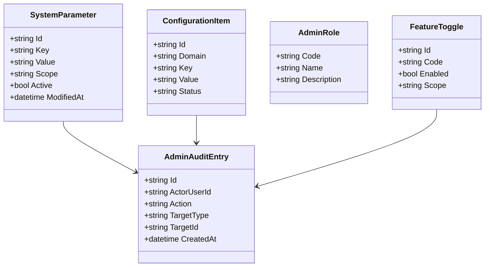
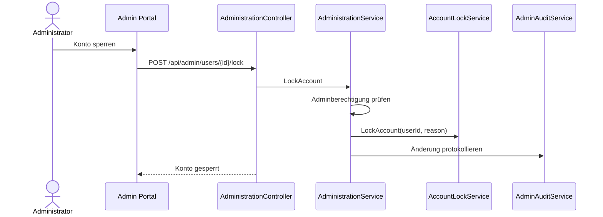
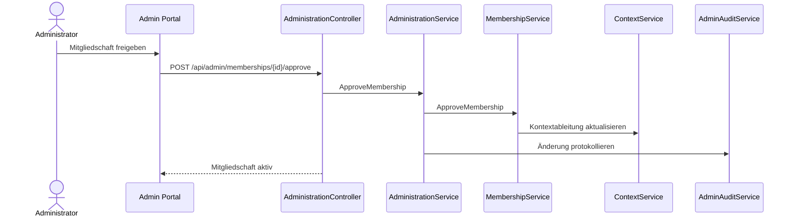
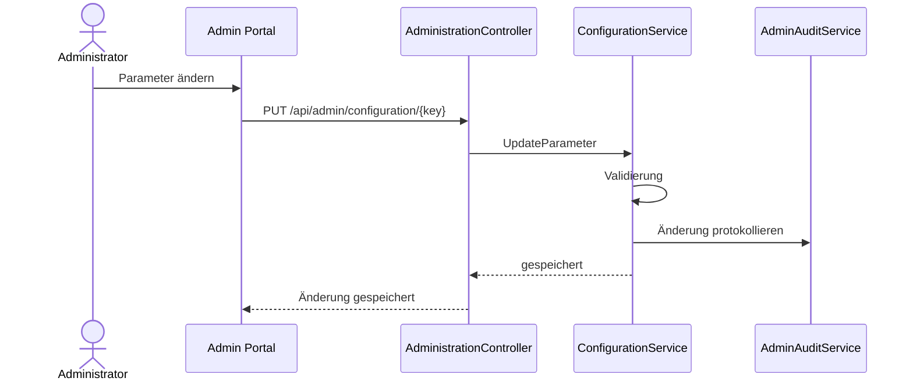

# Domäne Administration

| Feld | Wert |
|---|---|
| Kapitel | 03 – Domänen |
| Dokument | Administration |
| Status | Konsolidierter Arbeitsstand |
| Typ | Neuentwicklung / Erweiterung |
| Priorität | Hoch |
| Leitquellen | `Quellen/2026-07-05_Snapshot1.txt`, `Quellen/2026-05_28_Lastenheft_SportFM.pdf` |

---

## 1 Zweck

Die Domäne **Administration** stellt die fachliche und technische Verwaltung der SportFM-Plattform bereit.

Sie bündelt Konfiguration, Stammdatenpflege, Portalverwaltung, Systemparameter, fachliche Referenzdaten, Rollen- und Berechtigungsadministration sowie administrative Einsichten in Plattformzustand und Verarbeitung.

Administration ist keine Fachdomäne für Antrag, Buchung oder Rechnung. Sie stellt ausschließlich Verwaltungsfunktionen bereit, mit denen andere Domänen konfiguriert und betrieben werden können.

---

## 2 Projektbewertung

| Bereich | Bestand | Erweiterung | Neuentwicklung | Bewertung |
|---|:---:|:---:|:---:|---|
| Oracle | x | x | x | bestehende Stammdaten prüfen, neue Portal-/Plattformkonfiguration ergänzen |
| PL/SQL | x | x | x | vorhandene Packages weiterverwenden, neue Admin-Packages prüfen |
| REST |  |  | x | neue Administrations-API |
| DTO |  |  | x | neue Vertragsobjekte |
| Portal |  |  | x | neue Admin-Oberflächen |
| Authentication |  | x |  | administrative Rollen und Kontoverwaltung |
| Organisation |  | x |  | Organisationen, Mitgliedschaften, Freigaben |
| Context |  | x |  | Kontextzuordnungen und Sichtbarkeit |
| Tests |  |  | x | Rollen-, Konfigurations- und Sicherheitstests erforderlich |

---

## 3 Abgrenzung

### 3.1 Verantwortlich

Administration ist verantwortlich für:

- Systemparameter,
- fachliche Konfiguration,
- Referenzdaten,
- Portal-Konfiguration,
- Rollen- und Berechtigungsadministration,
- Benutzer- und Kontoverwaltung aus administrativer Sicht,
- Organisations- und Mitgliedschaftsfreigaben,
- Kontextzuordnungen,
- Konfiguration von Antragstypen,
- Konfiguration von Wizarddefinitionen, falls V1 beauftragt,
- Workflowdefinitionen, falls V1 administrativ pflegbar,
- Vorlagen- und Textbausteinverwaltung nur soweit bestehende Dokumentendomäne dies vorsieht,
- Systemübersichten,
- Audit- und Protokolleinsicht,
- administrative Sperr- und Freigabefunktionen.

### 3.2 Nicht verantwortlich

Administration ist nicht verantwortlich für:

- Antragserstellung,
- Workflowbearbeitung,
- Buchungslogik,
- Gebührenberechnung,
- Rechnungserstellung,
- Dokumentengenerierung,
- physische Dateispeicherung,
- Mailversand,
- Authentifizierungslogik selbst.

Diese Funktionen bleiben in den jeweiligen Fach- und Plattformdomänen.

---

## 4 Architekturgrundsatz

Administration ist ein fachlich abgesicherter Zugriff auf Konfiguration und Verwaltungsfunktionen anderer Domänen.

```text
Admin Portal
  ↓
Administration API
  ↓
Administration Services
  ↓
Domain-spezifische Admin Services
  ↓
Oracle / Konfiguration / Fachdomänen
```

Administration darf Domänen nicht umgehen. Änderungen erfolgen über definierte Services und werden protokolliert.

---

## 5 Administrationsbereiche

| Bereich | Beschreibung | Zugeordnete Domäne |
|---|---|---|
| Benutzerkonten | Sperren, Entsperren, Status, Audit | Authentication |
| Portalnutzer | Profildaten, Zuordnung, Support | PortalUser |
| Organisationen | Organisationen, Abteilungen, Freigaben | Organisation |
| Mitgliedschaften | Freigabe, Ablehnung, Rollen | Organisation / Context |
| Kontexte | Kontextzuordnung, Kontextstatus | Context |
| Antragstypen | verfügbare Anträge | Application |
| Wizard | Wizarddefinitionen, falls V1 | Wizard |
| Workflow | Status und Übergänge, falls V1 | Workflow |
| Dokumente | Vorlagen, Textbausteine, Dokumenttypen | Document |
| Gebühren | Gebührenreferenzen, soweit fachlich vorgesehen | Charge |
| Reporting | administrative Auswertungen | Reporting |
| System | Parameter, Logs, Konfiguration | Administration |

---

## 6 Grundsatz: Konfiguration statt Fachlogik

Administration verwaltet Konfiguration.

Sie implementiert keine eigenen fachlichen Regeln für Antrag, Buchung, Rechnung oder Dokumente.

Beispiele:

- Administration aktiviert einen Antragstyp.
- Application entscheidet, wie ein Antrag verarbeitet wird.
- Administration pflegt eine Wizarddefinition.
- Wizard rendert und validiert die Definition.
- Administration pflegt Workflowübergänge.
- Workflow prüft und führt Statuswechsel aus.

---

## 7 Business Objects

| Objekt | Zweck | Persistenz |
|---|---|---|
| `AdminUserView` | administrative Sicht auf Benutzer / Portalidentitäten | abgeleitet |
| `AdminRole` | administrative Rolle | neue / vorhandene Berechtigungskonfiguration |
| `SystemParameter` | technische oder fachliche Systemeinstellung | neue / vorhandene Persistenz |
| `ReferenceDataSet` | fachliche Referenzdaten | vorhandene / neue Persistenz |
| `AdminAuditEntry` | administrative Änderungshistorie | neue / vorhandene Auditpersistenz |
| `ConfigurationItem` | generische Konfigurationseinheit | neue / vorhandene Persistenz |
| `FeatureToggle` | Aktivierung einzelner Funktionen | neue Persistenz zu prüfen |
| `AdminDashboardItem` | administrative Übersicht | abgeleitet |

### 7.1 Klassendiagramm



---

## 8 Administrative Rollen

| Rolle | Beschreibung |
|---|---|
| `SYSTEM_ADMIN` | technische Administration |
| `FACH_ADMIN` | fachliche Konfiguration |
| `PORTAL_ADMIN` | Portalverwaltung |
| `ORG_ADMIN_INTERNAL` | interne Organisationsverwaltung |
| `AUTH_ADMIN` | Konten sperren / entsperren, Audit einsehen |
| `WORKFLOW_ADMIN` | Workflowdefinitionen verwalten, falls V1 |
| `WIZARD_ADMIN` | Wizarddefinitionen verwalten, falls V1 |
| `DOCUMENT_ADMIN` | Dokumenttypen / Vorlagen verwalten, soweit bestehende Domäne dies vorsieht |
| `READONLY_ADMIN` | lesender administrativer Zugriff |

Die finale Rollenmatrix ist mit `Authentication.md`, `Organisation.md` und `Context.md` abzugleichen.

---

## 9 Fachliche Regeln

| ID | Regel |
|---|---|
| ADM-BR-001 | Administrative Änderungen benötigen eine berechtigte administrative Rolle. |
| ADM-BR-002 | Administrative Änderungen werden protokolliert. |
| ADM-BR-003 | Administration darf keine Fachlogik anderer Domänen umgehen. |
| ADM-BR-004 | Konfigurationsänderungen dürfen laufende Anträge und Workflows nicht beschädigen. |
| ADM-BR-005 | Änderungen an Wizard- und Workflowdefinitionen müssen versioniert werden, falls sie administrativ gepflegt werden. |
| ADM-BR-006 | Benutzer- und Kontosperren erfolgen über Authentication. |
| ADM-BR-007 | Organisationsfreigaben erfolgen über Organisation. |
| ADM-BR-008 | Kontextzuordnungen erfolgen über Context. |
| ADM-BR-009 | Kritische Änderungen benötigen nachvollziehbare Begründung. |
| ADM-BR-010 | Lesende administrative Auswertungen dürfen Datenschutz und Berechtigungskonzept nicht umgehen. |

---

## 10 Administrationsfunktionen V1

### 10.1 Verbindlich vorzusehen

| Funktion | Beschreibung |
|---|---|
| Benutzerkonten anzeigen | Support und Kontrolle |
| Benutzerkonto sperren / entsperren | administrative Sicherheitsfunktion |
| Organisationen anzeigen | Verwaltung und Support |
| Mitgliedschaften prüfen | Freigabe / Ablehnung |
| Kontexte anzeigen | Prüfung fachlicher Sichtbarkeit |
| Systemparameter anzeigen | Betrieb / Support |
| Audit / Protokoll einsehen | Nachvollziehbarkeit |

### 10.2 V1-Entscheidungsbedarf

| Funktion | Entscheidung |
|---|---|
| Wizarddefinitionen administrativ pflegen | offen |
| Workflowdefinitionen administrativ pflegen | offen |
| Antragstypen vollständig über UI pflegen | offen |
| Dokumentvorlagen über Portal verwalten | offen, wegen bestehender Dokumentendomäne |
| Gebührenreferenzen administrativ pflegen | offen, wegen bestehender Gebührenlogik |
| Feature Toggles | offen |

---

## 11 Standardabläufe

### 11.1 Benutzerkonto sperren

```text
Admin öffnet Benutzerkonto
  ↓
Berechtigung prüfen
  ↓
Sperrgrund erfassen
  ↓
Authentication sperrt Konto
  ↓
Audit schreiben
  ↓
Benutzer kann sich nicht mehr anmelden
```

### 11.2 Mitgliedschaft freigeben

```text
Admin öffnet Mitgliedschaft
  ↓
Organisation prüft Mitgliedschaft
  ↓
Rolle und Scope festlegen
  ↓
Mitgliedschaft aktivieren
  ↓
Context aktualisiert verfügbare Kontexte
  ↓
Audit schreiben
```

### 11.3 Konfiguration ändern

```text
Admin öffnet Konfiguration
  ↓
Berechtigung prüfen
  ↓
Änderung validieren
  ↓
Version / Änderung speichern
  ↓
Audit schreiben
  ↓
betroffene Domäne nutzt neue Konfiguration
```

---

## 12 Sequenzdiagramme

### 12.1 Konto sperren



### 12.2 Mitgliedschaft freigeben



### 12.3 Parameter ändern



---

## 13 REST-API

| ID | Methode | Pfad | Zweck |
|---|---|---|---|
| ADM-API-001 | `GET` | `/api/admin/dashboard` | Admin-Dashboard lesen |
| ADM-API-002 | `GET` | `/api/admin/users` | Benutzerkonten suchen |
| ADM-API-003 | `GET` | `/api/admin/users/{id}` | Benutzerkonto lesen |
| ADM-API-004 | `POST` | `/api/admin/users/{id}/lock` | Benutzerkonto sperren |
| ADM-API-005 | `POST` | `/api/admin/users/{id}/unlock` | Benutzerkonto entsperren |
| ADM-API-006 | `GET` | `/api/admin/organisations` | Organisationen administrativ suchen |
| ADM-API-007 | `GET` | `/api/admin/memberships/pending` | offene Mitgliedschaften lesen |
| ADM-API-008 | `POST` | `/api/admin/memberships/{id}/approve` | Mitgliedschaft freigeben |
| ADM-API-009 | `POST` | `/api/admin/memberships/{id}/reject` | Mitgliedschaft ablehnen |
| ADM-API-010 | `GET` | `/api/admin/contexts` | Kontexte administrativ lesen |
| ADM-API-011 | `GET` | `/api/admin/configuration` | Konfiguration lesen |
| ADM-API-012 | `PUT` | `/api/admin/configuration/{key}` | Konfiguration ändern |
| ADM-API-013 | `GET` | `/api/admin/audit` | Audit / Protokoll lesen |
| ADM-API-014 | `GET` | `/api/admin/features` | Feature Toggles lesen, falls V1 |
| ADM-API-015 | `PUT` | `/api/admin/features/{code}` | Feature Toggle ändern, falls V1 |

---

## 14 DTOs

### 14.1 `AdminDashboardDto`

| Feld | Typ | Pflicht |
|---|---|:---:|
| `pendingMemberships` | int | ja |
| `lockedAccounts` | int | ja |
| `openConfigurationWarnings` | int | nein |
| `failedLogins24h` | int | nein |
| `systemMessages` | array | nein |

### 14.2 `AdminUserDto`

| Feld | Typ | Pflicht |
|---|---|:---:|
| `id` | string | ja |
| `email` | string | ja |
| `displayName` | string | nein |
| `accountStatus` | string | ja |
| `lastLoginAt` | datetime | nein |
| `availableContexts` | array | nein |
| `memberships` | array | nein |

### 14.3 `AdminConfigurationDto`

| Feld | Typ | Pflicht |
|---|---|:---:|
| `key` | string | ja |
| `value` | string | ja |
| `scope` | string | ja |
| `description` | string | nein |
| `modifiedAt` | datetime | nein |
| `modifiedBy` | string | nein |

### 14.4 `AdminAuditEntryDto`

| Feld | Typ | Pflicht |
|---|---|:---:|
| `id` | string | ja |
| `actor` | string | ja |
| `action` | string | ja |
| `targetType` | string | ja |
| `targetId` | string | ja |
| `createdAt` | datetime | ja |
| `reason` | string | nein |

---

## 15 Services

| Service | Verantwortung |
|---|---|
| `AdministrationService` | zentrale Orchestrierung administrativer Funktionen |
| `AdminUserService` | administrative Benutzersicht, Sperren / Entsperren delegieren |
| `AdminOrganisationService` | Organisationen und Mitgliedschaften administrativ anzeigen / delegieren |
| `AdminContextService` | Kontexte administrativ anzeigen / prüfen |
| `ConfigurationService` | Systemparameter und Konfiguration verwalten |
| `FeatureToggleService` | Funktionen aktivieren / deaktivieren, falls V1 |
| `AdminAuditService` | administrative Änderungen protokollieren |
| `AdminDashboardService` | administrative Kennzahlen und Hinweise bereitstellen |

---

## 16 Repository

| Repository | Zweck |
|---|---|
| `AdministrationRepository` | administrative Sichten / Übersichten |
| `ConfigurationRepository` | Parameter und Konfiguration lesen / speichern |
| `FeatureToggleRepository` | Feature Toggles lesen / speichern, falls V1 |
| `AdminAuditRepository` | Audit schreiben / lesen |

Administration nutzt zusätzlich definierte Services anderer Domänen statt deren Daten direkt zu verändern.

---

## 17 Oracle und PL/SQL

### 17.1 Bestandsprüfung

Für Administration sind bestehende Tabellen und Packages der Fachdomänen zu prüfen, insbesondere:

- vorhandene Stammdaten,
- Dokumenttypen,
- Dokumentvorlagen,
- Textbausteine,
- Gebührenarten,
- Gebührenreferenzen,
- Logging,
- bestehende SportFM-Benutzer- und Rollenstrukturen.

Bestehende Fachlogik wird nicht ersetzt.

### 17.2 Neue / zu prüfende Persistenz

| Objekt | Zweck | Status |
|---|---|---|
| `LHD_SPA_ADMIN_AUDIT` | administrative Änderungshistorie | zu prüfen / voraussichtlich neu |
| `LHD_SPA_SYSTEM_PARAMETERS` | Systemparameter | zu prüfen / neu oder Bestand nutzen |
| `LHD_SPA_CONFIGURATION` | generische Konfiguration | zu prüfen |
| `LHD_SPA_FEATURE_TOGGLES` | Feature Toggles | nur falls V1 |
| `LHD_SPA_ADMIN_ROLES` | administrative Rollen | zu prüfen / ggf. über Auth-Rollen |

### 17.3 Package-Zuordnung

| Package | Zweck | Status |
|---|---|---|
| `PA_LHD_SPA_ADMIN` | administrative Übersichten und Aktionen | vorgeschlagene Zielstruktur, noch zu bestätigen |
| `PA_LHD_SPA_CONFIG` | Systemparameter / Konfiguration | vorgeschlagene Zielstruktur, noch zu bestätigen |
| `PA_LHD_SPA_ADMIN_AUDIT` | administrative Protokollierung | vorgeschlagene Zielstruktur, noch zu bestätigen |

---

## 18 Blazor-Frontend

### 18.1 Seiten

| ID | Seite | Route | Zweck |
|---|---|---|---|
| ADM-PAGE-001 | Admin-Dashboard | `/admin` | administrative Übersicht |
| ADM-PAGE-002 | Benutzerverwaltung | `/admin/users` | Benutzer suchen / lesen |
| ADM-PAGE-003 | Benutzerkonto | `/admin/users/{id}` | Details, Sperren, Audit |
| ADM-PAGE-004 | Organisationen | `/admin/organisations` | Organisationen prüfen |
| ADM-PAGE-005 | Mitgliedschaften | `/admin/memberships` | offene Mitgliedschaften bearbeiten |
| ADM-PAGE-006 | Kontexte | `/admin/contexts` | Kontextzuordnungen prüfen |
| ADM-PAGE-007 | Konfiguration | `/admin/configuration` | Parameter verwalten |
| ADM-PAGE-008 | Audit | `/admin/audit` | Protokolle einsehen |
| ADM-PAGE-009 | Feature Toggles | `/admin/features` | falls V1 |
| ADM-PAGE-010 | Wizard Admin | `/admin/wizards` | falls V1 |
| ADM-PAGE-011 | Workflow Admin | `/admin/workflows` | falls V1 |

### 18.2 Komponenten

| Komponente | Zweck |
|---|---|
| `AdminDashboardCards` | Kennzahlen anzeigen |
| `AdminUserGrid` | Benutzerliste |
| `AdminUserDetail` | Benutzerkonto anzeigen |
| `AccountLockDialog` | Konto sperren / entsperren |
| `PendingMembershipGrid` | offene Mitgliedschaften |
| `AdminOrganisationSearch` | Organisationen suchen |
| `AdminContextGrid` | Kontexte anzeigen |
| `ConfigurationEditor` | Parameter bearbeiten |
| `AdminAuditTable` | Protokoll anzeigen |
| `FeatureToggleList` | Funktionen aktivieren / deaktivieren |

---

## 19 Berechtigungen

| Berechtigung | Zweck |
|---|---|
| `Admin.Dashboard.Read` | Admin-Dashboard lesen |
| `Admin.Users.Read` | Benutzer lesen |
| `Admin.Users.Lock` | Benutzer sperren |
| `Admin.Users.Unlock` | Benutzer entsperren |
| `Admin.Organisations.Read` | Organisationen lesen |
| `Admin.Memberships.Approve` | Mitgliedschaften freigeben |
| `Admin.Contexts.Read` | Kontexte lesen |
| `Admin.Configuration.Read` | Konfiguration lesen |
| `Admin.Configuration.Write` | Konfiguration ändern |
| `Admin.Audit.Read` | Audit lesen |
| `Admin.Features.Manage` | Feature Toggles ändern, falls V1 |
| `Admin.Wizard.Manage` | Wizarddefinitionen verwalten, falls V1 |
| `Admin.Workflow.Manage` | Workflowdefinitionen verwalten, falls V1 |

Administrative Berechtigungen sind besonders restriktiv zu vergeben und zu protokollieren.

---

## 20 Validierungen

| ID | Validierung | Ebene |
|---|---|---|
| ADM-VAL-001 | administrative Berechtigung vorhanden | Administration |
| ADM-VAL-002 | Zielobjekt existiert | jeweilige Domäne |
| ADM-VAL-003 | kritische Änderung enthält Begründung | Administration |
| ADM-VAL-004 | Konfigurationswert ist fachlich / technisch gültig | ConfigurationService |
| ADM-VAL-005 | Konto kann nicht ohne Berechtigung gesperrt werden | Authentication / Administration |
| ADM-VAL-006 | Mitgliedschaftsfreigabe besitzt zulässige Rolle | Organisation |
| ADM-VAL-007 | Kontextzuordnung ist eindeutig | Context |
| ADM-VAL-008 | schreibgeschützte Konfiguration kann nicht geändert werden | ConfigurationService |

---

## 21 Testfälle

| Testfall | Beschreibung |
|---|---|
| TF-ADM-001 | Admin-Dashboard laden |
| TF-ADM-002 | Benutzer suchen |
| TF-ADM-003 | Benutzerkonto sperren |
| TF-ADM-004 | Benutzerkonto entsperren |
| TF-ADM-005 | Sperrung ohne Berechtigung verhindern |
| TF-ADM-006 | offene Mitgliedschaften laden |
| TF-ADM-007 | Mitgliedschaft freigeben |
| TF-ADM-008 | Mitgliedschaft ablehnen |
| TF-ADM-009 | Konfiguration lesen |
| TF-ADM-010 | Konfiguration ändern |
| TF-ADM-011 | ungültige Konfiguration verhindern |
| TF-ADM-012 | administrative Änderung protokollieren |
| TF-ADM-013 | Audit nur berechtigt anzeigen |
| TF-ADM-014 | Feature Toggle ändern, falls V1 |
| TF-ADM-015 | Wizard-/Workflow-Admin nur falls V1 testen |

---

## 22 Arbeitspakete

| AP | Titel | Inhalt |
|---|---|---|
| AP-ADM-001 | Administrationsmodell | Rollen, Rechte, Audit, Konfiguration |
| AP-ADM-002 | Oracle-Konzept | Bestandsprüfung, Tabellen, Package-Zuordnung |
| AP-ADM-003 | REST | Controller, DTOs, Fehlerformat |
| AP-ADM-004 | AdminUserService | Benutzeransicht, Sperren / Entsperren delegieren |
| AP-ADM-005 | AdminOrganisationService | Organisationen und Mitgliedschaften |
| AP-ADM-006 | AdminContextService | Kontextübersichten |
| AP-ADM-007 | ConfigurationService | Systemparameter und Konfiguration |
| AP-ADM-008 | AdminAuditService | Protokollierung |
| AP-ADM-009 | Portal | Admin-Seiten und Komponenten |
| AP-ADM-010 | Feature Toggles | nur falls V1 |
| AP-ADM-011 | Wizard-/Workflow-Admin | nur falls V1 |
| AP-ADM-012 | Tests | Unit-, Integrations- und UI-Tests |
| AP-ADM-013 | Dokumentation | API, Rollen, Betriebshinweise |

---

## 23 Aufwandstreiber

| Treiber | Einfluss |
|---|---|
| Umfang Admin-UI | hoch |
| Wizard-Konfiguration über UI | sehr hoch |
| Workflow-Konfiguration über UI | sehr hoch |
| Rollen- und Berechtigungsmatrix | hoch |
| Audit-Anforderungen | hoch |
| Konfigurationsvalidierung | mittel bis hoch |
| bestehende Stammdatenintegration | hoch |
| Feature Toggles | mittel |
| Sicherheits- und Rollentests | hoch |

Konkrete Personentage werden erst nach Entscheidung getroffen, welche Administrationsfunktionen Bestandteil von V1 sind.

---

## 24 Risiken

| Risiko | Bewertung | Maßnahme |
|---|---|---|
| Adminbereich wird zu breit | hoch | V1-Funktionsumfang begrenzen |
| Wizard-/Workflow-Designer sprengen Aufwand | sehr hoch | Entscheidung separat dokumentieren |
| Administration umgeht Domänenlogik | hoch | Änderungen nur über Domänenservices |
| administrative Rechte zu weit gefasst | hoch | Rollenmatrix und Tests |
| Audit-Anforderungen unterschätzt | hoch | AdminAudit verbindlich modellieren |
| Konfiguration beschädigt laufende Prozesse | hoch | Versionierung / Validierung |
| bestehende Stammdatenlogik wird dupliziert | hoch | Bestand vor Erweiterung prüfen |

---

## 25 Offene Punkte

| ID | Offener Punkt | Relevanz |
|---|---|---|
| OP-ADM-001 | finale Admin-Rollenmatrix | sehr hoch |
| OP-ADM-002 | Wizarddefinitionen über Admin-UI pflegen? | sehr hoch |
| OP-ADM-003 | Workflowdefinitionen über Admin-UI pflegen? | sehr hoch |
| OP-ADM-004 | Antragstypen über Admin-UI pflegen? | hoch |
| OP-ADM-005 | Feature Toggles Bestandteil V1? | mittel |
| OP-ADM-006 | Umfang Systemparameterverwaltung | hoch |
| OP-ADM-007 | Umfang Audit-Einsicht | hoch |
| OP-ADM-008 | Dokumentvorlagen im neuen Adminbereich oder Bestand? | hoch |
| OP-ADM-009 | Gebührenreferenzen im neuen Adminbereich oder Bestand? | hoch |
| OP-ADM-010 | finale Oracle-/Package-Zuordnung | hoch |

---

## 26 Traceability-Matrix

| Quelle | Funktion | REST | Service | UI | Test | AP |
|---|---|---|---|---|---|---|
| Snapshot Administration | Admin-Dashboard | ADM-API-001 | AdminDashboardService | AdminDashboardCards | TF-ADM-001 | AP-ADM-009 |
| Authentication.md | Konto sperren | ADM-API-004 | AdminUserService / AccountLockService | AccountLockDialog | TF-ADM-003 | AP-ADM-004 |
| Organisation.md | Mitgliedschaft freigeben | ADM-API-008 | AdminOrganisationService / MembershipService | PendingMembershipGrid | TF-ADM-007 | AP-ADM-005 |
| Context.md | Kontexte prüfen | ADM-API-010 | AdminContextService | AdminContextGrid | TF-ADM-009 | AP-ADM-006 |
| Sicherheitsanforderungen | Audit | ADM-API-013 | AdminAuditService | AdminAuditTable | TF-ADM-012/013 | AP-ADM-008 |

---

## 27 Änderungsauswirkungen

Änderungen an `Administration.md` wirken sich aus auf:

- `03_Domaenen/Authentication.md`,
- `03_Domaenen/Organisation.md`,
- `03_Domaenen/Context.md`,
- `03_Domaenen/Application.md`,
- `03_Domaenen/Wizard.md`,
- `03_Domaenen/Workflow.md`,
- `03_Domaenen/Document.md`,
- `03_Domaenen/Charge.md`,
- `04_REST_API/Endpunkte.md`,
- `04_REST_API/DTOs.md`,
- `05_Datenmodell/Tabellen.md`,
- `05_Datenmodell/Packages.md`,
- `06_Arbeitspakete/Arbeitspaketliste.md`,
- `07_Kalkulation/Aufwandsschaetzung.md`,
- `09_Testkonzept/Testfaelle.md`,
- `10_Controlling/Risikoregister.md`,
- `12_Offene_Punkte/Offene_Punkte.md`.

---

## 28 Ergebnis

Die Domäne Administration ist als zentrale Verwaltungsdomäne der Plattform spezifiziert.

Sie stellt administrative Oberflächen und APIs für Benutzerkonten, Organisationen, Mitgliedschaften, Kontexte, Konfiguration, Audit und optionale Framework-Konfiguration bereit.

Die konkrete Kalkulation bleibt abhängig von:

- finaler Admin-Rollenmatrix,
- V1-Umfang der Administrationsfunktionen,
- Entscheidung Wizard-Admin,
- Entscheidung Workflow-Admin,
- Umfang der Konfigurationsverwaltung,
- bestätigter Oracle-Zuordnung,
- Audit- und Sicherheitsanforderungen.
