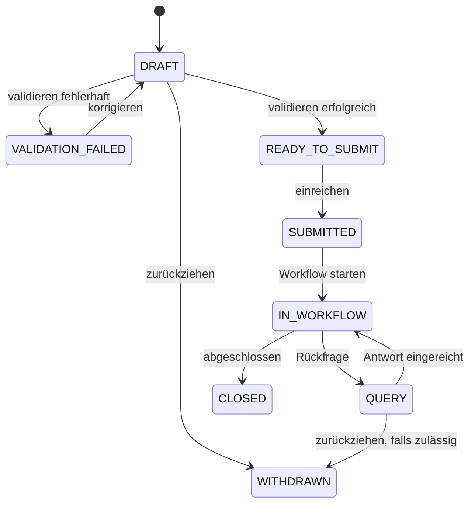
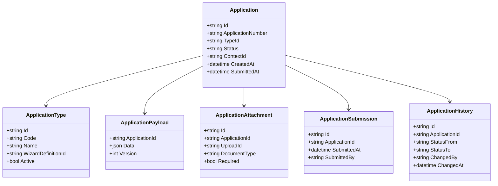
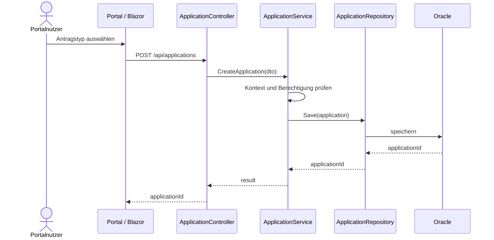
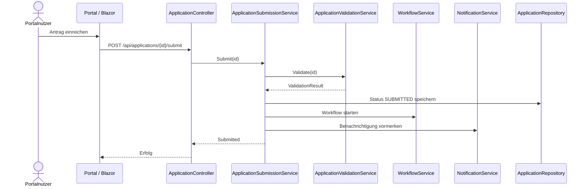

# Domäne Application

| Feld | Wert |
|---|---|
| Kapitel | 03 – Domänen |
| Dokument | Application |
| Status | Konsolidierter Arbeitsstand |
| Typ | Neuentwicklung |
| Priorität | Sehr hoch |
| Leitquellen | `Quellen/2026-07-05_Snapshot1.txt`, `Quellen/2026-05_28_Lastenheft_SportFM.pdf` |

---

## 1 Zweck

Die Domäne **Application** beschreibt die digitale Antragstellung im SportFM-Portal.

Sie umfasst den fachlichen Lebenszyklus eines Nutzungsantrags von der Anliegensklärung über die Erfassung, Validierung, Speicherung als Entwurf und Einreichung bis zur Übergabe an Workflow und SportFM.

Application ist eine neue Plattformdomäne.

---

## 2 Projektbewertung

| Bereich | Bestand | Erweiterung | Neuentwicklung | Bewertung |
|---|:---:|:---:|:---:|---|
| Oracle |  | x |  | Erweiterung erforderlich |
| PL/SQL |  | x |  | Erweiterung / Kapselung erforderlich |
| REST |  |  | x | neue fachliche API |
| DTO |  |  | x | neue Vertragsobjekte |
| Portal |  |  | x | neue Seiten und Komponenten |
| Workflow |  | x |  | Anbindung an Workflow erforderlich |
| Wizard |  | x |  | Wizard als Eingabeoberfläche |
| Tests |  |  | x | neue Tests erforderlich |

---

## 3 Abgrenzung

### 3.1 Verantwortlich

Application ist verantwortlich für:

- Anliegensklärung,
- Auswahl des Antragstyps,
- Anlegen eines Antrags,
- Speichern von Entwürfen,
- Bearbeitung von Entwürfen,
- Zuordnung von Anlagen,
- fachliche Vorvalidierung,
- Einreichung,
- Start des Workflows,
- Anzeige des Antragsstatus,
- Historisierung der Antragsschritte.

### 3.2 Nicht verantwortlich

Application ist nicht verantwortlich für:

- Buchungslogik,
- Belegungsplanlogik,
- Gebührenberechnung,
- Rechnungserstellung,
- Dokumentengenerierung,
- technische Dateispeicherung,
- Benutzerverwaltung,
- Rollenverwaltung.

Diese Verantwortlichkeiten verbleiben in den jeweils bestehenden oder eigenen Domänen.

---

## 4 Einordnung in die Plattform

```text
Portal
  ↓
Dashboard
  ↓
Application
  ↓
Workflow
  ↓
SportFM-Fachlogik
  ↓
Booking / Document / Charge / Invoice
```

Application ist die führende Domäne für die Antragserstellung, aber nicht für die spätere fachliche Buchung.

---

## 5 Fachlicher Ablauf

### 5.1 Ablaufübersicht

```text
Portalnutzer meldet sich an
  ↓
SportFM-Kontext auswählen
  ↓
Anliegensklärung auswählen
  ↓
Antragstyp bestimmen
  ↓
Antrag als Entwurf anlegen
  ↓
Wizard-Daten erfassen
  ↓
Anlagen hochladen
  ↓
Antrag validieren
  ↓
Antrag einreichen
  ↓
Workflow starten
  ↓
Antrag im SportFM-Arbeitskorb bearbeiten
```

### 5.2 Anliegensklärung

Vor der eigentlichen Antragstellung wird eine Anliegensklärung durchgeführt.

Aus den Quellen ergeben sich mindestens folgende Anliegen:

- Training / Übungsbelegung,
- Wettkämpfe und Veranstaltungen,
- Schulbetrieb,
- Einzelnutzung,
- Mehrfachnutzung.

Die finale fachliche Liste der Anliegen ist im Pflichtenheft zu bestätigen.

### 5.3 Antragstypen

Die Antragstypen orientieren sich an den im Lastenheft und den Anlagen genannten Nutzungsanträgen, insbesondere:

- Trainingszeiten auf Sportanlagen ohne Schulsportanlagen,
- Wettkämpfe und Veranstaltungen auf Sportanlagen ohne Schulsportanlagen,
- Trainingszeiten im Eissport- und Ballspielzentrum,
- Wettkämpfe und Veranstaltungen im Eissport- und Ballspielzentrum,
- Trainingszeiten auf Schulsportanlagen,
- Wettkämpfe und Veranstaltungen auf Schulsportanlagen,
- Einzelveranstaltungen auf Sportanlagen einschließlich Schulsportanlagen,
- Antrag auf Anmietung Dritter.

---

## 6 Statusmodell

Application verwaltet den Status der Antragstellung bis zur Übergabe an Workflow.

| Status | Bedeutung | Bearbeitung durch Portalnutzer |
|---|---|:---:|
| `DRAFT` | Entwurf | ja |
| `VALIDATION_FAILED` | Validierung fehlgeschlagen | ja |
| `READY_TO_SUBMIT` | bereit zur Einreichung | ja |
| `SUBMITTED` | eingereicht | nein |
| `IN_WORKFLOW` | in Bearbeitung | nein |
| `QUERY` | Rückfrage | eingeschränkt |
| `WITHDRAWN` | zurückgezogen | nein |
| `CLOSED` | abgeschlossen | nein |

### 6.1 Zustandsdiagramm



---

## 7 Business Objects

| Objekt | Zweck | Persistenz |
|---|---|---|
| `Application` | fachlicher Antrag | neue oder erweiterte Persistenz |
| `ApplicationType` | Antragstyp | Konfiguration |
| `ApplicationDraft` | Entwurfsdaten | neue Persistenz |
| `ApplicationPayload` | strukturierte Antragsdaten | neue Persistenz |
| `ApplicationAttachment` | Verweis auf Anlagen | Upload / Document |
| `ApplicationSubmission` | Einreichvorgang | neue Persistenz |
| `ApplicationHistory` | Historie | neue Persistenz / Audit |
| `ApplicationValidationResult` | Validierungsergebnis | transient / optional persistiert |

### 7.1 Klassendiagramm



---

## 8 Fachliche Regeln

| ID | Regel |
|---|---|
| APP-BR-001 | Ohne aktiven SportFM-Kontext darf kein Antrag angelegt werden. |
| APP-BR-002 | Ohne Anliegensklärung darf kein Antragstyp ausgewählt werden. |
| APP-BR-003 | Ein Antrag beginnt immer im Status `DRAFT`. |
| APP-BR-004 | Entwürfe starten keinen Workflow. |
| APP-BR-005 | Nur vollständige und gültige Anträge dürfen eingereicht werden. |
| APP-BR-006 | Nach Einreichung ist eine Bearbeitung durch den Portalnutzer nur noch über definierte Rückfrageprozesse zulässig. |
| APP-BR-007 | Anlagen werden nicht in Application gespeichert, sondern über Upload / Document referenziert. |
| APP-BR-008 | Application erzeugt keine Buchung. |
| APP-BR-009 | Application löst beim Einreichen den Workflow aus. |
| APP-BR-010 | Jede Statusänderung wird historisiert. |

---

## 9 REST-API

### 9.1 Endpunkte

| ID | Methode | Pfad | Zweck |
|---|---|---|---|
| APP-API-001 | `GET` | `/api/application/types` | verfügbare Antragstypen lesen |
| APP-API-002 | `POST` | `/api/applications` | Antrag als Entwurf anlegen |
| APP-API-003 | `GET` | `/api/applications/{id}` | Antrag lesen |
| APP-API-004 | `GET` | `/api/users/me/applications` | eigene Anträge lesen |
| APP-API-005 | `PUT` | `/api/applications/{id}` | Entwurf speichern |
| APP-API-006 | `POST` | `/api/applications/{id}/attachments` | Anlage zuordnen |
| APP-API-007 | `DELETE` | `/api/applications/{id}/attachments/{attachmentId}` | Anlage aus Entwurf entfernen |
| APP-API-008 | `POST` | `/api/applications/{id}/validate` | Antrag validieren |
| APP-API-009 | `POST` | `/api/applications/{id}/submit` | Antrag einreichen |
| APP-API-010 | `GET` | `/api/applications/{id}/history` | Historie lesen |
| APP-API-011 | `POST` | `/api/applications/{id}/withdraw` | Antrag zurückziehen, falls zulässig |

### 9.2 REST-Prinzipien

- REST-Endpunkte bilden fachliche Aktionen ab.
- Keine Tabellen-CRUD-API.
- Keine Geschäftslogik im Portal.
- REST validiert Berechtigungen und Kontext.
- REST ruft Application Services auf.

---

## 10 DTOs

### 10.1 `ApplicationTypeDto`

| Feld | Typ | Pflicht | Beschreibung |
|---|---|:---:|---|
| `id` | string | ja | technische ID |
| `code` | string | ja | fachlicher Code |
| `name` | string | ja | Anzeigename |
| `description` | string | nein | Beschreibung |
| `wizardDefinitionId` | string | ja | zugehörige Wizard-Konfiguration |
| `active` | boolean | ja | aktiv / inaktiv |

### 10.2 `ApplicationCreateDto`

| Feld | Typ | Pflicht |
|---|---|:---:|
| `applicationTypeId` | string | ja |
| `contextId` | string | ja |
| `concernCode` | string | ja |
| `initialData` | object | nein |

### 10.3 `ApplicationDto`

| Feld | Typ | Pflicht |
|---|---|:---:|
| `id` | string | ja |
| `applicationNumber` | string | nein |
| `applicationType` | `ApplicationTypeDto` | ja |
| `status` | string | ja |
| `contextId` | string | ja |
| `payload` | object | ja |
| `attachments` | array | nein |
| `createdAt` | datetime | ja |
| `modifiedAt` | datetime | ja |
| `submittedAt` | datetime | nein |

### 10.4 `ApplicationSubmitDto`

| Feld | Typ | Pflicht |
|---|---|:---:|
| `applicationId` | string | ja |
| `confirmationAccepted` | boolean | ja |
| `privacyAccepted` | boolean | ja |
| `submittedBy` | string | ja |

### 10.5 `ValidationResultDto`

| Feld | Typ | Pflicht |
|---|---|:---:|
| `success` | boolean | ja |
| `errors` | array | ja |
| `warnings` | array | nein |

---

## 11 Services

### 11.1 `ApplicationService`

Verantwortung:

- Antrag anlegen,
- Antrag laden,
- Entwurf speichern,
- Antrag zurückziehen,
- Status prüfen,
- Historie schreiben.

Nicht verantwortlich für:

- Dateispeicherung,
- Workflowausführung,
- Buchung,
- Rechnung.

### 11.2 `ApplicationValidationService`

Verantwortung:

- Pflichtfeldprüfung,
- fachliche Konsistenzprüfung,
- Prüfung Kontext,
- Prüfung Antragstyp,
- Prüfung Anlagenvollständigkeit.

### 11.3 `ApplicationSubmissionService`

Verantwortung:

- Gesamtvalidierung,
- Statuswechsel `READY_TO_SUBMIT` → `SUBMITTED`,
- Workflowstart,
- Audit / Historie,
- Notification auslösen.

### 11.4 `ApplicationAttachmentService`

Verantwortung:

- Upload-Domäne aufrufen,
- Anlage fachlich zuordnen,
- Entfernen aus Entwurf erlauben,
- keine physische Dateiverwaltung.

---

## 12 Repository

### 12.1 `ApplicationRepository`

Aufgaben:

- Antrag speichern,
- Antrag lesen,
- Antragsliste lesen,
- Payload speichern,
- Historie speichern,
- Anlagenzuordnung speichern.

Das Repository enthält keine Geschäftslogik.

### 12.2 Zugriffsmuster

```text
ApplicationController
  ↓
ApplicationService
  ↓
ApplicationRepository
  ↓
Oracle / PL/SQL
```

---

## 13 Oracle und PL/SQL

### 13.1 Grundsatz

Application erweitert das bestehende SportFM-System, ersetzt aber keine bestehende Buchungs-, Gebühren-, Rechnungs- oder Dokumentenlogik.

### 13.2 Bestehende fachliche Bezugspunkte

Aus den vorhandenen Quellen ergeben sich relevante bestehende Bereiche:

| Bereich | bestehende Quellen / Objekte |
|---|---|
| Buchung | `LHD_SPA_BOOKING_NUMBERS`, `LHD_SPA_OCC*` |
| Dokumente | `LHD_SPA_DOCUMENTS*`, `LHD_SPA_DOCUMENT_TYPES`, `LHD_SPA_DOCUMENT_TEMPLATES` |
| Gebühren | `LHD_SPA_CHARGES`, `LHD_SPA_CHARGETYPES`, `LHD_SPA_CHARGEGROUPS` |
| Rechnungen | `LHD_SPA_INVOICES*`, `LHD_SPA_INVOICE_CHARGEINFOS*` |
| Logging | `LHD_SPA_LOGGING` |

### 13.3 Neue / zu prüfende Application-Persistenz

Die Quellen belegen kein vorhandenes vollständiges Datenmodell für digitale Antragsentwürfe. Daher sind neue oder erweiterte Persistenzobjekte zu prüfen:

| Objekt | Zweck | Status |
|---|---|---|
| `LHD_SPA_APPLICATIONS` | Antragskopf | zu prüfen / voraussichtlich neu |
| `LHD_SPA_APPLICATION_TYPES` | Antragstypen | zu prüfen / voraussichtlich neu |
| `LHD_SPA_APPLICATION_PAYLOADS` | strukturierte Antragsdaten | zu prüfen / voraussichtlich neu |
| `LHD_SPA_APPLICATION_ATTACHMENTS` | Anlagenzuordnung | zu prüfen / voraussichtlich neu |
| `LHD_SPA_APPLICATION_HISTORY` | Historie | zu prüfen / voraussichtlich neu |

### 13.4 Package-Zuordnung

| Package | Zweck | Status |
|---|---|---|
| `PA_LHD_SPA_APPLICATION` | Application-Funktionen | vorgeschlagene Zielstruktur, noch zu bestätigen |
| `PA_LHD_SPA_WORKFLOW` | Workflowstart / Status | abhängig von Workflow-Domäne |
| bestehende SportFM-Packages | Buchung, Dokumente, Rechnungen | weiterverwenden |

---

## 14 Blazor-Frontend

### 14.1 Seiten

| ID | Seite | Route | Zweck |
|---|---|---|---|
| APP-PAGE-001 | Antragstyp auswählen | `/application/new` | Auswahl Anliegen / Antragstyp |
| APP-PAGE-002 | Antrag bearbeiten | `/applications/{id}/wizard` | Wizard-geführte Erfassung |
| APP-PAGE-003 | Eigene Anträge | `/applications` | Liste eigener Anträge |
| APP-PAGE-004 | Antrag anzeigen | `/applications/{id}` | Detailansicht |
| APP-PAGE-005 | Antragshistorie | `/applications/{id}/history` | Historie / Protokoll |

### 14.2 Komponenten

| Komponente | Zweck |
|---|---|
| `ApplicationTypeCard` | Anzeige eines Antragstyps |
| `ConcernSelector` | Auswahl der Anliegensklärung |
| `ApplicationWizardHost` | Einbettung Wizard |
| `ApplicationStatusBadge` | Statusanzeige |
| `ApplicationAttachmentList` | Anlagenübersicht |
| `ApplicationValidationSummary` | Fehleranzeige |
| `ApplicationHistoryTimeline` | Historie |
| `SubmitApplicationButton` | Einreichen |
| `SaveDraftButton` | Entwurf speichern |

---

## 15 Sequenzdiagramme

### 15.1 Antrag anlegen



### 15.2 Antrag einreichen



---

## 16 Berechtigungen

| Berechtigung | Zweck |
|---|---|
| `Application.Read` | Antrag lesen |
| `Application.Create` | Antrag anlegen |
| `Application.UpdateDraft` | Entwurf bearbeiten |
| `Application.DeleteDraft` | Entwurf löschen |
| `Application.Submit` | Antrag einreichen |
| `Application.Withdraw` | Antrag zurückziehen |
| `Application.History.Read` | Historie lesen |
| `Application.Workbasket.Read` | Arbeitskorb lesen, intern |

Berechtigungen sind immer kontextbezogen zu prüfen.

---

## 17 Validierungen

| ID | Validierung | Ebene |
|---|---|---|
| APP-VAL-001 | aktiver Kontext vorhanden | Application |
| APP-VAL-002 | Benutzer darf Antrag im Kontext erstellen | Application |
| APP-VAL-003 | Antragstyp aktiv | Application |
| APP-VAL-004 | Pflichtfelder vollständig | Wizard / Application |
| APP-VAL-005 | Pflichtanlagen vorhanden | Application / Upload |
| APP-VAL-006 | Datenschutz / Zustimmung bestätigt | Application |
| APP-VAL-007 | Antrag im einreichbaren Status | Application |
| APP-VAL-008 | Workflowstart möglich | Workflow |

---

## 18 Testfälle

| Testfall | Beschreibung |
|---|---|
| TF-APP-001 | Antragstypen laden |
| TF-APP-002 | Antrag als Entwurf anlegen |
| TF-APP-003 | Entwurf speichern |
| TF-APP-004 | Pflichtfeldvalidierung schlägt fehl |
| TF-APP-005 | Pflichtanlagen fehlen |
| TF-APP-006 | Antrag erfolgreich einreichen |
| TF-APP-007 | Workflow wird gestartet |
| TF-APP-008 | Antrag nach Einreichung nicht mehr als Entwurf änderbar |
| TF-APP-009 | Zugriff auf fremden Kontext wird verhindert |
| TF-APP-010 | Historie wird geschrieben |
| TF-APP-011 | Rückfrage kann beantwortet werden |
| TF-APP-012 | Antrag kann nur zulässig zurückgezogen werden |

---

## 19 Arbeitspakete

| AP | Titel | Inhalt |
|---|---|---|
| AP-APP-001 | Domänenmodell | Business Objects, Status, Regeln |
| AP-APP-002 | Oracle-Konzept | Tabellenprüfung, neue Tabellen, Package-Zuordnung |
| AP-APP-003 | REST | Controller, DTOs, Fehlerformat |
| AP-APP-004 | Services | ApplicationService, ValidationService, SubmissionService |
| AP-APP-005 | Repository | Oracle-Zugriff, Mapping |
| AP-APP-006 | Wizard-Anbindung | WizardHost, Payload, Validierung |
| AP-APP-007 | Upload-Anbindung | Anlagen, Pflichtanlagen, Entfernen im Entwurf |
| AP-APP-008 | Workflow-Anbindung | Submit, Workflowstart, Rückfrage |
| AP-APP-009 | Portal | Seiten, Komponenten, UX |
| AP-APP-010 | Tests | Unit-, Integrations- und UI-Tests |
| AP-APP-011 | Dokumentation | API, Domäne, Betriebshinweise |

---

## 20 Aufwandstreiber

| Treiber | Einfluss |
|---|---|
| Anzahl Antragstypen | sehr hoch |
| Anzahl Wizard-Schritte | sehr hoch |
| Pflichtanlagen je Antragstyp | hoch |
| Workflow-Komplexität | sehr hoch |
| Datenübernahme nach SportFM | hoch |
| Berechtigungsmodell | hoch |
| Rückfragen und Nachreichungen | hoch |
| Historisierung / Audit | hoch |
| UI-Komplexität | mittel bis hoch |
| Testaufwand | hoch |

Konkrete Personentage werden erst nach Zuordnung der Antragstypen, Wizard-Schritte, Tabellen und Schnittstellen festgelegt.

---

## 21 Risiken

| Risiko | Bewertung | Maßnahme |
|---|---|---|
| Antragstypen nicht final geklärt | hoch | fachliche Klärung vor Kalkulation |
| Pflichtanlagen je Antragstyp unklar | hoch | Anlagenmatrix erstellen |
| Workflow-Regeln ändern sich | hoch | Workflow separat spezifizieren |
| bestehende SportFM-Übergabe unklar | hoch | Integrationsschnittstelle konkretisieren |
| Portal enthält versehentlich Fachlogik | hoch | REST- und Servicegrenzen strikt einhalten |
| Oracle-Zuordnung unvollständig | hoch | SQL-Quellen auswerten |
| Rückfrageprozess unterschätzt | mittel | Testfälle und Workflow-Status ergänzen |

---

## 22 Offene Punkte

| ID | Offener Punkt | Relevanz |
|---|---|---|
| OP-APP-001 | finale Liste der Antragstypen V1 | hoch |
| OP-APP-002 | Zuordnung Antragstyp zu Wizard-Definition | hoch |
| OP-APP-003 | Pflichtanlagen je Antragstyp | hoch |
| OP-APP-004 | finale Statusliste im Zusammenspiel mit Workflow | hoch |
| OP-APP-005 | technische Übergabe an bestehenden SportFM-Arbeitskorb | hoch |
| OP-APP-006 | Löschregel für Entwürfe | mittel |
| OP-APP-007 | genaue Oracle-Tabellenstruktur Application | hoch |
| OP-APP-008 | finales Package-Konzept | hoch |

---

## 23 Traceability-Matrix

| Quelle | Funktion | REST | Service | UI | Test | AP |
|---|---|---|---|---|---|---|
| Lastenheft Onlineantrag | Antrag anlegen | APP-API-002 | ApplicationService | APP-PAGE-002 | TF-APP-002 | AP-APP-003/004 |
| Lastenheft Upload | Anlage hochladen | APP-API-006 | AttachmentService | AttachmentList | TF-APP-005 | AP-APP-007 |
| Snapshot REST-Grundsätze | Einreichen | APP-API-009 | SubmissionService | SubmitButton | TF-APP-006/007 | AP-APP-008 |
| Lastenheft Arbeitskorb | Übergabe Workflow/SportFM | intern | SubmissionService | Statusanzeige | TF-APP-007 | AP-APP-008 |
| Sicherheitsanforderungen | Kontextprüfung | alle | ApplicationService | alle Seiten | TF-APP-009 | AP-APP-004/010 |

---

## 24 Änderungsauswirkungen

Änderungen an `Application.md` wirken sich aus auf:

- `03_Domaenen/Workflow.md`,
- `03_Domaenen/Wizard.md`,
- `03_Domaenen/Upload.md`,
- `03_Domaenen/Document.md`,
- `04_REST_API/Endpunkte.md`,
- `04_REST_API/DTOs.md`,
- `05_Datenmodell/Tabellen.md`,
- `05_Datenmodell/Packages.md`,
- `06_Arbeitspakete/Arbeitspaketliste.md`,
- `07_Kalkulation/Aufwandsschaetzung.md`,
- `09_Testkonzept/Testfaelle.md`,
- `12_Offene_Punkte/Offene_Punkte.md`.

---

## 25 Ergebnis

Die Domäne Application ist damit als neue Plattformdomäne fachlich und technisch spezifiziert.

Die konkrete Kalkulation bleibt abhängig von:

- finaler Antragstypenliste,
- finaler Wizard-Struktur,
- finaler Anlagenmatrix,
- bestätigtem Workflowmodell,
- bestätigter Oracle-Zuordnung.
