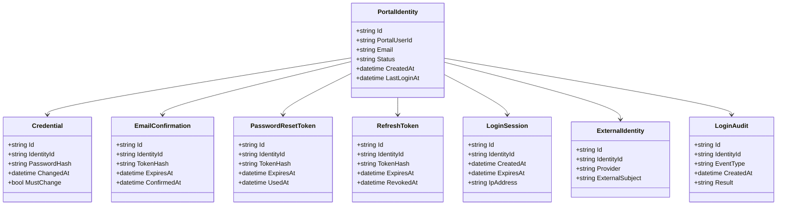
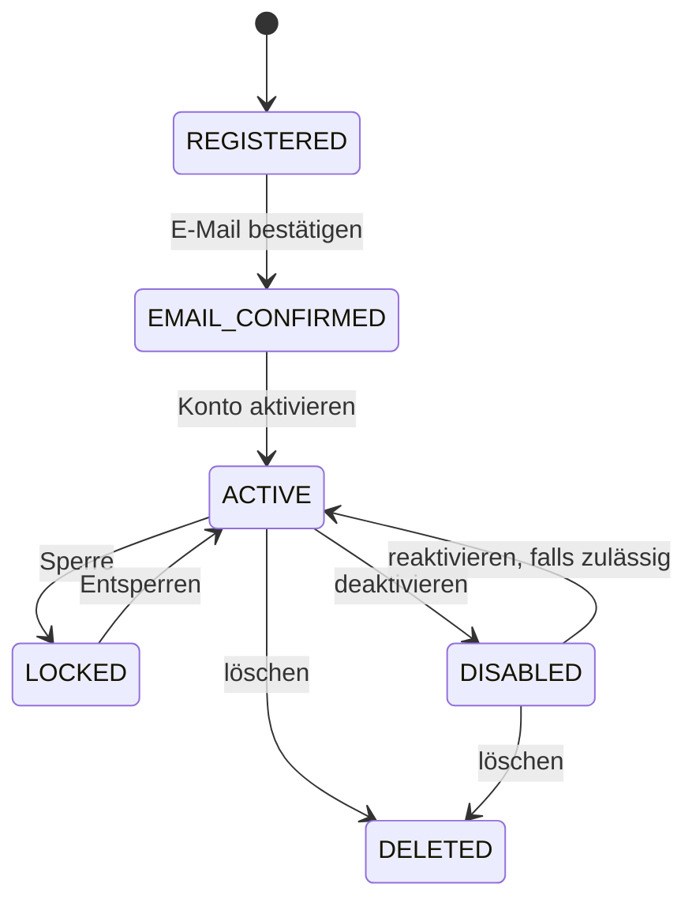
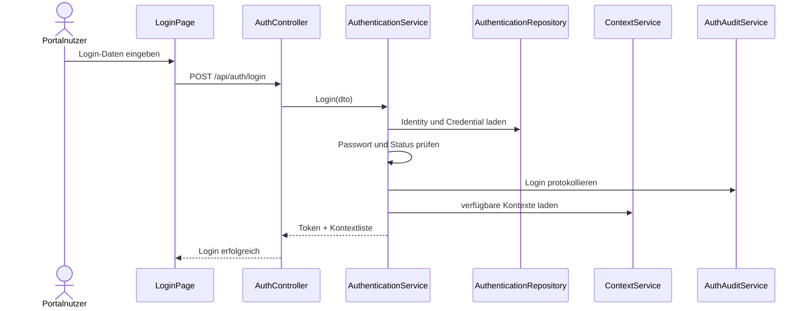
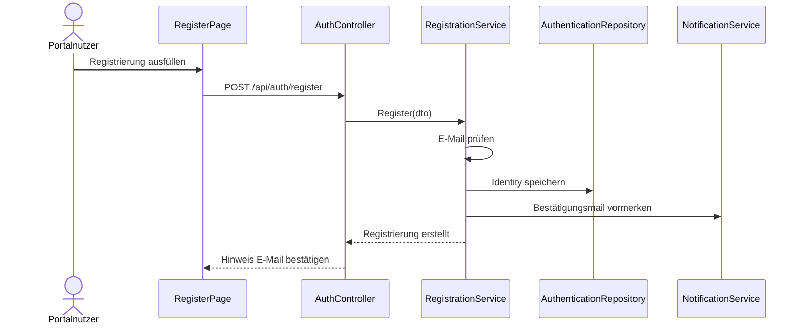
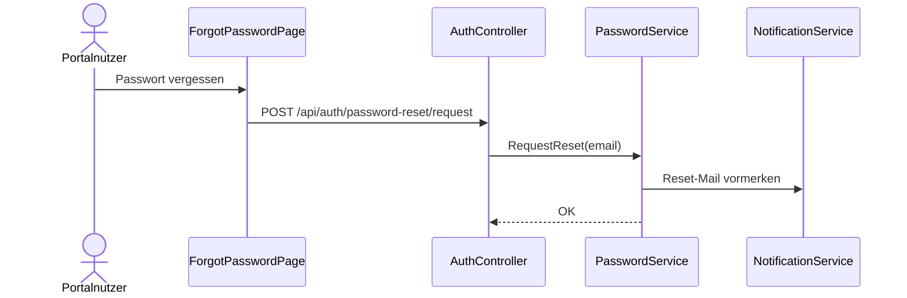

# Domäne Authentication

| Feld | Wert |
|---|---|
| Kapitel | 03 – Domänen |
| Dokument | Authentication |
| Status | Konsolidierter Arbeitsstand |
| Typ | Neuentwicklung |
| Priorität | Sehr hoch |
| Leitquellen | `Quellen/2026-07-05_Snapshot1.txt`, `Quellen/2026-05_28_Lastenheft_SportFM.pdf` |

---

## 1 Zweck

Die Domäne **Authentication** stellt die Authentifizierung für Portalnutzer und technische Zugriffe auf die SportFM-Plattform bereit.

Sie identifiziert Benutzer sicher, stellt Sitzungen bzw. Tokens bereit und bildet die Grundlage für den Zugriff auf Portal, Context, Organisation, Application, Workflow und weitere Domänen.

Authentication ist von fachlichen Berechtigungen zu trennen. Die Authentifizierung beantwortet primär die Frage:

```text
Wer ist der Benutzer?
```

Die konkrete fachliche Zugriffserlaubnis ergibt sich anschließend aus Organisation, Mitgliedschaften, Context und Berechtigungen.

---

## 2 Projektbewertung

| Bereich | Bestand | Erweiterung | Neuentwicklung | Bewertung |
|---|:---:|:---:|:---:|---|
| Oracle |  |  | x | Portal-Identitäten / Tokens / Audit erforderlich |
| PL/SQL |  |  | x | Package / API für Auth-Daten zu prüfen |
| REST |  |  | x | neue Authentifizierungs-API |
| DTO |  |  | x | neue Vertragsobjekte |
| Portal |  |  | x | Login, Registrierung, Passwort, 2FA |
| Context |  | x |  | Kontextliste nach Login laden |
| Organisation |  | x |  | Mitgliedschaften nach Login relevant |
| Tests |  |  | x | Sicherheits- und Integrationstests erforderlich |

---

## 3 Abgrenzung

### 3.1 Verantwortlich

Authentication ist verantwortlich für:

- Registrierung,
- E-Mail-Bestätigung,
- Anmeldung,
- Abmeldung,
- Passwortvergabe,
- Passwortänderung,
- Passwort-Zurücksetzen,
- Sitzungen,
- Access Tokens,
- Refresh Tokens,
- Zwei-Faktor-Authentifizierung, falls aktiviert,
- Kontosperrung,
- Entsperrung,
- letzte Anmeldung,
- Login-Audit,
- technische Identität externer Systeme, falls erforderlich,
- optionale Integration von BundID / MUK / OAuth, soweit fachlich bestätigt.

### 3.2 Nicht verantwortlich

Authentication ist nicht verantwortlich für:

- Organisationen,
- Abteilungen,
- Mitgliedschaften,
- fachliche Rollen in Organisationen,
- aktiven SportFM-Kontext,
- Antragserstellung,
- Arbeitskorb,
- Buchungen,
- Gebühren,
- Rechnungen,
- Dokumentensichtbarkeit.

Diese Verantwortlichkeiten liegen in Organisation, Context und den jeweiligen Fachdomänen.

---

## 4 Architekturgrundsatz

Authentication ist die erste technische Zugriffsschicht.

```text
Portal / Client
  ↓
Authentication
  ↓
PortalUser
  ↓
Organisation / Membership
  ↓
Context
  ↓
Fachdomänen
```

Nach erfolgreicher Authentifizierung wird der Benutzer nicht automatisch fachlich berechtigt. Fachliche Berechtigungen werden erst über Mitgliedschaften und Context abgeleitet.

---

## 5 Sicherheitsgrundsatz

Der Zugriff auf Onlineportal und SportFM muss durch geeignete technische und organisatorische Maßnahmen geschützt werden.

Daraus ergeben sich für Authentication mindestens:

- sichere Authentifizierungsverfahren,
- rollenbasierte bzw. kontextbezogene Zugriffskontrolle im Zusammenspiel mit Context,
- Protokollierung relevanter Zugriffe,
- auswertbare Zugriffsdaten,
- Schutz vor unautorisiertem Zugriff,
- Sperrmechanismen bei Missbrauch,
- sichere Token-Lebensdauer.

---

## 6 Authentifizierungsarten

| Art | Beschreibung | V1-Bewertung |
|---|---|---|
| `EMAIL_PASSWORD` | Anmeldung mit E-Mail und Passwort | V1 |
| `TWO_FACTOR` | zweiter Faktor, insbesondere für administrative Rollen | zu prüfen / empfohlen |
| `BUNDID` | Anmeldung über BundID | offener Punkt |
| `MUK` | Anmeldung über MUK, falls durch LHD vorgesehen | offener Punkt |
| `OAUTH_CLIENT` | technische / externe Clients | zu prüfen |
| `INTERNAL` | interne Fachanwender | Abgrenzung zu bestehendem SportFM klären |

---

## 7 Business Objects

| Objekt | Zweck | Persistenz |
|---|---|---|
| `PortalIdentity` | technische Login-Identität | neue Persistenz |
| `Credential` | Passwort / Authentifizierungsmittel | neue Persistenz |
| `EmailConfirmation` | E-Mail-Bestätigung | neue Persistenz |
| `PasswordResetToken` | Passwort-Zurücksetzen | neue Persistenz |
| `RefreshToken` | Token-Erneuerung | neue Persistenz |
| `LoginSession` | aktive Sitzung | neue Persistenz / Cache zu prüfen |
| `TwoFactorMethod` | 2FA-Methode | neue Persistenz |
| `ExternalIdentity` | BundID / OAuth / MUK-Zuordnung | neue Persistenz |
| `LoginAudit` | Login- und Zugriffsprotokoll | neue Persistenz / Logging |

### 7.1 Klassendiagramm



---

## 8 Konto-Status

| Status | Bedeutung |
|---|---|
| `REGISTERED` | Konto angelegt, E-Mail noch nicht bestätigt |
| `EMAIL_CONFIRMED` | E-Mail bestätigt |
| `ACTIVE` | Konto aktiv nutzbar |
| `LOCKED` | Konto gesperrt |
| `DISABLED` | Konto deaktiviert |
| `DELETED` | Konto gelöscht / nicht mehr nutzbar, Löschkonzept gesondert klären |

### 8.1 Zustandsdiagramm



---

## 9 Fachliche Regeln

| ID | Regel |
|---|---|
| AUTH-BR-001 | Eine Registrierung benötigt eine eindeutige E-Mail-Adresse. |
| AUTH-BR-002 | Ein Konto ist erst nach bestätigter E-Mail vollständig nutzbar. |
| AUTH-BR-003 | Passwörter werden niemals im Klartext gespeichert. |
| AUTH-BR-004 | Mehrere fehlgeschlagene Loginversuche können eine temporäre Sperre auslösen. |
| AUTH-BR-005 | Administrative Rollen sollen 2FA verwenden; finale Verbindlichkeit ist fachlich zu bestätigen. |
| AUTH-BR-006 | Access Tokens sind zeitlich begrenzt. |
| AUTH-BR-007 | Refresh Tokens können widerrufen werden. |
| AUTH-BR-008 | Abmeldung widerruft die aktuelle Sitzung bzw. den Refresh Token. |
| AUTH-BR-009 | Login, Logout, Fehlversuche und Sperren werden protokolliert. |
| AUTH-BR-010 | Authentication vergibt keine fachlichen Organisationsrechte. |
| AUTH-BR-011 | Nach Anmeldung werden verfügbare Kontexte über Organisation und Context abgeleitet. |
| AUTH-BR-012 | Externe Identitäten dürfen nur eindeutig einem PortalIdentity-Konto zugeordnet sein. |

---

## 10 Standardabläufe

### 10.1 Registrierung

```text
Benutzer öffnet Registrierung
  ↓
E-Mail und Passwort erfassen
  ↓
E-Mail-Eindeutigkeit prüfen
  ↓
PortalIdentity erzeugen
  ↓
Credential speichern
  ↓
Bestätigungstoken erzeugen
  ↓
Notification / MailQueue anstoßen
  ↓
Status REGISTERED
```

### 10.2 E-Mail bestätigen

```text
Benutzer öffnet Bestätigungslink
  ↓
Token prüfen
  ↓
E-Mail bestätigen
  ↓
Status EMAIL_CONFIRMED / ACTIVE
  ↓
Login möglich
```

### 10.3 Anmeldung

```text
Benutzer meldet sich an
  ↓
Credentials prüfen
  ↓
Konto-Status prüfen
  ↓
optional 2FA prüfen
  ↓
Access Token / Refresh Token erzeugen
  ↓
LoginAudit schreiben
  ↓
Kontextliste laden
```

### 10.4 Passwort zurücksetzen

```text
Benutzer fordert Reset an
  ↓
Token erzeugen
  ↓
Notification / MailQueue anstoßen
  ↓
Benutzer setzt neues Passwort
  ↓
Credential aktualisieren
  ↓
alte Sessions / Tokens widerrufen, soweit erforderlich
```

---

## 11 Sequenzdiagramme

### 11.1 Login



### 11.2 Registrierung



### 11.3 Passwort zurücksetzen



---

## 12 REST-API

| ID | Methode | Pfad | Zweck |
|---|---|---|---|
| AUTH-API-001 | `POST` | `/api/auth/register` | Portalnutzer registrieren |
| AUTH-API-002 | `POST` | `/api/auth/confirm-email` | E-Mail bestätigen |
| AUTH-API-003 | `POST` | `/api/auth/login` | anmelden |
| AUTH-API-004 | `POST` | `/api/auth/logout` | abmelden |
| AUTH-API-005 | `POST` | `/api/auth/refresh` | Access Token erneuern |
| AUTH-API-006 | `POST` | `/api/auth/password-reset/request` | Passwort-Reset anfordern |
| AUTH-API-007 | `POST` | `/api/auth/password-reset/confirm` | neues Passwort setzen |
| AUTH-API-008 | `POST` | `/api/auth/change-password` | Passwort ändern |
| AUTH-API-009 | `GET` | `/api/auth/me` | angemeldeten Benutzer lesen |
| AUTH-API-010 | `POST` | `/api/auth/2fa/setup` | 2FA einrichten, falls V1 |
| AUTH-API-011 | `POST` | `/api/auth/2fa/verify` | 2FA prüfen, falls V1 |
| AUTH-API-012 | `POST` | `/api/auth/external/{provider}/callback` | externe Authentifizierung, falls V1 |
| AUTH-API-013 | `POST` | `/api/auth/accounts/{id}/lock` | Konto sperren, administrativ |
| AUTH-API-014 | `POST` | `/api/auth/accounts/{id}/unlock` | Konto entsperren, administrativ |

---

## 13 DTOs

### 13.1 `RegisterDto`

| Feld | Typ | Pflicht |
|---|---|:---:|
| `email` | string | ja |
| `password` | string | ja |
| `acceptedTerms` | boolean | ja |
| `acceptedPrivacy` | boolean | ja |

### 13.2 `LoginDto`

| Feld | Typ | Pflicht |
|---|---|:---:|
| `email` | string | ja |
| `password` | string | ja |
| `twoFactorCode` | string | nein |

### 13.3 `AuthResultDto`

| Feld | Typ | Pflicht |
|---|---|:---:|
| `accessToken` | string | ja |
| `refreshToken` | string | ja |
| `expiresAt` | datetime | ja |
| `user` | `AuthenticatedUserDto` | ja |
| `availableContexts` | array | nein |

### 13.4 `AuthenticatedUserDto`

| Feld | Typ | Pflicht |
|---|---|:---:|
| `id` | string | ja |
| `email` | string | ja |
| `displayName` | string | nein |
| `accountStatus` | string | ja |

### 13.5 `PasswordResetRequestDto`

| Feld | Typ | Pflicht |
|---|---|:---:|
| `email` | string | ja |

### 13.6 `PasswordResetConfirmDto`

| Feld | Typ | Pflicht |
|---|---|:---:|
| `token` | string | ja |
| `newPassword` | string | ja |

---

## 14 Services

| Service | Verantwortung |
|---|---|
| `RegistrationService` | Registrierung und E-Mail-Bestätigung |
| `AuthenticationService` | Login, Logout, Tokenausgabe |
| `PasswordService` | Passwort ändern und zurücksetzen |
| `TokenService` | Access / Refresh Token erzeugen und validieren |
| `TwoFactorService` | 2FA, falls V1 |
| `ExternalIdentityService` | BundID / MUK / OAuth, falls V1 |
| `AccountLockService` | Sperren / Entsperren |
| `AuthAuditService` | Login- und Sicherheitsereignisse protokollieren |

---

## 15 Repository

| Repository | Zweck |
|---|---|
| `IdentityRepository` | PortalIdentity lesen / speichern |
| `CredentialRepository` | Credentials lesen / speichern |
| `TokenRepository` | Refresh Tokens / Reset Tokens lesen / speichern |
| `SessionRepository` | Sitzungen lesen / speichern, falls persistiert |
| `ExternalIdentityRepository` | externe Identitäten lesen / speichern |
| `AuthAuditRepository` | Audit schreiben / lesen |

Repositories enthalten keine Geschäftslogik.

---

## 16 Oracle und PL/SQL

### 16.1 Neue / zu prüfende Persistenz

| Objekt | Zweck | Status |
|---|---|---|
| `LHD_SPA_IDENTITIES` | Login-Identitäten | zu prüfen / voraussichtlich neu |
| `LHD_SPA_CREDENTIALS` | Passwort-Hash / Credential-Daten | zu prüfen / voraussichtlich neu |
| `LHD_SPA_EMAIL_CONFIRMATIONS` | E-Mail-Bestätigung | zu prüfen / voraussichtlich neu |
| `LHD_SPA_PASSWORD_RESETS` | Passwort-Reset-Tokens | zu prüfen / voraussichtlich neu |
| `LHD_SPA_REFRESH_TOKENS` | Refresh Tokens | zu prüfen / voraussichtlich neu |
| `LHD_SPA_LOGIN_SESSIONS` | Sitzungen | zu prüfen |
| `LHD_SPA_EXTERNAL_IDENTITIES` | BundID / OAuth / MUK Zuordnung | zu prüfen |
| `LHD_SPA_AUTH_AUDIT` | Authentifizierungsprotokoll | zu prüfen / voraussichtlich neu |

### 16.2 Package-Zuordnung

| Package | Zweck | Status |
|---|---|---|
| `PA_LHD_SPA_AUTH` | Registrierung, Login, Tokenstatus | vorgeschlagene Zielstruktur, noch zu bestätigen |
| `PA_LHD_SPA_AUTH_AUDIT` | Authentifizierungsereignisse | vorgeschlagene Zielstruktur, noch zu bestätigen |
| `PA_LHD_SPA_TOKEN` | Refresh / Reset Tokens | vorgeschlagene Zielstruktur, noch zu bestätigen |

---

## 17 Blazor-Frontend

### 17.1 Seiten

| ID | Seite | Route | Zweck |
|---|---|---|---|
| AUTH-PAGE-001 | Registrierung | `/register` | Konto anlegen |
| AUTH-PAGE-002 | E-Mail bestätigt | `/confirm-email` | Bestätigung verarbeiten |
| AUTH-PAGE-003 | Login | `/login` | Anmeldung |
| AUTH-PAGE-004 | Passwort vergessen | `/forgot-password` | Reset anfordern |
| AUTH-PAGE-005 | Passwort zurücksetzen | `/reset-password` | neues Passwort setzen |
| AUTH-PAGE-006 | Passwort ändern | `/account/change-password` | Passwort ändern |
| AUTH-PAGE-007 | 2FA einrichten | `/account/2fa` | falls V1 |
| AUTH-PAGE-008 | Konto gesperrt | `/account/locked` | Benutzerhinweis |

### 17.2 Komponenten

| Komponente | Zweck |
|---|---|
| `LoginForm` | Anmeldung |
| `RegisterForm` | Registrierung |
| `PasswordResetForm` | Reset anfordern |
| `PasswordChangeForm` | Passwort ändern |
| `TwoFactorForm` | 2FA-Code erfassen |
| `AuthErrorMessage` | Fehleranzeige |
| `SessionTimeoutDialog` | Sitzung läuft ab |
| `ExternalLoginButtons` | BundID / MUK / OAuth, falls V1 |

---

## 18 Berechtigungen

Authentication selbst prüft technische Zugriffsvoraussetzungen.

| Berechtigung | Zweck |
|---|---|
| `Auth.Account.Read` | Benutzerkonto lesen |
| `Auth.Account.Lock` | Konto sperren |
| `Auth.Account.Unlock` | Konto entsperren |
| `Auth.Audit.Read` | Auth-Audit lesen |
| `Auth.External.Manage` | externe Identitäten verwalten |

Fachliche Berechtigungen entstehen nicht in Authentication, sondern über Organisation und Context.

---

## 19 Validierungen

| ID | Validierung | Ebene |
|---|---|---|
| AUTH-VAL-001 | E-Mail gültig | Registrierung |
| AUTH-VAL-002 | E-Mail eindeutig | Registrierung |
| AUTH-VAL-003 | Passwort erfüllt Richtlinie | Registrierung / Passwortänderung |
| AUTH-VAL-004 | E-Mail-Bestätigungstoken gültig | Registrierung |
| AUTH-VAL-005 | Konto aktiv | Login |
| AUTH-VAL-006 | Passwort korrekt | Login |
| AUTH-VAL-007 | 2FA korrekt, falls aktiviert | Login |
| AUTH-VAL-008 | Refresh Token gültig und nicht widerrufen | Token |
| AUTH-VAL-009 | Reset Token gültig und nicht verwendet | Passwortreset |
| AUTH-VAL-010 | externe Identität eindeutig | ExternalIdentity |

---

## 20 Testfälle

| Testfall | Beschreibung |
|---|---|
| TF-AUTH-001 | Registrierung erfolgreich |
| TF-AUTH-002 | doppelte E-Mail verhindern |
| TF-AUTH-003 | E-Mail bestätigen |
| TF-AUTH-004 | Login erfolgreich |
| TF-AUTH-005 | Login mit falschem Passwort verhindern |
| TF-AUTH-006 | gesperrtes Konto kann sich nicht anmelden |
| TF-AUTH-007 | Access Token wird erzeugt |
| TF-AUTH-008 | Refresh Token erneuert Access Token |
| TF-AUTH-009 | Logout widerruft Session / Token |
| TF-AUTH-010 | Passwortreset anfordern |
| TF-AUTH-011 | Passwortreset durchführen |
| TF-AUTH-012 | Audit bei Login schreiben |
| TF-AUTH-013 | 2FA-Code prüfen, falls V1 |
| TF-AUTH-014 | Kontextliste nach Login laden |
| TF-AUTH-015 | externe Identität zuordnen, falls V1 |

---

## 21 Arbeitspakete

| AP | Titel | Inhalt |
|---|---|---|
| AP-AUTH-001 | Auth-Modell | Identity, Credential, Token, Session, Audit |
| AP-AUTH-002 | Oracle-Konzept | Tabellenprüfung, neue Tabellen, Package-Zuordnung |
| AP-AUTH-003 | REST | Controller, DTOs, Fehlerformat |
| AP-AUTH-004 | RegistrationService | Registrierung und E-Mail-Bestätigung |
| AP-AUTH-005 | AuthenticationService | Login, Logout, Accountstatus |
| AP-AUTH-006 | TokenService | Access / Refresh Tokens |
| AP-AUTH-007 | PasswordService | Passwort ändern / zurücksetzen |
| AP-AUTH-008 | AuditService | Login- und Sicherheitsereignisse |
| AP-AUTH-009 | 2FA / External Auth | 2FA, BundID, MUK, OAuth, falls V1 |
| AP-AUTH-010 | Portal | Login-, Register-, Passwortseiten |
| AP-AUTH-011 | Context-Anbindung | Kontextliste nach Login |
| AP-AUTH-012 | Tests | Unit-, Integrations- und Sicherheitstests |
| AP-AUTH-013 | Dokumentation | API, Betrieb, Sicherheitshinweise |

---

## 22 Aufwandstreiber

| Treiber | Einfluss |
|---|---|
| BundID / MUK Integration | sehr hoch |
| 2FA-Verpflichtung | hoch |
| Token- und Sessionmodell | hoch |
| Sicherheits- und Auditvorgaben | hoch |
| Passwort- und Sperrregeln | mittel bis hoch |
| Kontextliste nach Login | mittel |
| externe technische Clients | mittel bis hoch |
| Datenschutz / Löschkonzept | hoch |
| Test- und Sicherheitstests | hoch |

Konkrete Personentage werden erst nach Entscheidung zu BundID, MUK, OAuth und 2FA verbindlich festgelegt.

---

## 23 Risiken

| Risiko | Bewertung | Maßnahme |
|---|---|---|
| Externe Authentifizierung nicht final geklärt | hoch | BundID/MUK/OAuth als eigener Entscheidungsbedarf |
| Auth und Berechtigung werden vermischt | hoch | klare Trennung zu Organisation / Context |
| Tokenmodell unsicher oder zu komplex | hoch | Sicherheitskonzept und Review |
| 2FA nachträglich verpflichtend | mittel bis hoch | 2FA-Schnittstellen früh vorsehen |
| Audit-Anforderungen unterschätzt | hoch | AuthAudit von Beginn an einplanen |
| Passwortreset unsicher implementiert | hoch | Token-Hash, Ablauf, Einmalverwendung |
| Datenschutz / Löschung unklar | hoch | Lösch- und Aufbewahrungskonzept abstimmen |

---

## 24 Offene Punkte

| ID | Offener Punkt | Relevanz |
|---|---|---|
| OP-AUTH-001 | BundID Bestandteil V1? | sehr hoch |
| OP-AUTH-002 | MUK Bestandteil V1? | sehr hoch |
| OP-AUTH-003 | OAuth für Fremdsysteme Bestandteil V1? | hoch |
| OP-AUTH-004 | 2FA verpflichtend für welche Rollen? | hoch |
| OP-AUTH-005 | finale Passwort- und Sperrrichtlinien | hoch |
| OP-AUTH-006 | Sessiondauer und Token-Lebensdauer | hoch |
| OP-AUTH-007 | Speicherung aktiver Sessions | mittel |
| OP-AUTH-008 | Lösch- und Aufbewahrungsregeln für Auth-Daten | hoch |
| OP-AUTH-009 | Abgrenzung interner SportFM-Benutzer zu Portalidentitäten | sehr hoch |

---

## 25 Traceability-Matrix

| Quelle | Funktion | REST | Service | UI | Test | AP |
|---|---|---|---|---|---|---|
| Lastenheft Portalnutzer | Registrierung | AUTH-API-001 | RegistrationService | RegisterForm | TF-AUTH-001 | AP-AUTH-004/010 |
| Lastenheft Anmeldung | Login | AUTH-API-003 | AuthenticationService | LoginForm | TF-AUTH-004 | AP-AUTH-005/010 |
| Sicherheitsanforderungen | Zugriffsschutz | alle geschützten APIs | TokenService | alle Seiten | TF-AUTH-007/008 | AP-AUTH-006/012 |
| Sicherheitsanforderungen | Audit | intern | AuthAuditService | n/a | TF-AUTH-012 | AP-AUTH-008 |
| Context.md | Kontextliste nach Login | AUTH-API-003 / CTX-API-001 | AuthenticationService / ContextService | ContextSelector | TF-AUTH-014 | AP-AUTH-011 |

---

## 26 Änderungsauswirkungen

Änderungen an `Authentication.md` wirken sich aus auf:

- `03_Domaenen/PortalUser.md`,
- `03_Domaenen/Organisation.md`,
- `03_Domaenen/Context.md`,
- `03_Domaenen/Application.md`,
- `04_REST_API/Authentifizierung.md`,
- `04_REST_API/Endpunkte.md`,
- `04_REST_API/DTOs.md`,
- `05_Datenmodell/Tabellen.md`,
- `05_Datenmodell/Packages.md`,
- `06_Arbeitspakete/Arbeitspaketliste.md`,
- `07_Kalkulation/Aufwandsschaetzung.md`,
- `09_Testkonzept/Testfaelle.md`,
- `10_Controlling/Risikoregister.md`,
- `12_Offene_Punkte/Offene_Punkte.md`.

---

## 27 Ergebnis

Die Domäne Authentication ist als technische Identitäts- und Zugriffsschicht spezifiziert.

Sie stellt Registrierung, Anmeldung, Tokens, Passwortprozesse, Sperren, Audit und optionale externe Authentifizierung bereit.

Die konkrete Kalkulation bleibt abhängig von:

- Entscheidung BundID,
- Entscheidung MUK,
- Entscheidung OAuth,
- finaler 2FA-Vorgabe,
- finaler Passwort- und Sperrrichtlinie,
- bestätigter Oracle-Zuordnung,
- Abgrenzung interner SportFM-Benutzer zu Portalidentitäten.
