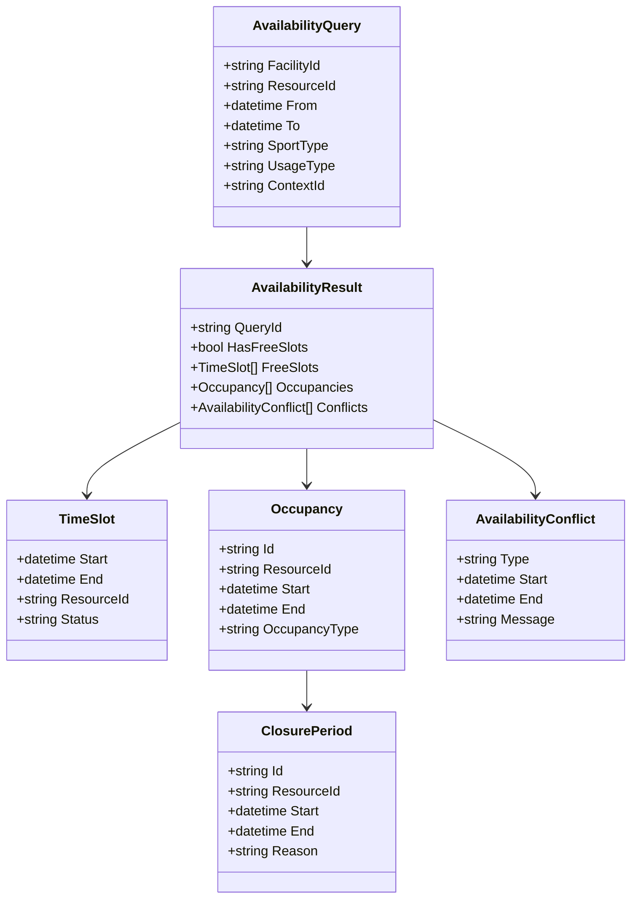
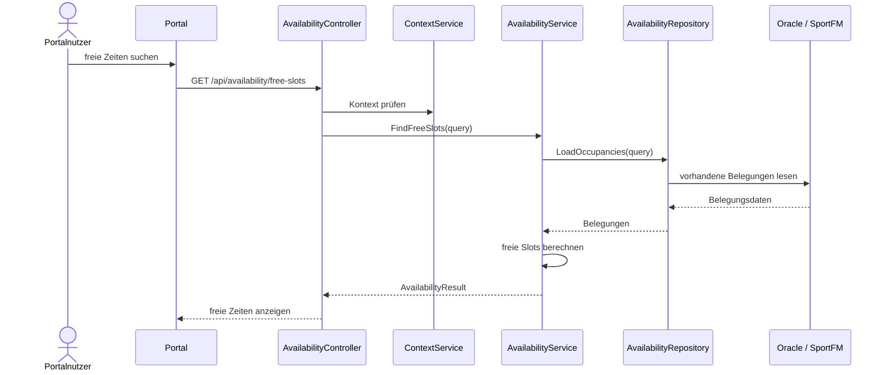
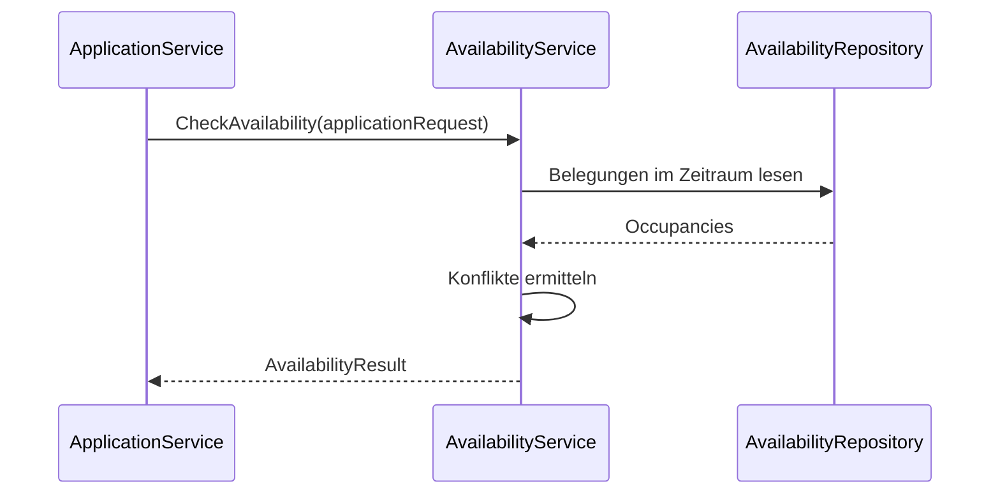

# Domäne Availability

| Feld | Wert |
|---|---|
| Kapitel | 03 – Domänen |
| Dokument | Availability |
| Status | Konsolidierter Arbeitsstand |
| Typ | Bestand / Erweiterung |
| Priorität | Hoch |
| Leitquellen | `Quellen/2026-07-05_Snapshot1.txt`, `Quellen/2026-05_28_Lastenheft_SportFM.pdf` |

---

## 1 Zweck

Die Domäne **Availability** stellt die Ermittlung und Anzeige freier Zeiten, Belegungen und Verfügbarkeiten von Sportanlagen bereit.

Sie ist eine zentrale Bestandsdomäne, weil die Belegungs- und Verfügbarkeitslogik bereits fachlich in SportFM vorhanden ist und nicht neu modelliert werden soll.

Availability kapselt die vorhandene SportFM-Logik und macht sie über fachliche REST-Endpunkte für Portal, Application, Booking und interne Oberflächen nutzbar.

---

## 2 Projektbewertung

| Bereich | Bestand | Erweiterung | Neuentwicklung | Bewertung |
|---|:---:|:---:|:---:|---|
| Oracle | x | x |  | vorhandene Belegungsdaten nutzen und kontextfähig bereitstellen |
| PL/SQL | x | x |  | vorhandene Logik prüfen, ggf. API-Package ergänzen |
| REST |  |  | x | neue fachliche Availability-API |
| DTO |  |  | x | neue Vertragsobjekte |
| Portal |  | x | x | freie Zeiten, Kalender, Suche |
| Application |  | x |  | Antragstellung nutzt Verfügbarkeiten |
| Booking | x | x |  | Buchungs- und Reservierungsdaten sind Grundlage |
| Tests |  | x | x | Integrations- und Regressionstests erforderlich |

---

## 3 Abgrenzung

### 3.1 Verantwortlich

Availability ist verantwortlich für:

- freie Zeiten,
- belegte Zeiten,
- Kalenderansichten,
- Verfügbarkeitsabfragen,
- Zeitfenster,
- Ressourcenbelegung,
- Zusammenführung von Buchungen, Reservierungen und Sperrzeiten,
- kontextbezogene Anzeige zulässiger Verfügbarkeiten,
- Such- und Filtergrundlagen für Antragstellung und Buchung.

### 3.2 Nicht verantwortlich

Availability ist nicht verantwortlich für:

- Antragserstellung,
- Reservierungserstellung,
- Buchungserstellung,
- Genehmigung,
- Gebührenberechnung,
- Rechnungserstellung,
- Dokumentenerzeugung,
- Workflowstatus,
- Stammdatenpflege von Sportanlagen.

Diese Verantwortlichkeiten liegen in Application, Booking, Workflow, Charge, Invoice, Document und Administration.

---

## 4 Architekturgrundsatz

Availability ist eine lesende bzw. prüfende Domäne.

Sie darf vorhandene Belegungslogik nicht duplizieren.

```text
Portal / Application / Booking
  ↓
Availability API
  ↓
AvailabilityService
  ↓
AvailabilityRepository
  ↓
Oracle / bestehende Belegungs- und Buchungslogik
```

Ändernde Operationen an Belegungen erfolgen nicht über Availability, sondern über Booking oder bestehende SportFM-Fachlogik.

---

## 5 Fachlicher Grundsatz

Freie Zeiten entstehen nicht aus isolierten Kalenderdaten.

Sie ergeben sich aus dem Zusammenspiel von:

- Sportanlage,
- Sportstätte / Teilfläche,
- Nutzungszeitraum,
- vorhandenen Buchungen,
- Reservierungen,
- Sperrzeiten,
- Öffnungszeiten,
- Nutzungsart,
- Sportart,
- fachlichen Einschränkungen,
- Kontext und Sichtbarkeit.

---

## 6 Einordnung in die Plattform

```text
Search / Portal
  ↓
Availability
  ↓
Application
  ↓
Booking
```

Availability liefert Verfügbarkeitsinformationen.

Application nutzt diese Informationen für die Antragstellung.

Booking verwendet die vorhandene Belegungs- und Buchungslogik zur verbindlichen Reservierung oder Buchung.

---

## 7 Fachliche Sichten

| Sicht | Zweck |
|---|---|
| freie Zeiten | Portalnutzer findet mögliche Nutzungszeiten |
| Belegungskalender | Anzeige vorhandener Belegungen |
| Ressourcenansicht | Anzeige je Sportanlage / Teilfläche |
| Zeitraumansicht | freie und belegte Zeiten in einem Zeitraum |
| Antragssicht | Verfügbarkeit im Rahmen eines Antrags |
| interne Sicht | Sachbearbeitung prüft Belegungslage |

---

## 8 Business Objects

| Objekt | Zweck | Persistenz |
|---|---|---|
| `AvailabilityQuery` | Such- und Prüfparameter | transient |
| `AvailabilityResult` | Ergebnis einer Verfügbarkeitsabfrage | transient |
| `TimeSlot` | einzelnes Zeitfenster | abgeleitet |
| `Occupancy` | vorhandene Belegung | Bestand |
| `ReservationBlock` | reservierter Zeitraum | Bestand / Booking |
| `ClosurePeriod` | Sperrzeit / Nichtverfügbarkeit | Bestand / zu prüfen |
| `FacilityCalendar` | Kalenderansicht einer Anlage | abgeleitet |
| `AvailabilityConflict` | Konflikt / Überschneidung | abgeleitet |

### 8.1 Klassendiagramm



---

## 9 Fachliche Regeln

| ID | Regel |
|---|---|
| AVL-BR-001 | Verfügbarkeiten werden aus bestehenden Belegungs- und Buchungsdaten abgeleitet. |
| AVL-BR-002 | Availability erzeugt keine Buchungen. |
| AVL-BR-003 | Availability verändert keine Reservierungen. |
| AVL-BR-004 | Jeder fachliche Aufruf benötigt einen zulässigen Kontext, sofern nicht ausschließlich öffentliche Informationen angezeigt werden. |
| AVL-BR-005 | Suchergebnisse dürfen nur Informationen enthalten, die für den jeweiligen Benutzer / Kontext sichtbar sind. |
| AVL-BR-006 | Zeiträume werden anhand bestehender SportFM-Regeln geprüft. |
| AVL-BR-007 | Überschneidungen werden als Konflikte ausgewiesen, nicht automatisch korrigiert. |
| AVL-BR-008 | Eine als frei angezeigte Zeit garantiert keine spätere Buchung, solange kein verbindlicher Booking-Prozess erfolgt ist. |
| AVL-BR-009 | Portalansicht und interne Ansicht können unterschiedliche Detailtiefe besitzen. |
| AVL-BR-010 | Performance ist kritisch; Abfragen müssen filterbar und begrenzbar sein. |

---

## 10 Standardabläufe

### 10.1 Freie Zeiten suchen

```text
Portalnutzer wählt Sportanlage / Zeitraum
  ↓
Context prüfen
  ↓
AvailabilityQuery erzeugen
  ↓
Bestandslogik für Belegungen auswerten
  ↓
freie Zeitfenster ermitteln
  ↓
Ergebnis an Portal zurückgeben
```

### 10.2 Verfügbarkeit im Antrag prüfen

```text
Application enthält gewünschten Zeitraum
  ↓
Application ruft Availability auf
  ↓
Availability prüft Überschneidungen
  ↓
Application erhält Ergebnis / Konflikte
  ↓
Antrag kann fortgesetzt oder korrigiert werden
```

### 10.3 Interne Belegungsprüfung

```text
Sachbearbeitung öffnet Antrag
  ↓
Workflow / Application ruft Availability auf
  ↓
Kalender und Konflikte anzeigen
  ↓
Sachbearbeitung entscheidet fachlich
```

---

## 11 Sequenzdiagramme

### 11.1 Freie Zeiten suchen



### 11.2 Konfliktprüfung für Antrag



---

## 12 REST-API

| ID | Methode | Pfad | Zweck |
|---|---|---|---|
| AVL-API-001 | `GET` | `/api/availability/free-slots` | freie Zeitfenster suchen |
| AVL-API-002 | `POST` | `/api/availability/check` | Verfügbarkeit eines gewünschten Zeitraums prüfen |
| AVL-API-003 | `GET` | `/api/facilities/{facilityId}/calendar` | Kalender einer Sportanlage lesen |
| AVL-API-004 | `GET` | `/api/resources/{resourceId}/occupancies` | Belegungen einer Ressource lesen |
| AVL-API-005 | `GET` | `/api/availability/conflicts` | Konflikte für Parameter lesen |
| AVL-API-006 | `GET` | `/api/availability/filters` | verfügbare Filterwerte lesen |

Ändernde Operationen sind nicht Bestandteil der Availability-API.

---

## 13 DTOs

### 13.1 `AvailabilityQueryDto`

| Feld | Typ | Pflicht |
|---|---|:---:|
| `facilityId` | string | nein |
| `resourceId` | string | nein |
| `from` | datetime | ja |
| `to` | datetime | ja |
| `sportType` | string | nein |
| `usageType` | string | nein |
| `contextId` | string | nein / aus aktivem Kontext |

### 13.2 `AvailabilityResultDto`

| Feld | Typ | Pflicht |
|---|---|:---:|
| `query` | `AvailabilityQueryDto` | ja |
| `freeSlots` | array | ja |
| `occupancies` | array | nein |
| `conflicts` | array | nein |
| `warnings` | array | nein |

### 13.3 `TimeSlotDto`

| Feld | Typ | Pflicht |
|---|---|:---:|
| `start` | datetime | ja |
| `end` | datetime | ja |
| `facilityId` | string | ja |
| `resourceId` | string | nein |
| `status` | string | ja |

### 13.4 `OccupancyDto`

| Feld | Typ | Pflicht |
|---|---|:---:|
| `id` | string | ja |
| `start` | datetime | ja |
| `end` | datetime | ja |
| `occupancyType` | string | ja |
| `displayText` | string | nein |
| `visibleDetails` | boolean | ja |

### 13.5 `AvailabilityConflictDto`

| Feld | Typ | Pflicht |
|---|---|:---:|
| `type` | string | ja |
| `start` | datetime | ja |
| `end` | datetime | ja |
| `message` | string | ja |
| `blocking` | boolean | ja |

---

## 14 Services

| Service | Verantwortung |
|---|---|
| `AvailabilityService` | zentrale Verfügbarkeitsabfragen und Konfliktprüfung |
| `FreeSlotService` | freie Slots berechnen |
| `OccupancyService` | Belegungen laden / aufbereiten |
| `AvailabilityFilterService` | Filterwerte bereitstellen |
| `AvailabilityCalendarService` | Kalenderansichten erzeugen |
| `AvailabilityVisibilityService` | Detailtiefe und Sichtbarkeit prüfen |
| `AvailabilityIntegrationService` | Nutzung durch Application und Booking koordinieren |

---

## 15 Repository

| Repository | Zweck |
|---|---|
| `AvailabilityRepository` | Belegungsdaten lesen |
| `OccupancyRepository` | vorhandene Occupancies lesen |
| `FacilityCalendarRepository` | Kalenderdaten lesen / zusammenführen |
| `AvailabilityFilterRepository` | Filter- und Stammdatenwerte lesen |

Repositories enthalten keine Geschäftslogik und verändern keine Buchungen.

---

## 16 Oracle und PL/SQL

### 16.1 Bestandsprüfung

Availability muss primär bestehende SportFM-Objekte nutzen.

Aus den vorhandenen Quellen ergeben sich insbesondere Bezugspunkte zu bestehenden Belegungs- und Buchungsobjekten wie:

| Bereich | Bezug |
|---|---|
| Buchungsnummern | `LHD_SPA_BOOKING_NUMBERS` |
| Belegung / Occupancy | `LHD_SPA_OCC*` |
| Sportanlagen / Ressourcen | bestehende SportFM-Stammdaten, genaue Tabellenzuordnung prüfen |
| Dokumente / Rechnungen | nur indirekte Sichtbarkeit, keine Availability-Verantwortung |

### 16.2 Neue Persistenz

Für Availability selbst ist zunächst keine neue fachliche Hauptpersistenz vorgesehen, sofern die bestehende Belegungslogik die notwendigen Informationen liefert.

Zu prüfen sind lediglich technische oder konfigurierende Ergänzungen:

| Objekt | Zweck | Status |
|---|---|---|
| `LHD_SPA_AVAILABILITY_FILTERS` | optionale Filterkonfiguration | nur falls erforderlich |
| `LHD_SPA_AVAILABILITY_CACHE` | optionaler Cache | nur falls Performance erforderlich |

### 16.3 Package-Zuordnung

| Package | Zweck | Status |
|---|---|---|
| bestehende Belegungs-Packages | vorhandene Verfügbarkeits- und Belegungslogik | zu identifizieren |
| `PA_LHD_SPA_AVAILABILITY` | REST-taugliche Kapselung der Availability-Funktionen | vorgeschlagene Zielstruktur, noch zu bestätigen |

---

## 17 Blazor-Frontend

### 17.1 Seiten

| ID | Seite | Route | Zweck |
|---|---|---|---|
| AVL-PAGE-001 | Freie Zeiten suchen | `/availability` | öffentliche / portalbezogene Suche |
| AVL-PAGE-002 | Kalender Sportanlage | `/facilities/{id}/calendar` | Kalenderansicht |
| AVL-PAGE-003 | Verfügbarkeit im Antrag | Bestandteil Wizard / Application | Zeitfenster auswählen |
| AVL-PAGE-004 | Interne Belegungsansicht | Bestandteil Workflow / Backoffice | Prüfung durch Sachbearbeitung |

### 17.2 Komponenten

| Komponente | Zweck |
|---|---|
| `AvailabilitySearchForm` | Suchparameter erfassen |
| `FreeSlotList` | freie Zeitfenster anzeigen |
| `AvailabilityCalendar` | Kalenderansicht |
| `OccupancyBadge` | Belegungsstatus darstellen |
| `AvailabilityConflictList` | Konflikte anzeigen |
| `FacilityFilterPanel` | Filter nach Anlage / Sportart / Zeitraum |
| `TimeSlotPicker` | Zeitfenster im Wizard auswählen |

---

## 18 Berechtigungen

| Berechtigung | Zweck |
|---|---|
| `Availability.ReadPublic` | öffentliche oder allgemein freigegebene Verfügbarkeiten lesen |
| `Availability.ReadContext` | kontextbezogene Verfügbarkeiten lesen |
| `Availability.ReadDetails` | Belegungsdetails lesen, intern / berechtigt |
| `Availability.Check` | Verfügbarkeit für Antrag / Buchung prüfen |
| `Availability.Calendar.Read` | Kalenderansicht lesen |

Die Sichtbarkeit von Belegungsdetails ist restriktiv zu behandeln.

---

## 19 Validierungen

| ID | Validierung | Ebene |
|---|---|---|
| AVL-VAL-001 | Zeitraum vorhanden | Availability |
| AVL-VAL-002 | Zeitraum gültig: `from < to` | Availability |
| AVL-VAL-003 | Zeitraum begrenzt, um teure Abfragen zu vermeiden | Availability |
| AVL-VAL-004 | Anlage oder Ressource existiert | Facility / Availability |
| AVL-VAL-005 | Kontext vorhanden, wenn Detaildaten angefordert werden | Context |
| AVL-VAL-006 | Benutzer darf Detaildaten sehen | Context / Authorization |
| AVL-VAL-007 | Suchfilter sind gültig | Availability |
| AVL-VAL-008 | Konfliktprüfung nutzt dieselben Bestandsregeln wie Booking | Availability / Booking |

---

## 20 Testfälle

| Testfall | Beschreibung |
|---|---|
| TF-AVL-001 | freie Zeiten für Anlage laden |
| TF-AVL-002 | belegte Zeiten werden nicht als frei angezeigt |
| TF-AVL-003 | Konflikt bei Überschneidung erkennen |
| TF-AVL-004 | Zeitraumvalidierung verhindert ungültige Abfrage |
| TF-AVL-005 | Kontextfilter verhindert unzulässige Details |
| TF-AVL-006 | Portalansicht zeigt nur zulässige Detailtiefe |
| TF-AVL-007 | Kalenderansicht laden |
| TF-AVL-008 | Application kann Verfügbarkeit prüfen |
| TF-AVL-009 | Availability erzeugt keine Buchung |
| TF-AVL-010 | Performancegrenze für große Zeiträume testen |
| TF-AVL-011 | Suchfilter funktionieren kombiniert |
| TF-AVL-012 | bestehende Oracle-Logik wird unverändert genutzt |

---

## 21 Arbeitspakete

| AP | Titel | Inhalt |
|---|---|---|
| AP-AVL-001 | Bestandsanalyse | Oracle-Tabellen, Packages, bestehende Belegungslogik |
| AP-AVL-002 | Domänenmodell | Query, Result, TimeSlot, Occupancy, Conflict |
| AP-AVL-003 | REST | Controller, DTOs, Fehlerformat |
| AP-AVL-004 | AvailabilityService | zentrale Abfragen und Konflikte |
| AP-AVL-005 | Repository | Oracle-/Package-Zugriffe |
| AP-AVL-006 | Context-Anbindung | Sichtbarkeit und Detailtiefe |
| AP-AVL-007 | Application-Anbindung | Verfügbarkeitsprüfung im Antrag |
| AP-AVL-008 | Portal | Suche, Kalender, Komponenten |
| AP-AVL-009 | Performance | Paging, Zeitraumgrenzen, ggf. Cache |
| AP-AVL-010 | Tests | Unit-, Integrations- und Regressionstests |
| AP-AVL-011 | Dokumentation | API, Domäne, Bestandsmapping |

---

## 22 Aufwandstreiber

| Treiber | Einfluss |
|---|---|
| Komplexität bestehender Belegungslogik | sehr hoch |
| Identifikation relevanter Oracle-Packages | hoch |
| Performance großer Kalenderabfragen | hoch |
| Kontextbezogene Sichtbarkeit | hoch |
| Detailtiefe Portal vs. intern | mittel bis hoch |
| Anzahl Filter | mittel |
| Integration in Application-Wizard | mittel bis hoch |
| Konfliktlogik | hoch |
| Regression gegen Bestand | hoch |

Konkrete Personentage werden erst nach Analyse der vorhandenen Belegungslogik und Oracle-Packages festgelegt.

---

## 23 Risiken

| Risiko | Bewertung | Maßnahme |
|---|---|---|
| bestehende Verfügbarkeitslogik wird versehentlich nachgebaut | hoch | Bestand zuerst analysieren und kapseln |
| Performance großer Abfragen unklar | hoch | Zeitraumgrenzen und Lasttests |
| Details werden im Portal zu offen angezeigt | hoch | VisibilityService und Context-Prüfung |
| unterschiedliche Regeln zwischen Availability und Booking | sehr hoch | Booking-Bestandslogik als führend behandeln |
| Oracle-Packages nicht eindeutig dokumentiert | hoch | Package-Mapping im Datenmodell ergänzen |
| freie Zeit wird als verbindliche Zusage missverstanden | mittel | UI-Hinweis und Business Rule |

---

## 24 Offene Punkte

| ID | Offener Punkt | Relevanz |
|---|---|---|
| OP-AVL-001 | finale Zuordnung der Belegungs-/Occupancy-Tabellen | sehr hoch |
| OP-AVL-002 | finale Zuordnung der PL/SQL-Packages | sehr hoch |
| OP-AVL-003 | Detailtiefe öffentlicher Portalansicht | hoch |
| OP-AVL-004 | Zeitraumgrenzen für Abfragen | hoch |
| OP-AVL-005 | Cache erforderlich? | mittel |
| OP-AVL-006 | Filterumfang V1 | mittel |
| OP-AVL-007 | Integration in Wizard-Zeitfensterauswahl | hoch |
| OP-AVL-008 | Umgang mit Sperrzeiten / Schließzeiten | hoch |

---

## 25 Traceability-Matrix

| Quelle | Funktion | REST | Service | UI | Test | AP |
|---|---|---|---|---|---|---|
| Lastenheft freie Zeiten | freie Zeitfenster suchen | AVL-API-001 | AvailabilityService | AvailabilitySearchForm | TF-AVL-001 | AP-AVL-003/004/008 |
| Lastenheft Belegung | Kalender anzeigen | AVL-API-003 | AvailabilityCalendarService | AvailabilityCalendar | TF-AVL-007 | AP-AVL-008 |
| Application.md | Zeitraum im Antrag prüfen | AVL-API-002 | AvailabilityService | TimeSlotPicker | TF-AVL-008 | AP-AVL-007 |
| Booking-Bestand | Konfliktprüfung | AVL-API-002/005 | AvailabilityService | ConflictList | TF-AVL-003 | AP-AVL-004/005 |
| Context.md | Sichtbarkeit | alle | AvailabilityVisibilityService | alle Komponenten | TF-AVL-005/006 | AP-AVL-006 |

---

## 26 Änderungsauswirkungen

Änderungen an `Availability.md` wirken sich aus auf:

- `03_Domaenen/Application.md`,
- `03_Domaenen/Wizard.md`,
- `03_Domaenen/Booking.md`,
- `03_Domaenen/Context.md`,
- `03_Domaenen/Dashboard.md`,
- `04_REST_API/Endpunkte.md`,
- `04_REST_API/DTOs.md`,
- `05_Datenmodell/Tabellen.md`,
- `05_Datenmodell/Packages.md`,
- `06_Arbeitspakete/Arbeitspaketliste.md`,
- `07_Kalkulation/Aufwandsschaetzung.md`,
- `09_Testkonzept/Testfaelle.md`,
- `12_Offene_Punkte/Offene_Punkte.md`.

---

## 27 Ergebnis

Die Domäne Availability ist als Bestands- und Erweiterungsdomäne spezifiziert.

Sie stellt freie Zeiten, Kalender, Belegungsinformationen und Konfliktprüfungen bereit, ohne selbst Buchungen oder Reservierungen zu erzeugen.

Die konkrete Kalkulation bleibt abhängig von:

- bestätigter Oracle-Zuordnung,
- identifizierter bestehender PL/SQL-Logik,
- finaler Portal-Detailtiefe,
- finalem Filterumfang,
- Performanceanforderungen,
- Integration in Application und Booking.
