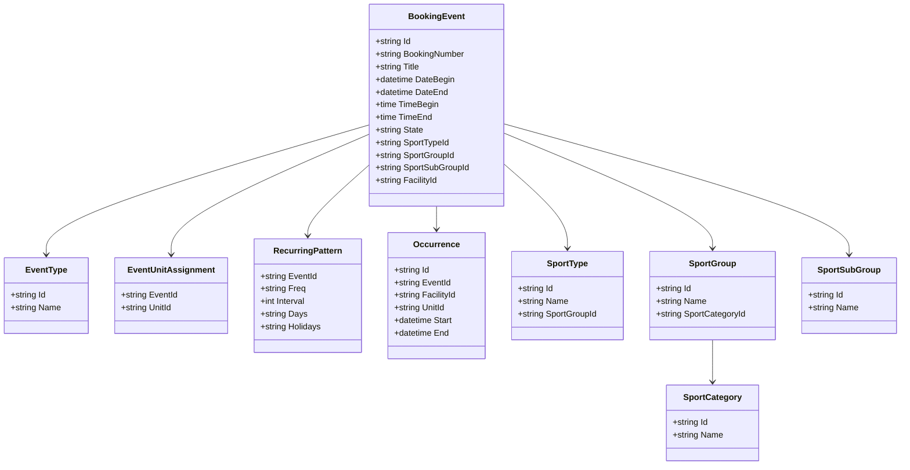

# Domäne Booking

| Feld | Wert |
|---|---|
| Kapitel | 03 – Domänen |
| Dokument | Booking |
| Status | Konsolidierter Arbeitsstand |
| Typ | Bestandsdomäne / REST-Freilegung |
| Priorität | Sehr hoch |
| Leitquellen | `Quellen/2026-07-05_Snapshot1.txt`, `LHD_SPA_EVENTS.sql`, `LHD_SPA_EVENT2UNIT.sql`, `LHD_SPA_EVENTCLASSES.sql`, `LHD_SPA_EVENTTYPES.sql`, `LHD_SPA_RECURRING_PATTERN.sql`, `LHD_SPA_OCC*.sql`, `LHD_SPA_BOOKING_NUMBERS.sql`, `LHD_SPA_SPORTCATEGORIES.sql`, `LHD_SPA_SPORTGROUPS.sql`, `LHD_SPA_SPORTSUBGROUPS.sql`, `LHD_SPA_SPORTTYPES.sql` |

---

## 1 Zweck

Die Domäne **Booking** beschreibt die bestehende SportFM-Buchungslogik.

Booking ist eine Bestandsdomäne. Sie bleibt führend für Events, Buchungen, Belegungen, Wiederholungen, Stornierungen, Occurrences, Winner-Ermittlung, Kalenderlogik, Gebührenbezug und buchungsbezogene Sportreferenzen.

Ziel ist nicht die Neuentwicklung der Buchungslogik, sondern die fachliche Dokumentation des Bestands und die kontrollierte REST-Freilegung.

---

## 2 Fachliche Einordnung

Booking beschreibt **welche Nutzung** in einer Sportstätte stattfindet.

Facility beschreibt **wo** die Nutzung stattfindet.

Die Buchung / das Event verbindet daher:

```text
Facility-Bezug
  Sportanlage / Teileinheit

Nutzungsbezug
  Eventtyp / Eventklasse
  Sportart / Sportgruppe / Sportuntergruppe / Sportkategorie

Zeitbezug
  Datum / Uhrzeit / Wiederholungsmuster

Ergebnis
  Occurrence / Winner / Kalenderbelegung
```

Sportart, Sportgruppe, Sportuntergruppe und Sportkategorie sind keine Eigenschaften der Sportanlage. Sie werden am Event bzw. an der Buchung geführt.

---

## 3 Projektbewertung

| Bereich | Bestand | Erweiterung | Neuentwicklung | Bewertung |
|---|:---:|:---:|:---:|---|
| Oracle | x | x |  | bestehendes Datenmodell bleibt führend |
| PL/SQL | x | x |  | `PA_LHD_SPA` und `PA_LHD_SPA_OCC` bleiben führend |
| REST |  |  | x | fachliche Zugriffsschicht erforderlich |
| DTO |  |  | x | fachliche DTOs, keine Tabellen-DTOs |
| Portal |  | x | x | Anzeige, Kalender, eigene Buchungen, freie-Zeiten-Einstieg |
| Facility | x | x |  | liefert Sportanlage und Teileinheit |
| Availability | x | x |  | liest Belegung / freie Zeiten über Occurrence und Winner |
| Tests |  | x | x | Regression gegen bestehende Buchungslogik erforderlich |

---

## 4 Grundsatz

Booking wird nicht neu entworfen.

Verbindliche Grundsätze:

- keine zweite Buchungslogik im Portal,
- keine zweite Occurrence-Berechnung in .NET,
- keine zweite Winner-Berechnung in .NET,
- keine neue Gebührenlogik im Portal,
- keine direkte Tabellen-API,
- REST kapselt fachliche Operationen und nutzt den Bestand,
- Sportart, Sportgruppe, Sportuntergruppe und Sportkategorie werden als Booking-/Event-Referenzdaten geführt.

---

## 5 Fachlicher Bestand

Gesichert vorhanden sind:

- Buchungen als Events,
- Eventtypen,
- Eventklassen,
- Sportarten,
- Sportgruppen,
- Sportuntergruppen,
- Sportkategorien,
- wiederkehrende Belegungen,
- wöchentliche Übungsbelegung,
- 14-tägige Übungsbelegung,
- Veranstaltungen,
- Sperrungen,
- Reinigung,
- Schulbetrieb,
- GTA,
- Stornierungen,
- Gebührenlogik,
- Occurrence-Ermittlung,
- Winner-Ermittlung,
- Kalenderlogik,
- Suche nach freien Zeiten,
- Dokumenten- und Rechnungsbezug.

---

## 6 Fachmodell Bestand

### 6.1 Event als zentrales Buchungsobjekt

In SportFM sind belegungsrelevante Vorgänge als Events modelliert.

```text
Event
  ↓
EventType / EventClass
  ↓
SportType / SportGroup / SportSubGroup / SportCategory
  ↓
Facility / Unit
  ↓
Recurring Pattern, falls wiederkehrend
  ↓
Occurrence
  ↓
Winner
```

Das Event enthält sowohl den Sportstättenbezug als auch den Nutzungsbezug.

### 6.2 Facility-Bezug

Der Facility-Bezug erfolgt über:

- `LHD_SPA_EVENTS.ID_SPA`,
- `LHD_SPA_EVENTS.SPA_NR`,
- `LHD_SPA_EVENTS.IS_ALL_UNIT`,
- `LHD_SPA_EVENT2UNIT.ID_UNIT`,
- `LHD_SPA_OCC.SPA_ID`,
- `LHD_SPA_OCC.UNIT_ID`,
- `LHD_SPA_OCC_WINNER.SPA_ID`,
- `LHD_SPA_OCC_WINNER.UNIT_ID`.

Die fachliche Struktur von Sportanlage und Teileinheit gehört zur Domäne Facility.

### 6.3 Sportreferenzdaten am Event

Der Nutzungsbezug erfolgt über:

- `LHD_SPA_EVENTS.ID_SPORTTYPE`,
- `LHD_SPA_EVENTS.ID_SPORTGROUP`,
- `LHD_SPA_EVENTS.ID_SPORTSUBGROUP`.

Die referenzierten Tabellen gehören fachlich zu Booking / Event:

| Tabelle | Zweck |
|---|---|
| `LHD_SPA_SPORTCATEGORIES` | Sportkategorien |
| `LHD_SPA_SPORTGROUPS` | Sportgruppen |
| `LHD_SPA_SPORTSUBGROUPS` | Sportuntergruppen |
| `LHD_SPA_SPORTTYPES` | Sportarten |

---

## 7 Buchungsarten / Eventtypen

Produktiv relevante Buchungs- bzw. Belegungsarten sind:

- Sperrung,
- Reinigung,
- Schulbetrieb,
- GTA,
- wöchentliche Übungsbelegung,
- 14-tägige Übungsbelegung,
- Veranstaltung,
- Stornierung.

Sperrungen, Reinigung, Schulbetrieb und GTA sind ebenfalls Events in `LHD_SPA_EVENTS`.

Die resultierende Belegung wird aus Events über Occurrence und Winner berechnet.

---

## 8 Statusmodell Bestand

### 8.1 Events

| Wert | Bedeutung |
|---:|---|
| `1` | aktiv |
| `-1` | gelöscht |

Buchungen werden nicht als neues Portalstatusmodell geführt.

Sie enden fachlich über ein Datum oder werden durch entsprechende Events, insbesondere Stornierungen, abgebildet.

### 8.2 Stornierung

Eine Stornierung ist fachlich eine eigene Buchung mit dem Typ Stornierung.

Sie ist keine einfache Statusänderung am ursprünglichen Event.

---

## 9 Relevante Oracle-Tabellen

### 9.1 Buchungskern

| Tabelle | Zweck |
|---|---|
| `LHD_SPA_EVENTS` | zentrale Event-/Buchungstabelle |
| `LHD_SPA_EVENTS_HIST` | Historien-/Änderungsstruktur zu Events |
| `LHD_SPA_EVENTTYPES` | Eventtypen / Buchungsarten |
| `LHD_SPA_EVENTCLASSES` | Eventklassen |
| `LHD_SPA_EVENT2UNIT` | Zuordnung Event zu Teileinheiten |
| `LHD_SPA_BOOKING_NUMBERS` | Buchungsnummern je Jahr |
| `LHD_SPA_RECURRING_PATTERN` | Wiederholungsmuster |

### 9.2 Sportreferenzdaten für Events

| Tabelle | Zweck |
|---|---|
| `LHD_SPA_SPORTCATEGORIES` | Sportkategorien |
| `LHD_SPA_SPORTGROUPS` | Sportgruppen |
| `LHD_SPA_SPORTSUBGROUPS` | Sportuntergruppen |
| `LHD_SPA_SPORTTYPES` | Sportarten |

### 9.3 Occurrence / Winner

| Tabelle | Zweck |
|---|---|
| `LHD_SPA_OCC` | konkrete Belegungsvorkommen |
| `LHD_SPA_OCC_WINNER` | resultierende gültige Belegung |
| `LHD_SPA_OCC_DAY_COVERAGE` | Tagesabdeckung / Aktualisierungsstand |
| `LHD_SPA_OCC_EVENT_DRT` | technische Dirty-/Retry-Struktur für Event-Occurrences |
| `LHD_SPA_OCC_WINNER_DRT` | technische Dirty-/Retry-Struktur für Winner |

---

## 10 Wichtige Spalten aus dem Bestand

### 10.1 `LHD_SPA_EVENTS`

Zentrale Spalten:

- `ID_EVENT`,
- `ID_PARENT_EVENT`,
- `YEAR`,
- `ID_BOOKING`,
- `BOOKING_COUNTER`,
- `BOOKING_NUMBER`,
- `ID_SPA`,
- `SPA_NR`,
- `ID_USER`,
- `ID_EVENTTYPE`,
- `TITLE`,
- `DESCRIPTION`,
- `DATE_BEGIN`,
- `DATE_END`,
- `TIME_BEGIN`,
- `TIME_END`,
- `DURATION`,
- `ID_SPORTTYPE`,
- `ID_SPORTGROUP`,
- `ID_SPORTSUBGROUP`,
- `IS_RECURRING`,
- `IS_ALL_UNIT`,
- `STATE`,
- `DEPARTMENT`,
- `IS_COMPLEXEVENT`.

### 10.2 `LHD_SPA_EVENT2UNIT`

- `ID_EVENT`,
- `ID_UNIT`.

### 10.3 `LHD_SPA_RECURRING_PATTERN`

- `ID_EVENT`,
- `FREQ`,
- `INTERVAL`,
- `MAX_OCCURRENCES`,
- `DAYS`,
- `HOLIDAYS`.

### 10.4 `LHD_SPA_OCC`

- `ID`,
- `EVENT_ID`,
- `SPA_ID`,
- `UNIT_ID`,
- `START_TS`,
- `END_TS`,
- `DAY_DATE`,
- `USER_ID`,
- `EVENTTYPE_ID`,
- `PRIORITY`,
- `PRIORITY_ETP`,
- `CANCEL_EVENT_ID`,
- `HOLIDAYS_MASK`,
- `CREATED_TS`.

### 10.5 `LHD_SPA_OCC_WINNER`

- `WINNER_ID`,
- `SPA_ID`,
- `UNIT_ID`,
- `DAY_DATE`,
- `START_TS`,
- `END_TS`,
- `EVENT_ID`,
- `OCC_ID`,
- `USER_ID`,
- `EVENTTYPE_ID`,
- `PRIORITY`,
- `PRIORITY_ETP`,
- `CREATED_TS`.

---

## 11 Business Objects

| Objekt | Zweck | Persistenz |
|---|---|---|
| `BookingEvent` | zentrale Buchung / Belegung | Bestand |
| `EventType` | Buchungs-/Belegungsart | Bestand |
| `EventClass` | Eventklasse | Bestand |
| `BookingNumber` | Buchungsnummer | Bestand |
| `RecurringPattern` | Wiederholungsmuster | Bestand |
| `EventUnitAssignment` | Zuordnung Event zu Teileinheit | Bestand |
| `Occurrence` | konkretes Belegungsvorkommen | Bestand |
| `OccurrenceWinner` | resultierende gültige Belegung | Bestand |
| `SportCategory` | Sportkategorie der Nutzung | Bestand |
| `SportGroup` | Sportgruppe der Nutzung | Bestand |
| `SportSubGroup` | Sportuntergruppe der Nutzung | Bestand |
| `SportType` | Sportart der Nutzung | Bestand |

### 11.1 Klassendiagramm



---

## 12 Abgrenzung zu anderen Domänen

| Domäne | Beziehung zu Booking |
|---|---|
| `Facility` | liefert Sportkomplex, Sportanlage und Teileinheit; keine Sportartenlogik |
| `Availability` | liest freie Zeiten und Belegung aus Occurrence / Winner |
| `Application` | erfasst Anträge, erzeugt aber keine Buchung selbst |
| `Workflow` | steuert Bearbeitung und Genehmigung, führt aber keine Buchungslogik aus |
| `Document` | stellt Dokumente zu Buchungen bereit |
| `Charge` | stellt Gebühreninformationen bereit, Berechnung bleibt Bestand |
| `Invoice` | stellt Rechnungen bereit, Erzeugung bleibt Bestand |
| `Notification` | informiert über relevante Ereignisse, verändert keine Buchung |
| `Context` | begrenzt Sichtbarkeit nach OE-/Abteilungs-/SportFM-Kontext |

---

## 13 Fachliche Regeln

| ID | Regel |
|---|---|
| BOOK-BR-001 | Die bestehende Buchungslogik bleibt führend. |
| BOOK-BR-002 | Booking berechnet Occurrences und Winner nicht neu in .NET. |
| BOOK-BR-003 | Sportart, Sportgruppe, Sportuntergruppe und Sportkategorie gehören fachlich zum Event. |
| BOOK-BR-004 | Sportanlage und Teileinheit werden über Facility identifiziert. |
| BOOK-BR-005 | Eine Buchung kann mehreren Teileinheiten zugeordnet sein. |
| BOOK-BR-006 | Stornierungen werden als eigene Events abgebildet. |
| BOOK-BR-007 | Portal erzeugt keine Gebühren. |
| BOOK-BR-008 | REST bildet fachliche Operationen ab, keine Tabellenkopie. |
| BOOK-BR-009 | Buchungen sind nur im zulässigen Kontext sichtbar. |
| BOOK-BR-010 | Kalenderdaten stammen aus Bestandstabellen / Bestandspackages. |

---

## 14 REST-Strategie

Die REST-API ist eine fachliche Zugriffsschicht auf den Bestand.

Sie bildet keine Tabellen direkt ab.

Fachliche DTOs sind erforderlich, z. B.:

- `BookingDto`,
- `BookingDetailDto`,
- `BookingCalendarItemDto`,
- `BookingSeriesDto`,
- `BookingUnitDto`,
- `BookingSportReferenceDto`,
- `BookingChargeInfoDto`,
- `BookingDocumentInfoDto`.

---

## 15 REST-Endpunkte V1

| ID | Methode | Pfad | Zweck |
|---|---|---|---|
| BOOK-API-001 | `GET` | `/api/v1/bookings` | Buchungen suchen / listen |
| BOOK-API-002 | `GET` | `/api/v1/bookings/{id}` | Buchungsdetails lesen |
| BOOK-API-003 | `GET` | `/api/v1/bookings/{id}/units` | zugeordnete Teileinheiten lesen |
| BOOK-API-004 | `GET` | `/api/v1/bookings/{id}/occurrences` | Occurrences einer Buchung lesen |
| BOOK-API-005 | `GET` | `/api/v1/bookings/{id}/documents` | Dokumente zur Buchung lesen |
| BOOK-API-006 | `GET` | `/api/v1/bookings/{id}/charges` | Gebühreninformationen zur Buchung lesen |
| BOOK-API-007 | `GET` | `/api/v1/bookings/{id}/invoices` | Rechnungsbezüge zur Buchung lesen |
| BOOK-API-008 | `GET` | `/api/v1/calendar` | Kalenderdaten aus Buchungen / Winner lesen |
| BOOK-API-009 | `GET` | `/api/v1/event-types` | Eventtypen lesen |
| BOOK-API-010 | `GET` | `/api/v1/sport-types` | Sportarten lesen |
| BOOK-API-011 | `GET` | `/api/v1/sport-groups` | Sportgruppen lesen |
| BOOK-API-012 | `GET` | `/api/v1/sport-subgroups` | Sportuntergruppen lesen |
| BOOK-API-013 | `GET` | `/api/v1/sport-categories` | Sportkategorien lesen |

Ändernde Booking-Endpunkte werden erst definiert, wenn die konkrete Portal- und WPF-Migration dies erfordert.

---

## 16 DTOs

### 16.1 `BookingDto`

| Feld | Typ | Pflicht |
|---|---|:---:|
| `bookingId` | string | ja |
| `bookingNumber` | string | nein |
| `title` | string | ja |
| `eventType` | string | ja |
| `facilityId` | string | nein |
| `facilityName` | string | nein |
| `sportType` | string | nein |
| `dateBegin` | datetime | ja |
| `dateEnd` | datetime | nein |
| `state` | string | ja |

### 16.2 `BookingDetailDto`

| Feld | Typ | Pflicht |
|---|---|:---:|
| `bookingId` | string | ja |
| `bookingNumber` | string | nein |
| `title` | string | ja |
| `description` | string | nein |
| `eventType` | string | ja |
| `eventClass` | string | nein |
| `facility` | object | nein |
| `units` | array | nein |
| `sport` | `BookingSportReferenceDto` | nein |
| `recurringPattern` | object | nein |
| `documents` | array | nein |
| `charges` | array | nein |
| `invoices` | array | nein |

### 16.3 `BookingSportReferenceDto`

| Feld | Typ | Pflicht |
|---|---|:---:|
| `sportTypeId` | string | nein |
| `sportTypeName` | string | nein |
| `sportGroupId` | string | nein |
| `sportGroupName` | string | nein |
| `sportSubGroupId` | string | nein |
| `sportSubGroupName` | string | nein |
| `sportCategoryId` | string | nein |
| `sportCategoryName` | string | nein |

### 16.4 `SportTypeDto`

| Feld | Typ | Pflicht |
|---|---|:---:|
| `id` | string | ja |
| `name` | string | ja |
| `sportGroupId` | string | nein |
| `active` | boolean | nein |

---

## 17 Services und Repositories

| Service | Verantwortung |
|---|---|
| `BookingService` | Buchungen suchen und lesen |
| `BookingDetailService` | Details, Units, Sportreferenzen, Dokumente, Gebühren zusammenstellen |
| `BookingCalendarService` | Kalenderdaten über Bestand bereitstellen |
| `BookingOccurrenceService` | Occurrences lesen, nicht neu berechnen |
| `BookingSportReferenceService` | Sportarten, Sportgruppen, Sportuntergruppen und Sportkategorien lesen |
| `BookingVisibilityService` | Kontext- und Rollenprüfung |
| `BookingIntegrationService` | Anbindung an Facility, Availability, Document, Charge, Invoice |

| Repository | Zweck |
|---|---|
| `BookingRepository` | Events / Buchungen lesen |
| `BookingUnitRepository` | Event2Unit lesen |
| `BookingOccurrenceRepository` | Occurrences und Winner lesen |
| `BookingSportReferenceRepository` | Sportreferenzdaten lesen |
| `BookingNumberRepository` | Buchungsnummern lesen |

---

## 18 Oracle und PL/SQL

### 18.1 Bestehende Packages

| Package | Zweck |
|---|---|
| `PA_LHD_SPA` | zentrales Bestandspackage für Wiederholungen, Stornierungen, Gebühren und weitere Buchungslogik |
| `PA_LHD_SPA_OCC` | Bestandspackage für Occurrences und performante Terminzugriffe |

### 18.2 Zielkapselung

| Package | Zweck | Status |
|---|---|---|
| bestehende Buchungspackages | Buchungslogik / Occurrences / Winner | Bestand führend |
| `PA_LHD_SPA_BOOKING` | REST-taugliche Kapselung für Buchungsliste, Details und Referenzdaten | vorgeschlagene Zielstruktur, noch zu bestätigen |

---

## 19 Blazor-Frontend

| Seite / Bereich | Zweck |
|---|---|
| Meine Buchungen | kontextbezogene Buchungsliste |
| Buchungsdetails | Details zu einer Buchung inklusive Facility- und Sportreferenzen |
| Kalender | Anzeige von Belegungen / Winner-Daten |
| Buchungsdokumente | Dokumente zur Buchung anzeigen |
| Buchungsrechnungen | Rechnungsbezüge anzeigen |

| Komponente | Zweck |
|---|---|
| `BookingList` | Buchungsliste |
| `BookingDetail` | Buchungsdetail |
| `BookingCalendar` | Kalenderanzeige |
| `BookingSportInfo` | Sportart / Sportgruppe / Kategorie anzeigen |
| `BookingUnitList` | Teileinheiten anzeigen |
| `BookingDocumentList` | Dokumente zur Buchung |
| `BookingInvoiceList` | Rechnungen zur Buchung |

---

## 20 Berechtigungen

| Berechtigung | Zweck |
|---|---|
| `Booking.Read` | Buchungen im zulässigen Kontext lesen |
| `Booking.Calendar.Read` | Kalenderdaten lesen |
| `Booking.Occurrences.Read` | Occurrences lesen |
| `Booking.ReferenceData.Read` | Eventtypen und Sportreferenzdaten lesen |
| `Booking.Documents.Read` | Dokumente zur Buchung lesen |
| `Booking.Charges.Read` | Gebühreninformationen lesen |
| `Booking.Invoices.Read` | Rechnungsbezüge lesen |

---

## 21 Validierungen

| ID | Validierung | Ebene |
|---|---|---|
| BOOK-VAL-001 | Buchung existiert | BookingService |
| BOOK-VAL-002 | Buchung ist nicht gelöscht, sofern keine gelöschten Daten angefordert werden | BookingService |
| BOOK-VAL-003 | Benutzer besitzt zulässigen Kontext | Context |
| BOOK-VAL-004 | Teileinheit gehört zur Buchung | BookingService |
| BOOK-VAL-005 | Sportart / Sportgruppe / Sportuntergruppe ist gültig | BookingSportReferenceService |
| BOOK-VAL-006 | Benutzer darf Dokumente zur Buchung sehen | Context / Document |
| BOOK-VAL-007 | Benutzer darf Rechnungen zur Buchung sehen | Context / Invoice |
| BOOK-VAL-008 | Kalenderzeitraum ist begrenzt | REST / Performance |

---

## 22 Testfälle

| Testfall | Beschreibung |
|---|---|
| TF-BOOK-001 | Buchungsliste im Kontext laden |
| TF-BOOK-002 | fremde Buchung nicht anzeigen |
| TF-BOOK-003 | Buchungsdetails lesen |
| TF-BOOK-004 | zugeordnete Teileinheiten lesen |
| TF-BOOK-005 | Sportart / Sportgruppe / Sportuntergruppe zur Buchung anzeigen |
| TF-BOOK-006 | Sportreferenzdaten lesen |
| TF-BOOK-007 | Occurrences einer Buchung lesen |
| TF-BOOK-008 | Kalenderdaten laden |
| TF-BOOK-009 | Dokumente zur Buchung lesen |
| TF-BOOK-010 | Rechnungsbezüge zur Buchung lesen |
| TF-BOOK-011 | gelöschte Buchung standardmäßig ausblenden |
| TF-BOOK-012 | REST nutzt Bestand und erzeugt keine eigene Occurrence-Logik |
| TF-BOOK-013 | REST nutzt Bestand und erzeugt keine eigene Winner-Logik |

---

## 23 Arbeitspakete

| AP | Titel | Inhalt |
|---|---|---|
| AP-BOOK-001 | Bestandsmapping | Tabellen, Packages, bestehende Logik dokumentieren |
| AP-BOOK-002 | DTOs | Booking-, Kalender-, Detail- und Sportreferenz-DTOs definieren |
| AP-BOOK-003 | REST Lesen | Leseendpunkte für Buchungen |
| AP-BOOK-004 | REST Referenzdaten | Eventtypen, Sportarten, Gruppen, Kategorien bereitstellen |
| AP-BOOK-005 | Kalenderzugriff | REST-Zugriff auf Kalender-/Winner-Daten |
| AP-BOOK-006 | Occurrence-Zugriff | vorhandene Occurrence-Daten bereitstellen |
| AP-BOOK-007 | Dokumentenbezug | Document-Domäne anbinden |
| AP-BOOK-008 | Gebührenbezug | Charge-Domäne anbinden |
| AP-BOOK-009 | Rechnungsbezug | Invoice-Domäne anbinden |
| AP-BOOK-010 | Kontextprüfung | Context-Domäne anbinden |
| AP-BOOK-011 | Portal | Buchungsliste, Detail, Kalenderbereiche |
| AP-BOOK-012 | Tests | Regression, REST, Kontext, Performance |

---

## 24 Risiken

| Risiko | Bewertung | Maßnahme |
|---|---|---|
| REST bildet Tabellen statt Fachfunktionen ab | hoch | fachliche DTOs und Services verwenden |
| Portal berechnet eigene Belegungslogik | sehr hoch | Occurrence / Winner ausschließlich aus Bestand nutzen |
| Sportarten werden fälschlich Facility zugeordnet | hoch | Sportreferenzen im Booking-Modell führen |
| Kontextprüfung unvollständig | hoch | Context-Domäne verbindlich anbinden |
| Kalenderabfragen werden zu groß | hoch | Zeitraumgrenzen, Filter und Caching prüfen |
| bestehende Package-Logik wird umgangen | hoch | `PA_LHD_SPA` / `PA_LHD_SPA_OCC` als führend behandeln |

---

## 25 Offene Punkte

| ID | Offener Punkt | Relevanz |
|---|---|---|
| OP-BOOK-001 | Welche schreibenden Booking-Funktionen werden in V1 tatsächlich über REST benötigt? | hoch |
| OP-BOOK-002 | Welche internen WPF-Funktionen werden zuerst auf REST migriert? | mittel |
| OP-BOOK-003 | Welche Kalenderdetailtiefe ist im Portal zulässig? | hoch |
| OP-BOOK-004 | Zeitraumgrenzen für Kalender- und Occurrence-Endpunkte | hoch |
| OP-BOOK-005 | finale fachliche Hierarchie SportCategory / SportGroup / SportSubGroup / SportType im Datenmodellkapitel | mittel |

---

## 26 Traceability-Matrix

| Quelle | Funktion | REST | Service | UI | Test | AP |
|---|---|---|---|---|---|---|
| Snapshot / Bestand | Buchungen als Events | BOOK-API-001/002 | BookingService | BookingList / BookingDetail | TF-BOOK-001/003 | AP-BOOK-003 |
| DDL `LHD_SPA_EVENTS` | Eventdetails und Sportreferenzen | BOOK-API-002 | BookingDetailService | BookingDetail / BookingSportInfo | TF-BOOK-003/005 | AP-BOOK-002/003 |
| DDL `LHD_SPA_SPORTTYPES` | Sportarten | BOOK-API-010 | BookingSportReferenceService | BookingSportInfo | TF-BOOK-006 | AP-BOOK-004 |
| DDL `LHD_SPA_SPORTGROUPS` | Sportgruppen | BOOK-API-011 | BookingSportReferenceService | BookingSportInfo | TF-BOOK-006 | AP-BOOK-004 |
| DDL `LHD_SPA_SPORTSUBGROUPS` | Sportuntergruppen | BOOK-API-012 | BookingSportReferenceService | BookingSportInfo | TF-BOOK-006 | AP-BOOK-004 |
| DDL `LHD_SPA_SPORTCATEGORIES` | Sportkategorien | BOOK-API-013 | BookingSportReferenceService | BookingSportInfo | TF-BOOK-006 | AP-BOOK-004 |
| DDL `LHD_SPA_EVENT2UNIT` | Teileinheiten | BOOK-API-003 | BookingService | BookingUnitList | TF-BOOK-004 | AP-BOOK-003 |
| DDL `LHD_SPA_OCC` | Occurrences | BOOK-API-004 | BookingOccurrenceService | BookingCalendar | TF-BOOK-007 | AP-BOOK-006 |
| DDL `LHD_SPA_OCC_WINNER` | gültige Belegung | BOOK-API-008 | BookingCalendarService | BookingCalendar | TF-BOOK-008 | AP-BOOK-005 |
| Facility.md | Sportstättenstruktur | BOOK-API-002/003 | BookingIntegrationService | BookingDetail | TF-BOOK-004 | AP-BOOK-002/011 |
| Context.md | Sichtbarkeit | alle BOOK-APIs | BookingVisibilityService | alle Booking-Bereiche | TF-BOOK-002 | AP-BOOK-010 |

---

## 27 Änderungsauswirkungen

Änderungen an `Booking.md` wirken sich aus auf:

- `03_Domaenen/Facility.md`,
- `03_Domaenen/Application.md`,
- `03_Domaenen/Wizard.md`,
- `03_Domaenen/Availability.md`,
- `03_Domaenen/Workflow.md`,
- `03_Domaenen/Document.md`,
- `03_Domaenen/Charge.md`,
- `03_Domaenen/Invoice.md`,
- `03_Domaenen/Context.md`,
- `04_REST_API/Endpunkte.md`,
- `04_REST_API/DTOs.md`,
- `05_Datenmodell/Tabellen.md`,
- `05_Datenmodell/Packages.md`,
- `06_Arbeitspakete/Arbeitspaketliste.md`,
- `07_Kalkulation/Aufwandsschaetzung.md`,
- `09_Testkonzept/Testfaelle.md`,
- `12_Offene_Punkte/Offene_Punkte.md`.

---

## 28 Ergebnis

Die Domäne Booking ist als Bestandsdomäne beschrieben.

Sie umfasst Events, Buchungen, Eventtypen, Eventklassen, Wiederholungen, Stornierungen, Occurrences, Winner, Kalenderlogik und buchungsbezogene Sportreferenzdaten.

Sportarten, Sportgruppen, Sportuntergruppen und Sportkategorien sind Teil des Event-/Booking-Modells und nicht Teil von Facility.

Die bestehende Oracle- und PL/SQL-Logik bleibt führend.
