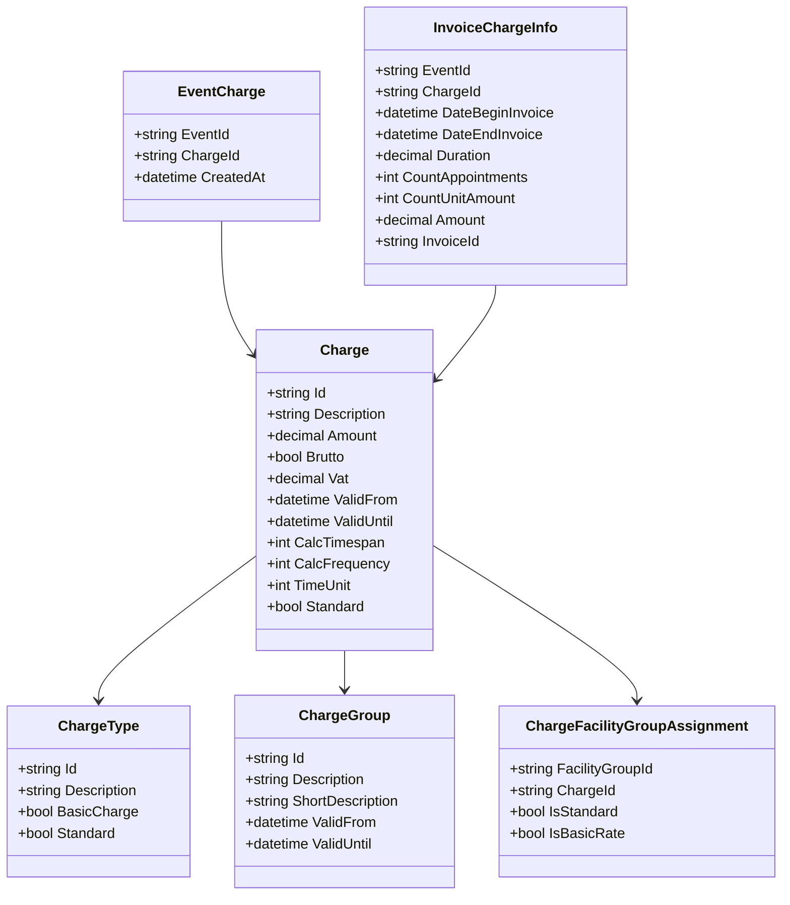
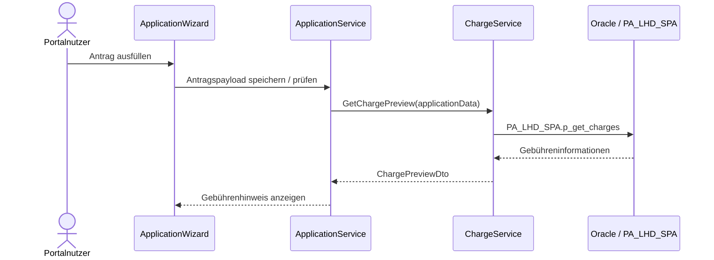
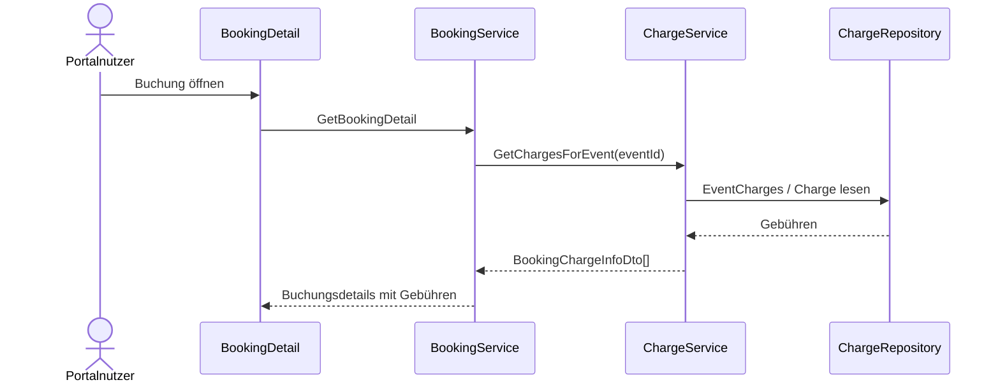
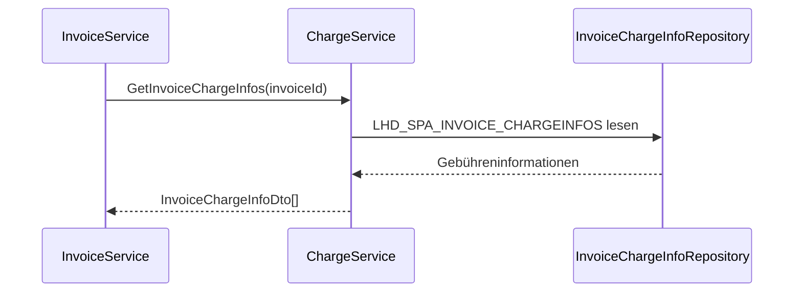

# Domäne Charge

| Feld | Wert |
|---|---|
| Kapitel | 03 – Domänen |
| Dokument | Charge |
| Status | Konsolidierter Arbeitsstand |
| Typ | Bestandsdomäne / REST-Freilegung |
| Priorität | Hoch |
| Leitquellen | `Quellen/2026-07-05_Snapshot1.txt`, `LHD_SPA_CHARGES.sql`, `LHD_SPA_CHARGETYPES.sql`, `LHD_SPA_CHARGEGROUPS.sql`, `LHD_SPA_CHARGE2FACILITYGROUP.sql`, `LHD_SPA_EVENTCHARGES.sql`, `LHD_SPA_EVENTCHARGES_HIST.sql`, `LHD_SPA_INVOICE_CHARGEINFOS.sql`, `LHD_SPA_INVOICE_CHARGEINFOS_2025.sql`, `LHD_SPA_INVOICES.sql`, fachliche Bestätigung: Berechnung über `PA_LHD_SPA.p_get_charges` |

---

## 1 Zweck

Die Domäne **Charge** beschreibt die vorhandene SportFM-Gebührenlogik.

Sie stellt Gebührenstammdaten, Gebührentypen, Gebührengruppen, FacilityGroup-Zuordnungen, Buchungsgebühren und rechnungsrelevante Gebühreninformationen bereit.

Charge ist eine Bestandsdomäne.

Die Gebührenberechnung erfolgt im Bestand über `PA_LHD_SPA.p_get_charges` und wird nicht im Portal oder in .NET neu implementiert.

---

## 2 Fachliche Einordnung

Charge beantwortet die Frage, welche Gebühren zu einer Nutzung, Buchung oder späteren Rechnung gehören.

```text
FacilityGroup
  ↓
Charge / ChargeType / ChargeGroup
  ↓
EventCharge
  ↓
PA_LHD_SPA.p_get_charges
  ↓
InvoiceChargeInfo
  ↓
Invoice
```

Das Portal soll Gebühren grundsätzlich nur anzeigen, z. B. im Antrag, in Buchungsdetails oder bei Rechnungsinformationen.

---

## 3 Projektbewertung

| Bereich | Bestand | Erweiterung | Neuentwicklung | Bewertung |
|---|:---:|:---:|:---:|---|
| Oracle | x | x |  | bestehende Gebühren- und Rechnungsdaten bleiben führend |
| PL/SQL | x | x |  | Gebührenberechnung bleibt in `PA_LHD_SPA.p_get_charges` |
| REST |  |  | x | lesende fachliche Zugriffsschicht erforderlich |
| DTO |  |  | x | fachliche DTOs für Anzeige und Prüfung |
| Portal |  | x |  | Gebührenanzeige in Antrag, Buchung, Rechnung |
| Application |  | x |  | Gebührenhinweise im Antrag |
| Booking | x | x |  | Buchung / Event ist Gebührenbezug |
| Invoice | x | x |  | Rechnungspositionen basieren auf ChargeInfos |
| Tests |  | x | x | Regression gegen bestehende Gebührenlogik erforderlich |

---

## 4 Grundsatz

Charge wird nicht neu entworfen.

Verbindliche Grundsätze:

- keine Gebührenberechnung im Portal,
- keine Gebührenberechnung in .NET,
- keine zweite Gebührenlogik,
- `PA_LHD_SPA.p_get_charges` bleibt führend für die Berechnung,
- REST stellt Gebühreninformationen fachlich bereit,
- Gebührenstammdaten bleiben im Bestand,
- rechnungsrelevante Gebühreninformationen bleiben im Bestand,
- Portal zeigt Gebühren nur berechtigt und kontextbezogen an.

---

## 5 Fachlicher Bestand

Aus Snapshot, DDLs und fachlicher Bestätigung ergeben sich folgende Bestandselemente:

- Gebührenstammdaten,
- Gebührentypen,
- Gebührengruppen,
- FacilityGroup-Zuordnung,
- Standardgebühr,
- Basisgebühr,
- Betrag,
- Brutto-/Netto-Kennzeichen,
- Mehrwertsteuer,
- Gültigkeitszeitraum,
- Berechnungsparameter,
- zeitliche Aktivität von Gebühren,
- Zuordnung Buchung / Event zu Gebühr,
- Historisierung der Event-Gebührenzuordnung,
- rechnungsrelevante Gebühreninformationen,
- Rechnungsbezug.

---

## 6 Fachliches Modell

```text
ChargeGroup
  ↓
ChargeType
  ↓
Charge
  ↓
Charge2FacilityGroup
  ↓
EventCharge
  ↓
InvoiceChargeInfo
```

`Charge` ist der zentrale Gebührenstammsatz.

`ChargeGroup` gruppiert Gebühren fachlich.

`ChargeType` beschreibt den Gebührentyp.

`Charge2FacilityGroup` ordnet Gebühren Sportanlagengruppen zu.

`EventCharge` ordnet Gebühren einer Buchung / einem Event zu.

`InvoiceChargeInfo` enthält rechnungsrelevante, bereits berechnete Gebühreninformationen.

---

## 7 Relevante Oracle-Tabellen

| Tabelle | Zweck |
|---|---|
| `LHD_SPA_CHARGES` | zentrale Gebührenstammdaten |
| `LHD_SPA_CHARGETYPES` | Gebührentypen |
| `LHD_SPA_CHARGEGROUPS` | Gebührengruppen |
| `LHD_SPA_CHARGE2FACILITYGROUP` | Zuordnung Gebühren zu FacilityGroups |
| `LHD_SPA_EVENTCHARGES` | Zuordnung Event / Buchung zu Gebühren |
| `LHD_SPA_EVENTCHARGES_HIST` | Historie der Event-Gebührenzuordnung |
| `LHD_SPA_INVOICE_CHARGEINFOS` | rechnungsrelevante Gebühreninformationen |
| `LHD_SPA_INVOICE_CHARGEINFOS_2025` | historische / archivierte Gebühreninformationen 2025 |
| `LHD_SPA_INVOICES` | Rechnungsbezug |

---

## 8 Wichtige Spalten aus dem Bestand

### 8.1 `LHD_SPA_CHARGES`

Zentrale Spalten:

- `ID_CHARGE`,
- `DESCRIPTION`,
- `ID_CHARGEGROUP`,
- `VALID_FROM`,
- `VALID_UNTIL`,
- `AMOUNT`,
- `BRUTTO`,
- `VAT`,
- `ID_FACILITYGROUP`,
- `CALC_TIMESPAN`,
- `CALC_FREQUENCY`,
- `TIMEUNIT`,
- `ID_CHARGETYPE`,
- `UNIT_SPLIT`,
- `DAY_ACTIVE_FROM`,
- `DAY_ACTIVE_UNTIL`,
- `TIME_ACTIVE_FROM`,
- `TIME_ACTIVE_UNTIL`,
- `STANDARD`.

### 8.2 `LHD_SPA_CHARGETYPES`

Zentrale Spalten:

- `ID_CHARGETYPE`,
- `DESCRIPTION`,
- `BASICCHARGE`,
- `STANDARD`.

### 8.3 `LHD_SPA_CHARGEGROUPS`

Zentrale Spalten:

- `ID_CHARGEGROUP`,
- `DESCRIPTION`,
- `VALID_FROM`,
- `VALID_UNTIL`,
- `SHORT_DESC`.

### 8.4 `LHD_SPA_CHARGE2FACILITYGROUP`

Zentrale Spalten:

- `ID_FACILITYGROUP`,
- `ID_CHARGE`,
- `IS_STANDARD`,
- `IS_BASICRATE`.

### 8.5 `LHD_SPA_EVENTCHARGES`

Zentrale Spalten:

- `ID_EVENT`,
- `ID_CHARGE`,
- `USER1`,
- `DATE1`.

### 8.6 `LHD_SPA_INVOICE_CHARGEINFOS`

Zentrale Spalten:

- `ID_EVENT`,
- `ID_CHARGE`,
- `DATE_BEGIN_INVOICE`,
- `DATE_END_INVOICE`,
- `DURATION`,
- `COUNT_APPOINTMENTS`,
- `COUNT_UNIT_AMOUNT`,
- `FACILITY_AMOUNT_ALL_UNIT`,
- `FACILITY_AMOUNT_PER_UNIT`,
- `APPOINTMENT_AMOUNT_ALL_UNIT`,
- `APPOINTMENT_AMOUNT_PER_UNIT`,
- `AMOUNT`,
- `STATE`,
- `ID_INVOICE`.

---

## 9 Business Objects

| Objekt | Zweck | Persistenz |
|---|---|---|
| `Charge` | Gebührenstammsatz | Bestand |
| `ChargeType` | Gebührentyp | Bestand |
| `ChargeGroup` | Gebührengruppe | Bestand |
| `ChargeFacilityGroupAssignment` | Zuordnung Gebühr zu FacilityGroup | Bestand |
| `EventCharge` | Zuordnung Event zu Gebühr | Bestand |
| `EventChargeHistory` | Historie der Event-Gebührenzuordnung | Bestand |
| `InvoiceChargeInfo` | rechnungsrelevante Gebühreninformation | Bestand |
| `ChargeCalculationResult` | Ergebnis von `PA_LHD_SPA.p_get_charges` | abgeleitet / Bestand |

### 9.1 Klassendiagramm



---

## 10 Fachliche Regeln

| ID | Regel |
|---|---|
| CHG-BR-001 | Die bestehende Gebührenlogik bleibt führend. |
| CHG-BR-002 | Gebühren werden nicht im Portal berechnet. |
| CHG-BR-003 | Gebühren werden nicht in .NET nachgebaut. |
| CHG-BR-004 | Die Gebührenberechnung erfolgt über `PA_LHD_SPA.p_get_charges`. |
| CHG-BR-005 | Gebührenstammdaten sind über Gültigkeitszeiträume begrenzt. |
| CHG-BR-006 | Gebühren können FacilityGroups zugeordnet sein. |
| CHG-BR-007 | Eine FacilityGroup kann mehrere Gebühren besitzen. |
| CHG-BR-008 | Eine Buchung / ein Event kann Gebühren zugeordnet bekommen. |
| CHG-BR-009 | Rechnungsrelevante Gebühreninformationen werden in `LHD_SPA_INVOICE_CHARGEINFOS` geführt. |
| CHG-BR-010 | Rechnungsbezug erfolgt über `ID_INVOICE`. |
| CHG-BR-011 | Portal zeigt Gebühren nur lesend und kontextbezogen an. |
| CHG-BR-012 | Gebühreninformationen im Antrag sind Hinweis-/Vorschauinformationen und ersetzen keine spätere verbindliche Rechnung. |

---

## 11 Abgrenzung zu anderen Domänen

| Domäne | Beziehung zu Charge |
|---|---|
| `Booking` | Event / Buchung ist fachlicher Bezug für EventCharges und InvoiceChargeInfos |
| `Facility` | FacilityGroup beeinflusst mögliche Gebührenzuordnung |
| `Application` | kann Gebührenhinweise oder Gebührenvorschau anzeigen |
| `Invoice` | liest rechnungsrelevante Gebühreninformationen |
| `Document` | stellt Gebührenbescheid / Rechnungsdokument bereit |
| `Workflow` | entscheidet nicht über Gebührenberechnung |
| `PortalUser` | sieht Gebühren nur im zulässigen Kontext |
| `Context` | begrenzt Sichtbarkeit der Gebühreninformationen |
| `Administration` | kann Gebührenstammdaten nur verwalten, wenn dies fachlich für V1 bestätigt wird |

---

## 12 Standardabläufe

### 12.1 Gebührenhinweis im Antrag anzeigen

```text
Benutzer erfasst Antrag
  ↓
Application kennt Facility / Zeitraum / Nutzungsdaten
  ↓
ChargeService ruft bestehende Gebührenlogik auf oder liest vorbereitete Gebühreninformationen
  ↓
Gebührenhinweis wird im Portal angezeigt
  ↓
Antrag wird ohne Gebührenberechnung im Portal fortgeführt
```

### 12.2 Gebühren zu Buchung anzeigen

```text
Benutzer öffnet Buchung
  ↓
Context prüft Sichtbarkeit
  ↓
Booking lädt Event
  ↓
Charge lädt EventCharges / berechnete Gebühreninformationen
  ↓
Portal zeigt Gebühreninformationen an
```

### 12.3 Gebühreninformationen zur Rechnung anzeigen

```text
Benutzer öffnet Rechnung
  ↓
Invoice lädt Rechnung
  ↓
Charge / Invoice lädt InvoiceChargeInfos
  ↓
Gebührenpositionen werden angezeigt
  ↓
PDF / Gebührenbescheid kommt über Document
```

---

## 13 Sequenzdiagramme

### 13.1 Gebührenhinweis im Antrag



### 13.2 Gebühren zu Buchung



### 13.3 Rechnungsgebühren



---

## 14 REST-API

| ID | Methode | Pfad | Zweck |
|---|---|---|---|
| CHG-API-001 | `GET` | `/api/v1/charges` | Gebührenstammdaten lesen / filtern |
| CHG-API-002 | `GET` | `/api/v1/charges/{id}` | Gebührenstammsatz lesen |
| CHG-API-003 | `GET` | `/api/v1/charge-types` | Gebührentypen lesen |
| CHG-API-004 | `GET` | `/api/v1/charge-groups` | Gebührengruppen lesen |
| CHG-API-005 | `GET` | `/api/v1/facility-groups/{id}/charges` | Gebühren einer FacilityGroup lesen |
| CHG-API-006 | `GET` | `/api/v1/bookings/{id}/charges` | Gebühren einer Buchung lesen |
| CHG-API-007 | `GET` | `/api/v1/invoices/{id}/charge-infos` | Rechnungsgebühren lesen |
| CHG-API-008 | `POST` | `/api/v1/charges/preview` | Gebührenhinweis / Vorschau für Antrag lesen |

Keine allgemeine `POST`-, `PUT`- oder `DELETE`-API für Gebührenstammdaten in V1.

---

## 15 DTOs

### 15.1 `ChargeDto`

| Feld | Typ | Pflicht |
|---|---|:---:|
| `chargeId` | string | ja |
| `description` | string | ja |
| `chargeGroupId` | string | ja |
| `chargeTypeId` | string | nein |
| `amount` | decimal | ja |
| `brutto` | boolean | ja |
| `vat` | decimal | ja |
| `facilityGroupId` | string | ja |
| `validFrom` | datetime | ja |
| `validUntil` | datetime | nein |
| `standard` | boolean | nein |

### 15.2 `ChargeTypeDto`

| Feld | Typ | Pflicht |
|---|---|:---:|
| `chargeTypeId` | string | ja |
| `description` | string | ja |
| `basicCharge` | boolean | nein |
| `standard` | boolean | nein |

### 15.3 `ChargeGroupDto`

| Feld | Typ | Pflicht |
|---|---|:---:|
| `chargeGroupId` | string | ja |
| `description` | string | ja |
| `shortDescription` | string | nein |
| `validFrom` | datetime | ja |
| `validUntil` | datetime | nein |

### 15.4 `BookingChargeInfoDto`

| Feld | Typ | Pflicht |
|---|---|:---:|
| `eventId` | string | ja |
| `chargeId` | string | ja |
| `description` | string | nein |
| `amount` | decimal | nein |
| `chargeType` | string | nein |
| `validFrom` | datetime | nein |
| `validUntil` | datetime | nein |

### 15.5 `InvoiceChargeInfoDto`

| Feld | Typ | Pflicht |
|---|---|:---:|
| `eventId` | string | ja |
| `chargeId` | string | ja |
| `dateBeginInvoice` | datetime | ja |
| `dateEndInvoice` | datetime | ja |
| `duration` | decimal | ja |
| `countAppointments` | int | ja |
| `countUnitAmount` | int | ja |
| `facilityAmountAllUnit` | decimal | ja |
| `facilityAmountPerUnit` | decimal | ja |
| `appointmentAmountAllUnit` | decimal | ja |
| `appointmentAmountPerUnit` | decimal | ja |
| `amount` | decimal | ja |
| `state` | int | ja |
| `invoiceId` | string | nein |

### 15.6 `ChargePreviewRequestDto`

| Feld | Typ | Pflicht |
|---|---|:---:|
| `applicationId` | string | nein |
| `facilityId` | string | nein |
| `unitIds` | array | nein |
| `dateBegin` | datetime | ja |
| `dateEnd` | datetime | ja |
| `timeBegin` | string | nein |
| `timeEnd` | string | nein |
| `usageData` | object | nein |

### 15.7 `ChargePreviewDto`

| Feld | Typ | Pflicht |
|---|---|:---:|
| `items` | array | ja |
| `totalAmount` | decimal | nein |
| `currency` | string | nein |
| `disclaimer` | string | ja |

Der Disclaimer muss klarstellen, dass die Anzeige im Antrag kein endgültiger Gebührenbescheid ist.

---

## 16 Services

| Service | Verantwortung |
|---|---|
| `ChargeService` | zentrale lesende Gebührenbereitstellung |
| `ChargePreviewService` | Gebührenhinweis / Vorschau über Bestandlogik bereitstellen |
| `ChargeReferenceService` | ChargeTypes und ChargeGroups lesen |
| `EventChargeService` | Gebühren einer Buchung / eines Events lesen |
| `InvoiceChargeInfoService` | rechnungsrelevante Gebühreninformationen lesen |
| `ChargeFacilityGroupService` | FacilityGroup-Zuordnung lesen |
| `ChargeVisibilityService` | Kontext- und Rollenprüfung |
| `ChargeIntegrationService` | Anbindung an Booking, Application, Invoice, Facility koordinieren |

---

## 17 Repository

| Repository | Zweck |
|---|---|
| `ChargeRepository` | Gebührenstammdaten lesen |
| `ChargeTypeRepository` | Gebührentypen lesen |
| `ChargeGroupRepository` | Gebührengruppen lesen |
| `ChargeFacilityGroupRepository` | `LHD_SPA_CHARGE2FACILITYGROUP` lesen |
| `EventChargeRepository` | `LHD_SPA_EVENTCHARGES` lesen |
| `InvoiceChargeInfoRepository` | `LHD_SPA_INVOICE_CHARGEINFOS` lesen |

Repositories enthalten keine Gebührenberechnung.

---

## 18 Oracle und PL/SQL

### 18.1 Grundsatz

Oracle und PL/SQL bleiben führend.

Die Gebührenberechnung erfolgt über:

```text
PA_LHD_SPA.p_get_charges
```

Diese Logik wird nicht nach .NET übertragen.

### 18.2 Zielkapselung

| Package | Zweck | Status |
|---|---|---|
| `PA_LHD_SPA.p_get_charges` | führende Gebührenberechnung | Bestand / verbindlich |
| `PA_LHD_SPA` | bestehende Gebühren- und Buchungslogik | Bestand |
| `PA_LHD_SPA_CHARGE` | REST-taugliche Kapselung für Gebührenanzeige, falls erforderlich | vorgeschlagene Zielstruktur, noch zu bestätigen |

---

## 19 Blazor-Frontend

### 19.1 Seiten / Bereiche

| Seite / Bereich | Zweck |
|---|---|
| Gebührenhinweis im Antrag | mögliche Gebühren anzeigen |
| Buchungsdetails | Gebühren einer Buchung anzeigen |
| Rechnungsdetails | rechnungsrelevante Gebührenpositionen anzeigen |
| Admin-Gebührenübersicht | nur falls V1 bestätigt, sonst nicht Bestandteil |

### 19.2 Komponenten

| Komponente | Zweck |
|---|---|
| `ChargePreviewPanel` | Gebührenhinweis im Antrag |
| `BookingChargeList` | Gebühren zur Buchung |
| `InvoiceChargeList` | Gebühreninformationen zur Rechnung |
| `ChargeAmountDisplay` | Betrag, MwSt., Brutto/Netto anzeigen |
| `ChargeDisclaimer` | Hinweischarakter der Vorschau anzeigen |

---

## 20 Berechtigungen

| Berechtigung | Zweck |
|---|---|
| `Charge.Read` | Gebührenstammdaten lesen |
| `Charge.Preview` | Gebührenhinweis berechnen / anzeigen |
| `Charge.ReadByBooking` | Gebühren zu Buchung lesen |
| `Charge.ReadByInvoice` | Gebühreninformationen zu Rechnung lesen |
| `Charge.ReferenceData.Read` | Gebührentypen und Gruppen lesen |
| `Charge.Admin.Read` | Gebühren administrativ lesen, falls V1 |

Schreibende Gebührenberechtigungen sind in V1 nicht vorgesehen.

---

## 21 Validierungen

| ID | Validierung | Ebene |
|---|---|---|
| CHG-VAL-001 | Gebühr existiert | Charge |
| CHG-VAL-002 | Gebühr ist im relevanten Zeitraum gültig | Charge |
| CHG-VAL-003 | FacilityGroup existiert | Facility / Charge |
| CHG-VAL-004 | Event / Buchung existiert | Booking |
| CHG-VAL-005 | Benutzer darf Gebühren zur Buchung sehen | Context / Booking |
| CHG-VAL-006 | Benutzer darf Rechnungsgebühren sehen | Context / Invoice |
| CHG-VAL-007 | Gebührenvorschau besitzt ausreichende Parameter | Application / Charge |
| CHG-VAL-008 | Vorschau wird als nicht endgültiger Gebührenbescheid gekennzeichnet | Portal / Charge |
| CHG-VAL-009 | REST ändert keine Gebührenstammdaten | REST / Authorization |

---

## 22 Testfälle

| Testfall | Beschreibung |
|---|---|
| TF-CHG-001 | Gebührenstammdaten lesen |
| TF-CHG-002 | Gebührentypen lesen |
| TF-CHG-003 | Gebührengruppen lesen |
| TF-CHG-004 | Gebühren einer FacilityGroup lesen |
| TF-CHG-005 | Gebühren einer Buchung lesen |
| TF-CHG-006 | rechnungsrelevante Gebühreninformationen lesen |
| TF-CHG-007 | Gebührenhinweis im Antrag anzeigen |
| TF-CHG-008 | Gebührenvorschau nutzt `PA_LHD_SPA.p_get_charges` |
| TF-CHG-009 | Portal berechnet keine Gebühren selbst |
| TF-CHG-010 | fremde Gebühreninformationen nicht anzeigen |
| TF-CHG-011 | ungültiger Zeitraum wird abgelehnt |
| TF-CHG-012 | Disclaimer bei Gebührenvorschau wird angezeigt |
| TF-CHG-013 | keine schreibenden Gebührenendpunkte in V1 |

---

## 23 Arbeitspakete

| AP | Titel | Inhalt |
|---|---|---|
| AP-CHG-001 | Bestandsmapping | Tabellen, Packages, `p_get_charges`, Gebührenstammdaten dokumentieren |
| AP-CHG-002 | DTOs | Charge-, ChargeType-, ChargeGroup-, Preview- und InvoiceChargeInfo-DTOs |
| AP-CHG-003 | REST Stammdaten | Gebühren, Typen, Gruppen lesend bereitstellen |
| AP-CHG-004 | REST Buchungsgebühren | EventCharges zu Buchungen bereitstellen |
| AP-CHG-005 | REST Rechnungsgebühren | InvoiceChargeInfos bereitstellen |
| AP-CHG-006 | Gebührenvorschau | `PA_LHD_SPA.p_get_charges` für Antragshinweis kapseln |
| AP-CHG-007 | FacilityGroup-Anbindung | Gebühren je FacilityGroup lesen |
| AP-CHG-008 | Application-Anbindung | Gebührenhinweis im Antrag anzeigen |
| AP-CHG-009 | Booking-Anbindung | Gebühren in Buchungsdetails anzeigen |
| AP-CHG-010 | Invoice-Anbindung | Gebühreninformationen in Rechnungsdetails anzeigen |
| AP-CHG-011 | Kontext / Berechtigungen | Sichtbarkeit prüfen |
| AP-CHG-012 | Portal | ChargePreviewPanel, BookingChargeList, InvoiceChargeList |
| AP-CHG-013 | Tests | Regression, REST, Kontext, Vorschau, Nicht-Neuberechnung |
| AP-CHG-014 | Dokumentation | API, Domäne, Bestandsmapping |

---

## 24 Aufwandstreiber

| Treiber | Einfluss |
|---|---|
| Kapselung von `PA_LHD_SPA.p_get_charges` | hoch |
| Parameterbedarf für Gebührenvorschau im Antrag | hoch |
| Abgrenzung Vorschau vs. verbindliche Rechnung | hoch |
| Zuordnung FacilityGroup / Charge | mittel |
| Anzeige rechnungsrelevanter ChargeInfos | mittel |
| Kontext- und Sichtbarkeitsprüfung | hoch |
| Regression gegen bestehende Gebührenlogik | hoch |
| Admin-Pflege von Gebührenstammdaten | nicht V1 / sehr hoch bei Umsetzung |

---

## 25 Risiken

| Risiko | Bewertung | Maßnahme |
|---|---|---|
| Gebührenberechnung wird in .NET nachgebaut | sehr hoch | `PA_LHD_SPA.p_get_charges` verbindlich nutzen |
| Gebührenvorschau wird als endgültige Rechnung verstanden | hoch | Disclaimer und klare UI-Texte |
| Parameter für `p_get_charges` werden unvollständig übergeben | hoch | Bestandsmapping und Integrationstest |
| Gebührenstammdaten werden versehentlich über Portal geändert | hoch | keine schreibenden Endpunkte V1 |
| Rechnungsgebühren und Vorschau werden vermischt | hoch | `InvoiceChargeInfo` getrennt von Vorschau behandeln |
| Kontextprüfung fehlt | hoch | Context-Anbindung verpflichtend |
| FacilityGroup-Zuordnung unklar | mittel | Facility-/Charge-Mapping dokumentieren |

---

## 26 Offene Punkte

| ID | Offener Punkt | Relevanz |
|---|---|---|
| OP-CHG-001 | finale Parameterliste für `PA_LHD_SPA.p_get_charges` | sehr hoch |
| OP-CHG-002 | Detailtiefe der Gebührenvorschau im Antrag | hoch |
| OP-CHG-003 | Text des Disclaimers für Gebührenhinweis | mittel |
| OP-CHG-004 | genaue Kontextzuordnung von Gebühreninformationen | hoch |
| OP-CHG-005 | Admin-Pflege der Gebührenstammdaten in V1 ausgeschlossen oder später? | mittel |
| OP-CHG-006 | Statusbedeutung in `LHD_SPA_INVOICE_CHARGEINFOS.STATE` | mittel |
| OP-CHG-007 | Umgang mit historischen ChargeInfos 2025 | mittel |

---

## 27 Traceability-Matrix

| Quelle | Funktion | REST | Service | UI | Test | AP |
|---|---|---|---|---|---|---|
| Snapshot Charge / Gebühren | Gebühren anzeigen | CHG-API-001/006/007 | ChargeService | ChargeAmountDisplay | TF-CHG-001/005/006 | AP-CHG-003/004/005 |
| Fachliche Bestätigung | Gebührenberechnung über `PA_LHD_SPA.p_get_charges` | CHG-API-008 | ChargePreviewService | ChargePreviewPanel | TF-CHG-008/009 | AP-CHG-006/008 |
| DDL `LHD_SPA_CHARGES` | Gebührenstammdaten | CHG-API-001/002 | ChargeRepository | ChargeAmountDisplay | TF-CHG-001 | AP-CHG-001/003 |
| DDL `LHD_SPA_CHARGETYPES` | Gebührentypen | CHG-API-003 | ChargeReferenceService | n/a | TF-CHG-002 | AP-CHG-003 |
| DDL `LHD_SPA_CHARGEGROUPS` | Gebührengruppen | CHG-API-004 | ChargeReferenceService | n/a | TF-CHG-003 | AP-CHG-003 |
| DDL `LHD_SPA_CHARGE2FACILITYGROUP` | FacilityGroup-Zuordnung | CHG-API-005 | ChargeFacilityGroupService | ChargePreviewPanel | TF-CHG-004 | AP-CHG-007 |
| DDL `LHD_SPA_EVENTCHARGES` | Buchungsgebühren | CHG-API-006 | EventChargeService | BookingChargeList | TF-CHG-005 | AP-CHG-004/009 |
| DDL `LHD_SPA_INVOICE_CHARGEINFOS` | Rechnungsgebühren | CHG-API-007 | InvoiceChargeInfoService | InvoiceChargeList | TF-CHG-006 | AP-CHG-005/010 |
| Invoice.md | Rechnungskontext | CHG-API-007 | ChargeIntegrationService | InvoiceDetail | TF-CHG-006 | AP-CHG-010 |
| Booking.md | Eventbezug | CHG-API-006 | ChargeIntegrationService | BookingDetail | TF-CHG-005 | AP-CHG-009 |
| Context.md | Sichtbarkeit | alle | ChargeVisibilityService | alle Charge-Komponenten | TF-CHG-010 | AP-CHG-011 |

---

## 28 Änderungsauswirkungen

Änderungen an `Charge.md` wirken sich aus auf:

- `03_Domaenen/Application.md`,
- `03_Domaenen/Booking.md`,
- `03_Domaenen/Facility.md`,
- `03_Domaenen/Invoice.md`,
- `03_Domaenen/Document.md`,
- `03_Domaenen/Dashboard.md`,
- `03_Domaenen/Context.md`,
- `03_Domaenen/Administration.md`,
- `04_REST_API/Endpunkte.md`,
- `04_REST_API/DTOs.md`,
- `05_Datenmodell/Tabellen.md`,
- `05_Datenmodell/Packages.md`,
- `06_Arbeitspakete/Arbeitspaketliste.md`,
- `07_Kalkulation/Aufwandsschaetzung.md`,
- `09_Testkonzept/Testfaelle.md`,
- `12_Offene_Punkte/Offene_Punkte.md`.

---

## 29 Ergebnis

Die Domäne Charge ist als Bestandsdomäne beschrieben.

Sie umfasst Gebührenstammdaten, Gebührentypen, Gebührengruppen, FacilityGroup-Zuordnungen, Buchungsgebühren und rechnungsrelevante Gebühreninformationen.

Die Gebührenberechnung bleibt vollständig im Bestand und erfolgt über `PA_LHD_SPA.p_get_charges`.

Das Portal zeigt Gebühren nur lesend an, insbesondere als Gebührenhinweis im Antrag, in Buchungsdetails und in Rechnungsdetails.

Nicht Bestandteil sind:

- neue Gebührenberechnung,
- schreibende Gebührenpflege im Portal,
- Rechnungserstellung,
- SAP-Buchung,
- verbindlicher Gebührenbescheid im Antrag.
