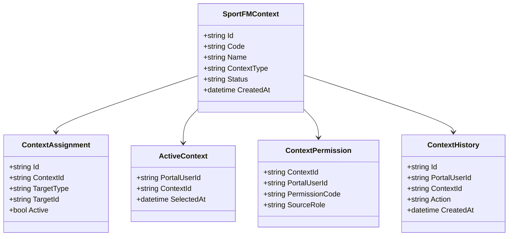
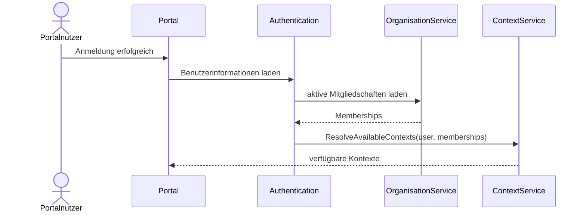
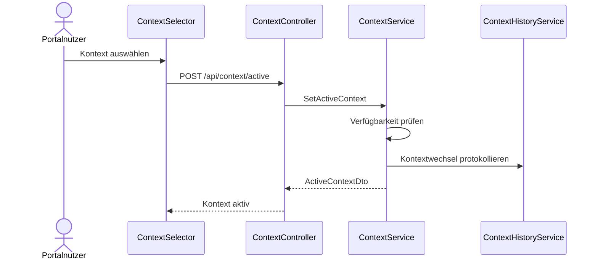
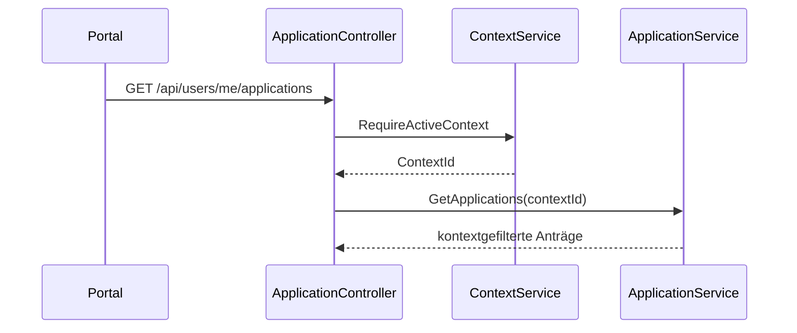

# Domäne Context

| Feld | Wert |
|---|---|
| Kapitel | 03 – Domänen |
| Dokument | Context |
| Status | Konsolidierter Arbeitsstand |
| Typ | Neuentwicklung |
| Priorität | Sehr hoch |
| Leitquellen | `Quellen/2026-07-05_Snapshot1.txt`, `Quellen/2026-05_28_Lastenheft_SportFM.pdf` |

---

## 1 Zweck

Die Domäne **Context** definiert den aktiven fachlichen Arbeits- und Sichtbarkeitsraum eines Portalnutzers.

Der SportFM-Kontext entscheidet, für welche Organisation, Abteilung oder fachliche Einheit ein Benutzer im Portal arbeitet und welche Anträge, Buchungen, Dokumente, Rechnungen, Aufgaben und Benachrichtigungen sichtbar sind.

Context ist ein zentrales Architekturkonzept der Plattform. Ohne aktiven Kontext darf kein fachlicher Vorgang ausgeführt werden, der organisations- oder personenbezogene Daten betrifft.

---

## 2 Projektbewertung

| Bereich | Bestand | Erweiterung | Neuentwicklung | Bewertung |
|---|:---:|:---:|:---:|---|
| Oracle |  |  | x | neue Kontextpersistenz / Zuordnung erforderlich |
| PL/SQL |  |  | x | Package / API für Kontextauflösung erforderlich |
| REST |  |  | x | neue Kontext-API |
| DTO |  |  | x | neue Vertragsobjekte |
| Portal |  |  | x | Kontextauswahl und Kontextanzeige |
| Organisation |  | x |  | enge Kopplung an Mitgliedschaften |
| Authentication |  | x |  | Kontextliste nach Login ableiten |
| Tests |  |  | x | neue Tests erforderlich |

---

## 3 Abgrenzung

### 3.1 Verantwortlich

Context ist verantwortlich für:

- verfügbare Kontexte eines Portalnutzers,
- aktiven Kontext,
- Kontextwechsel,
- Kontextprüfung,
- Sichtbarkeitsraum,
- Zuordnung Organisation / Abteilung zu SportFM-Kontext,
- technische Weitergabe des Kontextes an REST und Services,
- kontextbezogene Filtergrundlage,
- Audit des Kontextwechsels.

### 3.2 Nicht verantwortlich

Context ist nicht verantwortlich für:

- Login,
- Passwort,
- Benutzerregistrierung,
- Pflege von Organisationen,
- Pflege von Mitgliedschaften,
- fachliche Antragserstellung,
- Buchungslogik,
- Dokumentenerzeugung,
- Gebühren- und Rechnungserstellung.

Diese Aufgaben liegen in Authentication, Organisation, Application, Booking, Document, Charge und Invoice.

---

## 4 Architekturgrundsatz

Jeder fachliche REST-Aufruf, der auf organisations- oder antragsbezogene Daten zugreift, muss einen gültigen aktiven Kontext besitzen.

```text
PortalUser
  ↓
Membership
  ↓
Organisation / Department
  ↓
SportFMContext
  ↓
Application / Booking / Document / Invoice / Workflow
```

Context ist damit keine optionale UI-Auswahl, sondern Teil der fachlichen Zugriffskontrolle.

---

## 5 Fachlicher Grundsatz

Ein Portalnutzer kann mehrere Kontexte besitzen.

Beispiele:

```text
Benutzer A
  ├─ Verein 1 / Gesamtverein
  ├─ Verein 1 / Abteilung Fußball
  └─ Verein 2 / Abteilung Handball
```

Der aktive Kontext bestimmt, in welchem fachlichen Raum Aktionen ausgeführt werden.

---

## 6 Einordnung in die Plattform

```text
Authentication
  ↓
PortalUser
  ↓
Organisation
  ↓
Membership
  ↓
Context
  ↓
Application / Workflow / Booking / Document / Invoice
```

Authentication identifiziert den Benutzer.

Organisation liefert Mitgliedschaften.

Context leitet daraus verfügbare fachliche Arbeitsräume ab.

---

## 7 Kontextarten

| Kontextart | Beschreibung |
|---|---|
| `ORGANISATION` | Kontext einer Organisationseinheit |
| `DEPARTMENT` | Kontext einer Abteilung |
| `PERSONAL` | persönlicher Kontext eines Einzelantragstellers, falls fachlich vorgesehen |
| `INTERNAL` | interner Verwaltungskontext für Sachbearbeitung |
| `SYSTEM` | technischer Systemkontext für Hintergrundprozesse |

Die finale Liste ist mit Organisation, Authentication und Berechtigungskonzept abzugleichen.

---

## 8 Business Objects

| Objekt | Zweck | Persistenz |
|---|---|---|
| `SportFMContext` | fachlicher Kontext | neue Persistenz |
| `ContextAssignment` | Zuordnung zu Organisation / Abteilung / Benutzer | neue Persistenz |
| `ActiveContext` | aktuell ausgewählter Kontext eines Benutzers | Session / Persistenz zu prüfen |
| `ContextPermission` | abgeleitete Berechtigung im Kontext | transient / Konfiguration |
| `ContextScope` | Typ und Reichweite des Kontextes | Konfiguration |
| `ContextHistory` | Kontextwechsel / Änderungen | neue Persistenz / Audit |

### 8.1 Klassendiagramm



---

## 9 Fachliche Regeln

| ID | Regel |
|---|---|
| CTX-BR-001 | Ein fachlicher Portalaufruf benötigt einen aktiven Kontext. |
| CTX-BR-002 | Ein Benutzer darf nur Kontexte auswählen, die aus aktiven Mitgliedschaften ableitbar sind. |
| CTX-BR-003 | Der aktive Kontext ist Bestandteil jeder fachlichen Berechtigungsprüfung. |
| CTX-BR-004 | Ein Antrag wird immer im aktiven Kontext angelegt. |
| CTX-BR-005 | Dokumente werden nur angezeigt, wenn sie dem aktiven Kontext zugeordnet sind. |
| CTX-BR-006 | Rechnungen werden nur angezeigt, wenn sie dem aktiven Kontext zugeordnet sind. |
| CTX-BR-007 | Buchungen werden nur angezeigt, wenn sie dem aktiven Kontext zugeordnet sind. |
| CTX-BR-008 | Ein Kontextwechsel darf keine begonnenen Speicheroperationen verfälschen. |
| CTX-BR-009 | Kontextwechsel werden protokolliert. |
| CTX-BR-010 | Interne Verwaltungskontexte sind von Portalnutzerkontexten zu trennen. |
| CTX-BR-011 | Systemkontexte dürfen nicht durch Portalnutzer ausgewählt werden. |

---

## 10 Kontextauflösung

### 10.1 Ableitung aus Mitgliedschaften

```text
PortalUser
  ↓
aktive Memberships
  ↓
Organisation / Department
  ↓
OrganisationContextLink
  ↓
SportFMContext
```

### 10.2 Ergebnis

Die Kontextauflösung liefert:

- Kontext-ID,
- Anzeigename,
- Kontexttyp,
- zugehörige Organisation / Abteilung,
- Rollen im Kontext,
- daraus ableitbare Berechtigungen.

---

## 11 Standardabläufe

### 11.1 Kontextliste nach Anmeldung

```text
Benutzer meldet sich an
  ↓
Authentication identifiziert PortalUser
  ↓
Organisation lädt aktive Mitgliedschaften
  ↓
Context leitet verfügbare Kontexte ab
  ↓
Portal zeigt Kontextauswahl
```

### 11.2 Kontext auswählen

```text
Benutzer wählt Kontext
  ↓
Context prüft Verfügbarkeit
  ↓
aktiver Kontext wird gesetzt
  ↓
Dashboard wird kontextbezogen geladen
```

### 11.3 Kontextprüfung bei Fachaufruf

```text
REST Request
  ↓
Authentication prüft Benutzer
  ↓
Context prüft aktiven Kontext
  ↓
Service filtert Daten anhand Kontext
  ↓
Antwort enthält nur zulässige Daten
```

---

## 12 Sequenzdiagramme

### 12.1 Kontextliste laden



### 12.2 Kontext wechseln



### 12.3 Fachaufruf mit Kontext



---

## 13 REST-API

| ID | Methode | Pfad | Zweck |
|---|---|---|---|
| CTX-API-001 | `GET` | `/api/contexts` | verfügbare Kontexte des Benutzers lesen |
| CTX-API-002 | `GET` | `/api/context/active` | aktiven Kontext lesen |
| CTX-API-003 | `POST` | `/api/context/active` | aktiven Kontext setzen |
| CTX-API-004 | `DELETE` | `/api/context/active` | aktiven Kontext löschen |
| CTX-API-005 | `GET` | `/api/contexts/{id}` | Kontextdetails lesen |
| CTX-API-006 | `GET` | `/api/contexts/{id}/permissions` | Berechtigungen im Kontext lesen |
| CTX-API-007 | `GET` | `/api/contexts/{id}/history` | Kontext-Historie lesen, intern / admin |

---

## 14 DTOs

### 14.1 `ContextDto`

| Feld | Typ | Pflicht |
|---|---|:---:|
| `id` | string | ja |
| `code` | string | ja |
| `name` | string | ja |
| `contextType` | string | ja |
| `organisationId` | string | nein |
| `departmentId` | string | nein |
| `roles` | array | ja |
| `permissions` | array | nein |
| `active` | boolean | ja |

### 14.2 `SetActiveContextDto`

| Feld | Typ | Pflicht |
|---|---|:---:|
| `contextId` | string | ja |

### 14.3 `ActiveContextDto`

| Feld | Typ | Pflicht |
|---|---|:---:|
| `contextId` | string | ja |
| `name` | string | ja |
| `contextType` | string | ja |
| `selectedAt` | datetime | ja |

### 14.4 `ContextPermissionDto`

| Feld | Typ | Pflicht |
|---|---|:---:|
| `permissionCode` | string | ja |
| `sourceRole` | string | nein |
| `targetType` | string | nein |

---

## 15 Services

| Service | Verantwortung |
|---|---|
| `ContextService` | verfügbare Kontexte lesen, aktiven Kontext setzen / prüfen |
| `ContextResolutionService` | Kontexte aus Mitgliedschaften ableiten |
| `ActiveContextService` | aktiven Kontext verwalten |
| `ContextPermissionService` | kontextbezogene Berechtigungen ableiten |
| `ContextValidationService` | Verfügbarkeit und Gültigkeit prüfen |
| `ContextHistoryService` | Kontextwechsel und Änderungen protokollieren |

---

## 16 Repository

| Repository | Zweck |
|---|---|
| `ContextRepository` | Kontexte lesen / speichern |
| `ContextAssignmentRepository` | Zuordnungen lesen / speichern |
| `ActiveContextRepository` | aktiven Kontext speichern, falls persistent |
| `ContextPermissionRepository` | Berechtigungskonfiguration lesen |
| `ContextHistoryRepository` | Historie schreiben / lesen |

Repositories enthalten keine Geschäftslogik.

---

## 17 Oracle und PL/SQL

### 17.1 Neue / zu prüfende Persistenz

Die Quellen legen den SportFM-Kontext als fachliches Kernkonzept fest, enthalten aber keine abschließend bestätigte Tabellenstruktur. Daher sind folgende Objekte zu prüfen:

| Objekt | Zweck | Status |
|---|---|---|
| `LHD_SPA_CONTEXTS` | SportFM-Kontexte | zu prüfen / voraussichtlich neu |
| `LHD_SPA_CONTEXT_ASSIGNMENTS` | Zuordnung zu Organisation / Abteilung / Benutzer | zu prüfen / voraussichtlich neu |
| `LHD_SPA_CONTEXT_PERMISSIONS` | kontextbezogene Berechtigungskonfiguration | zu prüfen / voraussichtlich neu |
| `LHD_SPA_ACTIVE_CONTEXTS` | persistenter aktiver Kontext, falls erforderlich | zu prüfen |
| `LHD_SPA_CONTEXT_HISTORY` | Kontextwechsel / Audit | zu prüfen / voraussichtlich neu |

### 17.2 Package-Zuordnung

| Package | Zweck | Status |
|---|---|---|
| `PA_LHD_SPA_CONTEXT` | Kontext lesen, setzen, prüfen | vorgeschlagene Zielstruktur, noch zu bestätigen |
| `PA_LHD_SPA_CONTEXT_AUTH` | Kontextbezogene Berechtigungen | vorgeschlagene Zielstruktur, noch zu bestätigen |

---

## 18 Blazor-Frontend

### 18.1 Seiten / Bereiche

| ID | Seite / Bereich | Route | Zweck |
|---|---|---|---|
| CTX-UI-001 | Kontextauswahl | Header / Dashboard | aktiven Kontext wählen |
| CTX-UI-002 | Kontextliste | `/contexts` | verfügbare Kontexte anzeigen, falls eigene Seite erforderlich |
| CTX-UI-003 | Kontextdetails | `/contexts/{id}` | Kontextinformationen anzeigen, admin / intern |
| CTX-UI-004 | Kein Kontext vorhanden | Systemseite | Hinweis und Weiterleitung zu Organisation / Mitgliedschaft |

### 18.2 Komponenten

| Komponente | Zweck |
|---|---|
| `ContextSelector` | aktiven Kontext auswählen |
| `ContextBadge` | aktiven Kontext anzeigen |
| `ContextList` | verfügbare Kontexte anzeigen |
| `NoContextHint` | Benutzerführung ohne Kontext |
| `ContextPermissionInfo` | Berechtigungen anzeigen, admin / intern |

---

## 19 Berechtigungen

| Berechtigung | Zweck |
|---|---|
| `Context.Read` | verfügbare Kontexte lesen |
| `Context.Select` | aktiven Kontext setzen |
| `Context.Permission.Read` | Berechtigungen im Kontext lesen |
| `Context.Admin.Read` | Kontextdetails administrativ lesen |
| `Context.Admin.Manage` | Kontextzuordnungen administrativ bearbeiten |

Die Berechtigung zur Auswahl eines Kontextes wird aus aktiven Mitgliedschaften abgeleitet.

---

## 20 Validierungen

| ID | Validierung | Ebene |
|---|---|---|
| CTX-VAL-001 | Kontext existiert | Context |
| CTX-VAL-002 | Kontext ist aktiv | Context |
| CTX-VAL-003 | Benutzer besitzt aktive Mitgliedschaft | Organisation / Context |
| CTX-VAL-004 | Mitgliedschaft ist nicht abgelaufen | Organisation / Context |
| CTX-VAL-005 | Kontext gehört zur Organisation oder Abteilung | Context |
| CTX-VAL-006 | Systemkontext nicht durch Portalnutzer auswählbar | Context |
| CTX-VAL-007 | Fachaufruf ohne Kontext wird abgelehnt | REST / Context |
| CTX-VAL-008 | Kontextwechsel während Speichern verhindert Inkonsistenz | Portal / REST |

---

## 21 Testfälle

| Testfall | Beschreibung |
|---|---|
| TF-CTX-001 | verfügbare Kontexte nach Anmeldung laden |
| TF-CTX-002 | aktiven Kontext setzen |
| TF-CTX-003 | aktiven Kontext lesen |
| TF-CTX-004 | Kontext ohne Mitgliedschaft ablehnen |
| TF-CTX-005 | inaktiven Kontext ablehnen |
| TF-CTX-006 | Fachaufruf ohne Kontext ablehnen |
| TF-CTX-007 | Antragsliste kontextbezogen filtern |
| TF-CTX-008 | Dokumente kontextbezogen filtern |
| TF-CTX-009 | Rechnungen kontextbezogen filtern |
| TF-CTX-010 | Kontextwechsel historisieren |
| TF-CTX-011 | Systemkontext für Portalnutzer nicht auswählbar |
| TF-CTX-012 | Abteilungskontext getrennt von Organisationskontext |

---

## 22 Arbeitspakete

| AP | Titel | Inhalt |
|---|---|---|
| AP-CTX-001 | Kontextmodell | Context, Assignment, ActiveContext, Permission |
| AP-CTX-002 | Oracle-Konzept | Tabellenprüfung, neue Tabellen, Package-Zuordnung |
| AP-CTX-003 | REST | Controller, DTOs, Fehlerformat |
| AP-CTX-004 | ContextService | Kontexte lesen / setzen / prüfen |
| AP-CTX-005 | ResolutionService | Ableitung aus Mitgliedschaften |
| AP-CTX-006 | PermissionService | Berechtigungen im Kontext ableiten |
| AP-CTX-007 | Portal | ContextSelector, Badge, NoContextHint |
| AP-CTX-008 | Integration | Application, Document, Invoice, Booking anbinden |
| AP-CTX-009 | Tests | Unit-, Integrations- und UI-Tests |
| AP-CTX-010 | Dokumentation | API, Domäne, Betriebshinweise |

---

## 23 Aufwandstreiber

| Treiber | Einfluss |
|---|---|
| Abteilungsbezogene Kontexte | sehr hoch |
| Berechtigungsableitung aus Rollen | sehr hoch |
| Kontextfilter in allen Fachdomänen | sehr hoch |
| bestehende Datenzuordnung | hoch |
| Kontextwechsel und Session-Verhalten | mittel |
| Audit / Historie | mittel |
| interne Verwaltungskontexte | hoch |
| Tests über mehrere Domänen | sehr hoch |

Konkrete Personentage werden erst nach finaler Organisations-, Rollen- und Berechtigungsmatrix festgelegt.

---

## 24 Risiken

| Risiko | Bewertung | Maßnahme |
|---|---|---|
| Kontextmodell zu spät geklärt | sehr hoch | vor REST- und Datenmodellfinalisierung freigeben |
| Daten werden ohne Kontext sichtbar | sehr hoch | Kontextprüfung als technische Pflichtschicht |
| Organisation und Abteilung nicht sauber getrennt | hoch | Organisation.md abstimmen |
| Berechtigungen zu grob | hoch | Rollen- und Berechtigungsmatrix erstellen |
| bestehende Daten besitzen keinen eindeutigen Kontext | hoch | Datenmapping klären |
| Kontextwechsel erzeugt inkonsistente Entwürfe | mittel | Application speichert Kontext fest am Antrag |
| Systemkontext wird missbraucht | hoch | Systemkontext technisch vom Portal trennen |

---

## 25 Offene Punkte

| ID | Offener Punkt | Relevanz |
|---|---|---|
| OP-CTX-001 | finale Kontextarten V1 | hoch |
| OP-CTX-002 | Abteilungen mit eigenem Kontext | sehr hoch |
| OP-CTX-003 | Kontextzuordnung bestehender Buchungen | hoch |
| OP-CTX-004 | Kontextzuordnung bestehender Dokumente | hoch |
| OP-CTX-005 | Kontextzuordnung bestehender Rechnungen | hoch |
| OP-CTX-006 | Persistenz des aktiven Kontextes: Session oder Datenbank | mittel |
| OP-CTX-007 | finale Berechtigungsableitung aus Organisationsrollen | sehr hoch |
| OP-CTX-008 | technischer Umgang mit internen Verwaltungskontexten | hoch |

---

## 26 Traceability-Matrix

| Quelle | Funktion | REST | Service | UI | Test | AP |
|---|---|---|---|---|---|---|
| Snapshot SportFM-Kontext | verfügbare Kontexte | CTX-API-001 | ContextResolutionService | ContextSelector | TF-CTX-001 | AP-CTX-005/007 |
| Organisation.md | Mitgliedschaften auswerten | CTX-API-001 | ContextResolutionService | ContextList | TF-CTX-004 | AP-CTX-005 |
| Application.md | Antrag im Kontext | CTX-API-002/003 | ContextService | ContextBadge | TF-CTX-007 | AP-CTX-008 |
| Sicherheitsanforderungen | Zugriff ohne Kontext verhindern | alle Fachaufrufe | ContextValidationService | alle Seiten | TF-CTX-006 | AP-CTX-004/009 |
| Datenschutz / Sichtbarkeit | Daten kontextbezogen filtern | domänenspezifisch | ContextPermissionService | Dashboard | TF-CTX-008/009 | AP-CTX-006/008 |

---

## 27 Änderungsauswirkungen

Änderungen an `Context.md` wirken sich aus auf:

- `03_Domaenen/Organisation.md`,
- `03_Domaenen/Authentication.md`,
- `03_Domaenen/PortalUser.md`,
- `03_Domaenen/Application.md`,
- `03_Domaenen/Workflow.md`,
- `03_Domaenen/Booking.md`,
- `03_Domaenen/Document.md`,
- `03_Domaenen/Invoice.md`,
- `04_REST_API/Endpunkte.md`,
- `04_REST_API/DTOs.md`,
- `05_Datenmodell/Tabellen.md`,
- `05_Datenmodell/Packages.md`,
- `06_Arbeitspakete/Arbeitspaketliste.md`,
- `07_Kalkulation/Aufwandsschaetzung.md`,
- `09_Testkonzept/Testfaelle.md`,
- `12_Offene_Punkte/Offene_Punkte.md`.

---

## 28 Ergebnis

Die Domäne Context ist als zentrale Sicherheits-, Sichtbarkeits- und Arbeitsraumdomäne spezifiziert.

Sie stellt sicher, dass jeder fachliche Zugriff auf Anträge, Buchungen, Dokumente, Rechnungen und Aufgaben eindeutig auf einen zulässigen SportFM-Kontext begrenzt ist.

Die konkrete Kalkulation bleibt abhängig von:

- finalem Organisationsmodell,
- finaler Rollenmatrix,
- bestätigtem Abteilungskontext,
- Datenmapping bestehender SportFM-Objekte,
- bestätigter Oracle-Zuordnung,
- Entscheidung zur Speicherung des aktiven Kontextes.
