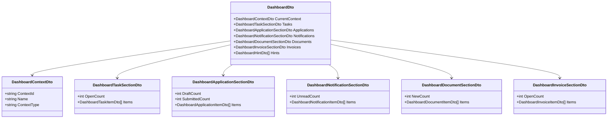
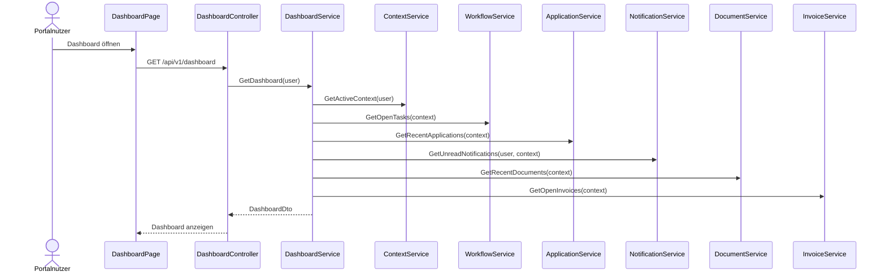
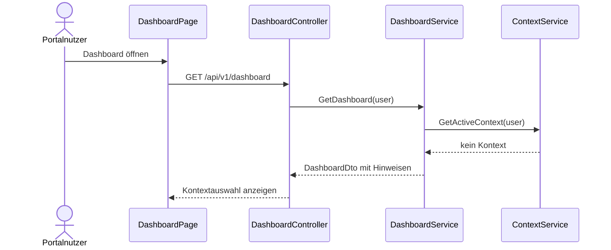

# Domäne Dashboard

| Feld | Wert |
|---|---|
| Kapitel | 03 – Domänen |
| Dokument | Dashboard |
| Status | Konsolidierter Arbeitsstand |
| Typ | Neuentwicklung |
| Priorität | Hoch |
| Leitquellen | `Quellen/2026-07-05_Snapshot1.txt`, `Quellen/2026-05_28_Lastenheft_SportFM.pdf` |

---

## 1 Zweck

Die Domäne **Dashboard** stellt die persönliche Startseite des Portals bereit.

Das Dashboard aggregiert Informationen aus anderen Domänen und zeigt sie kontextbezogen als Kacheln, Listen und Hinweise an.

Das Dashboard besitzt keine eigene Fachlogik und keine eigene fachliche Datenhaltung.

---

## 2 Projektbewertung

| Bereich | Bestand | Erweiterung | Neuentwicklung | Bewertung |
|---|:---:|:---:|:---:|---|
| Oracle |  |  |  | keine eigene fachliche Dashboard-Persistenz V1 |
| PL/SQL |  |  |  | kein eigenes Dashboard-Package V1 |
| Repository |  |  |  | kein eigenes DashboardRepository V1 |
| Service |  |  | x | Aggregationsservice erforderlich |
| REST |  |  | x | ein Dashboard-Endpunkt |
| DTO |  |  | x | bereichsorientierte DTOs |
| Portal |  |  | x | Startseite, Kacheln, Listen |
| Tests |  |  | x | Aggregations-, Berechtigungs- und Performancetests |

---

## 3 Abgrenzung

### 3.1 Verantwortlich

Dashboard ist verantwortlich für:

- Aggregation von Dashboardinformationen,
- kontextbezogene Startansicht,
- Anzeige offener Aufgaben,
- Anzeige letzter Anträge,
- Anzeige neuer Dokumente,
- Anzeige neuer Rechnungen,
- Anzeige aktueller Benachrichtigungen,
- Anzeige des aktiven Kontextes,
- Zusammenstellung eines Dashboard-DTOs,
- einfache Sortierung und Begrenzung der angezeigten Elemente.

### 3.2 Nicht verantwortlich

Dashboard ist nicht verantwortlich für:

- Antragserstellung,
- Workflowbearbeitung,
- Dokumentenerzeugung,
- Rechnungserstellung,
- Buchungslogik,
- Benachrichtigungserzeugung,
- Kontextableitung,
- Berechtigungsentscheidung im Fachdetail,
- Konfiguration eines Dashboard-Designers.

Diese Funktionen liegen in Application, Workflow, Document, Invoice, Booking, Notification, Context und Administration.

---

## 4 Architekturgrundsatz

Dashboard ist eine reine Aggregationsdomäne.

```text
Portal
  ↓
DashboardController
  ↓
DashboardService
  ↓
Application / Workflow / Document / Invoice / Notification / Context
```

Es gibt in V1 kein eigenes `DashboardRepository` und kein eigenes Oracle-Package.

Der Snapshot hält ausdrücklich fest, dass Dashboard keine eigenen Daten speichert und vorhandene Services aggregiert.

---

## 5 Fachlicher Grundsatz

Nach der Anmeldung erhält jeder Portalnutzer eine auf den aktiven SportFM-Kontext zugeschnittene Übersicht.

Ohne aktiven Kontext darf das Dashboard nur neutrale Hinweise anzeigen, beispielsweise:

- Kontext auswählen,
- Mitgliedschaft beantragen,
- Profil vervollständigen.

Fachliche Inhalte werden ausschließlich im aktiven Kontext geladen.

---

## 6 Dashboard-Bereiche

| Bereich | Quelle | Inhalt |
|---|---|---|
| Aktiver Kontext | Context | Organisation, Abteilung, Kontextname |
| Meine Aufgaben | Workflow | offene Aufgaben, Rückfragen, Fristen |
| Meine Anträge | Application | Entwürfe, eingereichte Anträge, Rückfragen, genehmigte Anträge |
| Benachrichtigungen | Notification | ungelesene Nachrichten, letzte Meldungen |
| Dokumente | Document | letzte Dokumente, Genehmigungen, Gebührenbescheide |
| Rechnungen | Invoice | offene Rechnungen, letzte Rechnungen |
| Hinweise | PortalUser / Context | Profil, Kontext, Mitgliedschaft, Systemhinweise |

---

## 7 Business Objects

Dashboard besitzt keine persistenten Fachobjekte.

Für die API werden nur aggregierte Ausgabeobjekte verwendet.

| Objekt | Zweck | Persistenz |
|---|---|---|
| `Dashboard` | aggregierte Startseite | transient |
| `DashboardSection` | einzelner Dashboardbereich | transient |
| `DashboardTaskItem` | Aufgabenanzeige | aus Workflow abgeleitet |
| `DashboardApplicationItem` | Antragsanzeige | aus Application abgeleitet |
| `DashboardNotificationItem` | Benachrichtigungsanzeige | aus Notification abgeleitet |
| `DashboardDocumentItem` | Dokumentenanzeige | aus Document abgeleitet |
| `DashboardInvoiceItem` | Rechnungsanzeige | aus Invoice abgeleitet |
| `DashboardContextInfo` | aktiver Kontext | aus Context abgeleitet |

### 7.1 Klassendiagramm



---

## 8 Fachliche Regeln

| ID | Regel |
|---|---|
| DSH-BR-001 | Dashboard speichert keine eigenen Fachdaten. |
| DSH-BR-002 | Dashboard besitzt kein eigenes Repository in V1. |
| DSH-BR-003 | Dashboard besitzt kein eigenes Oracle-Package in V1. |
| DSH-BR-004 | Dashboard aggregiert vorhandene Services. |
| DSH-BR-005 | Dashboard lädt fachliche Inhalte nur für den aktiven Kontext. |
| DSH-BR-006 | Dashboard darf keine Berechtigungsprüfung anderer Domänen umgehen. |
| DSH-BR-007 | Jeder Dashboardbereich muss auch leer darstellbar sein. |
| DSH-BR-008 | Fehler in einem Bereich dürfen das gesamte Dashboard nicht zwingend unbenutzbar machen, wenn eine Teildarstellung fachlich zulässig ist. |
| DSH-BR-009 | Die angezeigten Listen werden begrenzt, damit das Dashboard performant bleibt. |
| DSH-BR-010 | Das Dashboard ist keine Volltextsuche und ersetzt keine Detailseiten. |
| DSH-BR-011 | Ein Dashboard-Designer ist nicht Bestandteil von V1. |

---

## 9 Standardabläufe

### 9.1 Dashboard nach Login laden

```text
Benutzer meldet sich an
  ↓
Authentication liefert Benutzer
  ↓
Context liefert aktiven Kontext oder Kontextauswahl
  ↓
DashboardService aggregiert Bereiche
  ↓
Portal zeigt Startseite
```

### 9.2 Dashboard mit aktivem Kontext laden

```text
Portal ruft Dashboard auf
  ↓
ContextService prüft aktiven Kontext
  ↓
Workflow liefert offene Aufgaben
  ↓
Application liefert letzte Anträge
  ↓
Notification liefert ungelesene Nachrichten
  ↓
Document liefert neue Dokumente
  ↓
Invoice liefert offene Rechnungen
  ↓
DashboardService baut DashboardDto
```

### 9.3 Dashboard ohne aktiven Kontext

```text
Portal ruft Dashboard auf
  ↓
kein aktiver Kontext vorhanden
  ↓
DashboardService lädt nur neutrale Hinweise
  ↓
Portal zeigt Kontextauswahl / Mitgliedschaftshinweis
```

---

## 10 Sequenzdiagramme

### 10.1 Dashboard laden



### 10.2 Dashboard ohne Kontext



---

## 11 REST-API

| ID | Methode | Pfad | Zweck |
|---|---|---|---|
| DSH-API-001 | `GET` | `/api/v1/dashboard` | Dashboard für angemeldeten Benutzer laden |

Der Snapshot empfiehlt für V1 genau einen Dashboard-Endpunkt. Der Service aggregiert intern die benötigten Domäneninformationen.

---

## 12 DTOs

### 12.1 `DashboardDto`

Das Dashboard soll kein monolithisches Groß-DTO besitzen, sondern aus kleinen Bereichen bestehen.

| Feld | Typ | Pflicht |
|---|---|:---:|
| `currentContext` | `DashboardContextDto` | nein |
| `tasks` | `DashboardTaskSectionDto` | ja |
| `applications` | `DashboardApplicationSectionDto` | ja |
| `notifications` | `DashboardNotificationSectionDto` | ja |
| `documents` | `DashboardDocumentSectionDto` | ja |
| `invoices` | `DashboardInvoiceSectionDto` | ja |
| `hints` | array | nein |

### 12.2 `DashboardContextDto`

| Feld | Typ | Pflicht |
|---|---|:---:|
| `contextId` | string | nein |
| `name` | string | nein |
| `contextType` | string | nein |
| `organisationName` | string | nein |
| `departmentName` | string | nein |

### 12.3 `DashboardTaskSectionDto`

| Feld | Typ | Pflicht |
|---|---|:---:|
| `openCount` | int | ja |
| `dueSoonCount` | int | nein |
| `items` | array | ja |

### 12.4 `DashboardApplicationSectionDto`

| Feld | Typ | Pflicht |
|---|---|:---:|
| `draftCount` | int | ja |
| `submittedCount` | int | ja |
| `queryCount` | int | nein |
| `items` | array | ja |

### 12.5 `DashboardNotificationSectionDto`

| Feld | Typ | Pflicht |
|---|---|:---:|
| `unreadCount` | int | ja |
| `items` | array | ja |

### 12.6 `DashboardDocumentSectionDto`

| Feld | Typ | Pflicht |
|---|---|:---:|
| `newCount` | int | ja |
| `items` | array | ja |

### 12.7 `DashboardInvoiceSectionDto`

| Feld | Typ | Pflicht |
|---|---|:---:|
| `openCount` | int | ja |
| `items` | array | ja |

---

## 13 Services

| Service | Verantwortung |
|---|---|
| `DashboardService` | Dashboard aggregieren und DTO zusammenbauen |
| `DashboardSectionService` | optionale interne Strukturierung der Bereiche |
| `DashboardHintService` | Hinweise ohne Kontext oder bei unvollständigem Profil erzeugen |

Dashboard ruft definierte Services anderer Domänen auf.

Es greift nicht direkt auf deren Tabellen zu.

---

## 14 Repository

Für V1 wird kein eigenes `DashboardRepository` erstellt.

Begründung:

- Dashboard speichert keine eigenen Daten.
- Dashboard aggregiert vorhandene Services.
- Ein Repository würde eine nicht vorhandene Persistenz vortäuschen.

Falls später personalisierte Dashboard-Layouts oder Kachelkonfigurationen umgesetzt werden, ist eine Erweiterung zu prüfen.

---

## 15 Oracle und PL/SQL

### 15.1 Keine eigene Persistenz V1

Für Dashboard ist in V1 keine eigene Oracle-Persistenz vorgesehen.

### 15.2 Kein eigenes Package V1

Der Snapshot nennt `PA_LHD_SPA_PORT_DASHBOARD` ausdrücklich als entfallend / nicht V1, weil das Dashboard in .NET über vorhandene Services aggregiert wird.

### 15.3 Genutzte Datenquellen

| Bereich | Quelle |
|---|---|
| Aufgaben | Workflow |
| Anträge | Application |
| Benachrichtigungen | Notification |
| Dokumente | Document |
| Rechnungen | Invoice |
| Kontext | Context |
| Profilhinweise | PortalUser |

---

## 16 Blazor-Frontend

### 16.1 Seite

| ID | Seite | Route | Zweck |
|---|---|---|---|
| DSH-PAGE-001 | Dashboard | `/` oder `/dashboard` | persönliche Startseite nach Anmeldung |

### 16.2 Komponenten

| Komponente | Zweck |
|---|---|
| `DashboardPage` | Hauptseite |
| `DashboardGrid` | Kachelraster |
| `ContextCard` | aktiver Kontext |
| `OpenTasksCard` | offene Aufgaben |
| `ApplicationsCard` | letzte Anträge / Entwürfe |
| `NotificationsCard` | ungelesene Benachrichtigungen |
| `DocumentsCard` | neue Dokumente |
| `InvoicesCard` | offene Rechnungen |
| `DashboardHintCard` | Hinweise ohne Kontext / Profil |
| `DashboardLoadingState` | Ladezustand |
| `DashboardErrorState` | Teilausfälle darstellen |

---

## 17 Berechtigungen

| Berechtigung | Zweck |
|---|---|
| `Dashboard.Read` | Dashboard laden |
| `Dashboard.ReadContext` | kontextbezogene Dashboardinformationen laden |

Die Fachberechtigungen der einzelnen Bereiche werden nicht im Dashboard neu definiert.

Jeder Bereich nutzt die Berechtigungsprüfung seiner Quelldomäne.

---

## 18 Validierungen

| ID | Validierung | Ebene |
|---|---|---|
| DSH-VAL-001 | Benutzer ist authentifiziert | Authentication |
| DSH-VAL-002 | aktiver Kontext vorhanden, falls fachliche Inhalte geladen werden | Context |
| DSH-VAL-003 | Bereichsdaten werden nur über berechtigte Domänenservices geladen | Dashboard |
| DSH-VAL-004 | Listen sind begrenzt | Dashboard |
| DSH-VAL-005 | Teilausfall eines Bereichs wird kontrolliert behandelt | Dashboard |
| DSH-VAL-006 | Dashboard zeigt keine Details, die durch Quelldomänen nicht freigegeben sind | Dashboard / Quelldomänen |

---

## 19 Testfälle

| Testfall | Beschreibung |
|---|---|
| TF-DSH-001 | Dashboard für angemeldeten Benutzer laden |
| TF-DSH-002 | Dashboard ohne aktiven Kontext zeigt Hinweise |
| TF-DSH-003 | Dashboard mit Kontext zeigt Aufgaben |
| TF-DSH-004 | Dashboard zeigt letzte Anträge |
| TF-DSH-005 | Dashboard zeigt ungelesene Benachrichtigungen |
| TF-DSH-006 | Dashboard zeigt neue Dokumente |
| TF-DSH-007 | Dashboard zeigt offene Rechnungen |
| TF-DSH-008 | Dashboard lädt keine unberechtigten Detaildaten |
| TF-DSH-009 | Teilausfall einer Quelldomäne wird kontrolliert behandelt |
| TF-DSH-010 | Dashboard besitzt keine eigene Persistenz |
| TF-DSH-011 | Dashboard lädt innerhalb der definierten Performancegrenze |

---

## 20 Arbeitspakete

| AP | Titel | Inhalt |
|---|---|---|
| AP-DSH-001 | Dashboardmodell | Bereiche, DTOs, Kacheln |
| AP-DSH-002 | REST | ein Dashboard-Endpunkt |
| AP-DSH-003 | DashboardService | Aggregation der Domänenservices |
| AP-DSH-004 | Context-Anbindung | aktiver Kontext, kein Kontext |
| AP-DSH-005 | Bereich Aufgaben | Workflow-Anbindung |
| AP-DSH-006 | Bereich Anträge | Application-Anbindung |
| AP-DSH-007 | Bereich Benachrichtigungen | Notification-Anbindung |
| AP-DSH-008 | Bereich Dokumente | Document-Anbindung |
| AP-DSH-009 | Bereich Rechnungen | Invoice-Anbindung |
| AP-DSH-010 | Portal | Dashboardseite und Kacheln |
| AP-DSH-011 | Tests | Unit-, Integrations-, UI- und Performancetests |
| AP-DSH-012 | Dokumentation | API, Domäne, UX-Hinweise |

---

## 21 Aufwandstreiber

| Treiber | Einfluss |
|---|---|
| Anzahl Dashboardbereiche | mittel |
| Aggregation mehrerer Domänenservices | hoch |
| Performance unter Last | hoch |
| Teilfehlerbehandlung | mittel |
| Kontextabhängigkeit | hoch |
| UI-Kacheln / Responsive Layout | mittel |
| Berechtigungsprüfung je Bereich | hoch |
| Anzahl angezeigter Kennzahlen | mittel |
| spätere Personalisierung | nicht V1 / hoch bei Umsetzung |

Konkrete Personentage werden erst nach finalem Umfang der Dashboardbereiche und Performanceanforderungen festgelegt.

---

## 22 Risiken

| Risiko | Bewertung | Maßnahme |
|---|---|---|
| Dashboard wird mit Fachlogik überladen | hoch | nur Services aggregieren |
| Dashboard greift direkt auf Datenbanken zu | hoch | kein Repository V1 |
| Performance durch viele Serviceaufrufe | hoch | Begrenzung, parallele Aggregation prüfen |
| unberechtigte Details sichtbar | sehr hoch | Quelldomänen prüfen Berechtigungen |
| Dashboard-Designer wird in V1 gefordert | hoch | ausdrücklich als nicht V1 kennzeichnen |
| Teilausfall blockiert gesamte Startseite | mittel | kontrollierte Teildarstellung |

---

## 23 Offene Punkte

| ID | Offener Punkt | Relevanz |
|---|---|---|
| OP-DSH-001 | finale Anzahl der Dashboardbereiche V1 | mittel |
| OP-DSH-002 | Anzeige ohne aktiven Kontext | hoch |
| OP-DSH-003 | Performanceziel für Dashboard-Ladezeit | hoch |
| OP-DSH-004 | maximale Anzahl Einträge je Kachel | mittel |
| OP-DSH-005 | Personalisierung / Dashboard Designer explizit V2? | mittel |
| OP-DSH-006 | Detailtiefe für Dokumente und Rechnungen | hoch |

---

## 24 Traceability-Matrix

| Quelle | Funktion | REST | Service | UI | Test | AP |
|---|---|---|---|---|---|---|
| Snapshot Dashboard | Dashboard laden | DSH-API-001 | DashboardService | DashboardPage | TF-DSH-001 | AP-DSH-002/003/010 |
| Snapshot Aufgaben | offene Aufgaben | DSH-API-001 | WorkflowService | OpenTasksCard | TF-DSH-003 | AP-DSH-005 |
| Snapshot Anträge | letzte Anträge | DSH-API-001 | ApplicationService | ApplicationsCard | TF-DSH-004 | AP-DSH-006 |
| Snapshot Benachrichtigungen | ungelesene Meldungen | DSH-API-001 | NotificationService | NotificationsCard | TF-DSH-005 | AP-DSH-007 |
| Snapshot Dokumente | neue Dokumente | DSH-API-001 | DocumentService | DocumentsCard | TF-DSH-006 | AP-DSH-008 |
| Snapshot Rechnungen | offene Rechnungen | DSH-API-001 | InvoiceService | InvoicesCard | TF-DSH-007 | AP-DSH-009 |
| Context.md | aktiver Kontext | DSH-API-001 | ContextService | ContextCard | TF-DSH-002 | AP-DSH-004 |

---

## 25 Änderungsauswirkungen

Änderungen an `Dashboard.md` wirken sich aus auf:

- `03_Domaenen/Application.md`,
- `03_Domaenen/Workflow.md`,
- `03_Domaenen/Notification.md`,
- `03_Domaenen/Document.md`,
- `03_Domaenen/Invoice.md`,
- `03_Domaenen/Context.md`,
- `03_Domaenen/PortalUser.md`,
- `04_REST_API/Endpunkte.md`,
- `04_REST_API/DTOs.md`,
- `06_Arbeitspakete/Arbeitspaketliste.md`,
- `07_Kalkulation/Aufwandsschaetzung.md`,
- `09_Testkonzept/Testfaelle.md`,
- `12_Offene_Punkte/Offene_Punkte.md`.

---

## 26 Ergebnis

Die Domäne Dashboard ist als reine Aggregationsdomäne spezifiziert.

Sie stellt die persönliche Startseite des Portals bereit, aggregiert aber ausschließlich Informationen aus vorhandenen Domänenservices.

Die konkrete Kalkulation bleibt abhängig von:

- finaler Bereichsliste,
- Performanceziel,
- Detailtiefe je Kachel,
- Fehlerbehandlung bei Teilausfällen,
- UI-Layout,
- bestätigtem V1-Ausschluss eines Dashboard-Designers.
