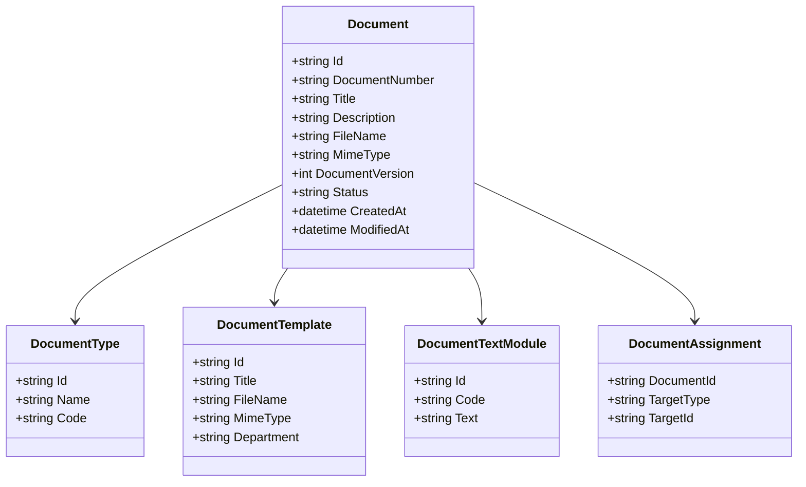
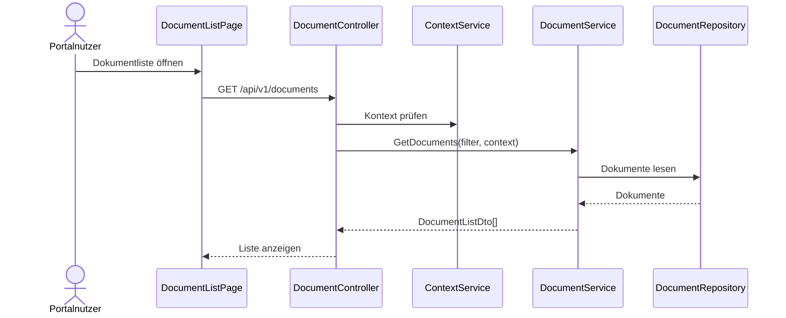
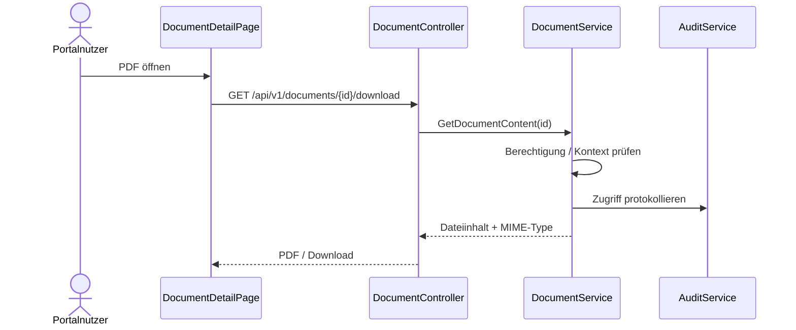
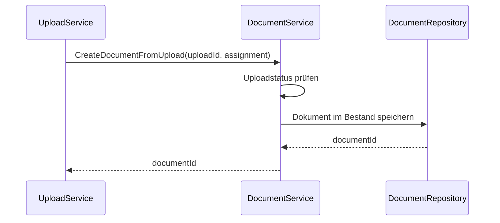

# Domäne Document

| Feld | Wert |
|---|---|
| Kapitel | 03 – Domänen |
| Dokument | Document |
| Status | Konsolidierter Arbeitsstand |
| Typ | Bestandsdomäne / Erweiterung |
| Priorität | Hoch |
| Leitquellen | `Quellen/2026-07-05_Snapshot1.txt`, DDL-Dateien `LHD_SPA_DOCUMENTS.sql`, `LHD_SPA_DOCUMENTS_EVENTS.sql`, `LHD_SPA_DOCUMENT_NUMBERS.sql`, `LHD_SPA_DOCUMENT_TEMPLATES.sql`, `LHD_SPA_DOCUMENT_TEXTMODULES.sql`, `LHD_SPA_DOCUMENT_TYPES.sql` |

---

## 1 Zweck

Die Domäne **Document** beschreibt die vorhandene SportFM-Dokumentenverwaltung.

Sie stellt bestehende Dokumente, Dokumenttypen, Vorlagen, Textbausteine, Nummernkreise, PDF-Inhalte und Dokumentstatus für Portal und zukünftige REST-Nutzung bereit.

Document ist keine Neuentwicklung.

Ziel ist die kontrollierte REST- und Portal-Freigabe der vorhandenen Dokumentenverwaltung.

---

## 2 Projektbewertung

| Bereich | Bestand | Erweiterung | Neuentwicklung | Bewertung |
|---|:---:|:---:|:---:|---|
| Oracle | x |  |  | bestehende Tabellen bleiben führend |
| Dokumentenerzeugung | x |  |  | keine Neuentwicklung |
| Vorlagenverwaltung | x |  |  | bleibt Bestand |
| Textbausteine | x |  |  | bleiben Bestand |
| Nummernkreise | x |  |  | bleiben Bestand |
| PL/SQL | x | x |  | bestehende Logik nutzen / ggf. REST-tauglich erweitern |
| REST |  |  | x | neue fachliche Zugriffsschicht |
| DTO |  |  | x | neue fachliche DTOs |
| Portal |  |  | x | Dokumentenliste, Detail, Download |
| Tests |  |  | x | Berechtigungs-, Download- und Regressionstests |

---

## 3 Grundsatz

Die bestehende Dokumentenverwaltung wird nicht ersetzt.

Verbindliche Grundsätze:

- kein zweites Dokumentensystem,
- keine neue Vorlagenverwaltung,
- keine neue Dokumentengenerierung,
- keine neuen Nummernkreise außerhalb des Bestands,
- Uploads werden Bestandteil der vorhandenen Dokumentenverwaltung,
- REST stellt vorhandene Dokumente fachlich bereit,
- Portal zeigt und lädt Dokumente nur berechtigt und kontextbezogen.

---

## 4 Bestand

### 4.1 Vorhandene Fähigkeiten

Im Bestand vorhanden sind:

- Dokumente,
- Dokumenttypen,
- Dokumentvorlagen,
- Textbausteine,
- Nummernkreise,
- PDF bzw. binärer Dokumentinhalt,
- Dokumentstatus,
- Versionierung,
- Änderungsinformationen,
- Rechnungsbezug,
- Buchungs-/Eventbezug.

### 4.2 Fachliche Erweiterungen V1

| ID | Erweiterung | Beschreibung |
|---|---|---|
| FA-DOC-001 | Dokumentliste | Dokumente im Portal anzeigen |
| FA-DOC-002 | Dokumentdownload | Dokumentdatei herunterladen / öffnen |
| FA-DOC-003 | Dokumentfilter | Filter nach Zeitraum, Dokumenttyp und Status |
| FA-DOC-004 | Zuordnung | Dokumente zu Buchung, Rechnung und Antrag anzeigen |
| FA-DOC-005 | Upload | neue Dokumente aus dem Portal in vorhandene Dokumentenverwaltung übernehmen |

---

## 5 Abgrenzung

### 5.1 Verantwortlich

Document ist verantwortlich für:

- Dokumentmetadaten,
- Dokumentinhalt,
- Dokumenttyp,
- Dokumentstatus,
- Dokumentnummer,
- Dokumentversion,
- Dokumentdownload,
- Dokumentliste,
- Filterung,
- Zuordnung zu Buchung / Event,
- Zuordnung zu Rechnung,
- Zuordnung zu Antrag, soweit portalbezogen benötigt,
- Übernahme gültiger Uploads in die vorhandene Dokumentenverwaltung.

### 5.2 Nicht verantwortlich

Document ist nicht verantwortlich für:

- Antragserstellung,
- Workflowstatus,
- Buchungslogik,
- Gebührenberechnung,
- Rechnungserstellung,
- SAP-Anbindung,
- technische Uploadprüfung,
- Authentifizierung,
- Kontextableitung.

Diese Funktionen liegen in Application, Workflow, Booking, Charge, Invoice, Upload, Authentication und Context.

---

## 6 Fachliches Modell

```text
Document
  ↓
DocumentType
  ↓
DocumentState
  ↓
DocumentNumber
  ↓
Content / PDF
  ↓
Zuordnung zu Event / Invoice / Application
```

Dokumente werden fachlich über Typ, Status, Nummer, Inhalt und Zuordnungen bereitgestellt.

---

## 7 Relevante Oracle-Tabellen

| Tabelle | Zweck |
|---|---|
| `LHD_SPA_DOCUMENTS` | zentrale Dokumenttabelle mit Metadaten und Inhalt |
| `LHD_SPA_DOCUMENTS_EVENTS` | Zuordnung zwischen Dokumenten und Events / Buchungen |
| `LHD_SPA_DOCUMENT_NUMBERS` | Dokumentnummern / Nummernkreise |
| `LHD_SPA_DOCUMENT_TEMPLATES` | Dokumentvorlagen |
| `LHD_SPA_DOCUMENT_TEXTMODULES` | Textbausteine |
| `LHD_SPA_DOCUMENT_TYPES` | Dokumenttypen |
| `LHD_SPA_DOCUMENTS_RE_2025` | Bestands-/Referenzstruktur, genaue Nutzung prüfen |

---

## 8 Wichtige Spalten aus dem Bestand

### 8.1 `LHD_SPA_DOCUMENTS`

Erkennbare zentrale Spalten:

- `ID_SPORTSUSER`,
- `ID_DOCUMENT_TYPE`,
- `ID_DOCUMENT_STATE`,
- `TITLE`,
- `DESCRIPTION`,
- `FILENAME`,
- `MIMETYPE`,
- `CONTENT`,
- `DOCUMENT_VERSION`,
- `UPDATE_VERSION`,
- `DATE1`,
- `USER1`,
- `DATE2`,
- `USER2`,
- `YEAR`,
- `DOCUMENT_COUNTER`,
- `DOCUMENT_NUMBER`,
- `ID_INVOICE`.

### 8.2 `LHD_SPA_DOCUMENT_TEMPLATES`

Erkennbare zentrale Spalten:

- `TITLE`,
- `DESCRIPTION`,
- `FILENAME`,
- `MIMETYPE`,
- `CONTENT`,
- `ID_DOCUMENT_TYPE`,
- `DATE1`,
- `USER1`,
- `DATE2`,
- `USER2`,
- `DEPARTMENT`.

---

## 9 Fachliche Bedeutung des Bestands

`LHD_SPA_DOCUMENTS` zeigt, dass SportFM Dokumente bereits mit Metadaten, Dokumenttyp, Dokumentstatus, Dateiinhalt, MIME-Type, Versionierung, Dokumentnummer und Rechnungsbezug speichert.

Daraus folgt:

- das Portal verwaltet Dokumente nicht selbst,
- der Download erfolgt über REST,
- Dokumentnummern bleiben unverändert aus dem Bestand,
- Versionierung bleibt Bestand,
- Vorlagen bleiben Bestand,
- Dokumentinhalte werden nicht außerhalb der vorhandenen Dokumentenverwaltung dupliziert.

---

## 10 Business Objects

| Objekt | Zweck | Persistenz |
|---|---|---|
| `Document` | bestehendes Dokument | Bestand |
| `DocumentType` | Dokumenttyp | Bestand |
| `DocumentState` | Dokumentstatus | Bestand |
| `DocumentTemplate` | Vorlage | Bestand |
| `DocumentTextModule` | Textbaustein | Bestand |
| `DocumentNumber` | Dokumentnummer / Nummernkreis | Bestand |
| `DocumentContent` | PDF / Dateiinhalt | Bestand |
| `DocumentAssignment` | Zuordnung zu Buchung, Rechnung, Antrag | Bestand / Erweiterung prüfen |

### 10.1 Klassendiagramm



---

## 11 Fachliche Regeln

| ID | Regel |
|---|---|
| DOC-BR-001 | Die vorhandene Dokumentenverwaltung bleibt führend. |
| DOC-BR-002 | Es wird kein zweites Dokumentensystem aufgebaut. |
| DOC-BR-003 | Vorlagenverwaltung wird in V1 nicht geändert. |
| DOC-BR-004 | Dokumentengenerierung wird in V1 nicht neu entwickelt. |
| DOC-BR-005 | Nummernkreise bleiben Bestand. |
| DOC-BR-006 | Dokumente erhalten eine eindeutige Dokumentnummer aus dem Bestand. |
| DOC-BR-007 | Dokumentdownload wird protokolliert, soweit Zugriff und Revisionssicherheit dies erfordern. |
| DOC-BR-008 | Dokumente sind nur im zulässigen Kontext sichtbar. |
| DOC-BR-009 | Dokumente zu Rechnungen dürfen nur durch berechtigte Rechnungsempfänger / Rollen gelesen werden. |
| DOC-BR-010 | Uploads werden nach Prüfung über Upload in die vorhandene Dokumentenverwaltung übernommen. |
| DOC-BR-011 | Portal darf Dokumentinhalte nicht dauerhaft separat speichern. |
| DOC-BR-012 | Dokumente zu Anträgen, Buchungen und Rechnungen werden über fachliche Zuordnung bereitgestellt. |

---

## 12 Standardabläufe

### 12.1 Dokumentliste laden

```text
Portalnutzer öffnet Dokumente
  ↓
Context prüfen
  ↓
DocumentService lädt berechtigte Dokumente
  ↓
Filter anwenden
  ↓
DocumentListDto zurückgeben
```

### 12.2 Dokument herunterladen

```text
Portalnutzer öffnet Dokument
  ↓
Berechtigung und Kontext prüfen
  ↓
Dokumentmetadaten laden
  ↓
Dokumentinhalt aus Bestand lesen
  ↓
Download / Anzeige bereitstellen
  ↓
Zugriff protokollieren
```

### 12.3 Upload übernehmen

```text
Portal lädt Datei hoch
  ↓
Upload prüft Datei
  ↓
Document übernimmt gültigen Upload
  ↓
Dokument wird im Bestand gespeichert
  ↓
Dokument wird fachlich zugeordnet
```

---

## 13 Sequenzdiagramme

### 13.1 Dokumentliste



### 13.2 Dokumentdownload



### 13.3 Upload an Dokumentenverwaltung übergeben



---

## 14 REST-API

| ID | Methode | Pfad | Zweck |
|---|---|---|---|
| DOC-API-001 | `GET` | `/api/v1/documents` | Dokumentliste lesen |
| DOC-API-002 | `GET` | `/api/v1/documents/{id}` | Dokumentdetails lesen |
| DOC-API-003 | `GET` | `/api/v1/documents/{id}/download` | Dokumentinhalt herunterladen / öffnen |
| DOC-API-004 | `GET` | `/api/v1/users/{id}/documents` | Dokumente eines Nutzers lesen, falls berechtigt |
| DOC-API-005 | `GET` | `/api/v1/bookings/{id}/documents` | Dokumente einer Buchung lesen |
| DOC-API-006 | `GET` | `/api/v1/invoices/{id}/documents` | Dokumente einer Rechnung lesen |
| DOC-API-007 | `GET` | `/api/v1/applications/{id}/documents` | Dokumente eines Antrags lesen |
| DOC-API-008 | `GET` | `/api/v1/documents/types` | Dokumenttypen lesen |
| DOC-API-009 | `POST` | `/api/v1/documents/upload` | gültigen Upload als Dokument übernehmen |

Keine allgemeine `PUT`- oder `DELETE`-API für Dokumente in V1.

---

## 15 DTOs

### 15.1 `DocumentListDto`

| Feld | Typ | Pflicht |
|---|---|:---:|
| `documentId` | string | ja |
| `documentNumber` | string | ja |
| `documentType` | string | ja |
| `title` | string | ja |
| `createdAt` | datetime | ja |
| `status` | string | ja |
| `fileName` | string | nein |
| `mimeType` | string | nein |

### 15.2 `DocumentDetailDto`

| Feld | Typ | Pflicht |
|---|---|:---:|
| `documentId` | string | ja |
| `documentNumber` | string | ja |
| `documentType` | string | ja |
| `documentStatus` | string | ja |
| `title` | string | ja |
| `description` | string | nein |
| `fileName` | string | nein |
| `mimeType` | string | nein |
| `documentVersion` | int | nein |
| `downloadAvailable` | boolean | ja |
| `assignments` | array | nein |

### 15.3 `DocumentFilterDto`

| Feld | Typ | Pflicht |
|---|---|:---:|
| `from` | datetime | nein |
| `to` | datetime | nein |
| `documentType` | string | nein |
| `status` | string | nein |
| `targetType` | string | nein |
| `targetId` | string | nein |

### 15.4 `DocumentTypeDto`

| Feld | Typ | Pflicht |
|---|---|:---:|
| `id` | string | ja |
| `code` | string | nein |
| `name` | string | ja |
| `active` | boolean | nein |

### 15.5 `CreateDocumentFromUploadDto`

| Feld | Typ | Pflicht |
|---|---|:---:|
| `uploadId` | string | ja |
| `documentTypeId` | string | ja |
| `targetType` | string | ja |
| `targetId` | string | ja |
| `title` | string | nein |
| `description` | string | nein |

---

## 16 Services

| Service | Verantwortung |
|---|---|
| `DocumentService` | Dokumente lesen, Details bereitstellen, Dokument aus Upload übernehmen |
| `DocumentContentService` | Dateiinhalt / PDF bereitstellen |
| `DocumentTypeService` | Dokumenttypen lesen |
| `DocumentAssignmentService` | Zuordnung zu Buchung, Rechnung, Antrag lesen / setzen |
| `DocumentDownloadService` | Download inkl. Berechtigung und Protokollierung |
| `DocumentUploadIntegrationService` | Übergabe von Upload an Document koordinieren |
| `DocumentVisibilityService` | Kontext- und Rollenprüfung |

---

## 17 Repository

| Repository | Zweck |
|---|---|
| `DocumentRepository` | Dokumentmetadaten lesen / speichern |
| `DocumentContentRepository` | Dokumentinhalt lesen |
| `DocumentTypeRepository` | Dokumenttypen lesen |
| `DocumentAssignmentRepository` | Zuordnungen lesen / speichern |
| `DocumentTemplateRepository` | Vorlagen lesen, keine V1-Pflege |
| `DocumentNumberRepository` | Nummernkreis nutzen, keine V1-Neuentwicklung |

Repositories enthalten keine Geschäftslogik.

---

## 18 Oracle und PL/SQL

### 18.1 Grundsatz

Oracle bleibt führend.

REST und Services kapseln den Bestand.

### 18.2 Package-Zuordnung

Die vorhandenen Dokumentenpackages sind zu identifizieren und ggf. REST-tauglich zu erweitern.

Falls keine eindeutig getrennten Dokumentenpackages vorhanden sind, ist eine Kapselung über ein neues oder erweitertes Package zu prüfen.

| Package | Zweck | Status |
|---|---|---|
| bestehende Dokumentenpackages | Dokumente, Vorlagen, Nummernkreis, Inhalt | zu identifizieren |
| `PA_LHD_SPA_DOCUMENT` | REST-taugliche Kapselung für Dokumentliste, Detail, Download | vorgeschlagene Zielstruktur, noch zu bestätigen |

---

## 19 Blazor-Frontend

### 19.1 Seiten

| ID | Seite | Route | Zweck |
|---|---|---|---|
| DOC-PAGE-001 | Dokumente | `/documents` | Dokumentliste |
| DOC-PAGE-002 | Dokumentdetail | `/documents/{id}` | Metadaten und Download |
| DOC-PAGE-003 | Dokumente zur Buchung | Bestandteil Buchungsdetails | Dokumentbezug |
| DOC-PAGE-004 | Dokumente zur Rechnung | Bestandteil Rechnungsdetails | Gebührenbescheid / PDF |
| DOC-PAGE-005 | Dokumente zum Antrag | Bestandteil Antrag / Workflow | Anlagen / erzeugte Dokumente |

### 19.2 Komponenten

| Komponente | Zweck |
|---|---|
| `DocumentList` | Dokumentliste |
| `DocumentFilterPanel` | Zeitraum, Typ, Status filtern |
| `DocumentCard` | Dokumentkurzanzeige |
| `DocumentDetail` | Dokumentdetails |
| `DocumentDownloadButton` | Download / Öffnen |
| `DocumentTypeBadge` | Dokumenttyp anzeigen |
| `DocumentStatusBadge` | Dokumentstatus anzeigen |
| `RelatedDocumentsList` | Dokumente zu Buchung, Rechnung, Antrag |

---

## 20 Berechtigungen

| Berechtigung | Zweck |
|---|---|
| `Document.Read` | Dokumentmetadaten lesen |
| `Document.Download` | Dokumentinhalt herunterladen |
| `Document.ReadByBooking` | Dokumente zu Buchung lesen |
| `Document.ReadByInvoice` | Dokumente zu Rechnung lesen |
| `Document.ReadByApplication` | Dokumente zu Antrag lesen |
| `Document.Type.Read` | Dokumenttypen lesen |
| `Document.CreateFromUpload` | gültigen Upload in Dokumentenverwaltung übernehmen |

Berechtigungen sind immer mit Context und Zielobjekt abzugleichen.

---

## 21 Validierungen

| ID | Validierung | Ebene |
|---|---|---|
| DOC-VAL-001 | Dokument existiert | Document |
| DOC-VAL-002 | Dokument ist für Portal sichtbar | Document / Context |
| DOC-VAL-003 | Benutzer darf Dokument im Kontext lesen | Context / DocumentVisibility |
| DOC-VAL-004 | Benutzer darf Dateiinhalt herunterladen | Authorization |
| DOC-VAL-005 | Dokumenttyp existiert | DocumentType |
| DOC-VAL-006 | Zielobjekt existiert | Ziel-Domäne |
| DOC-VAL-007 | Upload ist gültig und übergabefähig | Upload |
| DOC-VAL-008 | Dokumentdownload wird protokolliert, soweit erforderlich | Audit |
| DOC-VAL-009 | Zeitraumfilter ist gültig | REST / Service |

---

## 22 Testfälle

| Testfall | Beschreibung |
|---|---|
| TF-DOC-001 | Dokumentliste laden |
| TF-DOC-002 | Dokumentliste nach Zeitraum filtern |
| TF-DOC-003 | Dokumentliste nach Dokumenttyp filtern |
| TF-DOC-004 | Dokumentliste nach Status filtern |
| TF-DOC-005 | Dokumentdetails lesen |
| TF-DOC-006 | PDF öffnen / herunterladen |
| TF-DOC-007 | fremdes Dokument nicht anzeigen |
| TF-DOC-008 | Dokumente zu Buchung lesen |
| TF-DOC-009 | Dokumente zu Rechnung lesen |
| TF-DOC-010 | Dokumente zu Antrag lesen |
| TF-DOC-011 | Upload als Dokument übernehmen |
| TF-DOC-012 | ungültigen Upload nicht übernehmen |
| TF-DOC-013 | Downloadzugriff protokollieren |
| TF-DOC-014 | Nummernkreis nicht neu implementieren |

---

## 23 Arbeitspakete

| AP | Titel | Typ | Inhalt |
|---|---|:---:|---|
| AP-DOC-001 | Bestandsmapping | B/E | Tabellen, Dokumentpackages, Dokumentstatus dokumentieren |
| AP-DOC-002 | DTOs | N | DocumentListDto, DocumentDetailDto, Filter, Typen |
| AP-DOC-003 | REST Dokumentliste | N | Liste, Filter, Kontextprüfung |
| AP-DOC-004 | REST Dokumentdetail | N | Details, Zuordnungen |
| AP-DOC-005 | REST Download | N | Inhalt, MIME-Type, Audit |
| AP-DOC-006 | Dokumenttypen | N/E | Dokumenttypen bereitstellen |
| AP-DOC-007 | Upload-Integration | E/N | gültige Uploads in Bestand übernehmen |
| AP-DOC-008 | Portal | N | Liste, Detail, Download, RelatedDocuments |
| AP-DOC-009 | Kontext / Berechtigungen | N | Sichtbarkeit je Kontext und Zielobjekt |
| AP-DOC-010 | Tests | N | REST, Portal, Berechtigung, Download, Regression |
| AP-DOC-011 | Dokumentation | N | API, Domäne, Bestandsmapping |

---

## 24 Aufwandstreiber

| Treiber | Einfluss |
|---|---|
| Sichtbarkeitsregeln je Kontext | hoch |
| Dokumentstatus und Portal-Freigabe | mittel bis hoch |
| Download-Protokollierung | mittel |
| BLOB-/PDF-Download über REST | mittel |
| Zuordnung zu Buchung, Rechnung, Antrag | hoch |
| Upload-Übernahme in Bestand | hoch |
| vorhandene Package-Struktur | mittel |
| Portal-Filter und Detailansicht | mittel |
| Regression gegen bestehende Dokumentenverwaltung | hoch |

---

## 25 Risiken

| Risiko | Bewertung | Maßnahme |
|---|---|---|
| zweites Dokumentensystem entsteht versehentlich | sehr hoch | Document-Bestand bleibt führend |
| Vorlagenverwaltung wird ungeplant neu entwickelt | hoch | ausdrücklich nicht Bestandteil V1 |
| Dokumente werden ohne Kontextschutz angezeigt | sehr hoch | Context- und VisibilityService verpflichtend |
| BLOB/PDF-Download ist nicht performant | mittel | Streaming und Größenprüfung |
| Download nicht protokolliert | hoch | Audit-Anforderung berücksichtigen |
| Upload und Document werden vermischt | hoch | Upload prüft, Document verwaltet |
| Nummernkreise werden dupliziert | hoch | Bestandsnummernkreise nutzen |

---

## 26 Offene Punkte

| ID | Status | Offener Punkt | Relevanz |
|---|---|---|---|
| OP-DOC-001 | Prüfen | finale Dokumentstatus und Portal-Sichtbarkeit | hoch |
| OP-DOC-002 | Prüfen | vorhandene Dokumentenpackages / Package-Zuordnung | hoch |
| OP-DOC-003 | Prüfen | genaue Dokumentzuordnung zu Antrag in V1 | hoch |
| OP-DOC-004 | Entscheiden | Upload-Übernahme direkt in `LHD_SPA_DOCUMENTS` oder über bestehende Funktion | hoch |
| OP-DOC-005 | Prüfen | Download-Protokollierung: bestehendes Logging oder neues Audit | hoch |
| OP-DOC-006 | Prüfen | Detailtiefe für Dokumente im Portal | mittel |

---

## 27 Traceability-Matrix

| Quelle | Funktion | REST | Service | UI | Test | AP |
|---|---|---|---|---|---|---|
| Snapshot Document | Dokumentliste | DOC-API-001 | DocumentService | DocumentList | TF-DOC-001 | AP-DOC-003/008 |
| Snapshot Document | Dokumentdownload | DOC-API-003 | DocumentDownloadService | DocumentDownloadButton | TF-DOC-006 | AP-DOC-005/008 |
| Snapshot Document | Filter | DOC-API-001 | DocumentService | DocumentFilterPanel | TF-DOC-002/003/004 | AP-DOC-003 |
| Snapshot Document | Zuordnung Buchung | DOC-API-005 | DocumentAssignmentService | RelatedDocumentsList | TF-DOC-008 | AP-DOC-004 |
| Snapshot Document | Zuordnung Rechnung | DOC-API-006 | DocumentAssignmentService | RelatedDocumentsList | TF-DOC-009 | AP-DOC-004 |
| Snapshot Document | Upload | DOC-API-009 | DocumentUploadIntegrationService | Upload / RelatedDocuments | TF-DOC-011 | AP-DOC-007 |
| DDL `LHD_SPA_DOCUMENTS` | Dokumentinhalt / Metadaten | DOC-API-002/003 | DocumentRepository | DocumentDetail | TF-DOC-005/006 | AP-DOC-001/004/005 |
| Lastenheft Revisionssicherheit | Dokumentnummer / Protokollierung | DOC-API-003 | DocumentDownloadService | DocumentDownloadButton | TF-DOC-013/014 | AP-DOC-005/010 |

---

## 28 Änderungsauswirkungen

Änderungen an `Document.md` wirken sich aus auf:

- `03_Domaenen/Upload.md`,
- `03_Domaenen/Application.md`,
- `03_Domaenen/Workflow.md`,
- `03_Domaenen/Booking.md`,
- `03_Domaenen/Invoice.md`,
- `03_Domaenen/Notification.md`,
- `03_Domaenen/Dashboard.md`,
- `03_Domaenen/Context.md`,
- `04_REST_API/Endpunkte.md`,
- `04_REST_API/DTOs.md`,
- `05_Datenmodell/Tabellen.md`,
- `05_Datenmodell/Packages.md`,
- `06_Arbeitspakete/Arbeitspaketliste.md`,
- `07_Kalkulation/Aufwandsschaetzung.md`,
- `09_Testkonzept/Testfaelle.md`,
- `10_Sicherheit/Revisionssicherheit.md`,
- `12_Offene_Punkte/Offene_Punkte.md`.

---

## 29 Ergebnis

Die Domäne Document ist als Bestandsdomäne beschrieben.

Die bestehende Dokumentenverwaltung bleibt führend.

Die Umsetzung im Projekt besteht aus:

- fachlicher Dokumentation des Bestands,
- REST-Freilegung,
- DTO-Definition,
- Portal-Anzeige,
- Dokumentdownload,
- Kontext- und Berechtigungsprüfung,
- Upload-Integration in den Bestand,
- Download- und Zugriffstests.

Nicht Bestandteil sind:

- neue Vorlagenverwaltung,
- neue Dokumentengenerierung,
- neue Nummernkreise,
- zweites Dokumentensystem.
