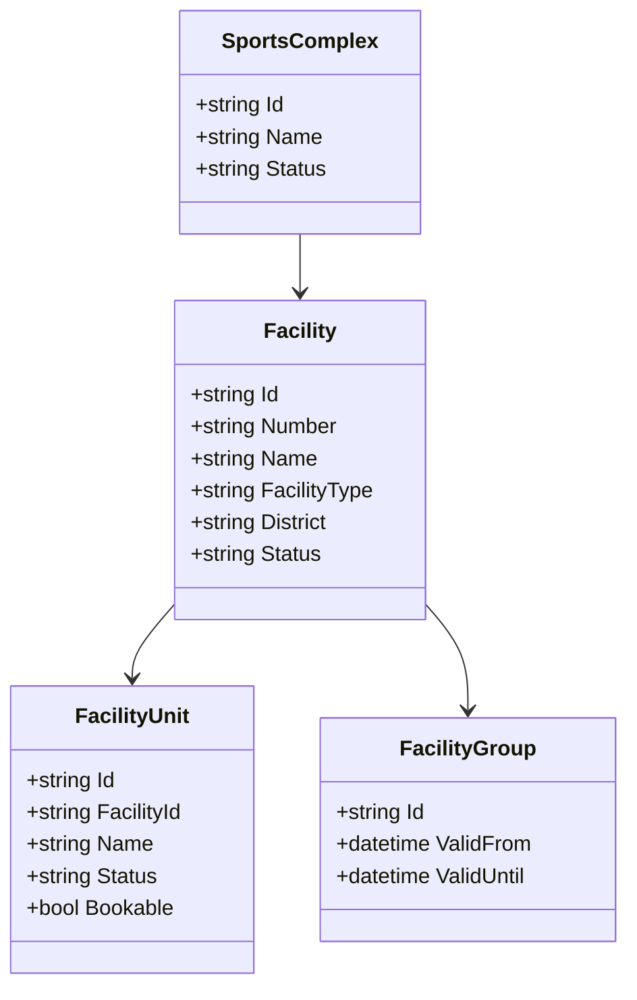
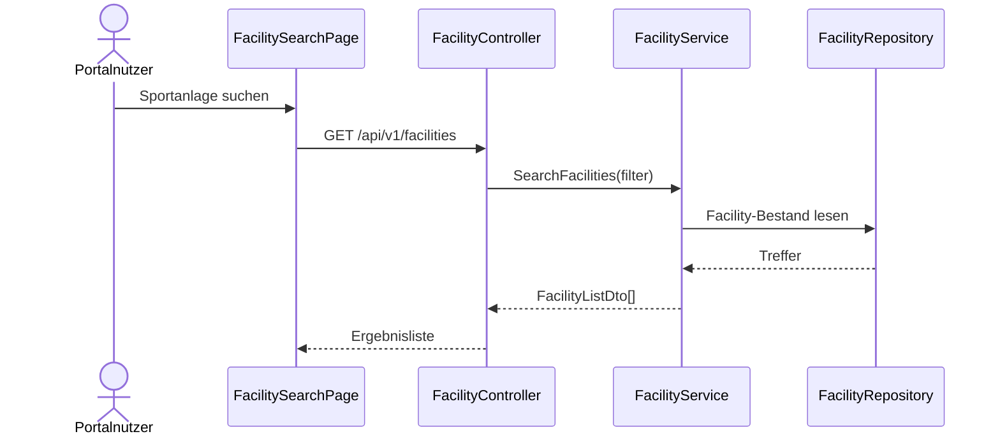
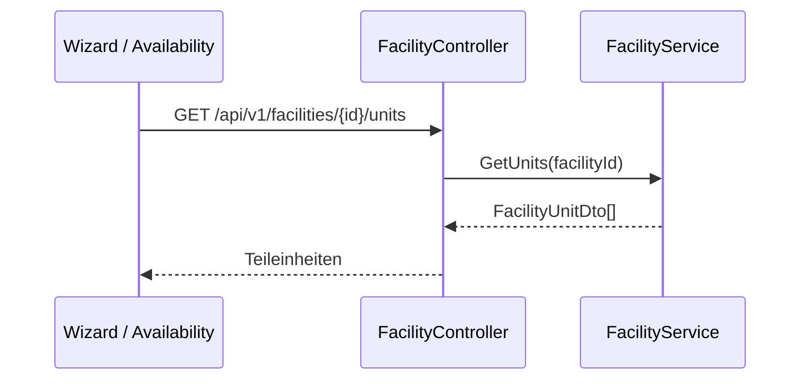
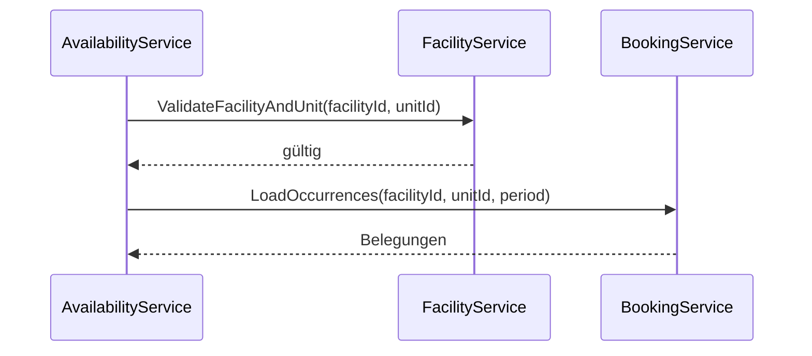

# Domäne Facility

| Feld | Wert |
|---|---|
| Kapitel | 03 – Domänen |
| Dokument | Facility |
| Status | Konsolidierter Arbeitsstand, korrigiert |
| Typ | Bestandsdomäne / REST-Freilegung |
| Priorität | Sehr hoch |
| Leitquellen | `Quellen/2026-07-05_Snapshot1.txt`, DDL-Dateien `LHD_SPA_SPORTSCOMPLEXES.sql`, `LHD_SPA_FACILITY2COMPLEX.sql`, `LHD_SPA_FACILITYGROUPS.sql`, `LHD_SPA_EVENT2UNIT.sql`, `LHD_SPA_EVENTS.sql` |

---

## 1 Zweck

Die Domäne **Facility** beschreibt die vorhandene Sportstättenstruktur von SportFM.

Sie stellt Sportkomplexe, Sportanlagen, Teileinheiten, Sportanlagengruppen sowie Such- und Filterinformationen zu Sportstätten für Portal, Application, Wizard, Availability und Booking bereit.

Facility ist keine Neuentwicklung der Sportstättenlogik.

Ziel ist die fachliche Dokumentation des Bestands und die kontrollierte REST-Freilegung für Portal- und Integrationsfunktionen.

---

## 2 Korrektur gegenüber Vorversion

Die Tabellen

- `LHD_SPA_SPORTCATEGORIES`,
- `LHD_SPA_SPORTGROUPS`,
- `LHD_SPA_SPORTSUBGROUPS`,
- `LHD_SPA_SPORTTYPES`

gehören fachlich **nicht** zur Domäne Facility.

Sie beschreiben Sportarten, Sportgruppen und Sportkategorien einer **Buchung / eines Events**.

Der Bezug erfolgt in `LHD_SPA_EVENTS` über:

- `ID_SPORTTYPE`,
- `ID_SPORTGROUP`,
- `ID_SPORTSUBGROUP`.

Damit sind diese Tabellen und Attribute der Domäne **Booking** bzw. der fachlichen Event-/Buchungsbeschreibung zuzuordnen, nicht der Sportanlage selbst.

Facility beschreibt die bauliche / organisatorische Sportstättenstruktur. Die Sportart beschreibt die konkrete Nutzung im Rahmen einer Buchung oder eines Antrags.

---

## 3 Projektbewertung

| Bereich | Bestand | Erweiterung | Neuentwicklung | Bewertung |
|---|:---:|:---:|:---:|---|
| Oracle | x | x |  | bestehende Sportstättenstammdaten bleiben führend |
| PL/SQL | x | x |  | vorhandene Stammdatenlogik identifizieren / kapseln |
| REST |  |  | x | neue fachliche Facility-API |
| DTO |  |  | x | fachliche DTOs, keine Tabellen-DTOs |
| Portal |  | x | x | Suche, Filter, Anzeige, Wizard-Auswahl |
| Availability | x | x |  | nutzt Anlagen und Teileinheiten für Verfügbarkeiten |
| Booking | x | x |  | bucht auf Teileinheiten und referenziert Sportarten am Event |
| Tests |  | x | x | Stammdaten-, Filter-, Kontext- und Integrationstests |

---

## 4 Grundsatz

Facility wird nicht neu modelliert.

Die vorhandenen SportFM-Stammdaten bleiben führend.

Verbindliche Grundsätze:

- keine zweite Sportstättenstammdatenhaltung im Portal,
- keine eigene Portalstruktur für Sportkomplexe, Anlagen oder Teileinheiten,
- keine Buchungslogik in Facility,
- keine Verfügbarkeitsberechnung in Facility,
- keine Gebührenberechnung in Facility,
- keine Sportartenlogik in Facility,
- REST kapselt fachliche Stammdatenabfragen,
- Portal nutzt Facility nur lesend und kontextbezogen.

---

## 5 Fachlicher Bestand

Aus Snapshot und DDL-Struktur ergeben sich für Facility folgende fachliche Bestandselemente:

- ca. 500 Sportstätten / Sportanlagen,
- ca. 1000 Teileinheiten,
- Sportkomplexe,
- Sportanlagen,
- Teileinheiten als buchbare Einheiten,
- Sportanlagengruppen,
- Zuordnung Sportanlage zu Sportkomplex,
- Zuordnung Buchung / Event zu Teileinheiten,
- Filter nach Sportanlagentyp, Stadtteil und weiteren Sportstättenmerkmalen,
- Nutzung als Stammdatenbasis in freier-Zeiten-Suche.

Nicht Bestandteil von Facility:

- Sportarten,
- Sportgruppen,
- Sportuntergruppen,
- Sportkategorien.

Diese Merkmale beschreiben die Nutzung / Buchung und werden über `LHD_SPA_EVENTS` referenziert.

---

## 6 Fachliches Strukturmodell

```text
Sportkomplex
  ↓
Sportanlage
  ↓
Teileinheit
```

Die **Teileinheit** ist die fachlich relevante kleinste buchbare Einheit.

Sportanlagen dienen der fachlichen Darstellung, Suche, Filterung und Gruppierung.

Sportkomplexe fassen Sportanlagen organisatorisch zusammen.

Sportarten werden nicht als Eigenschaften der Sportanlage modelliert, sondern als Eigenschaften des Events / der Buchung.

---

## 7 Abgrenzung

### 7.1 Verantwortlich

Facility ist verantwortlich für:

- Sportkomplexe,
- Sportanlagen,
- Teileinheiten,
- Sportanlagengruppen,
- Stammdatenanzeige,
- Such- und Filterwerte zu Sportstätten,
- Zuordnung Sportanlage zu Sportkomplex,
- Zuordnung Teileinheit zu Sportanlage, soweit im Bestand vorhanden,
- fachliche Anzeige für Portal und Wizard,
- Stammdatenbasis für Availability und Booking.

### 7.2 Nicht verantwortlich

Facility ist nicht verantwortlich für:

- Sportarten,
- Sportgruppen,
- Sportuntergruppen,
- Sportkategorien,
- Belegungsberechnung,
- freie Zeiten,
- Buchungserstellung,
- Stornierungen,
- Gebührenberechnung,
- Rechnungen,
- Dokumente,
- Anträge,
- Workflow,
- Kontextableitung,
- Authentifizierung.

Diese Verantwortlichkeiten liegen insbesondere in Booking, Availability, Charge, Invoice, Document, Application, Workflow, Context und Authentication.

---

## 8 Einordnung in die Plattform

```text
Facility
  ↓
Availability
  ↓
Application / Wizard
  ↓
Booking
```

Facility liefert Sportstättenstammdaten.

Availability ermittelt daraus in Verbindung mit Booking freie Zeiten.

Application und Wizard nutzen Facility zur Auswahl der gewünschten Sportanlage oder Teileinheit.

Booking verwendet die Teileinheit als buchbare Einheit und referenziert Sportart, Sportgruppe und Sportuntergruppe am Event.

---

## 9 Relevante Oracle-Tabellen

### 9.1 Facility-relevante Tabellen

| Tabelle | Zweck |
|---|---|
| `LHD_SPA_SPORTSCOMPLEXES` | Sportkomplexe |
| `LHD_SPA_FACILITY2COMPLEX` | Zuordnung Sportanlage zu Sportkomplex |
| `LHD_SPA_FACILITYGROUPS` | Sportanlagengruppen / fachliche Gruppen, u. a. Gebührenbezug |
| `LHD_SPA_EVENT2UNIT` | Zuordnung Buchung / Event zu Teileinheiten |
| `LHD_SPA_EVENTS` | enthält Sportanlagenbezug über `ID_SPA` und `SPA_NR` |
| `LHD_SPA_OCC` | konkrete Belegungsvorkommen mit `SPA_ID` und `UNIT_ID` |
| `LHD_SPA_OCC_WINNER` | resultierende Belegung mit `SPA_ID` und `UNIT_ID` |

Die eigentlichen Tabellen für Sportanlagen und Teileinheiten sind im Datenmodellkapitel final zu identifizieren, sofern sie nicht in den aktuell vorliegenden DDL-Auszügen enthalten sind.

### 9.2 Nicht Facility, sondern Booking / Event

| Tabelle | Zuordnung | Begründung |
|---|---|---|
| `LHD_SPA_SPORTCATEGORIES` | Booking / Event | Sportkategorie beschreibt die Nutzungsart im Event-Kontext |
| `LHD_SPA_SPORTGROUPS` | Booking / Event | `LHD_SPA_EVENTS` referenziert Sportgruppe |
| `LHD_SPA_SPORTSUBGROUPS` | Booking / Event | `LHD_SPA_EVENTS` referenziert Sportuntergruppe |
| `LHD_SPA_SPORTTYPES` | Booking / Event | `LHD_SPA_EVENTS` referenziert Sportart |

Diese Tabellen dürfen nicht als Attribute oder Klassen der Sportanlage beschrieben werden.

---

## 10 Wichtige Spalten aus dem Bestand

### 10.1 `LHD_SPA_EVENT2UNIT`

| Spalte | Bedeutung |
|---|---|
| `ID_EVENT` | Event / Buchung |
| `ID_UNIT` | Teileinheit |

Die Tabelle zeigt, dass Events mehreren Teileinheiten zugeordnet werden können.

### 10.2 `LHD_SPA_EVENTS`

Für Facility relevante Spalten:

- `ID_SPA`,
- `SPA_NR`,
- `IS_ALL_UNIT`.

Für Booking / Event relevante Spalten, nicht Facility:

- `ID_SPORTTYPE`,
- `ID_SPORTGROUP`,
- `ID_SPORTSUBGROUP`.

### 10.3 `LHD_SPA_OCC`

Für Facility relevante Spalten:

- `SPA_ID`,
- `UNIT_ID`,
- `START_TS`,
- `END_TS`,
- `EVENT_ID`,
- `EVENTTYPE_ID`.

### 10.4 `LHD_SPA_OCC_WINNER`

Für Facility relevante Spalten:

- `SPA_ID`,
- `UNIT_ID`,
- `DAY_DATE`,
- `START_TS`,
- `END_TS`,
- `EVENT_ID`,
- `OCC_ID`.

### 10.5 `LHD_SPA_FACILITYGROUPS`

Erkennbare Spalten:

- `ID_FACILITYGROUP`,
- `VALID_FROM`,
- `VALID_UNTIL`.

---

## 11 Business Objects

| Objekt | Zweck | Persistenz |
|---|---|---|
| `SportsComplex` | organisatorische Gruppierung von Sportanlagen | Bestand |
| `Facility` | Sportanlage / Sportstätte | Bestand |
| `FacilityUnit` | Teileinheit, kleinste buchbare Einheit | Bestand |
| `FacilityGroup` | Sportanlagengruppe | Bestand |
| `FacilityFilter` | Filterwerte für Portal und Suche | abgeleitet |

Nicht mehr enthalten:

- `SportType`,
- `SportGroup`,
- `SportCategory`.

Diese Objekte sind in `Booking.md` bzw. im späteren Datenmodell als Event-/Buchungsreferenzen zu führen.

### 11.1 Klassendiagramm



Hinweis: Das Diagramm beschreibt das fachliche Zielmodell der REST-Freilegung. Sportarten, Sportgruppen und Sportkategorien gehören nicht in dieses Klassendiagramm.

---

## 12 Fachliche Regeln

| ID | Regel |
|---|---|
| FAC-BR-001 | Sportstättenstammdaten bleiben im Bestand führend. |
| FAC-BR-002 | Facility erzeugt keine Buchungen. |
| FAC-BR-003 | Facility berechnet keine freien Zeiten. |
| FAC-BR-004 | Facility berechnet keine Gebühren. |
| FAC-BR-005 | Buchungen beziehen sich fachlich auf Teileinheiten. |
| FAC-BR-006 | Sportanlagen dienen Suche, Anzeige, Filterung und fachlicher Gruppierung. |
| FAC-BR-007 | Sportkomplexe gruppieren Sportanlagen. |
| FAC-BR-008 | Facility-Daten werden für Portal und Wizard nur über REST bereitgestellt. |
| FAC-BR-009 | Detailinformationen werden nur angezeigt, wenn sie für Portal und Kontext zulässig sind. |
| FAC-BR-010 | Availability und Booking nutzen dieselben Facility-Identitäten. |
| FAC-BR-011 | Filterwerte müssen aus dem Facility-Bestand abgeleitet werden. |
| FAC-BR-012 | Sportarten, Sportgruppen, Sportuntergruppen und Sportkategorien sind Booking-/Event-Referenzdaten und keine Facility-Attribute. |

---

## 13 Standardabläufe

### 13.1 Sportanlagen suchen

```text
Portalnutzer öffnet Sportstättensuche
  ↓
Facility-Filter werden geladen
  ↓
Suchparameter erfassen
  ↓
FacilityService liest passende Sportanlagen
  ↓
Ergebnisliste anzeigen
```

### 13.2 Sportanlage im Wizard auswählen

```text
Benutzer bearbeitet Antrag
  ↓
Wizard lädt Facility-Auswahl
  ↓
Sportanlage / Teileinheit auswählen
  ↓
Application speichert Facility-Auswahl im Antragspayload
  ↓
Sportart / Sportgruppe wird getrennt als Buchungs-/Antragsmerkmal geführt
  ↓
Availability prüft später freie Zeiten
```

### 13.3 Facility-Daten für Availability

```text
Availability erhält Suchparameter
  ↓
FacilityService validiert Anlage / Teileinheit
  ↓
Availability liest Belegungen über Booking / Occurrence
  ↓
freie Zeiten werden ermittelt
```

---

## 14 Sequenzdiagramme

### 14.1 Sportanlagen suchen



### 14.2 Teileinheiten laden



### 14.3 Availability prüft Facility



---

## 15 REST-API

| ID | Methode | Pfad | Zweck |
|---|---|---|---|
| FAC-API-001 | `GET` | `/api/v1/facilities` | Sportanlagen suchen / listen |
| FAC-API-002 | `GET` | `/api/v1/facilities/{id}` | Sportanlage lesen |
| FAC-API-003 | `GET` | `/api/v1/facilities/{id}/units` | Teileinheiten einer Sportanlage lesen |
| FAC-API-004 | `GET` | `/api/v1/units/{id}` | Teileinheit lesen |
| FAC-API-005 | `GET` | `/api/v1/sports-complexes` | Sportkomplexe lesen |
| FAC-API-006 | `GET` | `/api/v1/sports-complexes/{id}/facilities` | Anlagen eines Sportkomplexes lesen |
| FAC-API-007 | `GET` | `/api/v1/facility-groups` | Sportanlagengruppen lesen |
| FAC-API-008 | `GET` | `/api/v1/facilities/filters` | Facility-Filterwerte für Suche lesen |

Ändernde Stammdaten-Endpunkte sind in V1 nicht vorgesehen.

Sportarten-, Sportgruppen- und Sportkategorie-Endpunkte gehören nicht zur Facility-API. Sie sind der Booking-/Event-Referenzdaten-API zuzuordnen.

---

## 16 DTOs

### 16.1 `FacilityListDto`

| Feld | Typ | Pflicht |
|---|---|:---:|
| `facilityId` | string | ja |
| `facilityNumber` | string | nein |
| `name` | string | ja |
| `facilityType` | string | nein |
| `district` | string | nein |
| `sportsComplexName` | string | nein |
| `unitCount` | int | nein |
| `availableForPortal` | boolean | nein |

### 16.2 `FacilityDetailDto`

| Feld | Typ | Pflicht |
|---|---|:---:|
| `facilityId` | string | ja |
| `facilityNumber` | string | nein |
| `name` | string | ja |
| `description` | string | nein |
| `facilityType` | string | nein |
| `district` | string | nein |
| `sportsComplex` | object | nein |
| `units` | array | nein |
| `facilityGroups` | array | nein |

Kein Feld `sportTypes`: Sportart ist kein Facility-Attribut.

### 16.3 `FacilityUnitDto`

| Feld | Typ | Pflicht |
|---|---|:---:|
| `unitId` | string | ja |
| `facilityId` | string | ja |
| `name` | string | ja |
| `bookable` | boolean | nein |
| `status` | string | nein |

### 16.4 `SportsComplexDto`

| Feld | Typ | Pflicht |
|---|---|:---:|
| `sportsComplexId` | string | ja |
| `name` | string | ja |
| `facilityCount` | int | nein |

### 16.5 `FacilityFilterDto`

| Feld | Typ | Pflicht |
|---|---|:---:|
| `districts` | array | nein |
| `facilityTypes` | array | nein |
| `sportsComplexes` | array | nein |
| `facilityGroups` | array | nein |

Kein Feld `sportTypes`: Sportartfilter ist nur zulässig, wenn er fachlich als Buchungs-/Nutzungsfilter über Booking/Application ausgewertet wird, nicht als Facility-Stammdatum.

---

## 17 Services

| Service | Verantwortung |
|---|---|
| `FacilityService` | Sportanlagen suchen und lesen |
| `FacilityUnitService` | Teileinheiten lesen und validieren |
| `SportsComplexService` | Sportkomplexe lesen |
| `FacilityGroupService` | Sportanlagengruppen lesen |
| `FacilityFilterService` | Facility-Filterwerte bereitstellen |
| `FacilityVisibilityService` | Portal- und Kontextsichtbarkeit prüfen |
| `FacilityIntegrationService` | Nutzung durch Availability, Booking, Application koordinieren |

Kein `SportTypeService` in Facility.

---

## 18 Repository

| Repository | Zweck |
|---|---|
| `FacilityRepository` | Sportanlagen lesen |
| `FacilityUnitRepository` | Teileinheiten lesen |
| `SportsComplexRepository` | Sportkomplexe lesen |
| `FacilityGroupRepository` | Sportanlagengruppen lesen |

Repositories enthalten keine Geschäftslogik.

Sportarten, Sportgruppen, Sportuntergruppen und Sportkategorien werden nicht über Facility-Repositories bereitgestellt.

---

## 19 Oracle und PL/SQL

### 19.1 Grundsatz

Oracle bleibt führend.

REST und Services kapseln den Bestand.

### 19.2 Package-Zuordnung

Die vorhandenen Facility- und Stammdatenpackages sind zu identifizieren.

Falls keine eindeutig getrennte Facility-API vorhanden ist, ist eine REST-taugliche Kapselung zu prüfen.

| Package | Zweck | Status |
|---|---|---|
| bestehende Facility-/Stammdatenpackages | Sportstätten, Sportkomplexe, Teileinheiten | zu identifizieren |
| `PA_LHD_SPA_FACILITY` | REST-taugliche Kapselung für Sportanlagen, Teileinheiten und Facility-Filter | vorgeschlagene Zielstruktur, noch zu bestätigen |

Sportartenbezogene Packages sind Booking-/Event-Referenzdaten zuzuordnen.

---

## 20 Blazor-Frontend

### 20.1 Seiten / Bereiche

| ID | Seite / Bereich | Route | Zweck |
|---|---|---|---|
| FAC-PAGE-001 | Sportstätten suchen | `/facilities` | Suche und Filter |
| FAC-PAGE-002 | Sportanlage anzeigen | `/facilities/{id}` | Detailansicht |
| FAC-PAGE-003 | Sportkomplex anzeigen | `/sports-complexes/{id}` | Anlagen im Komplex |
| FAC-PAGE-004 | Facility-Auswahl im Wizard | Bestandteil Antrag | Sportanlage / Teileinheit auswählen |
| FAC-PAGE-005 | Facility-Filter in Availability | Bestandteil freie Zeiten | Suchfilter |

### 20.2 Komponenten

| Komponente | Zweck |
|---|---|
| `FacilitySearchForm` | Suchparameter erfassen |
| `FacilityFilterPanel` | Stadtteil, Typ, Sportkomplex, Sportanlagengruppe filtern |
| `FacilityList` | Trefferliste anzeigen |
| `FacilityCard` | Sportanlage kurz anzeigen |
| `FacilityDetail` | Detailinformationen anzeigen |
| `FacilityUnitList` | Teileinheiten anzeigen |
| `FacilitySelector` | Auswahl im Wizard |
| `SportsComplexSelector` | Sportkomplexfilter |

Kein `SportTypeSelector` in Facility. Ein Sportartselector gehört in den Antrag / die Buchung, nicht in die Facility-Domäne.

---

## 21 Berechtigungen

| Berechtigung | Zweck |
|---|---|
| `Facility.Read` | Sportanlagen lesen |
| `Facility.Search` | Sportanlagen suchen |
| `Facility.Unit.Read` | Teileinheiten lesen |
| `Facility.SportsComplex.Read` | Sportkomplexe lesen |
| `Facility.Filter.Read` | Facility-Filterwerte lesen |

Die reine öffentliche Anzeige kann fachlich freigegeben werden. Detailtiefe und interne Informationen sind über Context und Rollen zu begrenzen.

Keine Sportarten-Berechtigung in Facility.

---

## 22 Validierungen

| ID | Validierung | Ebene |
|---|---|---|
| FAC-VAL-001 | Sportanlage existiert | Facility |
| FAC-VAL-002 | Teileinheit existiert | FacilityUnit |
| FAC-VAL-003 | Teileinheit gehört zur Sportanlage | FacilityUnit |
| FAC-VAL-004 | Sportkomplex existiert | SportsComplex |
| FAC-VAL-005 | Facility-Filterwerte sind gültig | FacilityFilter |
| FAC-VAL-006 | Benutzer darf Detailtiefe sehen | Context / FacilityVisibility |
| FAC-VAL-007 | Facility ist für Portal sichtbar, falls Portalabfrage | FacilityVisibility |
| FAC-VAL-008 | Zeitraumbezogene Prüfung erfolgt nicht in Facility, sondern in Availability | Abgrenzung |
| FAC-VAL-009 | Sportartbezogene Prüfung erfolgt nicht in Facility, sondern in Application / Booking | Abgrenzung |

---

## 23 Testfälle

| Testfall | Beschreibung |
|---|---|
| TF-FAC-001 | Sportanlagenliste laden |
| TF-FAC-002 | Sportanlagen nach Stadtteil filtern |
| TF-FAC-003 | Sportanlagen nach Typ filtern |
| TF-FAC-004 | Sportanlage lesen |
| TF-FAC-005 | Teileinheiten einer Sportanlage lesen |
| TF-FAC-006 | Teileinheit validieren |
| TF-FAC-007 | Sportkomplexe lesen |
| TF-FAC-008 | Anlagen eines Sportkomplexes lesen |
| TF-FAC-009 | Facility-Filterwerte laden |
| TF-FAC-010 | Wizard kann Facility-Auswahl laden |
| TF-FAC-011 | Availability kann Facility / Unit validieren |
| TF-FAC-012 | Facility erzeugt keine Buchung |
| TF-FAC-013 | Facility berechnet keine freien Zeiten |
| TF-FAC-014 | Facility liefert keine Sportarten als Facility-Attribut |

---

## 24 Arbeitspakete

| AP | Titel | Typ | Inhalt |
|---|---|:---:|---|
| AP-FAC-001 | Bestandsmapping | B/E | Facility-Tabellen, Stammdatenpackages, Beziehungen dokumentieren |
| AP-FAC-002 | DTOs | N | Facility-, Unit-, Complex-, Filter-DTOs ohne Sportartattribute |
| AP-FAC-003 | REST Sportanlagen | N | Suche, Liste, Detail |
| AP-FAC-004 | REST Teileinheiten | N | Units lesen und validieren |
| AP-FAC-005 | REST Sportkomplexe | N | Komplexe und Zuordnung lesen |
| AP-FAC-006 | REST Facility-Filterwerte | N | Stadtteil, Typ, Komplex, FacilityGroup |
| AP-FAC-007 | Abgrenzung Booking-Referenzdaten | E | Sportarten, Gruppen, Kategorien in Booking / Datenmodell verschieben |
| AP-FAC-008 | Portal | N | Suche, Filter, Detail, Auswahlkomponenten |
| AP-FAC-009 | Wizard-Anbindung | N | FacilitySelector, Unit-Auswahl |
| AP-FAC-010 | Availability-Anbindung | N | Validierung und Filterbasis |
| AP-FAC-011 | Kontext / Sichtbarkeit | N | Detailtiefe und Portal-Sichtbarkeit |
| AP-FAC-012 | Tests | N | REST, Filter, Integration, Abgrenzung |
| AP-FAC-013 | Dokumentation | N | API, Domäne, Bestandsmapping |

---

## 25 Aufwandstreiber

| Treiber | Einfluss |
|---|---|
| finale Tabellenzuordnung Sportanlagen / Teileinheiten | hoch |
| Qualität der Facility-Stammdaten | hoch |
| Anzahl Facility-Filter | mittel |
| Portal-Detailtiefe | mittel |
| Integration mit Availability | hoch |
| Integration mit Wizard / Application | hoch |
| Kontext- und Sichtbarkeitsregeln | mittel bis hoch |
| Performance bei ca. 500 Anlagen und ca. 1000 Teileinheiten | mittel |
| spätere Stammdatenpflege im Adminbereich | hoch, falls V1 |
| Abgrenzung Sportartfilter zu Booking / Application | mittel |

---

## 26 Risiken

| Risiko | Bewertung | Maßnahme |
|---|---|---|
| Sportstättenstruktur wird im Portal dupliziert | hoch | Bestand bleibt führend |
| Teileinheiten werden nicht als buchbare Einheit erkannt | sehr hoch | Booking- und Availability-Abgleich |
| Facility übernimmt Availability-Logik | hoch | klare Abgrenzung einhalten |
| Sportarten werden fälschlich als Facility-Attribute modelliert | hoch | Sportarten in Booking / Event führen |
| Filterwerte sind fachlich unvollständig | mittel | Facility-Filtermatrix aus Bestand ableiten |
| Tabellenzuordnung für Anlagen / Units ist unvollständig | hoch | Datenmodellkapitel ergänzen |
| Kontextsichtbarkeit wird zu spät geklärt | hoch | Context-Abgleich vor API-Finalisierung |

---

## 27 Offene Punkte

| ID | Status | Offener Punkt | Relevanz |
|---|---|---|---|
| OP-FAC-001 | Prüfen | finale Tabellen für Sportanlagen und Teileinheiten | sehr hoch |
| OP-FAC-002 | Prüfen | vorhandene Facility-/Stammdatenpackages | hoch |
| OP-FAC-003 | Prüfen | finale Facility-Filterliste V1: Stadtteil, Typ, Barrierefreiheit usw. | hoch |
| OP-FAC-004 | Entscheiden | Detailtiefe der öffentlichen Portalansicht | mittel |
| OP-FAC-005 | Prüfen | Kontext- und Sichtbarkeitsregeln für interne / externe Anzeige | hoch |
| OP-FAC-006 | Prüfen | Stammdatenpflege über Administration in V1? | mittel |
| OP-FAC-007 | Prüfen | Zuordnung Sportanlage zu Gebühren-/FacilityGroup | mittel bis hoch |
| OP-FAC-008 | Erledigt / übertragen | Sportarten, Sportgruppen, Sportuntergruppen und Sportkategorien sind nicht Facility, sondern Booking / Event | hoch |

---

## 28 Traceability-Matrix

| Quelle | Funktion | REST | Service | UI | Test | AP |
|---|---|---|---|---|---|---|
| Snapshot Sportstätten | Sportanlagen suchen | FAC-API-001 | FacilityService | FacilitySearchForm | TF-FAC-001/002/003 | AP-FAC-003/008 |
| Snapshot Freie Zeiten | Facility-Filter für Verfügbarkeit | FAC-API-008 | FacilityFilterService | FacilityFilterPanel | TF-FAC-009/011 | AP-FAC-006/010 |
| Snapshot / Booking.md | Teileinheit als buchbare Einheit | FAC-API-003/004 | FacilityUnitService | FacilityUnitList | TF-FAC-005/006 | AP-FAC-004 |
| DDL `LHD_SPA_EVENT2UNIT` | Event zu Teileinheit | FAC-API-003/004 | FacilityUnitService / BookingService | BookingUnitList | TF-FAC-005 | AP-FAC-001/004 |
| DDL `LHD_SPA_SPORTSCOMPLEXES` | Sportkomplexe | FAC-API-005 | SportsComplexService | SportsComplexSelector | TF-FAC-007 | AP-FAC-005 |
| DDL `LHD_SPA_FACILITY2COMPLEX` | Anlagen im Komplex | FAC-API-006 | SportsComplexService | FacilityList | TF-FAC-008 | AP-FAC-005 |
| DDL `LHD_SPA_FACILITYGROUPS` | Sportanlagengruppen | FAC-API-007 | FacilityGroupService | FacilityFilterPanel | TF-FAC-009 | AP-FAC-006 |
| DDL `LHD_SPA_EVENTS` | Sportartbezug liegt am Event | Booking-API / Event-Referenzdaten | BookingService | Application / Booking UI | Booking-Tests | AP-FAC-007 |
| Wizard.md | Facility-Auswahl | FAC-API-001/003 | FacilityService | FacilitySelector | TF-FAC-010 | AP-FAC-009 |
| Availability.md | Facility-Validierung | FAC-API-002/004 | FacilityService | AvailabilitySearchForm | TF-FAC-011 | AP-FAC-010 |

---

## 29 Änderungsauswirkungen

Änderungen an `Facility.md` wirken sich aus auf:

- `03_Domaenen/Availability.md`,
- `03_Domaenen/Booking.md`,
- `03_Domaenen/Application.md`,
- `03_Domaenen/Wizard.md`,
- `03_Domaenen/Charge.md`,
- `03_Domaenen/Context.md`,
- `03_Domaenen/Administration.md`,
- `04_REST_API/Endpunkte.md`,
- `04_REST_API/DTOs.md`,
- `05_Datenmodell/Tabellen.md`,
- `05_Datenmodell/Packages.md`,
- `06_Arbeitspakete/Arbeitspaketliste.md`,
- `07_Kalkulation/Aufwandsschaetzung.md`,
- `09_Testkonzept/Testfaelle.md`,
- `12_Offene_Punkte/Offene_Punkte.md`.

Zusätzliche Auswirkung dieser Korrektur:

- `Booking.md` muss Sportarten, Sportgruppen, Sportuntergruppen und Sportkategorien als Event-/Buchungsreferenzdaten ausdrücklich aufnehmen.
- `04_REST_API/Endpunkte.md` darf Sportarten-Endpunkte nicht unter Facility einsortieren.
- `05_Datenmodell/Tabellen.md` muss die Tabellen `LHD_SPA_SPORT*` fachlich bei Booking / Event verorten.

---

## 30 Ergebnis

Die Domäne Facility ist als Bestandsdomäne beschrieben und korrigiert.

Die vorhandenen Sportstätten-, Sportkomplex-, Sportanlagen-, Teileinheiten- und FacilityGroup-Stammdaten bleiben führend.

Nicht Bestandteil von Facility sind Sportarten, Sportgruppen, Sportuntergruppen und Sportkategorien. Diese werden über `LHD_SPA_EVENTS` an der Buchung / am Event referenziert und sind daher in Booking bzw. im Event-Datenmodell zu beschreiben.

Die Umsetzung im Projekt besteht aus:

- fachlicher Dokumentation des Facility-Bestands,
- REST-Freilegung,
- DTO-Definition ohne Sportartattribute,
- Portal-Suche,
- Wizard-Auswahl,
- Filterbereitstellung für Availability,
- Kontext- und Sichtbarkeitsprüfung,
- Tests gegen Bestand und Integrationsdomänen.

Nicht Bestandteil sind:

- Buchungserstellung,
- freie-Zeiten-Berechnung,
- Gebührenberechnung,
- Sportartenlogik,
- neue Sportstättenstammdatenhaltung im Portal.
