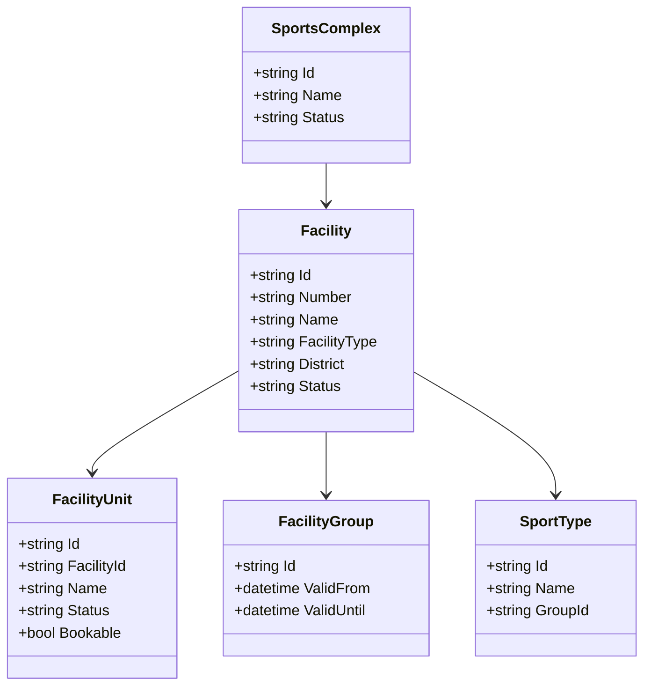
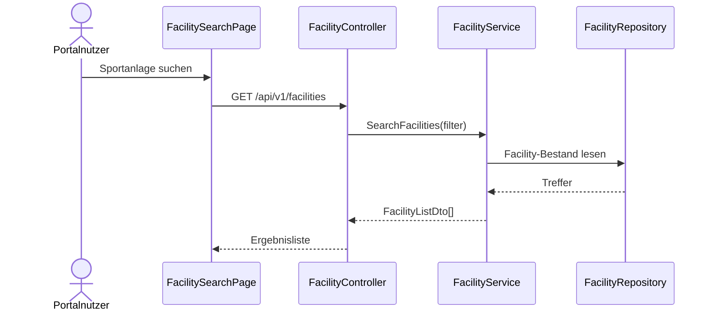
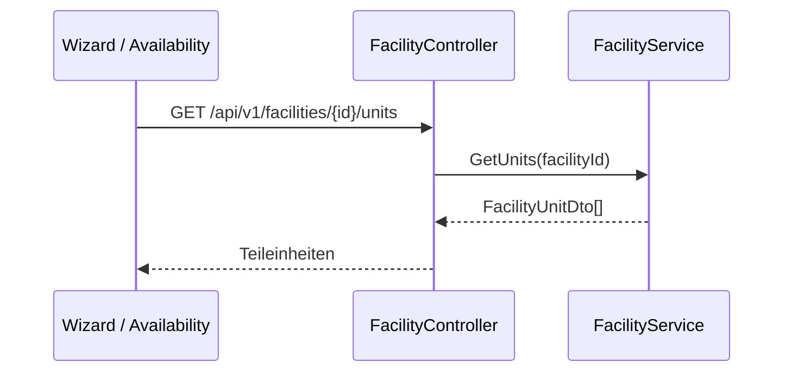
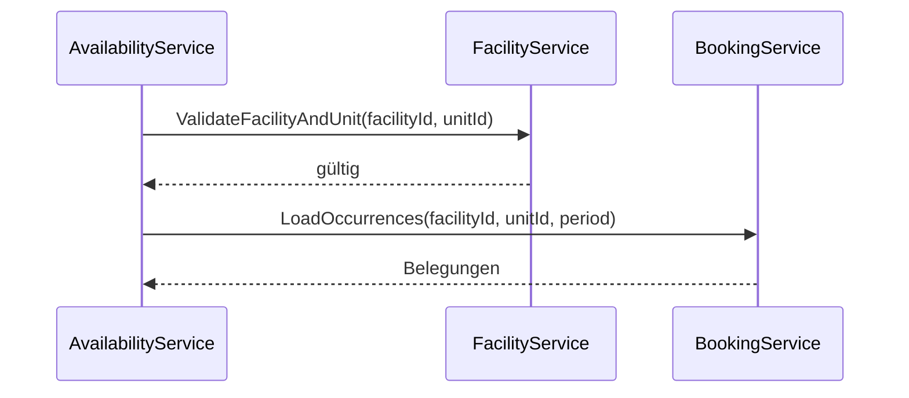

# Domäne Facility

| Feld | Wert |
|---|---|
| Kapitel | 03 – Domänen |
| Dokument | Facility |
| Status | Konsolidierter Arbeitsstand |
| Typ | Bestandsdomäne / REST-Freilegung |
| Priorität | Sehr hoch |
| Leitquellen | `Quellen/2026-07-05_Snapshot1.txt`, DDL-Dateien `LHD_SPA_SPORTSCOMPLEXES.sql`, `LHD_SPA_FACILITY2COMPLEX.sql`, `LHD_SPA_FACILITYGROUPS.sql`, `LHD_SPA_EVENT2UNIT.sql`, Sportarten-DDLs |

---

## 1 Zweck

Die Domäne **Facility** beschreibt die vorhandene Sportstättenstruktur von SportFM.

Sie stellt Sportkomplexe, Sportanlagen, Teileinheiten, Sportanlagengruppen, Such- und Filterinformationen sowie Stammdatenbezüge für Portal, Application, Wizard, Availability und Booking bereit.

Facility ist keine Neuentwicklung der Sportstättenlogik.

Ziel ist die fachliche Dokumentation des Bestands und die kontrollierte REST-Freilegung für Portal- und Integrationsfunktionen.

---

## 2 Projektbewertung

| Bereich | Bestand | Erweiterung | Neuentwicklung | Bewertung |
|---|:---:|:---:|:---:|---|
| Oracle | x | x |  | bestehende Sportstättenstammdaten bleiben führend |
| PL/SQL | x | x |  | vorhandene Stammdatenlogik identifizieren / kapseln |
| REST |  |  | x | neue fachliche Facility-API |
| DTO |  |  | x | fachliche DTOs, keine Tabellen-DTOs |
| Portal |  | x | x | Suche, Filter, Anzeige, Wizard-Auswahl |
| Availability | x | x |  | nutzt Anlagen und Teileinheiten für Verfügbarkeiten |
| Booking | x | x |  | bucht auf Teileinheiten |
| Tests |  | x | x | Stammdaten-, Filter-, Kontext- und Integrationstests |

---

## 3 Grundsatz

Facility wird nicht neu modelliert.

Die vorhandenen SportFM-Stammdaten bleiben führend.

Verbindliche Grundsätze:

- keine zweite Sportstättenstammdatenhaltung im Portal,
- keine eigene Portalstruktur für Sportkomplexe, Anlagen oder Teileinheiten,
- keine Buchungslogik in Facility,
- keine Verfügbarkeitsberechnung in Facility,
- keine Gebührenberechnung in Facility,
- REST kapselt fachliche Stammdatenabfragen,
- Portal nutzt Facility nur lesend und kontextbezogen.

---

## 4 Fachlicher Bestand

Aus Snapshot und DDL-Struktur ergeben sich folgende fachliche Bestandselemente:

- ca. 500 Sportstätten / Sportanlagen,
- ca. 1000 Teileinheiten,
- Sportkomplexe,
- Sportanlagen,
- Teileinheiten als buchbare Einheiten,
- Sportanlagengruppen,
- Zuordnung Sportanlage zu Sportkomplex,
- Zuordnung Buchung / Event zu Teileinheiten,
- Bezug zu Sportarten, Sportgruppen und Sportkategorien,
- Filter nach Sportanlagentyp, Stadtteil und weiteren Merkmalen,
- Nutzung in freier-Zeiten-Suche.

---

## 5 Fachliches Strukturmodell

```text
Sportkomplex
  ↓
Sportanlage
  ↓
Teileinheit
```

Die **Teileinheit** ist die fachlich relevante kleinste buchbare Einheit.

Sportanlagen dienen der fachlichen Darstellung, Suche, Filterung und Gruppierung.

Sportkomplexe fassen Sportanlagen organisatorisch zusammen.

---

## 6 Abgrenzung

### 6.1 Verantwortlich

Facility ist verantwortlich für:

- Sportkomplexe,
- Sportanlagen,
- Teileinheiten,
- Sportanlagengruppen,
- Stammdatenanzeige,
- Such- und Filterwerte,
- Zuordnung Sportanlage zu Sportkomplex,
- Zuordnung Teileinheit zu Sportanlage, soweit im Bestand vorhanden,
- fachliche Anzeige für Portal und Wizard,
- Stammdatenbasis für Availability und Booking.

### 6.2 Nicht verantwortlich

Facility ist nicht verantwortlich für:

- Belegungsberechnung,
- freie Zeiten,
- Buchungserstellung,
- Stornierungen,
- Gebührenberechnung,
- Rechnungen,
- Dokumente,
- Anträge,
- Workflow,
- Kontextableitung,
- Authentifizierung.

Diese Verantwortlichkeiten liegen in Availability, Booking, Charge, Invoice, Document, Application, Workflow, Context und Authentication.

---

## 7 Einordnung in die Plattform

```text
Facility
  ↓
Availability
  ↓
Application / Wizard
  ↓
Booking
```

Facility liefert Stammdaten.

Availability ermittelt daraus in Verbindung mit Booking freie Zeiten.

Application und Wizard nutzen Facility zur Auswahl der gewünschten Sportanlage oder Teileinheit.

Booking verwendet die Teileinheit als buchbare Einheit.

---

## 8 Relevante Oracle-Tabellen

| Tabelle | Zweck |
|---|---|
| `LHD_SPA_SPORTSCOMPLEXES` | Sportkomplexe |
| `LHD_SPA_FACILITY2COMPLEX` | Zuordnung Sportanlage zu Sportkomplex |
| `LHD_SPA_FACILITYGROUPS` | Sportanlagengruppen / fachliche Gruppen, u. a. Gebührenbezug |
| `LHD_SPA_EVENT2UNIT` | Zuordnung Buchung / Event zu Teileinheiten |
| `LHD_SPA_EVENTS` | enthält Sportanlagenbezug über `ID_SPA` und `SPA_NR` |
| `LHD_SPA_OCC` | konkrete Belegungsvorkommen mit `SPA_ID` und `UNIT_ID` |
| `LHD_SPA_OCC_WINNER` | resultierende Belegung mit `SPA_ID` und `UNIT_ID` |
| `LHD_SPA_SPORTCATEGORIES` | Sportkategorien |
| `LHD_SPA_SPORTGROUPS` | Sportgruppen |
| `LHD_SPA_SPORTSUBGROUPS` | Sportuntergruppen |
| `LHD_SPA_SPORTTYPES` | Sportarten |

Die eigentlichen Tabellen für Sportanlagen und Teileinheiten sind im Datenmodellkapitel final zu identifizieren, sofern sie nicht in den aktuell vorliegenden DDL-Auszügen enthalten sind.

---

## 9 Wichtige Spalten aus dem Bestand

### 9.1 `LHD_SPA_EVENT2UNIT`

| Spalte | Bedeutung |
|---|---|
| `ID_EVENT` | Event / Buchung |
| `ID_UNIT` | Teileinheit |

Die Tabelle zeigt, dass Events mehreren Teileinheiten zugeordnet werden können.

### 9.2 `LHD_SPA_EVENTS`

Für Facility relevante Spalten:

- `ID_SPA`,
- `SPA_NR`,
- `IS_ALL_UNIT`,
- `ID_SPORTTYPE`,
- `ID_SPORTGROUP`,
- `ID_SPORTSUBGROUP`.

### 9.3 `LHD_SPA_OCC`

Für Facility relevante Spalten:

- `SPA_ID`,
- `UNIT_ID`,
- `START_TS`,
- `END_TS`,
- `EVENT_ID`,
- `EVENTTYPE_ID`.

### 9.4 `LHD_SPA_OCC_WINNER`

Für Facility relevante Spalten:

- `SPA_ID`,
- `UNIT_ID`,
- `DAY_DATE`,
- `START_TS`,
- `END_TS`,
- `EVENT_ID`,
- `OCC_ID`.

### 9.5 `LHD_SPA_FACILITYGROUPS`

Erkennbare Spalten:

- `ID_FACILITYGROUP`,
- `VALID_FROM`,
- `VALID_UNTIL`.

---

## 10 Business Objects

| Objekt | Zweck | Persistenz |
|---|---|---|
| `SportsComplex` | organisatorische Gruppierung von Sportanlagen | Bestand |
| `Facility` | Sportanlage / Sportstätte | Bestand |
| `FacilityUnit` | Teileinheit, kleinste buchbare Einheit | Bestand |
| `FacilityGroup` | Sportanlagengruppe | Bestand |
| `FacilityFilter` | Filterwerte für Portal und Suche | abgeleitet |
| `SportType` | Sportart | Bestand |
| `SportGroup` | Sportgruppe | Bestand |
| `SportCategory` | Sportkategorie | Bestand |

### 10.1 Klassendiagramm



Hinweis: Das Diagramm beschreibt das fachliche Zielmodell der REST-Freilegung. Die finale Spalten- und Tabellenzuordnung bleibt im Datenmodellkapitel zu bestätigen.

---

## 11 Fachliche Regeln

| ID | Regel |
|---|---|
| FAC-BR-001 | Sportstättenstammdaten bleiben im Bestand führend. |
| FAC-BR-002 | Facility erzeugt keine Buchungen. |
| FAC-BR-003 | Facility berechnet keine freien Zeiten. |
| FAC-BR-004 | Facility berechnet keine Gebühren. |
| FAC-BR-005 | Buchungen beziehen sich fachlich auf Teileinheiten. |
| FAC-BR-006 | Sportanlagen dienen Suche, Anzeige, Filterung und fachlicher Gruppierung. |
| FAC-BR-007 | Sportkomplexe gruppieren Sportanlagen. |
| FAC-BR-008 | Facility-Daten werden für Portal und Wizard nur über REST bereitgestellt. |
| FAC-BR-009 | Detailinformationen werden nur angezeigt, wenn sie für Portal und Kontext zulässig sind. |
| FAC-BR-010 | Availability und Booking nutzen dieselben Facility-Identitäten. |
| FAC-BR-011 | Filterwerte müssen aus dem Bestand abgeleitet werden. |

---

## 12 Standardabläufe

### 12.1 Sportanlagen suchen

```text
Portalnutzer öffnet Sportstättensuche
  ↓
Filter werden geladen
  ↓
Suchparameter erfassen
  ↓
FacilityService liest passende Sportanlagen
  ↓
Ergebnisliste anzeigen
```

### 12.2 Sportanlage im Wizard auswählen

```text
Benutzer bearbeitet Antrag
  ↓
Wizard lädt Facility-Auswahl
  ↓
Sportanlage / Teileinheit auswählen
  ↓
Application speichert Auswahl im Antragspayload
  ↓
Availability prüft später freie Zeiten
```

### 12.3 Facility-Daten für Availability

```text
Availability erhält Suchparameter
  ↓
FacilityService validiert Anlage / Teileinheit
  ↓
Availability liest Belegungen über Booking / Occurrence
  ↓
freie Zeiten werden ermittelt
```

---

## 13 Sequenzdiagramme

### 13.1 Sportanlagen suchen



### 13.2 Teileinheiten laden



### 13.3 Availability prüft Facility



---

## 14 REST-API

| ID | Methode | Pfad | Zweck |
|---|---|---|---|
| FAC-API-001 | `GET` | `/api/v1/facilities` | Sportanlagen suchen / listen |
| FAC-API-002 | `GET` | `/api/v1/facilities/{id}` | Sportanlage lesen |
| FAC-API-003 | `GET` | `/api/v1/facilities/{id}/units` | Teileinheiten einer Sportanlage lesen |
| FAC-API-004 | `GET` | `/api/v1/units/{id}` | Teileinheit lesen |
| FAC-API-005 | `GET` | `/api/v1/sports-complexes` | Sportkomplexe lesen |
| FAC-API-006 | `GET` | `/api/v1/sports-complexes/{id}/facilities` | Anlagen eines Sportkomplexes lesen |
| FAC-API-007 | `GET` | `/api/v1/facility-groups` | Sportanlagengruppen lesen |
| FAC-API-008 | `GET` | `/api/v1/facilities/filters` | Filterwerte für Suche lesen |
| FAC-API-009 | `GET` | `/api/v1/sport-types` | Sportarten lesen |
| FAC-API-010 | `GET` | `/api/v1/sport-groups` | Sportgruppen lesen |

Ändernde Stammdaten-Endpunkte sind in V1 nicht vorgesehen.

---

## 15 DTOs

### 15.1 `FacilityListDto`

| Feld | Typ | Pflicht |
|---|---|:---:|
| `facilityId` | string | ja |
| `facilityNumber` | string | nein |
| `name` | string | ja |
| `facilityType` | string | nein |
| `district` | string | nein |
| `sportsComplexName` | string | nein |
| `unitCount` | int | nein |
| `availableForPortal` | boolean | nein |

### 15.2 `FacilityDetailDto`

| Feld | Typ | Pflicht |
|---|---|:---:|
| `facilityId` | string | ja |
| `facilityNumber` | string | nein |
| `name` | string | ja |
| `description` | string | nein |
| `facilityType` | string | nein |
| `district` | string | nein |
| `sportsComplex` | object | nein |
| `units` | array | nein |
| `sportTypes` | array | nein |
| `facilityGroups` | array | nein |

### 15.3 `FacilityUnitDto`

| Feld | Typ | Pflicht |
|---|---|:---:|
| `unitId` | string | ja |
| `facilityId` | string | ja |
| `name` | string | ja |
| `bookable` | boolean | nein |
| `status` | string | nein |

### 15.4 `SportsComplexDto`

| Feld | Typ | Pflicht |
|---|---|:---:|
| `sportsComplexId` | string | ja |
| `name` | string | ja |
| `facilityCount` | int | nein |

### 15.5 `FacilityFilterDto`

| Feld | Typ | Pflicht |
|---|---|:---:|
| `districts` | array | nein |
| `facilityTypes` | array | nein |
| `sportTypes` | array | nein |
| `sportsComplexes` | array | nein |
| `facilityGroups` | array | nein |

---

## 16 Services

| Service | Verantwortung |
|---|---|
| `FacilityService` | Sportanlagen suchen und lesen |
| `FacilityUnitService` | Teileinheiten lesen und validieren |
| `SportsComplexService` | Sportkomplexe lesen |
| `FacilityGroupService` | Sportanlagengruppen lesen |
| `FacilityFilterService` | Filterwerte bereitstellen |
| `SportTypeService` | Sportarten / Gruppen lesen |
| `FacilityVisibilityService` | Portal- und Kontextsichtbarkeit prüfen |
| `FacilityIntegrationService` | Nutzung durch Availability, Booking, Application koordinieren |

---

## 17 Repository

| Repository | Zweck |
|---|---|
| `FacilityRepository` | Sportanlagen lesen |
| `FacilityUnitRepository` | Teileinheiten lesen |
| `SportsComplexRepository` | Sportkomplexe lesen |
| `FacilityGroupRepository` | Sportanlagengruppen lesen |
| `SportTypeRepository` | Sportarten, Gruppen, Kategorien lesen |

Repositories enthalten keine Geschäftslogik.

---

## 18 Oracle und PL/SQL

### 18.1 Grundsatz

Oracle bleibt führend.

REST und Services kapseln den Bestand.

### 18.2 Package-Zuordnung

Die vorhandenen Facility- und Stammdatenpackages sind zu identifizieren.

Falls keine eindeutig getrennte Facility-API vorhanden ist, ist eine REST-taugliche Kapselung zu prüfen.

| Package | Zweck | Status |
|---|---|---|
| bestehende Stammdatenpackages | Sportstätten, Teileinheiten, Sportarten | zu identifizieren |
| `PA_LHD_SPA_FACILITY` | REST-taugliche Kapselung für Sportanlagen, Teileinheiten und Filter | vorgeschlagene Zielstruktur, noch zu bestätigen |

---

## 19 Blazor-Frontend

### 19.1 Seiten / Bereiche

| ID | Seite / Bereich | Route | Zweck |
|---|---|---|---|
| FAC-PAGE-001 | Sportstätten suchen | `/facilities` | Suche und Filter |
| FAC-PAGE-002 | Sportanlage anzeigen | `/facilities/{id}` | Detailansicht |
| FAC-PAGE-003 | Sportkomplex anzeigen | `/sports-complexes/{id}` | Anlagen im Komplex |
| FAC-PAGE-004 | Facility-Auswahl im Wizard | Bestandteil Antrag | Sportanlage / Teileinheit auswählen |
| FAC-PAGE-005 | Facility-Filter in Availability | Bestandteil freie Zeiten | Suchfilter |

### 19.2 Komponenten

| Komponente | Zweck |
|---|---|
| `FacilitySearchForm` | Suchparameter erfassen |
| `FacilityFilterPanel` | Stadtteil, Typ, Sportart, Gruppe filtern |
| `FacilityList` | Trefferliste anzeigen |
| `FacilityCard` | Sportanlage kurz anzeigen |
| `FacilityDetail` | Detailinformationen anzeigen |
| `FacilityUnitList` | Teileinheiten anzeigen |
| `FacilitySelector` | Auswahl im Wizard |
| `SportsComplexSelector` | Sportkomplexfilter |
| `SportTypeSelector` | Sportartfilter |

---

## 20 Berechtigungen

| Berechtigung | Zweck |
|---|---|
| `Facility.Read` | Sportanlagen lesen |
| `Facility.Search` | Sportanlagen suchen |
| `Facility.Unit.Read` | Teileinheiten lesen |
| `Facility.SportsComplex.Read` | Sportkomplexe lesen |
| `Facility.Filter.Read` | Filterwerte lesen |
| `SportType.Read` | Sportarten und Sportgruppen lesen |

Die reine öffentliche Anzeige kann fachlich freigegeben werden. Detailtiefe und interne Informationen sind über Context und Rollen zu begrenzen.

---

## 21 Validierungen

| ID | Validierung | Ebene |
|---|---|---|
| FAC-VAL-001 | Sportanlage existiert | Facility |
| FAC-VAL-002 | Teileinheit existiert | FacilityUnit |
| FAC-VAL-003 | Teileinheit gehört zur Sportanlage | FacilityUnit |
| FAC-VAL-004 | Sportkomplex existiert | SportsComplex |
| FAC-VAL-005 | Filterwerte sind gültig | FacilityFilter |
| FAC-VAL-006 | Benutzer darf Detailtiefe sehen | Context / FacilityVisibility |
| FAC-VAL-007 | Facility ist für Portal sichtbar, falls Portalabfrage | FacilityVisibility |
| FAC-VAL-008 | Zeitraumbezogene Prüfung erfolgt nicht in Facility, sondern in Availability | Abgrenzung |

---

## 22 Testfälle

| Testfall | Beschreibung |
|---|---|
| TF-FAC-001 | Sportanlagenliste laden |
| TF-FAC-002 | Sportanlagen nach Stadtteil filtern |
| TF-FAC-003 | Sportanlagen nach Typ filtern |
| TF-FAC-004 | Sportanlagen nach Sportart filtern |
| TF-FAC-005 | Sportanlage lesen |
| TF-FAC-006 | Teileinheiten einer Sportanlage lesen |
| TF-FAC-007 | Teileinheit validieren |
| TF-FAC-008 | Sportkomplexe lesen |
| TF-FAC-009 | Anlagen eines Sportkomplexes lesen |
| TF-FAC-010 | Filterwerte laden |
| TF-FAC-011 | Wizard kann Facility-Auswahl laden |
| TF-FAC-012 | Availability kann Facility / Unit validieren |
| TF-FAC-013 | Facility erzeugt keine Buchung |
| TF-FAC-014 | Facility berechnet keine freien Zeiten |

---

## 23 Arbeitspakete

| AP | Titel | Typ | Inhalt |
|---|---|:---:|---|
| AP-FAC-001 | Bestandsmapping | B/E | Tabellen, Stammdatenpackages, Beziehungen dokumentieren |
| AP-FAC-002 | DTOs | N | Facility-, Unit-, Complex-, Filter-DTOs |
| AP-FAC-003 | REST Sportanlagen | N | Suche, Liste, Detail |
| AP-FAC-004 | REST Teileinheiten | N | Units lesen und validieren |
| AP-FAC-005 | REST Sportkomplexe | N | Komplexe und Zuordnung lesen |
| AP-FAC-006 | REST Filterwerte | N | Stadtteil, Typ, Sportart, Gruppen |
| AP-FAC-007 | Sportarten | E/N | Sportarten, Gruppen, Kategorien bereitstellen |
| AP-FAC-008 | Portal | N | Suche, Filter, Detail, Auswahlkomponenten |
| AP-FAC-009 | Wizard-Anbindung | N | FacilitySelector, Unit-Auswahl |
| AP-FAC-010 | Availability-Anbindung | N | Validierung und Filterbasis |
| AP-FAC-011 | Kontext / Sichtbarkeit | N | Detailtiefe und Portal-Sichtbarkeit |
| AP-FAC-012 | Tests | N | REST, Filter, Integration, Abgrenzung |
| AP-FAC-013 | Dokumentation | N | API, Domäne, Bestandsmapping |

---

## 24 Aufwandstreiber

| Treiber | Einfluss |
|---|---|
| finale Tabellenzuordnung Sportanlagen / Teileinheiten | hoch |
| Qualität der Stammdaten | hoch |
| Anzahl Filter | mittel |
| Portal-Detailtiefe | mittel |
| Integration mit Availability | hoch |
| Integration mit Wizard / Application | hoch |
| Kontext- und Sichtbarkeitsregeln | mittel bis hoch |
| Performance bei ca. 500 Anlagen und ca. 1000 Teileinheiten | mittel |
| spätere Stammdatenpflege im Adminbereich | hoch, falls V1 |

---

## 25 Risiken

| Risiko | Bewertung | Maßnahme |
|---|---|---|
| Sportstättenstruktur wird im Portal dupliziert | hoch | Bestand bleibt führend |
| Teileinheiten werden nicht als buchbare Einheit erkannt | sehr hoch | Booking- und Availability-Abgleich |
| Facility übernimmt Availability-Logik | hoch | klare Abgrenzung einhalten |
| Filterwerte sind fachlich unvollständig | mittel | Filtermatrix aus Bestand ableiten |
| Tabellenzuordnung für Anlagen / Units ist unvollständig | hoch | Datenmodellkapitel ergänzen |
| Kontextsichtbarkeit wird zu spät geklärt | hoch | Context-Abgleich vor API-Finalisierung |

---

## 26 Offene Punkte

| ID | Status | Offener Punkt | Relevanz |
|---|---|---|---|
| OP-FAC-001 | Prüfen | finale Tabellen für Sportanlagen und Teileinheiten | sehr hoch |
| OP-FAC-002 | Prüfen | vorhandene Facility-/Stammdatenpackages | hoch |
| OP-FAC-003 | Prüfen | finale Filterliste V1: Stadtteil, Typ, Sportart, Barrierefreiheit usw. | hoch |
| OP-FAC-004 | Entscheiden | Detailtiefe der öffentlichen Portalansicht | mittel |
| OP-FAC-005 | Prüfen | Kontext- und Sichtbarkeitsregeln für interne / externe Anzeige | hoch |
| OP-FAC-006 | Prüfen | Stammdatenpflege über Administration in V1? | mittel |
| OP-FAC-007 | Prüfen | Zuordnung Sportanlage zu Gebühren-/FacilityGroup | mittel bis hoch |

---

## 27 Traceability-Matrix

| Quelle | Funktion | REST | Service | UI | Test | AP |
|---|---|---|---|---|---|---|
| Snapshot Sportstätten | Sportanlagen suchen | FAC-API-001 | FacilityService | FacilitySearchForm | TF-FAC-001/002/003 | AP-FAC-003/008 |
| Snapshot Freie Zeiten | Filter für Verfügbarkeit | FAC-API-008 | FacilityFilterService | FacilityFilterPanel | TF-FAC-010/012 | AP-FAC-006/010 |
| Snapshot / Booking.md | Teileinheit als buchbare Einheit | FAC-API-003/004 | FacilityUnitService | FacilityUnitList | TF-FAC-006/007 | AP-FAC-004 |
| DDL `LHD_SPA_EVENT2UNIT` | Event zu Teileinheit | FAC-API-003/004 | FacilityUnitService / BookingService | BookingUnitList | TF-FAC-006 | AP-FAC-001/004 |
| DDL `LHD_SPA_SPORTSCOMPLEXES` | Sportkomplexe | FAC-API-005 | SportsComplexService | SportsComplexSelector | TF-FAC-008 | AP-FAC-005 |
| DDL `LHD_SPA_FACILITY2COMPLEX` | Anlagen im Komplex | FAC-API-006 | SportsComplexService | FacilityList | TF-FAC-009 | AP-FAC-005 |
| DDL `LHD_SPA_FACILITYGROUPS` | Sportanlagengruppen | FAC-API-007 | FacilityGroupService | FacilityFilterPanel | TF-FAC-010 | AP-FAC-006 |
| Wizard.md | Facility-Auswahl | FAC-API-001/003 | FacilityService | FacilitySelector | TF-FAC-011 | AP-FAC-009 |
| Availability.md | Facility-Validierung | FAC-API-002/004 | FacilityService | AvailabilitySearchForm | TF-FAC-012 | AP-FAC-010 |

---

## 28 Änderungsauswirkungen

Änderungen an `Facility.md` wirken sich aus auf:

- `03_Domaenen/Availability.md`,
- `03_Domaenen/Booking.md`,
- `03_Domaenen/Application.md`,
- `03_Domaenen/Wizard.md`,
- `03_Domaenen/Charge.md`,
- `03_Domaenen/Context.md`,
- `03_Domaenen/Administration.md`,
- `04_REST_API/Endpunkte.md`,
- `04_REST_API/DTOs.md`,
- `05_Datenmodell/Tabellen.md`,
- `05_Datenmodell/Packages.md`,
- `06_Arbeitspakete/Arbeitspaketliste.md`,
- `07_Kalkulation/Aufwandsschaetzung.md`,
- `09_Testkonzept/Testfaelle.md`,
- `12_Offene_Punkte/Offene_Punkte.md`.

---

## 29 Ergebnis

Die Domäne Facility ist als Bestandsdomäne beschrieben.

Die vorhandenen Sportstätten-, Sportkomplex-, Sportanlagen-, Teileinheiten- und Sportartenstammdaten bleiben führend.

Die Umsetzung im Projekt besteht aus:

- fachlicher Dokumentation des Bestands,
- REST-Freilegung,
- DTO-Definition,
- Portal-Suche,
- Wizard-Auswahl,
- Filterbereitstellung für Availability,
- Kontext- und Sichtbarkeitsprüfung,
- Tests gegen Bestand und Integrationsdomänen.

Nicht Bestandteil sind:

- Buchungserstellung,
- freie-Zeiten-Berechnung,
- Gebührenberechnung,
- neue Sportstättenstammdatenhaltung im Portal.
