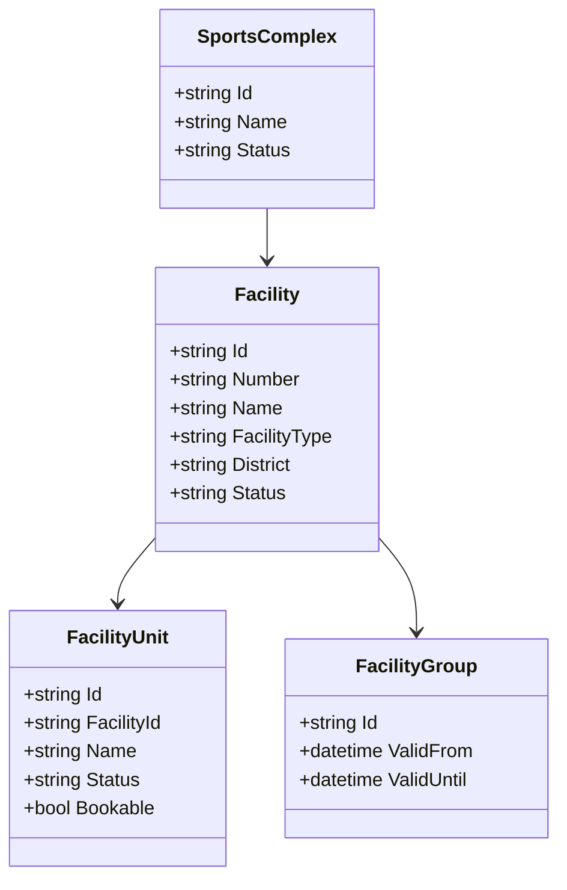

# Domäne Facility

| Feld | Wert |
|---|---|
| Kapitel | 03 – Domänen |
| Dokument | Facility |
| Status | Konsolidierter Arbeitsstand |
| Typ | Bestandsdomäne / REST-Freilegung |
| Priorität | Sehr hoch |
| Leitquellen | `Quellen/2026-07-05_Snapshot1.txt`, `LHD_SPA_SPORTSCOMPLEXES.sql`, `LHD_SPA_FACILITY2COMPLEX.sql`, `LHD_SPA_FACILITYGROUPS.sql`, `LHD_SPA_EVENT2UNIT.sql`, `LHD_SPA_EVENTS.sql`, `LHD_SPA_OCC*.sql` |

---

## 1 Zweck

Die Domäne **Facility** beschreibt die vorhandene Sportstättenstruktur von SportFM.

Sie stellt Sportkomplexe, Sportanlagen, Teileinheiten, Sportanlagengruppen sowie Sportstätten-Such- und Filterinformationen für Portal, Application, Wizard, Availability und Booking bereit.

Facility ist eine Bestandsdomäne. Die vorhandenen SportFM-Stammdaten bleiben führend.

---

## 2 Fachliche Einordnung

Facility beschreibt **wo** eine Nutzung stattfinden kann.

Booking beschreibt **welche Nutzung** dort stattfindet.

Damit gehören folgende Referenzdaten nicht zur Domäne Facility, sondern zur Domäne Booking beziehungsweise zum Event:

| Tabelle | Fachliche Zuordnung | Begründung |
|---|---|---|
| `LHD_SPA_SPORTCATEGORIES` | Booking / Event | Sportkategorie beschreibt die Nutzung |
| `LHD_SPA_SPORTGROUPS` | Booking / Event | Sportgruppe wird am Event referenziert |
| `LHD_SPA_SPORTSUBGROUPS` | Booking / Event | Sportuntergruppe wird am Event referenziert |
| `LHD_SPA_SPORTTYPES` | Booking / Event | Sportart wird am Event referenziert |

In `LHD_SPA_EVENTS` werden diese Merkmale über `ID_SPORTTYPE`, `ID_SPORTGROUP` und `ID_SPORTSUBGROUP` referenziert. Sie sind daher keine Eigenschaften einer Sportanlage.

---

## 3 Projektbewertung

| Bereich | Bestand | Erweiterung | Neuentwicklung | Bewertung |
|---|:---:|:---:|:---:|---|
| Oracle | x | x |  | bestehende Sportstättenstammdaten bleiben führend |
| PL/SQL | x | x |  | vorhandene Stammdatenlogik identifizieren und kapseln |
| REST |  |  | x | fachliche Facility-API erforderlich |
| DTO |  |  | x | fachliche DTOs, keine Tabellen-DTOs |
| Portal |  | x | x | Suche, Filter, Detailanzeige, Wizard-Auswahl |
| Availability | x | x |  | nutzt Sportanlage und Teileinheit zur Verfügbarkeitsprüfung |
| Booking | x | x |  | bucht auf Teileinheiten |
| Tests |  | x | x | Stammdaten-, Filter-, Kontext- und Integrationstests |

---

## 4 Grundsatz

Facility wird nicht neu modelliert.

Verbindliche Grundsätze:

- keine zweite Sportstättenstammdatenhaltung im Portal,
- keine Buchungslogik in Facility,
- keine Verfügbarkeitsberechnung in Facility,
- keine Gebührenberechnung in Facility,
- keine Sportartenlogik in Facility,
- keine Modellierung von Sportart, Sportgruppe, Sportuntergruppe oder Sportkategorie als Facility-Attribut,
- REST kapselt fachliche Stammdatenabfragen,
- Portal nutzt Facility lesend und kontextbezogen.

---

## 5 Fachlicher Bestand

Facility umfasst:

- Sportkomplexe,
- Sportanlagen,
- Teileinheiten,
- Sportanlagengruppen,
- Zuordnung Sportanlage zu Sportkomplex,
- Zuordnung von Buchungen / Events zu Teileinheiten,
- Sportstättenfilter wie Sportanlagentyp, Stadtteil und weitere Sportstättenmerkmale,
- Stammdatenbasis für freie-Zeiten-Suche, Antragstellung und Buchungsanzeige.

Nicht Bestandteil von Facility sind:

- Sportarten,
- Sportgruppen,
- Sportuntergruppen,
- Sportkategorien,
- Nutzungsart einer konkreten Buchung.

---

## 6 Fachliches Strukturmodell

```text
Sportkomplex
  ↓
Sportanlage
  ↓
Teileinheit
```

Die **Teileinheit** ist die kleinste buchbare Einheit.

Sportanlagen dienen Darstellung, Suche, Filterung und fachlicher Gruppierung.

Sportkomplexe fassen Sportanlagen organisatorisch zusammen.

---

## 7 Abgrenzung

### 7.1 Verantwortlich

Facility ist verantwortlich für:

- Sportkomplexe,
- Sportanlagen,
- Teileinheiten,
- Sportanlagengruppen,
- Anzeige von Sportstättenstammdaten,
- Sportstätten-Such- und Filterwerte,
- Zuordnung Sportanlage zu Sportkomplex,
- Zuordnung Teileinheit zu Sportanlage, soweit im Bestand vorhanden,
- Prüfung, ob Sportanlage und Teileinheit existieren,
- Bereitstellung der Stammdatenbasis für Availability, Application, Wizard und Booking.

### 7.2 Nicht verantwortlich

Facility ist nicht verantwortlich für:

- Sportart der Nutzung,
- Sportgruppe der Nutzung,
- Sportuntergruppe der Nutzung,
- Sportkategorie der Nutzung,
- Belegungsberechnung,
- freie Zeiten,
- Buchungserstellung,
- Stornierungen,
- Gebührenberechnung,
- Rechnungen,
- Dokumente,
- Anträge,
- Workflow,
- Kontextableitung,
- Authentifizierung.

---

## 8 Relevante Oracle-Tabellen

| Tabelle | Zweck in Facility |
|---|---|
| `LHD_SPA_SPORTSCOMPLEXES` | Sportkomplexe |
| `LHD_SPA_FACILITY2COMPLEX` | Zuordnung Sportanlage zu Sportkomplex |
| `LHD_SPA_FACILITYGROUPS` | Sportanlagengruppen / fachliche Gruppen |
| `LHD_SPA_EVENT2UNIT` | Zuordnung Event / Buchung zu Teileinheit |
| `LHD_SPA_EVENTS` | enthält Facility-Bezug über `ID_SPA`, `SPA_NR`, `IS_ALL_UNIT` |
| `LHD_SPA_OCC` | konkrete Vorkommen mit `SPA_ID` und `UNIT_ID` |
| `LHD_SPA_OCC_WINNER` | resultierende Belegung mit `SPA_ID` und `UNIT_ID` |

Die eigentlichen Tabellen für Sportanlagen und Teileinheiten sind im Datenmodellkapitel final zu identifizieren, sofern sie nicht in den aktuell vorliegenden DDL-Auszügen enthalten sind.

---

## 9 Relevante Spalten

### 9.1 `LHD_SPA_EVENTS`

Facility-relevant:

- `ID_SPA`,
- `SPA_NR`,
- `IS_ALL_UNIT`.

Nicht Facility, sondern Booking / Event:

- `ID_SPORTTYPE`,
- `ID_SPORTGROUP`,
- `ID_SPORTSUBGROUP`.

### 9.2 `LHD_SPA_EVENT2UNIT`

| Spalte | Bedeutung |
|---|---|
| `ID_EVENT` | Event / Buchung |
| `ID_UNIT` | Teileinheit |

### 9.3 `LHD_SPA_OCC` und `LHD_SPA_OCC_WINNER`

Facility-relevant:

- `SPA_ID`,
- `UNIT_ID`,
- `START_TS`,
- `END_TS`,
- `EVENT_ID`,
- `OCC_ID`, soweit vorhanden.

---

## 10 Business Objects

| Objekt | Zweck | Persistenz |
|---|---|---|
| `SportsComplex` | organisatorische Gruppierung von Sportanlagen | Bestand |
| `Facility` | Sportanlage / Sportstätte | Bestand |
| `FacilityUnit` | Teileinheit / kleinste buchbare Einheit | Bestand |
| `FacilityGroup` | Sportanlagengruppe | Bestand |
| `FacilityFilter` | abgeleitete Filterwerte für Portal und Suche | abgeleitet |

Nicht Bestandteil:

- `SportType`,
- `SportGroup`,
- `SportSubGroup`,
- `SportCategory`.

### 10.1 Klassendiagramm



---

## 11 Fachliche Regeln

| ID | Regel |
|---|---|
| FAC-BR-001 | Sportstättenstammdaten bleiben im Bestand führend. |
| FAC-BR-002 | Facility erzeugt keine Buchungen. |
| FAC-BR-003 | Facility berechnet keine freien Zeiten. |
| FAC-BR-004 | Facility berechnet keine Gebühren. |
| FAC-BR-005 | Buchungen beziehen sich fachlich auf Teileinheiten. |
| FAC-BR-006 | Sportanlagen dienen Suche, Anzeige, Filterung und Gruppierung. |
| FAC-BR-007 | Sportkomplexe gruppieren Sportanlagen. |
| FAC-BR-008 | Sportart, Sportgruppe, Sportuntergruppe und Sportkategorie sind Event-/Booking-Referenzdaten. |
| FAC-BR-009 | Facility-Daten werden über REST bereitgestellt. |
| FAC-BR-010 | Detailinformationen werden nur angezeigt, wenn sie für Portal und Kontext zulässig sind. |
| FAC-BR-011 | Availability und Booking nutzen dieselben Facility-Identitäten. |

---

## 12 Standardabläufe

### 12.1 Sportanlagen suchen

```text
Portalnutzer öffnet Sportstättensuche
  ↓
Facility-Filter laden
  ↓
Suchparameter erfassen
  ↓
FacilityService liest passende Sportanlagen
  ↓
Ergebnisliste anzeigen
```

### 12.2 Facility im Wizard auswählen

```text
Benutzer bearbeitet Antrag
  ↓
Wizard lädt Facility-Auswahl
  ↓
Sportanlage / Teileinheit auswählen
  ↓
Application speichert Facility-Auswahl im Antrag
  ↓
Sportart / Sportgruppe wird getrennt als Nutzungsmerkmal geführt
  ↓
Availability prüft freie Zeiten
```

### 12.3 Facility für Availability validieren

```text
Availability erhält Suchparameter
  ↓
FacilityService validiert Sportanlage / Teileinheit
  ↓
Availability liest Belegungen über Booking / Occurrence
  ↓
freie Zeiten werden ermittelt
```

---

## 13 REST-API

| ID | Methode | Pfad | Zweck |
|---|---|---|---|
| FAC-API-001 | `GET` | `/api/v1/facilities` | Sportanlagen suchen / listen |
| FAC-API-002 | `GET` | `/api/v1/facilities/{id}` | Sportanlage lesen |
| FAC-API-003 | `GET` | `/api/v1/facilities/{id}/units` | Teileinheiten einer Sportanlage lesen |
| FAC-API-004 | `GET` | `/api/v1/units/{id}` | Teileinheit lesen |
| FAC-API-005 | `GET` | `/api/v1/sports-complexes` | Sportkomplexe lesen |
| FAC-API-006 | `GET` | `/api/v1/sports-complexes/{id}/facilities` | Anlagen eines Sportkomplexes lesen |
| FAC-API-007 | `GET` | `/api/v1/facility-groups` | Sportanlagengruppen lesen |
| FAC-API-008 | `GET` | `/api/v1/facilities/filters` | Facility-Filterwerte lesen |

Nicht Bestandteil der Facility-API:

- `/sport-types`,
- `/sport-groups`,
- `/sport-subgroups`,
- `/sport-categories`.

Diese Endpunkte gehören zu Booking / Event-Referenzdaten.

---

## 14 DTOs

### 14.1 `FacilityListDto`

| Feld | Typ | Pflicht |
|---|---|:---:|
| `facilityId` | string | ja |
| `facilityNumber` | string | nein |
| `name` | string | ja |
| `facilityType` | string | nein |
| `district` | string | nein |
| `sportsComplexName` | string | nein |
| `unitCount` | int | nein |
| `availableForPortal` | boolean | nein |

### 14.2 `FacilityDetailDto`

| Feld | Typ | Pflicht |
|---|---|:---:|
| `facilityId` | string | ja |
| `facilityNumber` | string | nein |
| `name` | string | ja |
| `description` | string | nein |
| `facilityType` | string | nein |
| `district` | string | nein |
| `sportsComplex` | object | nein |
| `units` | array | nein |
| `facilityGroups` | array | nein |

Kein Feld `sportTypes`, da Sportart kein Facility-Attribut ist.

### 14.3 `FacilityUnitDto`

| Feld | Typ | Pflicht |
|---|---|:---:|
| `unitId` | string | ja |
| `facilityId` | string | ja |
| `name` | string | ja |
| `bookable` | boolean | nein |
| `status` | string | nein |

### 14.4 `FacilityFilterDto`

| Feld | Typ | Pflicht |
|---|---|:---:|
| `districts` | array | nein |
| `facilityTypes` | array | nein |
| `sportsComplexes` | array | nein |
| `facilityGroups` | array | nein |

Kein Feld `sportTypes`. Ein Sportartfilter ist fachlich ein Nutzungs-/Buchungsfilter und gehört zu Application / Booking.

---

## 15 Services und Repositories

| Service | Verantwortung |
|---|---|
| `FacilityService` | Sportanlagen suchen und lesen |
| `FacilityUnitService` | Teileinheiten lesen und validieren |
| `SportsComplexService` | Sportkomplexe lesen |
| `FacilityGroupService` | Sportanlagengruppen lesen |
| `FacilityFilterService` | Facility-Filterwerte bereitstellen |
| `FacilityVisibilityService` | Portal- und Kontextsichtbarkeit prüfen |
| `FacilityIntegrationService` | Nutzung durch Availability, Booking und Application koordinieren |

| Repository | Zweck |
|---|---|
| `FacilityRepository` | Sportanlagen lesen |
| `FacilityUnitRepository` | Teileinheiten lesen |
| `SportsComplexRepository` | Sportkomplexe lesen |
| `FacilityGroupRepository` | Sportanlagengruppen lesen |

Kein `SportTypeService` und kein `SportTypeRepository` in Facility.

---

## 16 Blazor-Frontend

| Seite / Bereich | Route | Zweck |
|---|---|---|
| Sportstätten suchen | `/facilities` | Suche und Filter |
| Sportanlage anzeigen | `/facilities/{id}` | Detailansicht |
| Sportkomplex anzeigen | `/sports-complexes/{id}` | Anlagen im Komplex |
| Facility-Auswahl im Wizard | Bestandteil Antrag | Sportanlage / Teileinheit auswählen |
| Facility-Filter in Availability | Bestandteil freie Zeiten | Facility-Suchfilter |

| Komponente | Zweck |
|---|---|
| `FacilitySearchForm` | Suchparameter erfassen |
| `FacilityFilterPanel` | Stadtteil, Typ, Sportkomplex, Sportanlagengruppe filtern |
| `FacilityList` | Trefferliste anzeigen |
| `FacilityCard` | Sportanlage kurz anzeigen |
| `FacilityDetail` | Detailinformationen anzeigen |
| `FacilityUnitList` | Teileinheiten anzeigen |
| `FacilitySelector` | Auswahl im Wizard |
| `SportsComplexSelector` | Sportkomplexfilter |

Kein `SportTypeSelector` in Facility.

---

## 17 Berechtigungen

| Berechtigung | Zweck |
|---|---|
| `Facility.Read` | Sportanlagen lesen |
| `Facility.Search` | Sportanlagen suchen |
| `Facility.Unit.Read` | Teileinheiten lesen |
| `Facility.SportsComplex.Read` | Sportkomplexe lesen |
| `Facility.Filter.Read` | Facility-Filterwerte lesen |

---

## 18 Validierungen

| ID | Validierung | Ebene |
|---|---|---|
| FAC-VAL-001 | Sportanlage existiert | Facility |
| FAC-VAL-002 | Teileinheit existiert | FacilityUnit |
| FAC-VAL-003 | Teileinheit gehört zur Sportanlage | FacilityUnit |
| FAC-VAL-004 | Sportkomplex existiert | SportsComplex |
| FAC-VAL-005 | Facility-Filterwerte sind gültig | FacilityFilter |
| FAC-VAL-006 | Benutzer darf Detailtiefe sehen | Context / FacilityVisibility |
| FAC-VAL-007 | Facility ist für Portal sichtbar, falls Portalabfrage | FacilityVisibility |
| FAC-VAL-008 | Sportartbezogene Prüfung erfolgt in Application / Booking, nicht in Facility | Abgrenzung |

---

## 19 Testfälle

| Testfall | Beschreibung |
|---|---|
| TF-FAC-001 | Sportanlagenliste laden |
| TF-FAC-002 | Sportanlagen nach Stadtteil filtern |
| TF-FAC-003 | Sportanlagen nach Typ filtern |
| TF-FAC-004 | Sportanlage lesen |
| TF-FAC-005 | Teileinheiten einer Sportanlage lesen |
| TF-FAC-006 | Teileinheit validieren |
| TF-FAC-007 | Sportkomplexe lesen |
| TF-FAC-008 | Anlagen eines Sportkomplexes lesen |
| TF-FAC-009 | Facility-Filterwerte laden |
| TF-FAC-010 | Wizard kann Facility-Auswahl laden |
| TF-FAC-011 | Availability kann Facility / Unit validieren |
| TF-FAC-012 | Facility erzeugt keine Buchung |
| TF-FAC-013 | Facility berechnet keine freien Zeiten |
| TF-FAC-014 | Facility liefert keine Sportarten als Facility-Attribut |

---

## 20 Arbeitspakete

| AP | Titel | Inhalt |
|---|---|---|
| AP-FAC-001 | Bestandsmapping | Facility-Tabellen, Stammdatenpackages, Beziehungen dokumentieren |
| AP-FAC-002 | DTOs | Facility-, Unit-, Complex- und Filter-DTOs ohne Sportartattribute |
| AP-FAC-003 | REST Sportanlagen | Suche, Liste, Detail |
| AP-FAC-004 | REST Teileinheiten | Units lesen und validieren |
| AP-FAC-005 | REST Sportkomplexe | Komplexe und Zuordnung lesen |
| AP-FAC-006 | REST Facility-Filterwerte | Stadtteil, Typ, Komplex, FacilityGroup |
| AP-FAC-007 | Portal | Suche, Filter, Detail, Auswahlkomponenten |
| AP-FAC-008 | Wizard-Anbindung | FacilitySelector, Unit-Auswahl |
| AP-FAC-009 | Availability-Anbindung | Validierung und Filterbasis |
| AP-FAC-010 | Kontext / Sichtbarkeit | Detailtiefe und Portal-Sichtbarkeit |
| AP-FAC-011 | Tests | REST, Filter, Integration, Abgrenzung |
| AP-FAC-012 | Dokumentation | API, Domäne, Bestandsmapping |

---

## 21 Risiken

| Risiko | Bewertung | Maßnahme |
|---|---|---|
| Sportstättenstruktur wird im Portal dupliziert | hoch | Bestand bleibt führend |
| Teileinheiten werden nicht als buchbare Einheit erkannt | sehr hoch | Booking- und Availability-Abgleich |
| Facility übernimmt Availability-Logik | hoch | klare Abgrenzung einhalten |
| Sportarten werden fälschlich als Facility-Attribute modelliert | hoch | Sportarten in Booking / Event führen |
| Tabellenzuordnung für Anlagen / Units ist unvollständig | hoch | Datenmodellkapitel ergänzen |
| Kontextsichtbarkeit wird zu spät geklärt | hoch | Context-Abgleich vor API-Finalisierung |

---

## 22 Offene Punkte

| ID | Offener Punkt | Relevanz |
|---|---|---|
| OP-FAC-001 | finale Tabellen für Sportanlagen und Teileinheiten | sehr hoch |
| OP-FAC-002 | vorhandene Facility-/Stammdatenpackages | hoch |
| OP-FAC-003 | finale Facility-Filterliste V1 | hoch |
| OP-FAC-004 | Detailtiefe der öffentlichen Portalansicht | mittel |
| OP-FAC-005 | Kontext- und Sichtbarkeitsregeln für interne / externe Anzeige | hoch |
| OP-FAC-006 | Stammdatenpflege über Administration in V1? | mittel |
| OP-FAC-007 | Zuordnung Sportanlage zu Gebühren-/FacilityGroup | mittel bis hoch |

---

## 23 Traceability-Matrix

| Quelle | Funktion | REST | Service | UI | Test | AP |
|---|---|---|---|---|---|---|
| Snapshot Sportstätten | Sportanlagen suchen | FAC-API-001 | FacilityService | FacilitySearchForm | TF-FAC-001/002/003 | AP-FAC-003/007 |
| Snapshot Freie Zeiten | Facility-Filter für Verfügbarkeit | FAC-API-008 | FacilityFilterService | FacilityFilterPanel | TF-FAC-009/011 | AP-FAC-006/009 |
| Booking.md | Teileinheit als buchbare Einheit | FAC-API-003/004 | FacilityUnitService | FacilityUnitList | TF-FAC-005/006 | AP-FAC-004 |
| DDL `LHD_SPA_EVENT2UNIT` | Event zu Teileinheit | FAC-API-003/004 | FacilityUnitService / BookingService | BookingUnitList | TF-FAC-005 | AP-FAC-001/004 |
| DDL `LHD_SPA_EVENTS` | Sportartbezug liegt am Event | Booking-API | BookingService | Application / Booking UI | Booking-Tests | Booking |
| DDL `LHD_SPA_SPORTSCOMPLEXES` | Sportkomplexe | FAC-API-005 | SportsComplexService | SportsComplexSelector | TF-FAC-007 | AP-FAC-005 |
| DDL `LHD_SPA_FACILITY2COMPLEX` | Anlagen im Komplex | FAC-API-006 | SportsComplexService | FacilityList | TF-FAC-008 | AP-FAC-005 |
| DDL `LHD_SPA_FACILITYGROUPS` | Sportanlagengruppen | FAC-API-007 | FacilityGroupService | FacilityFilterPanel | TF-FAC-009 | AP-FAC-006 |

---

## 24 Änderungsauswirkungen

Änderungen an `Facility.md` wirken sich aus auf:

- `03_Domaenen/Availability.md`,
- `03_Domaenen/Booking.md`,
- `03_Domaenen/Application.md`,
- `03_Domaenen/Wizard.md`,
- `03_Domaenen/Charge.md`,
- `03_Domaenen/Context.md`,
- `03_Domaenen/Administration.md`,
- `04_REST_API/Endpunkte.md`,
- `04_REST_API/DTOs.md`,
- `05_Datenmodell/Tabellen.md`,
- `05_Datenmodell/Packages.md`,
- `06_Arbeitspakete/Arbeitspaketliste.md`,
- `07_Kalkulation/Aufwandsschaetzung.md`,
- `09_Testkonzept/Testfaelle.md`,
- `12_Offene_Punkte/Offene_Punkte.md`.

---

## 25 Ergebnis

Die Domäne Facility ist als Bestandsdomäne für Sportstättenstammdaten beschrieben.

Sie umfasst Sportkomplexe, Sportanlagen, Teileinheiten und Sportanlagengruppen.

Sie umfasst ausdrücklich nicht Sportarten, Sportgruppen, Sportuntergruppen oder Sportkategorien. Diese Referenzdaten gehören zur Buchung / zum Event und werden in Booking beschrieben.
