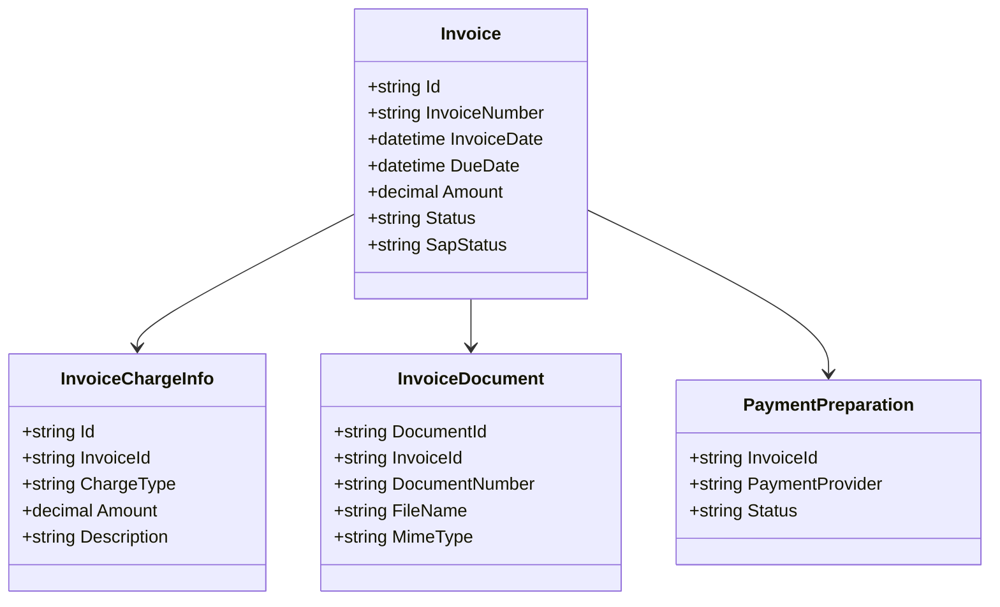
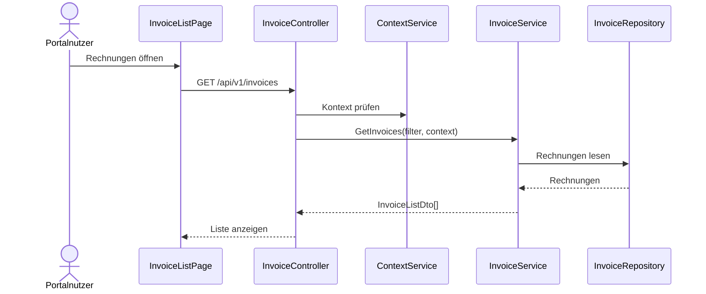
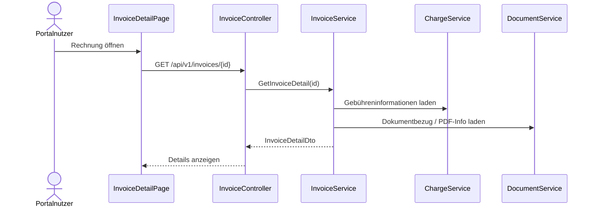
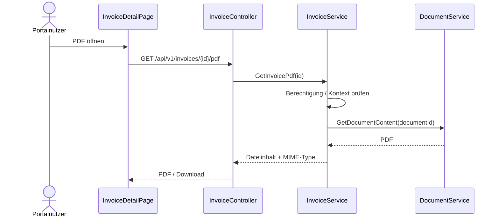

# Domäne Invoice

| Feld | Wert |
|---|---|
| Kapitel | 03 – Domänen |
| Dokument | Invoice |
| Status | Konsolidierter Arbeitsstand |
| Typ | Bestandsdomäne / Erweiterung |
| Priorität | Hoch |
| Leitquellen | `Quellen/2026-07-05_Snapshot1.txt`, DDL-Dateien `LHD_SPA_INVOICES.sql`, `LHD_SPA_INVOICES_HIST.sql`, `LHD_SPA_INVOICE_CHARGEINFOS.sql`, `LHD_SPA_INVOICE_CHARGEINFOS_HIST.sql`, `LHD_SPA_DOCUMENTS.sql` |

---

## 1 Zweck

Die Domäne **Invoice** beschreibt die vorhandene Rechnungs- und Rechnungsanzeigelogik von SportFM.

Sie stellt vorhandene Rechnungen, Gebührenbescheide, Rechnungsdetails, PDF-Dokumente, Zahlstatus und SAP-Bezüge für Portal und zukünftige REST-Nutzung bereit.

Invoice ist keine Neuentwicklung.

Ziel ist die kontrollierte REST- und Portal-Freigabe vorhandener Rechnungsinformationen.

---

## 2 Projektbewertung

| Bereich | Bestand | Erweiterung | Neuentwicklung | Bewertung |
|---|:---:|:---:|:---:|---|
| Oracle Tabellen | x |  |  | bestehende Tabellen bleiben führend |
| SAP-Anbindung | x |  |  | bleibt Bestand |
| Gebühren | x |  |  | Gebührenberechnung bleibt Bestand / Charge |
| Rechnungslogik | x |  |  | keine Neuentwicklung |
| Gebührenbescheid / PDF | x | x |  | Anzeige / Download über REST |
| PL/SQL | x | x |  | bestehende Logik nutzen / ggf. REST-tauglich erweitern |
| REST |  |  | x | neue fachliche Zugriffsschicht |
| DTO |  |  | x | neue fachliche DTOs |
| Portal |  |  | x | Rechnungsliste, Details, PDF, Zahlstatus |
| WPF | x | x |  | spätere Migration auf REST möglich |
| Tests |  |  | x | Berechtigungs-, PDF-, SAP-Status- und Regressionstests |

---

## 3 Grundsatz

Invoice wird nicht neu entworfen.

Die bestehende Rechnungslogik, SAP-Anbindung, Gebührenberechnung und Gebührenbescheiderzeugung bleiben unverändert im Bestand.

Verbindliche Grundsätze:

- keine Rechnungserstellung im Portal,
- keine SAP-Buchung aus dem Portal,
- keine Gebührenberechnung in Invoice-REST,
- keine zweite Rechnungslogik in .NET,
- REST stellt vorhandene Rechnungen fachlich bereit,
- Portal zeigt Rechnungen nur berechtigt und kontextbezogen,
- ePayBL wird nur vorbereitet, nicht als zwingende V1-Zahlungsintegration beschrieben.

---

## 4 Bestand

### 4.1 Vorhandene Fähigkeiten

Im Bestand vorhanden sind:

- Rechnungen,
- Gebühren,
- Gebührenbescheide,
- SAP-Anbindung,
- Rechnungsnummern / Belege,
- Rechnungsdetails,
- Rechnungsstatus / SAP-Status,
- PDF-Dokumente über Document,
- Historienstrukturen.

### 4.2 Fachliche Erweiterungen V1

| ID | Erweiterung | Beschreibung |
|---|---|---|
| FA-INV-001 | Rechnungsliste | vorhandene Rechnungen im Portal anzeigen |
| FA-INV-002 | Rechnungsdetails | Detailinformationen zu einer Rechnung anzeigen |
| FA-INV-003 | PDF | Gebührenbescheid / Rechnung als PDF öffnen oder herunterladen |
| FA-INV-004 | Zahlstatus | vorhandenen Zahlstatus / SAP-Status anzeigen |
| FA-INV-005 | ePayBL vorbereiten | spätere ePayBL-Anbindung strukturell berücksichtigen |

---

## 5 Abgrenzung

### 5.1 Verantwortlich

Invoice ist verantwortlich für:

- Rechnungsliste,
- Rechnungsdetails,
- Rechnungsnummer,
- Rechnungsdatum,
- Fälligkeit,
- Betrag,
- Zahlstatus,
- SAP-Statusanzeige,
- Gebührenbescheidbezug,
- PDF-Bezug über Document,
- Rechnungsbezug zu Buchung / Event,
- kontextbezogene Sichtbarkeit.

### 5.2 Nicht verantwortlich

Invoice ist nicht verantwortlich für:

- Rechnungserstellung,
- SAP-Buchung,
- Gebührenberechnung,
- Zahlungsabwicklung,
- Dokumentenerzeugung,
- Antragserstellung,
- Buchungslogik,
- Workflowstatus,
- Authentifizierung,
- Kontextableitung.

Diese Funktionen liegen in Bestand, SAP, Charge, Document, Application, Booking, Workflow, Authentication und Context.

---

## 6 Fachliches Modell

```text
Invoice
  ↓
InvoiceChargeInfo
  ↓
Charge
  ↓
Document / Gebührenbescheid
  ↓
SAP-Status / Zahlstatus
```

Die Rechnung stellt vorhandene Abrechnungsinformationen dar.

Die Gebühreninformationen kommen aus dem bestehenden Gebühren-/Charge-Bestand.

Das PDF wird über die bestehende Dokumentenverwaltung bereitgestellt.

---

## 7 Relevante Oracle-Tabellen

| Tabelle | Zweck |
|---|---|
| `LHD_SPA_INVOICES` | zentrale Rechnungstabelle |
| `LHD_SPA_INVOICES_HIST` | Rechnungshistorie |
| `LHD_SPA_INVOICE_CHARGEINFOS` | Gebühreninformationen / Rechnungspositionen |
| `LHD_SPA_INVOICE_CHARGEINFOS_HIST` | Historie der Gebühreninformationen |
| `LHD_SPA_DOCUMENTS` | PDF / Gebührenbescheid mit Rechnungsbezug |

---

## 8 Wichtige fachliche Informationen

Aus Snapshot und Bestand sind folgende Informationen für das Portal relevant:

- Rechnungs-ID,
- Rechnungsnummer,
- Zeitraum,
- Betrag,
- Status,
- Rechnungsdatum,
- Fälligkeit,
- Gebührenbescheid,
- SAP-Status,
- PDF-Dokument,
- Zahlinformationen,
- Gebühreninformationen.

Die genaue Spaltenzuordnung wird im Kapitel `05_Datenmodell/Tabellen.md` dokumentiert, sobald die DDLs final ausgewertet sind.

---

## 9 Business Objects

| Objekt | Zweck | Persistenz |
|---|---|---|
| `Invoice` | bestehende Rechnung | Bestand |
| `InvoiceChargeInfo` | Gebühreninformation / Rechnungsposition | Bestand |
| `InvoiceDocument` | Gebührenbescheid / PDF-Bezug | Document-Bestand |
| `InvoiceStatus` | Rechnungs- / Zahlstatus | Bestand |
| `SapStatus` | Status aus SAP-Bezug | Bestand |
| `PaymentPreparation` | spätere ePayBL-Vorbereitung | Erweiterung / offen |

### 9.1 Klassendiagramm



---

## 10 Fachliche Regeln

| ID | Regel |
|---|---|
| INV-BR-001 | Die vorhandene Rechnungslogik bleibt führend. |
| INV-BR-002 | Das Portal erzeugt keine Rechnungen. |
| INV-BR-003 | Das Portal führt keine SAP-Buchung aus. |
| INV-BR-004 | Gebührenberechnung bleibt Bestand / Charge. |
| INV-BR-005 | Rechnungen werden nur im zulässigen Kontext angezeigt. |
| INV-BR-006 | Rechnungspdfs werden über Document bereitgestellt. |
| INV-BR-007 | Der Zahlstatus wird angezeigt, aber nicht im Portal berechnet. |
| INV-BR-008 | SAP-Status wird angezeigt, aber nicht durch Portal verändert. |
| INV-BR-009 | ePayBL ist Vorbereitung, keine bestätigte vollständige Zahlungsfunktion V1. |
| INV-BR-010 | Rechnungszugriffe sind wegen Finanz- und Datenschutzbezug restriktiv zu prüfen. |

---

## 11 Standardabläufe

### 11.1 Rechnungsliste laden

```text
Portalnutzer öffnet Rechnungen
  ↓
Context prüfen
  ↓
InvoiceService lädt berechtigte Rechnungen
  ↓
Filter anwenden
  ↓
InvoiceListDto zurückgeben
```

### 11.2 Rechnungsdetail öffnen

```text
Portalnutzer öffnet Rechnung
  ↓
Berechtigung und Kontext prüfen
  ↓
Rechnungsdaten laden
  ↓
Gebühreninformationen laden
  ↓
Dokumentbezug laden
  ↓
Detailseite anzeigen
```

### 11.3 PDF öffnen

```text
Portalnutzer öffnet PDF
  ↓
Invoice prüft Berechtigung
  ↓
Document liefert zugehöriges Dokument
  ↓
Download / Anzeige bereitstellen
  ↓
Zugriff protokollieren, soweit erforderlich
```

---

## 12 Sequenzdiagramme

### 12.1 Rechnungsliste



### 12.2 Rechnungsdetails



### 12.3 Rechnungs-PDF



---

## 13 REST-API

| ID | Methode | Pfad | Zweck |
|---|---|---|---|
| INV-API-001 | `GET` | `/api/v1/invoices` | Rechnungsliste lesen |
| INV-API-002 | `GET` | `/api/v1/invoices/{id}` | Rechnungsdetails lesen |
| INV-API-003 | `GET` | `/api/v1/invoices/{id}/pdf` | Rechnungs-PDF / Gebührenbescheid herunterladen |
| INV-API-004 | `GET` | `/api/v1/invoices/{id}/charges` | Gebühreninformationen zur Rechnung lesen |
| INV-API-005 | `GET` | `/api/v1/invoices/{id}/documents` | Dokumente zur Rechnung lesen |
| INV-API-006 | `GET` | `/api/v1/invoices/{id}/payment-status` | Zahlstatus / SAP-Status lesen |

Keine allgemeine `POST`-, `PUT`- oder `DELETE`-API für Rechnungen in V1.

---

## 14 DTOs

### 14.1 `InvoiceListDto`

| Feld | Typ | Pflicht |
|---|---|:---:|
| `invoiceId` | string | ja |
| `invoiceNumber` | string | ja |
| `period` | string | nein |
| `amount` | decimal | ja |
| `status` | string | ja |
| `invoiceDate` | datetime | nein |
| `dueDate` | datetime | nein |

### 14.2 `InvoiceDetailDto`

| Feld | Typ | Pflicht |
|---|---|:---:|
| `invoiceId` | string | ja |
| `invoiceNumber` | string | ja |
| `feeNoticeNumber` | string | nein |
| `invoiceDate` | datetime | nein |
| `dueDate` | datetime | nein |
| `amount` | decimal | ja |
| `status` | string | ja |
| `sapStatus` | string | nein |
| `charges` | array | nein |
| `documents` | array | nein |
| `paymentInformation` | object | nein |

### 14.3 `InvoiceFilterDto`

| Feld | Typ | Pflicht |
|---|---|:---:|
| `from` | datetime | nein |
| `to` | datetime | nein |
| `status` | string | nein |
| `invoiceNumber` | string | nein |
| `contextId` | string | nein / aus aktivem Kontext |

### 14.4 `InvoiceChargeInfoDto`

| Feld | Typ | Pflicht |
|---|---|:---:|
| `chargeInfoId` | string | ja |
| `description` | string | nein |
| `chargeType` | string | nein |
| `amount` | decimal | ja |
| `bookingId` | string | nein |

### 14.5 `InvoicePaymentStatusDto`

| Feld | Typ | Pflicht |
|---|---|:---:|
| `invoiceId` | string | ja |
| `status` | string | ja |
| `sapStatus` | string | nein |
| `payable` | boolean | nein |
| `paymentProvider` | string | nein |

---

## 15 Services

| Service | Verantwortung |
|---|---|
| `InvoiceService` | Rechnungen suchen, Details bereitstellen |
| `InvoiceDetailService` | Detaildaten, Gebühren und Dokumentbezüge zusammenstellen |
| `InvoicePdfService` | PDF über Document bereitstellen |
| `InvoicePaymentStatusService` | Zahlstatus / SAP-Status anzeigen |
| `InvoiceVisibilityService` | Kontext- und Rollenprüfung |
| `InvoiceIntegrationService` | Anbindung an Charge, Document und Booking koordinieren |
| `PaymentPreparationService` | ePayBL-Vorbereitung, falls fachlich bestätigt |

---

## 16 Repository

| Repository | Zweck |
|---|---|
| `InvoiceRepository` | Rechnungen lesen |
| `InvoiceChargeInfoRepository` | Gebühreninformationen lesen |
| `InvoiceHistoryRepository` | Historie lesen, falls Portal / Audit benötigt |
| `InvoiceDocumentRepository` | Rechnungsdokumentbezug lesen, alternativ DocumentService |

Repositories enthalten keine Geschäftslogik und erzeugen keine Rechnungen.

---

## 17 Oracle und PL/SQL

### 17.1 Grundsatz

Oracle und bestehende Rechnungslogik bleiben führend.

REST und Services kapseln den Bestand.

### 17.2 Package-Zuordnung

Die vorhandenen Rechnungspackages sind zu identifizieren und ggf. REST-tauglich zu erweitern.

| Package | Zweck | Status |
|---|---|---|
| bestehende Rechnungs-/SAP-Packages | Rechnung, SAP-Bezug, Gebührenbescheid | zu identifizieren |
| `PA_LHD_SPA_INVOICE` | REST-taugliche Kapselung für Liste, Detail, PDF, Status | vorgeschlagene Zielstruktur, noch zu bestätigen |

---

## 18 Blazor-Frontend

### 18.1 Seiten

| ID | Seite | Route | Zweck |
|---|---|---|---|
| INV-PAGE-001 | Rechnungen | `/invoices` | Rechnungsliste |
| INV-PAGE-002 | Rechnungsdetail | `/invoices/{id}` | Detailansicht |
| INV-PAGE-003 | Rechnungs-PDF | eingebettet / Download | Gebührenbescheid / PDF öffnen |
| INV-PAGE-004 | Rechnungen im Dashboard | Bestandteil Dashboard | offene / letzte Rechnungen |

### 18.2 Komponenten

| Komponente | Zweck |
|---|---|
| `InvoiceList` | Rechnungsliste |
| `InvoiceFilterPanel` | Zeitraum, Status, Rechnungsnummer filtern |
| `InvoiceCard` | Rechnungskachel / Kurzanzeige |
| `InvoiceDetail` | Rechnungsdetails |
| `InvoiceStatusBadge` | Status / Zahlstatus |
| `SapStatusBadge` | SAP-Status anzeigen |
| `InvoiceChargeList` | Gebühreninformationen anzeigen |
| `InvoicePdfButton` | Gebührenbescheid / PDF öffnen |
| `PaymentInfoPanel` | Zahlinformationen anzeigen |

---

## 19 Berechtigungen

| Berechtigung | Zweck |
|---|---|
| `Invoice.Read` | Rechnungen im zulässigen Kontext lesen |
| `Invoice.Detail.Read` | Rechnungsdetails lesen |
| `Invoice.Pdf.Read` | Rechnungs-PDF / Gebührenbescheid öffnen |
| `Invoice.Charges.Read` | Gebühreninformationen zur Rechnung lesen |
| `Invoice.Documents.Read` | Dokumentbezug zur Rechnung lesen |
| `Invoice.PaymentStatus.Read` | Zahlstatus / SAP-Status lesen |

Berechtigungen sind besonders restriktiv zu prüfen, weil Rechnungen finanzielle und personenbezogene Daten enthalten können.

---

## 20 Validierungen

| ID | Validierung | Ebene |
|---|---|---|
| INV-VAL-001 | Rechnung existiert | Invoice |
| INV-VAL-002 | Benutzer besitzt zulässigen Kontext | Context |
| INV-VAL-003 | Benutzer darf Rechnung sehen | InvoiceVisibility |
| INV-VAL-004 | Benutzer darf PDF öffnen | Invoice / Document |
| INV-VAL-005 | Zeitraumfilter ist gültig | REST / Service |
| INV-VAL-006 | Rechnungsnummerfilter ist gültig | REST / Service |
| INV-VAL-007 | SAP-Status wird nur gelesen, nicht geändert | InvoiceService |
| INV-VAL-008 | ePayBL-Funktion wird nur angezeigt, wenn fachlich aktiviert | PaymentPreparation |

---

## 21 Testfälle

| Testfall | Beschreibung |
|---|---|
| TF-INV-001 | Rechnungsliste laden |
| TF-INV-002 | Rechnungsliste nach Zeitraum filtern |
| TF-INV-003 | Rechnungsliste nach Status filtern |
| TF-INV-004 | Rechnungsliste nach Rechnungsnummer filtern |
| TF-INV-005 | Rechnungsdetails lesen |
| TF-INV-006 | Gebühreninformationen anzeigen |
| TF-INV-007 | Rechnungs-PDF öffnen / herunterladen |
| TF-INV-008 | fremde Rechnung nicht anzeigen |
| TF-INV-009 | Zahlstatus anzeigen |
| TF-INV-010 | SAP-Status anzeigen |
| TF-INV-011 | Portal erzeugt keine Rechnung |
| TF-INV-012 | Portal führt keine SAP-Buchung aus |
| TF-INV-013 | Dokumentbezug über DocumentService funktioniert |
| TF-INV-014 | Kontextwechsel filtert Rechnungen korrekt |

---

## 22 Arbeitspakete

| AP | Titel | Typ | Inhalt |
|---|---|:---:|---|
| AP-INV-001 | Bestandsmapping | B/E | Tabellen, Packages, Status, SAP-Bezug dokumentieren |
| AP-INV-002 | DTOs | N | InvoiceListDto, InvoiceDetailDto, Filter, Status |
| AP-INV-003 | REST Rechnungsliste | N | Liste, Filter, Kontextprüfung |
| AP-INV-004 | REST Rechnungsdetail | N | Details, Gebühren, Dokumente |
| AP-INV-005 | REST PDF | N | PDF über Document bereitstellen |
| AP-INV-006 | Zahlstatus / SAP-Status | E/N | vorhandenen Status anzeigen |
| AP-INV-007 | Charge-Anbindung | N/E | Gebühreninformationen bereitstellen |
| AP-INV-008 | Document-Anbindung | N/E | PDF / Gebührenbescheid bereitstellen |
| AP-INV-009 | Portal | N | Liste, Detail, Filter, PDF, Zahlinfo |
| AP-INV-010 | Kontext / Berechtigungen | N | Sichtbarkeit je Kontext und Rolle |
| AP-INV-011 | ePayBL-Vorbereitung | E/N | nur strukturell, falls V1 bestätigt |
| AP-INV-012 | Tests | N | REST, Portal, Berechtigung, PDF, Regression |
| AP-INV-013 | Dokumentation | N | API, Domäne, Bestandsmapping |

---

## 23 Aufwandstreiber

| Treiber | Einfluss |
|---|---|
| Sichtbarkeitsregeln je Kontext | hoch |
| SAP-Status und Zahlstatus | mittel bis hoch |
| PDF-Bereitstellung über Document | mittel |
| Gebühreninformationen / Charge-Anbindung | hoch |
| Portalfilter und Detailansicht | mittel |
| ePayBL-Vorbereitung | mittel bis hoch, abhängig vom Zielumfang |
| vorhandene Package-Struktur | mittel |
| Datenschutz / Finanzdaten | hoch |
| Regression gegen bestehende Rechnungslogik | hoch |

---

## 24 Risiken

| Risiko | Bewertung | Maßnahme |
|---|---|---|
| Portal erzeugt versehentlich eigene Rechnungsvorgänge | sehr hoch | Invoice bleibt lesend / Bestand führend |
| SAP-Anbindung wird ungewollt verändert | sehr hoch | keine SAP-Schreiboperation V1 |
| Gebührenberechnung wird dupliziert | hoch | Charge / Bestand bleibt führend |
| Rechnungen werden ohne Kontextschutz angezeigt | sehr hoch | Context- und VisibilityService verpflichtend |
| PDF-Bezug ist nicht eindeutig | mittel bis hoch | Document-Zuordnung klären |
| ePayBL wird unterschätzt | hoch | nur als offener / vorbereitender Baustein führen |
| Zahlstatus wird falsch interpretiert | mittel | Statusmapping dokumentieren |

---

## 25 Offene Punkte

| ID | Status | Offener Punkt | Relevanz |
|---|---|---|---|
| OP-INV-001 | Prüfen | finale Rechnungsstatus / Zahlstatus / SAP-Status | hoch |
| OP-INV-002 | Prüfen | vorhandene Rechnungspackages / Package-Zuordnung | hoch |
| OP-INV-003 | Prüfen | genaue Beziehung Rechnung ↔ Gebührenbescheid / Dokument | hoch |
| OP-INV-004 | Prüfen | Kontextzuordnung bestehender Rechnungen | sehr hoch |
| OP-INV-005 | Entscheiden | Umfang ePayBL in V1 | hoch |
| OP-INV-006 | Prüfen | Detailtiefe der Gebühreninformationen im Portal | mittel |
| OP-INV-007 | Prüfen | Download-/Zugriffsprotokollierung für Rechnungs-PDFs | hoch |

---

## 26 Traceability-Matrix

| Quelle | Funktion | REST | Service | UI | Test | AP |
|---|---|---|---|---|---|---|
| Snapshot Invoice | Rechnungsliste | INV-API-001 | InvoiceService | InvoiceList | TF-INV-001 | AP-INV-003/009 |
| Snapshot Invoice | Rechnungsdetails | INV-API-002 | InvoiceDetailService | InvoiceDetail | TF-INV-005 | AP-INV-004/009 |
| Snapshot Invoice | PDF | INV-API-003 | InvoicePdfService / DocumentService | InvoicePdfButton | TF-INV-007 | AP-INV-005/008 |
| Snapshot Invoice | Zahlstatus | INV-API-006 | InvoicePaymentStatusService | InvoiceStatusBadge | TF-INV-009/010 | AP-INV-006 |
| Snapshot Invoice | ePayBL-Vorbereitung | n/a / später | PaymentPreparationService | PaymentInfoPanel | offen | AP-INV-011 |
| DDL `LHD_SPA_INVOICES` | Rechnungskern | INV-API-001/002 | InvoiceRepository | InvoiceList / Detail | TF-INV-001/005 | AP-INV-001/003/004 |
| DDL `LHD_SPA_INVOICE_CHARGEINFOS` | Gebühreninformationen | INV-API-004 | InvoiceChargeInfoRepository / ChargeService | InvoiceChargeList | TF-INV-006 | AP-INV-007 |
| Document.md | Gebührenbescheid / PDF | INV-API-003/005 | DocumentService | InvoicePdfButton | TF-INV-007/013 | AP-INV-008 |
| Context.md | Sichtbarkeit | alle INV-APIs | InvoiceVisibilityService | alle Invoice-Seiten | TF-INV-008/014 | AP-INV-010 |

---

## 27 Änderungsauswirkungen

Änderungen an `Invoice.md` wirken sich aus auf:

- `03_Domaenen/Charge.md`,
- `03_Domaenen/Document.md`,
- `03_Domaenen/Booking.md`,
- `03_Domaenen/Dashboard.md`,
- `03_Domaenen/Notification.md`,
- `03_Domaenen/Context.md`,
- `04_REST_API/Endpunkte.md`,
- `04_REST_API/DTOs.md`,
- `05_Datenmodell/Tabellen.md`,
- `05_Datenmodell/Packages.md`,
- `06_Arbeitspakete/Arbeitspaketliste.md`,
- `07_Kalkulation/Aufwandsschaetzung.md`,
- `09_Testkonzept/Testfaelle.md`,
- `10_Sicherheit/Revisionssicherheit.md`,
- `12_Offene_Punkte/Offene_Punkte.md`.

---

## 28 Ergebnis

Die Domäne Invoice ist als Bestandsdomäne beschrieben.

Die vorhandene Rechnungs-, SAP-, Gebühren- und Gebührenbescheidlogik bleibt führend.

Die Umsetzung im Projekt besteht aus:

- fachlicher Dokumentation des Bestands,
- REST-Freilegung,
- DTO-Definition,
- Portal-Anzeige,
- Rechnungsdetailansicht,
- PDF-Zugriff über Document,
- Anzeige von Zahlstatus / SAP-Status,
- Kontext- und Berechtigungsprüfung,
- Tests gegen die bestehende Logik.

Nicht Bestandteil sind:

- Rechnungserstellung im Portal,
- SAP-Buchung im Portal,
- Gebührenberechnung im Portal,
- vollständige Zahlungsabwicklung ohne gesonderte Entscheidung.
