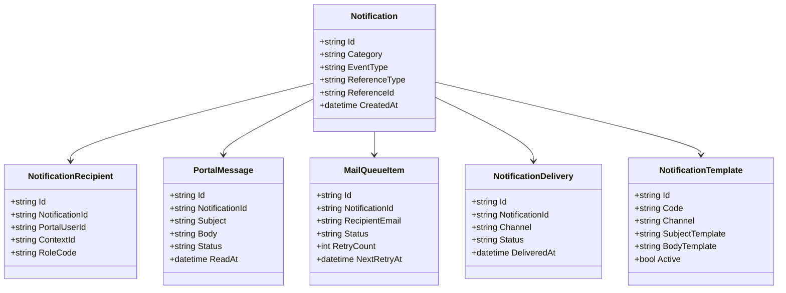
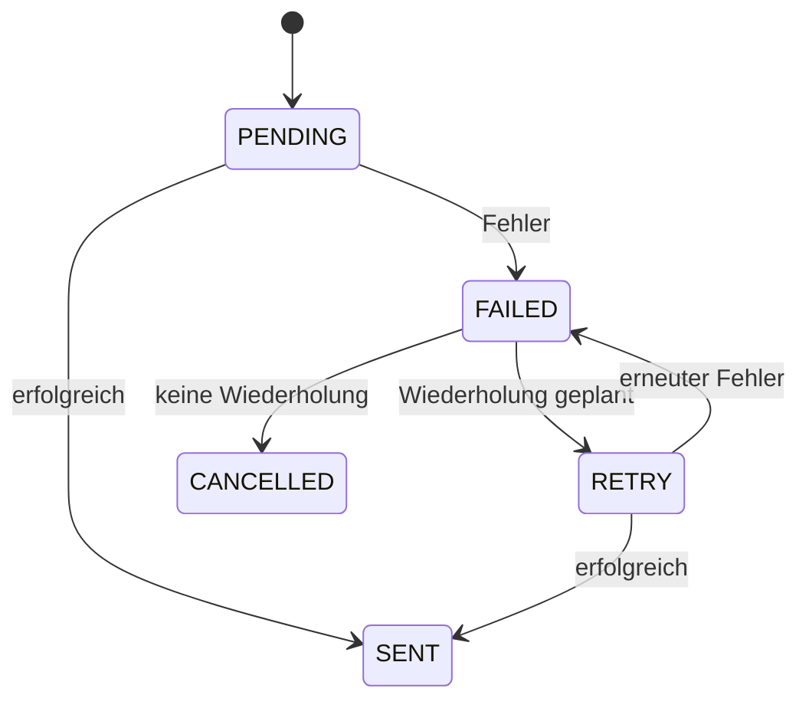
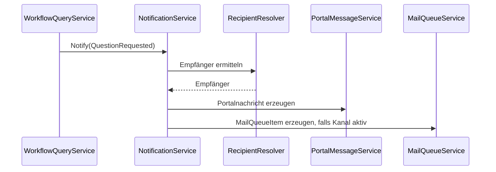
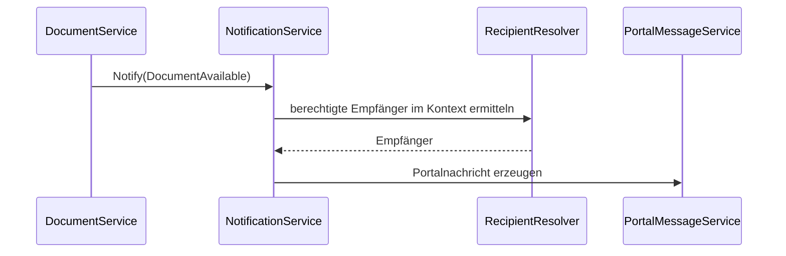
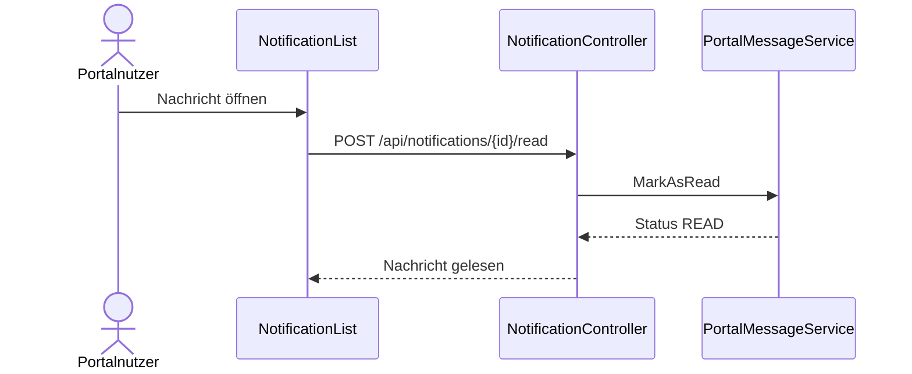

# Domäne Notification

| Feld | Wert |
|---|---|
| Kapitel | 03 – Domänen |
| Dokument | Notification |
| Status | Konsolidierter Arbeitsstand |
| Typ | Neuentwicklung |
| Priorität | Hoch |
| Leitquellen | `Quellen/2026-07-05_Snapshot1.txt`, `Quellen/2026-05_28_Lastenheft_SportFM.pdf` |

---

## 1 Zweck

Die Domäne **Notification** stellt Benachrichtigungen für Portalnutzer, interne Sachbearbeitung und technische Folgeprozesse bereit.

Sie verarbeitet fachliche Ereignisse aus Application, Workflow, Document, Invoice, Organisation, Authentication und Administration und erzeugt daraus Portalnachrichten, E-Mail-Aufträge und Hinweise für Dashboard und Arbeitskorb.

Notification ist keine Workflow-Engine und keine Fachdomäne für Anträge, Buchungen, Rechnungen oder Dokumente.

---

## 2 Projektbewertung

| Bereich | Bestand | Erweiterung | Neuentwicklung | Bewertung |
|---|:---:|:---:|:---:|---|
| Oracle |  | x | x | Nachrichten-, Queue- und Auditpersistenz erforderlich |
| PL/SQL |  | x | x | Package / API für Nachrichten und Versandstatus zu prüfen |
| REST |  |  | x | neue Notification-API |
| DTO |  |  | x | neue Vertragsobjekte |
| Portal |  |  | x | Nachrichtenliste, Benachrichtigungen, Einstellungen |
| Dashboard |  | x |  | ungelesene Nachrichten und Hinweise |
| Workflow |  | x |  | Rückfragen, Aufgaben, Entscheidungen |
| Tests |  |  | x | Ereignis-, Queue-, Versand- und Berechtigungstests |

---

## 3 Abgrenzung

### 3.1 Verantwortlich

Notification ist verantwortlich für:

- Portalnachrichten,
- ungelesene Nachrichten,
- Benachrichtigungskategorien,
- Empfängerermittlung auf Basis von Ereignissen,
- E-Mail-Aufträge,
- Versandstatus,
- Wiederholversuche,
- Nachrichtenvorlagen, soweit V1 vorgesehen,
- Dashboard-Zusammenfassung,
- Benachrichtigungseinstellungen,
- Protokollierung relevanter Benachrichtigungen.

### 3.2 Nicht verantwortlich

Notification ist nicht verantwortlich für:

- Workflowstatus,
- Antragserstellung,
- Buchungserstellung,
- Gebührenberechnung,
- Rechnungserstellung,
- Dokumentengenerierung,
- Benutzerregistrierung,
- Mitgliedschaftsfreigabe,
- fachliche Entscheidung über Genehmigung oder Ablehnung.

Diese Entscheidungen werden durch die jeweiligen Domänen getroffen. Notification informiert nur über Ereignisse.

---

## 4 Architekturgrundsatz

Notification arbeitet ereignisbasiert und möglichst entkoppelt.

```text
Fachdomäne
  ↓
Domain Event
  ↓
NotificationService
  ↓
PortalMessage / MailQueue
  ↓
Dashboard / Mailversand
```

Fachdomänen versenden keine E-Mails direkt. Sie erzeugen Ereignisse oder rufen definierte Notification-Services auf.

---

## 5 Fachlicher Grundsatz

Eine Benachrichtigung ist immer eine Folge eines fachlichen Ereignisses.

Beispiele:

- Antrag wurde eingereicht,
- Rückfrage wurde gestellt,
- Rückfrage wurde beantwortet,
- Antrag wurde genehmigt,
- Antrag wurde abgelehnt,
- neues Dokument liegt vor,
- Rechnung ist verfügbar,
- Mitgliedschaft wurde beantragt,
- Mitgliedschaft wurde freigegeben,
- Passwort-Reset wurde angefordert.

---

## 6 Einordnung in die Plattform

```text
Application / Workflow / Document / Invoice / Organisation / Authentication
  ↓
Notification
  ↓
PortalUser / Dashboard / E-Mail
```

Notification ist Querschnittsdomäne, aber fachlich relevant, weil viele Portalprozesse ohne Benachrichtigung nicht vollständig nutzbar sind.

---

## 7 Benachrichtigungskanäle

| Kanal | Beschreibung | V1-Bewertung |
|---|---|---|
| `PORTAL` | Nachricht im Portal | V1 |
| `EMAIL` | Versand per E-Mail bzw. MailQueue | V1 / abhängig von Infrastruktur |
| `DASHBOARD` | Zusammenfassung im Dashboard | V1 |
| `PUSH` | Push-Benachrichtigung | nicht V1 |
| `SMS` | SMS-Benachrichtigung | nicht V1 |

---

## 8 Benachrichtigungskategorien

| Kategorie | Auslöser | Zielgruppe |
|---|---|---|
| `APPLICATION` | Antrag erstellt, eingereicht, geändert | Antragsteller / Sachbearbeitung |
| `WORKFLOW` | Rückfrage, Aufgabe, Genehmigung, Ablehnung | Antragsteller / Sachbearbeitung |
| `DOCUMENT` | neues Dokument verfügbar | Kontextberechtigte Nutzer |
| `INVOICE` | Rechnung verfügbar / offen | Rechnungsleser |
| `ORGANISATION` | Mitgliedschaft beantragt / freigegeben | Org-Admins / Nutzer |
| `AUTHENTICATION` | Registrierung, Passwortreset, Sicherheitsereignis | Portalnutzer |
| `ADMINISTRATION` | administrative Änderung, Sperre | Admin / Betroffene |
| `SYSTEM` | technische oder organisatorische Hinweise | definierte Empfänger |

---

## 9 Business Objects

| Objekt | Zweck | Persistenz |
|---|---|---|
| `Notification` | fachliche Benachrichtigung | neue Persistenz |
| `PortalMessage` | Nachricht im Portal | neue Persistenz |
| `NotificationRecipient` | Empfänger einer Nachricht | neue Persistenz |
| `NotificationTemplate` | Textvorlage | neue / vorhandene Persistenz zu prüfen |
| `MailQueueItem` | E-Mail-Auftrag | neue / vorhandene Persistenz zu prüfen |
| `NotificationDelivery` | Versandstatus je Kanal | neue Persistenz |
| `NotificationPreference` | Benachrichtigungseinstellungen | mit PortalUser abstimmen |
| `NotificationAudit` | Protokoll | neue / Logging-Persistenz |

### 9.1 Klassendiagramm



---

## 10 Statusmodelle

### 10.1 PortalMessage-Status

| Status | Bedeutung |
|---|---|
| `UNREAD` | Nachricht ist ungelesen |
| `READ` | Nachricht wurde gelesen |
| `ARCHIVED` | Nachricht wurde archiviert |
| `DELETED` | Nachricht wurde ausgeblendet / gelöscht, Löschkonzept zu klären |

### 10.2 MailQueue-Status

| Status | Bedeutung |
|---|---|
| `PENDING` | E-Mail-Auftrag wartet auf Versand |
| `SENT` | erfolgreich versendet |
| `FAILED` | Versand fehlgeschlagen |
| `RETRY` | erneuter Versuch geplant |
| `CANCELLED` | Versand abgebrochen |

### 10.3 Zustandsdiagramm MailQueue



---

## 11 Fachliche Regeln

| ID | Regel |
|---|---|
| NOT-BR-001 | Fachdomänen versenden keine E-Mails direkt. |
| NOT-BR-002 | Benachrichtigungen entstehen aus fachlichen Ereignissen oder definierten Serviceaufrufen. |
| NOT-BR-003 | Portalnachrichten werden kontextbezogen sichtbar gemacht. |
| NOT-BR-004 | E-Mail-Versand darf fachliche Transaktionen nicht blockieren. |
| NOT-BR-005 | Fehler beim E-Mail-Versand dürfen den fachlichen Antrag nicht zurückrollen, wenn der Fachvorgang bereits erfolgreich abgeschlossen ist. |
| NOT-BR-006 | Rückfragen aus Workflow erzeugen eine Portalnachricht und optional eine E-Mail. |
| NOT-BR-007 | Rechnungs- und Dokumentbenachrichtigungen dürfen nur an berechtigte Empfänger gehen. |
| NOT-BR-008 | Pflichtbenachrichtigungen dürfen nicht durch persönliche Einstellungen deaktiviert werden, falls fachlich vorgeschrieben. |
| NOT-BR-009 | Jede Versandentscheidung muss nachvollziehbar sein. |
| NOT-BR-010 | Templates dürfen keine Geschäftslogik enthalten. |
| NOT-BR-011 | personenbezogene Inhalte in Benachrichtigungen sind auf das notwendige Maß zu begrenzen. |

---

## 12 Standardabläufe

### 12.1 Portalnachricht erzeugen

```text
Fachdomäne erzeugt Ereignis
  ↓
NotificationService ermittelt Kategorie
  ↓
Empfänger werden ermittelt
  ↓
PortalMessage wird gespeichert
  ↓
Dashboard zeigt ungelesene Nachricht
```

### 12.2 E-Mail-Auftrag erzeugen

```text
Notification entsteht
  ↓
Template wird ausgewählt
  ↓
Empfängeradresse wird ermittelt
  ↓
MailQueueItem wird gespeichert
  ↓
Mailversand verarbeitet Queue asynchron
  ↓
Versandstatus wird aktualisiert
```

### 12.3 Rückfrage im Workflow

```text
Sachbearbeiter stellt Rückfrage
  ↓
Workflow erzeugt QuestionRequested
  ↓
Notification erzeugt Portalnachricht
  ↓
optional MailQueueItem
  ↓
Antragsteller sieht Nachricht im Portal / Dashboard
```

---

## 13 Sequenzdiagramme

### 13.1 Workflow-Rückfrage



### 13.2 Dokument verfügbar



### 13.3 Nachricht lesen



---

## 14 REST-API

| ID | Methode | Pfad | Zweck |
|---|---|---|---|
| NOT-API-001 | `GET` | `/api/notifications` | eigene Portalnachrichten lesen |
| NOT-API-002 | `GET` | `/api/notifications/unread-count` | Anzahl ungelesener Nachrichten lesen |
| NOT-API-003 | `GET` | `/api/notifications/{id}` | Nachricht lesen |
| NOT-API-004 | `POST` | `/api/notifications/{id}/read` | Nachricht als gelesen markieren |
| NOT-API-005 | `POST` | `/api/notifications/{id}/archive` | Nachricht archivieren |
| NOT-API-006 | `GET` | `/api/notification-preferences` | eigene Einstellungen lesen |
| NOT-API-007 | `PUT` | `/api/notification-preferences` | eigene Einstellungen speichern |
| NOT-API-008 | `POST` | `/api/internal/notifications` | interne Erzeugung durch Domänen, nicht öffentlich |
| NOT-API-009 | `GET` | `/api/admin/notifications/mail-queue` | MailQueue administrativ lesen |
| NOT-API-010 | `POST` | `/api/admin/notifications/mail-queue/{id}/retry` | Mailversand erneut versuchen |

Interne Endpunkte sind nicht für Portalnutzer freizugeben.

---

## 15 DTOs

### 15.1 `NotificationDto`

| Feld | Typ | Pflicht |
|---|---|:---:|
| `id` | string | ja |
| `category` | string | ja |
| `eventType` | string | ja |
| `referenceType` | string | nein |
| `referenceId` | string | nein |
| `createdAt` | datetime | ja |

### 15.2 `PortalMessageDto`

| Feld | Typ | Pflicht |
|---|---|:---:|
| `id` | string | ja |
| `subject` | string | ja |
| `body` | string | ja |
| `status` | string | ja |
| `category` | string | ja |
| `referenceType` | string | nein |
| `referenceId` | string | nein |
| `createdAt` | datetime | ja |
| `readAt` | datetime | nein |

### 15.3 `NotificationPreferenceDto`

| Feld | Typ | Pflicht |
|---|---|:---:|
| `category` | string | ja |
| `channel` | string | ja |
| `enabled` | boolean | ja |
| `mandatory` | boolean | ja |

### 15.4 `CreateNotificationDto`

| Feld | Typ | Pflicht |
|---|---|:---:|
| `eventType` | string | ja |
| `category` | string | ja |
| `referenceType` | string | nein |
| `referenceId` | string | nein |
| `contextId` | string | nein |
| `recipientHints` | array | nein |
| `payload` | object | nein |

### 15.5 `MailQueueItemDto`

| Feld | Typ | Pflicht |
|---|---|:---:|
| `id` | string | ja |
| `recipientEmail` | string | ja |
| `subject` | string | ja |
| `status` | string | ja |
| `retryCount` | int | ja |
| `nextRetryAt` | datetime | nein |
| `createdAt` | datetime | ja |

---

## 16 Services

| Service | Verantwortung |
|---|---|
| `NotificationService` | zentrale Erzeugung und Orchestrierung |
| `PortalMessageService` | Portalnachrichten lesen, erzeugen, Status ändern |
| `MailQueueService` | E-Mail-Aufträge erzeugen und Status verwalten |
| `RecipientResolverService` | Empfänger anhand Kontext, Rollen und Ereignis ermitteln |
| `NotificationTemplateService` | Vorlagen auswählen und rendern |
| `NotificationPreferenceService` | Einstellungen lesen und anwenden |
| `NotificationDeliveryService` | Versandstatus je Kanal verwalten |
| `NotificationAuditService` | Erzeugung und Versand protokollieren |

---

## 17 Repository

| Repository | Zweck |
|---|---|
| `NotificationRepository` | Notification lesen / speichern |
| `PortalMessageRepository` | Portalnachrichten lesen / speichern |
| `MailQueueRepository` | MailQueue lesen / speichern |
| `NotificationTemplateRepository` | Vorlagen lesen |
| `NotificationPreferenceRepository` | Einstellungen lesen / speichern |
| `NotificationAuditRepository` | Audit schreiben / lesen |

Repositories enthalten keine Geschäftslogik.

---

## 18 Oracle und PL/SQL

### 18.1 Neue / zu prüfende Persistenz

| Objekt | Zweck | Status |
|---|---|---|
| `LHD_SPA_NOTIFICATIONS` | fachliche Benachrichtigungen | zu prüfen / voraussichtlich neu |
| `LHD_SPA_PORTAL_MESSAGES` | Portalnachrichten | zu prüfen / voraussichtlich neu |
| `LHD_SPA_NOTIFICATION_RECIPIENTS` | Empfänger | zu prüfen / voraussichtlich neu |
| `LHD_SPA_NOTIFICATION_TEMPLATES` | Vorlagen | zu prüfen / ggf. bestehende Textbausteine nutzen |
| `LHD_SPA_MAIL_QUEUE` | E-Mail-Aufträge | zu prüfen / voraussichtlich neu oder vorhandene MailQueue nutzen |
| `LHD_SPA_NOTIFICATION_DELIVERIES` | Versandstatus | zu prüfen / voraussichtlich neu |
| `LHD_SPA_NOTIFICATION_PREFS` | Benachrichtigungseinstellungen | mit PortalUser abstimmen |
| `LHD_SPA_NOTIFICATION_AUDIT` | Benachrichtigungsaudit | zu prüfen / Logging nutzen |

### 18.2 Package-Zuordnung

| Package | Zweck | Status |
|---|---|---|
| `PA_LHD_SPA_NOTIFICATION` | Benachrichtigungen und Portalnachrichten | vorgeschlagene Zielstruktur, noch zu bestätigen |
| `PA_LHD_SPA_MAIL_QUEUE` | E-Mail-Aufträge und Versandstatus | vorgeschlagene Zielstruktur, noch zu bestätigen |
| `PA_LHD_SPA_NOTIFICATION_PREFS` | Benachrichtigungseinstellungen | vorgeschlagene Zielstruktur, noch zu bestätigen |

---

## 19 Blazor-Frontend

### 19.1 Seiten

| ID | Seite | Route | Zweck |
|---|---|---|---|
| NOT-PAGE-001 | Nachrichten | `/notifications` | eigene Portalnachrichten anzeigen |
| NOT-PAGE-002 | Nachricht anzeigen | `/notifications/{id}` | Detailansicht |
| NOT-PAGE-003 | Benachrichtigungseinstellungen | `/account/notifications` | persönliche Einstellungen |
| NOT-PAGE-004 | MailQueue Admin | `/admin/notifications/mail-queue` | administrativ, falls V1 |

### 19.2 Komponenten

| Komponente | Zweck |
|---|---|
| `NotificationBell` | ungelesene Nachrichten im Header |
| `NotificationList` | Nachrichtenliste |
| `NotificationCard` | einzelne Nachricht |
| `NotificationDetail` | Detailansicht |
| `UnreadBadge` | Anzahl ungelesener Nachrichten |
| `NotificationPreferenceList` | Einstellungen |
| `MailQueueGrid` | administrative Queueansicht |
| `RetryMailButton` | Wiederholung auslösen |

---

## 20 Berechtigungen

| Berechtigung | Zweck |
|---|---|
| `Notification.ReadSelf` | eigene Nachrichten lesen |
| `Notification.MarkReadSelf` | eigene Nachrichten als gelesen markieren |
| `Notification.ArchiveSelf` | eigene Nachrichten archivieren |
| `Notification.Preferences.ReadSelf` | eigene Einstellungen lesen |
| `Notification.Preferences.UpdateSelf` | eigene Einstellungen ändern |
| `Notification.Admin.Read` | Benachrichtigungen administrativ lesen |
| `Notification.MailQueue.Read` | MailQueue lesen |
| `Notification.MailQueue.Retry` | Mailversand erneut starten |
| `Notification.Internal.Create` | interne Erzeugung durch Domänenservices |

---

## 21 Validierungen

| ID | Validierung | Ebene |
|---|---|---|
| NOT-VAL-001 | Empfänger vorhanden | RecipientResolver |
| NOT-VAL-002 | Empfänger im Kontext berechtigt | Context / Organisation |
| NOT-VAL-003 | Nachricht gehört zum Benutzer | PortalMessage |
| NOT-VAL-004 | Template existiert | TemplateService |
| NOT-VAL-005 | Kanal ist zulässig | NotificationService |
| NOT-VAL-006 | Pflichtbenachrichtigung darf nicht deaktiviert werden | PreferenceService |
| NOT-VAL-007 | E-Mail-Adresse vorhanden und gültig | MailQueueService |
| NOT-VAL-008 | Retry nur bei fehlgeschlagenem oder vorgesehenem Status | MailQueueService |
| NOT-VAL-009 | interne Erzeugung nur durch berechtigte Services | Authorization |

---

## 22 Testfälle

| Testfall | Beschreibung |
|---|---|
| TF-NOT-001 | Portalnachricht erzeugen |
| TF-NOT-002 | ungelesene Nachrichten zählen |
| TF-NOT-003 | Nachricht lesen |
| TF-NOT-004 | Nachricht als gelesen markieren |
| TF-NOT-005 | fremde Nachricht nicht lesen |
| TF-NOT-006 | Rückfrage erzeugt Benachrichtigung |
| TF-NOT-007 | Genehmigung erzeugt Benachrichtigung |
| TF-NOT-008 | Dokument verfügbar erzeugt Benachrichtigung |
| TF-NOT-009 | Rechnung verfügbar erzeugt Benachrichtigung |
| TF-NOT-010 | MailQueueItem erzeugen |
| TF-NOT-011 | Mailversandfehler führt zu Retry |
| TF-NOT-012 | Pflichtbenachrichtigung kann nicht deaktiviert werden |
| TF-NOT-013 | Dashboard zeigt ungelesene Nachrichten |
| TF-NOT-014 | Empfängerermittlung berücksichtigt Kontext |

---

## 23 Arbeitspakete

| AP | Titel | Inhalt |
|---|---|---|
| AP-NOT-001 | Notification-Modell | Notification, PortalMessage, MailQueue, Delivery |
| AP-NOT-002 | Oracle-Konzept | Tabellenprüfung, neue Tabellen, Package-Zuordnung |
| AP-NOT-003 | REST | Controller, DTOs, Fehlerformat |
| AP-NOT-004 | NotificationService | zentrale Erzeugung und Orchestrierung |
| AP-NOT-005 | RecipientResolver | Empfänger über Kontext / Rollen |
| AP-NOT-006 | PortalMessageService | Portalnachrichten |
| AP-NOT-007 | MailQueueService | E-Mail-Aufträge und Versandstatus |
| AP-NOT-008 | TemplateService | Vorlagen / Textbausteine |
| AP-NOT-009 | PreferenceService | Einstellungen |
| AP-NOT-010 | Integration | Application, Workflow, Document, Invoice, Organisation, Authentication |
| AP-NOT-011 | Portal | Nachrichtenseiten, Glocke, Einstellungen |
| AP-NOT-012 | Tests | Unit-, Integrations-, Queue- und UI-Tests |
| AP-NOT-013 | Dokumentation | API, Ereignisse, Betriebshinweise |

---

## 24 Aufwandstreiber

| Treiber | Einfluss |
|---|---|
| Anzahl Ereignisse | hoch |
| Empfängerermittlung über Kontext und Rollen | sehr hoch |
| MailQueue und Retry-Verhalten | hoch |
| Templates und Textbausteine | mittel bis hoch |
| Benachrichtigungseinstellungen | mittel |
| Dashboard-Integration | mittel |
| Datenschutz bei Nachrichtentexten | hoch |
| administrative Queueansicht | mittel |
| Tests für Ereignisse und Fehlerfälle | hoch |

Konkrete Personentage werden erst nach finaler Ereignis-, Template-, Kanal- und Empfängermatrix festgelegt.

---

## 25 Risiken

| Risiko | Bewertung | Maßnahme |
|---|---|---|
| Fachdomänen versenden E-Mails direkt | hoch | Notification als verpflichtende Schnittstelle |
| Empfängerermittlung falsch | sehr hoch | Context- und Rollenmatrix verwenden |
| Benachrichtigungen blockieren Fachprozesse | hoch | MailQueue asynchron |
| personenbezogene Daten in E-Mails zu umfangreich | hoch | Template- und Datenschutzprüfung |
| Pflichtbenachrichtigungen deaktiviert | mittel | Mandatory-Flag |
| Nachrichtenflut | mittel | Kategorien, Präferenzen und Begrenzungen |
| MailQueue-Betrieb unklar | hoch | Betriebskonzept ergänzen |

---

## 26 Offene Punkte

| ID | Offener Punkt | Relevanz |
|---|---|---|
| OP-NOT-001 | finale Benachrichtigungskanäle V1 | hoch |
| OP-NOT-002 | finale Ereignismatrix | sehr hoch |
| OP-NOT-003 | finale Empfängermatrix je Ereignis | sehr hoch |
| OP-NOT-004 | vorhandene Mail-Infrastruktur / MailQueue | hoch |
| OP-NOT-005 | Vorlagenpflege über Admin-UI oder technisch | mittel bis hoch |
| OP-NOT-006 | Pflichtbenachrichtigungen je Kategorie | hoch |
| OP-NOT-007 | Datenschutzvorgaben für E-Mail-Inhalte | hoch |
| OP-NOT-008 | Aufbewahrungs- und Löschregeln für Nachrichten | hoch |
| OP-NOT-009 | finale Oracle-/Package-Zuordnung | hoch |

---

## 27 Traceability-Matrix

| Quelle | Funktion | REST | Service | UI | Test | AP |
|---|---|---|---|---|---|---|
| Workflow.md | Rückfrage benachrichtigen | NOT-API-008 | NotificationService | NotificationBell | TF-NOT-006 | AP-NOT-010 |
| Application.md | Antrag eingereicht | NOT-API-008 | NotificationService | NotificationList | TF-NOT-001 | AP-NOT-010 |
| Document.md | neues Dokument | NOT-API-008 | NotificationService | DocumentsCard / NotificationList | TF-NOT-008 | AP-NOT-010 |
| Invoice.md | Rechnung verfügbar | NOT-API-008 | NotificationService | InvoicesCard / NotificationList | TF-NOT-009 | AP-NOT-010 |
| PortalUser.md | Einstellungen | NOT-API-006/007 | PreferenceService | NotificationPreferenceList | TF-NOT-012 | AP-NOT-009 |
| Dashboard.md | ungelesene Nachrichten | NOT-API-002 | PortalMessageService | NotificationBell | TF-NOT-013 | AP-NOT-006/011 |
| Context.md | Empfänger im Kontext | intern | RecipientResolverService | n/a | TF-NOT-014 | AP-NOT-005 |

---

## 28 Änderungsauswirkungen

Änderungen an `Notification.md` wirken sich aus auf:

- `03_Domaenen/Application.md`,
- `03_Domaenen/Workflow.md`,
- `03_Domaenen/Document.md`,
- `03_Domaenen/Invoice.md`,
- `03_Domaenen/Organisation.md`,
- `03_Domaenen/Authentication.md`,
- `03_Domaenen/PortalUser.md`,
- `03_Domaenen/Dashboard.md`,
- `03_Domaenen/Administration.md`,
- `04_REST_API/Endpunkte.md`,
- `04_REST_API/DTOs.md`,
- `05_Datenmodell/Tabellen.md`,
- `05_Datenmodell/Packages.md`,
- `06_Arbeitspakete/Arbeitspaketliste.md`,
- `07_Kalkulation/Aufwandsschaetzung.md`,
- `09_Testkonzept/Testfaelle.md`,
- `10_Betrieb/Mail_und_Queue.md`,
- `12_Offene_Punkte/Offene_Punkte.md`.

---

## 29 Ergebnis

Die Domäne Notification ist als ereignisbasierte Benachrichtigungsdomäne spezifiziert.

Sie erzeugt Portalnachrichten, MailQueue-Aufträge, Versandstatus und Dashboard-Zusammenfassungen, ohne Fachlogik anderer Domänen zu übernehmen.

Die konkrete Kalkulation bleibt abhängig von:

- finaler Ereignismatrix,
- finaler Empfängermatrix,
- gewählten Kanälen V1,
- vorhandener Mail-Infrastruktur,
- Template- und Textbausteinkonzept,
- Datenschutz- und Aufbewahrungsregeln,
- bestätigter Oracle-Zuordnung.
