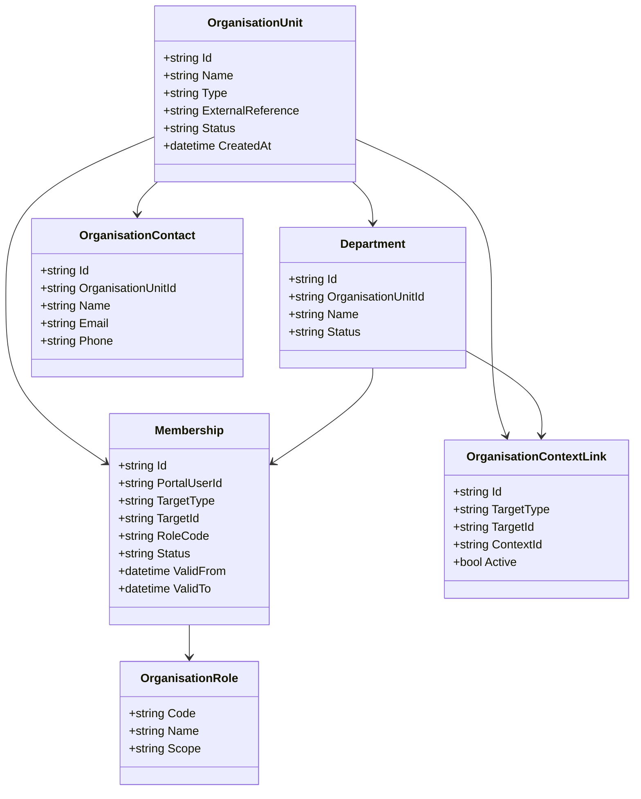
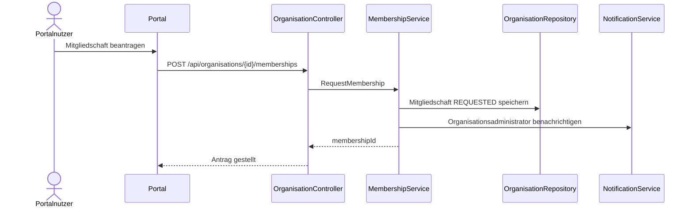
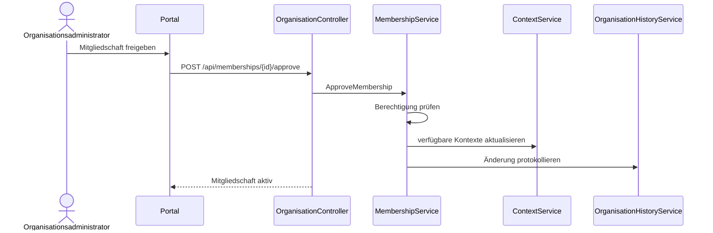
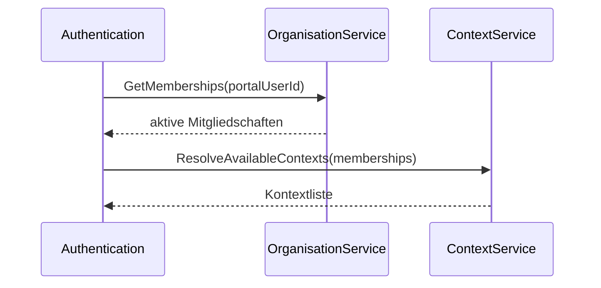

# Domäne Organisation

| Feld | Wert |
|---|---|
| Kapitel | 03 – Domänen |
| Dokument | Organisation |
| Status | Konsolidierter Arbeitsstand |
| Typ | Neuentwicklung / Erweiterung |
| Priorität | Sehr hoch |
| Leitquellen | `Quellen/2026-07-05_Snapshot1.txt`, `Quellen/2026-05_28_Lastenheft_SportFM.pdf` |

---

## 1 Zweck

Die Domäne **Organisation** verwaltet die organisatorischen Einheiten, in deren Namen Portalnutzer Anträge stellen, Buchungen einsehen, Dokumente abrufen und Rechnungen zugeordnet bekommen.

Sie bildet insbesondere Vereine, Schulen, Kitas, Firmen, Institutionen, Abteilungen und Mitgliedschaften ab.

Organisation ist eine zentrale neue Plattformdomäne, weil das Portal nicht nur Einzelpersonen, sondern auch Organisationen und deren Untergliederungen unterstützen muss.

---

## 2 Projektbewertung

| Bereich | Bestand | Erweiterung | Neuentwicklung | Bewertung |
|---|:---:|:---:|:---:|---|
| Oracle |  | x | x | bestehende Stammdaten prüfen, Portalmodell ergänzen |
| PL/SQL |  | x | x | Package / API für Organisationen und Mitgliedschaften erforderlich |
| REST |  |  | x | neue fachliche Organisations-API |
| DTO |  |  | x | neue Vertragsobjekte |
| Portal |  |  | x | Organisationsverwaltung und Kontextauswahl |
| Context |  | x |  | enge Kopplung an SportFM-Kontext |
| Authentication |  | x |  | Portalnutzer werden über Mitgliedschaften zugeordnet |
| Tests |  |  | x | neue Tests erforderlich |

---

## 3 Abgrenzung

### 3.1 Verantwortlich

Organisation ist verantwortlich für:

- Organisationseinheiten,
- Abteilungen,
- Mitgliedschaften,
- Rollen innerhalb einer Organisation,
- Rollen innerhalb einer Abteilung,
- Organisationsstammdaten,
- Ansprechpartner,
- Rechnungsadressaten als fachliche Zuordnung,
- Verknüpfung mit SportFM-Kontext,
- Sichtbarkeitsgrundlage für Anträge, Dokumente, Buchungen und Rechnungen.

### 3.2 Nicht verantwortlich

Organisation ist nicht verantwortlich für:

- Login,
- Passwort,
- Tokens,
- technische Authentifizierung,
- konkrete Berechtigungsentscheidung im Einzelfall,
- Antragserstellung,
- Buchungslogik,
- Gebührenberechnung,
- Rechnungserstellung,
- Dokumentengenerierung.

Diese Funktionen liegen in Authentication, Context, Application, Booking, Charge, Invoice und Document.

---

## 4 Architekturgrundsatz

Portalnutzer werden nicht direkt und dauerhaft als einzelne Nutzer mit allen Fachdaten verknüpft.

Die fachliche Zuordnung erfolgt über **Mitgliedschaften**.

```text
PortalUser
  ↓
Membership
  ↓
OrganisationUnit / Department
  ↓
SportFMContext
```

Damit kann ein Benutzer mehrere Rollen in mehreren Organisationen oder Abteilungen besitzen.

---

## 5 Fachlicher Grundsatz

Eine Organisationseinheit kann einen eigenen SportFM-Kontext besitzen.

Eine Abteilung kann ebenfalls einen eigenen SportFM-Kontext besitzen, wenn sie fachlich eigenständig Anträge, Buchungen, Dokumente oder Rechnungen verwalten soll.

Die Entscheidung, ob eine Abteilung einen eigenen SportFM-Kontext besitzt, wird fachlich konfiguriert.

---

## 6 Einordnung in die Plattform

```text
Authentication
  ↓
PortalUser
  ↓
Organisation
  ↓
Membership
  ↓
Context
  ↓
Application / Booking / Document / Invoice
```

Organisation liefert die fachliche Struktur.

Context entscheidet, welcher konkrete Berechtigungs- und Sichtbarkeitsraum aktiv ist.

---

## 7 Organisationstypen

Mindestens zu berücksichtigen sind:

| Organisationstyp | Beschreibung |
|---|---|
| `CLUB` | Verein |
| `SCHOOL` | Schule |
| `KITA` | Kindertageseinrichtung |
| `COMPANY` | Firma |
| `INSTITUTION` | Institution / Behörde |
| `PRIVATE` | Einzelperson / privater Antragsteller, falls fachlich vorgesehen |
| `OTHER` | sonstige Organisation |

Die finale Typenliste ist fachlich zu bestätigen.

---

## 8 Organisationsstruktur

### 8.1 Strukturmodell

```text
OrganisationUnit
  ├─ Department
  │   ├─ Membership
  │   └─ optional SportFMContext
  ├─ Membership
  └─ SportFMContext
```

### 8.2 Beispiele

```text
Verein A
  ├─ Abteilung Fußball
  ├─ Abteilung Handball
  └─ Abteilung Leichtathletik
```

```text
Schule B
  └─ Sportbetrieb / Sportunterricht
```

```text
Firma C
  └─ Anmietung Dritter
```

---

## 9 Business Objects

| Objekt | Zweck | Persistenz |
|---|---|---|
| `OrganisationUnit` | fachliche Organisation | neue / erweiterte Persistenz |
| `Department` | Untereinheit einer Organisation | neue Persistenz |
| `Membership` | Zuordnung Portalnutzer zu Organisation oder Abteilung | neue Persistenz |
| `OrganisationRole` | Rolle innerhalb Organisation | neue Persistenz / Konfiguration |
| `OrganisationContact` | Ansprechpartnerdaten | neue / erweiterte Persistenz |
| `OrganisationAddress` | Anschrift | neue / erweiterte Persistenz |
| `OrganisationVerification` | Prüfung / Freigabe einer Organisation | neue Persistenz |
| `OrganisationContextLink` | Verknüpfung mit SportFM-Kontext | neue Persistenz |

### 9.1 Klassendiagramm



---

## 10 Mitgliedschaften

### 10.1 Zweck

Mitgliedschaften verbinden Portalnutzer mit Organisationen oder Abteilungen.

Die Mitgliedschaft trägt die fachliche Rolle des Nutzers im jeweiligen Kontext.

### 10.2 Mitgliedschaftsziele

| Zieltyp | Beschreibung |
|---|---|
| `ORGANISATION` | Mitgliedschaft direkt an Organisationseinheit |
| `DEPARTMENT` | Mitgliedschaft an Abteilung |

### 10.3 Mitgliedschaftsstatus

| Status | Bedeutung |
|---|---|
| `REQUESTED` | Mitgliedschaft beantragt |
| `ACTIVE` | aktiv |
| `REJECTED` | abgelehnt |
| `SUSPENDED` | gesperrt |
| `EXPIRED` | abgelaufen |
| `REMOVED` | entfernt |

---

## 11 Rollen innerhalb Organisation

| Rolle | Scope | Beschreibung |
|---|---|---|
| `ORG_ADMIN` | Organisation | verwaltet Organisation und Mitgliedschaften |
| `DEPT_ADMIN` | Abteilung | verwaltet Abteilung und deren Mitglieder |
| `APPLICANT` | Organisation / Abteilung | darf Anträge stellen |
| `MEMBER` | Organisation / Abteilung | einfache Mitgliedschaft |
| `DOCUMENT_READER` | Organisation / Abteilung | darf Dokumente lesen |
| `INVOICE_READER` | Organisation / Abteilung | darf Rechnungen lesen |
| `BOOKING_READER` | Organisation / Abteilung | darf Buchungen lesen |

Die finale Rollenliste ist mit Benutzerrollen und Berechtigungskonzept abzugleichen.

---

## 12 Fachliche Regeln

| ID | Regel |
|---|---|
| ORG-BR-001 | Eine Organisationseinheit besitzt eine eindeutige Identität. |
| ORG-BR-002 | Eine Organisation kann mehrere Abteilungen besitzen. |
| ORG-BR-003 | Eine Abteilung gehört genau zu einer Organisation. |
| ORG-BR-004 | Ein Portalnutzer kann mehrere Mitgliedschaften besitzen. |
| ORG-BR-005 | Mitgliedschaften sind kontext- und rollenrelevant. |
| ORG-BR-006 | Ein Antrag wird immer im aktiven SportFM-Kontext gestellt. |
| ORG-BR-007 | Ein Kontext kann auf Organisation oder Abteilung zeigen. |
| ORG-BR-008 | Dokumente, Rechnungen, Buchungen und Anträge werden kontextbezogen sichtbar. |
| ORG-BR-009 | Organisationsadministratoren dürfen nicht automatisch systemweite Rechte besitzen. |
| ORG-BR-010 | Änderungen an Mitgliedschaften werden historisiert. |
| ORG-BR-011 | Freigabeprozesse für Organisationen und Mitgliedschaften sind fachlich zu klären. |

---

## 13 Standardabläufe

### 13.1 Organisation anlegen

```text
Portalnutzer beantragt Organisation
  ↓
Organisationsdaten erfassen
  ↓
Prüfung / Freigabe
  ↓
Organisation aktivieren
  ↓
SportFM-Kontext erzeugen oder verknüpfen
  ↓
Antragstellung möglich
```

### 13.2 Abteilung anlegen

```text
ORG_ADMIN öffnet Organisation
  ↓
Abteilung anlegen
  ↓
optional eigenen SportFM-Kontext zuordnen
  ↓
Mitgliedschaften verwalten
```

### 13.3 Mitgliedschaft beantragen

```text
Portalnutzer sucht Organisation
  ↓
Mitgliedschaft beantragen
  ↓
ORG_ADMIN prüft
  ↓
Mitgliedschaft aktivieren oder ablehnen
```

### 13.4 Kontext wechseln

```text
Portalnutzer meldet sich an
  ↓
verfügbare Mitgliedschaften laden
  ↓
verfügbare Kontexte ableiten
  ↓
aktiven Kontext auswählen
  ↓
Application / Document / Invoice verwenden Kontext
```

---

## 14 Sequenzdiagramme

### 14.1 Mitgliedschaft beantragen



### 14.2 Mitgliedschaft freigeben



### 14.3 Kontext ableiten



---

## 15 REST-API

| ID | Methode | Pfad | Zweck |
|---|---|---|---|
| ORG-API-001 | `GET` | `/api/organisations` | Organisationen suchen / listen |
| ORG-API-002 | `POST` | `/api/organisations` | Organisation anlegen / beantragen |
| ORG-API-003 | `GET` | `/api/organisations/{id}` | Organisation lesen |
| ORG-API-004 | `PUT` | `/api/organisations/{id}` | Organisation bearbeiten |
| ORG-API-005 | `GET` | `/api/organisations/{id}/departments` | Abteilungen lesen |
| ORG-API-006 | `POST` | `/api/organisations/{id}/departments` | Abteilung anlegen |
| ORG-API-007 | `GET` | `/api/organisations/{id}/memberships` | Mitgliedschaften einer Organisation lesen |
| ORG-API-008 | `POST` | `/api/organisations/{id}/memberships` | Mitgliedschaft beantragen / anlegen |
| ORG-API-009 | `GET` | `/api/users/me/memberships` | eigene Mitgliedschaften lesen |
| ORG-API-010 | `POST` | `/api/memberships/{id}/approve` | Mitgliedschaft freigeben |
| ORG-API-011 | `POST` | `/api/memberships/{id}/reject` | Mitgliedschaft ablehnen |
| ORG-API-012 | `DELETE` | `/api/memberships/{id}` | Mitgliedschaft entfernen |
| ORG-API-013 | `GET` | `/api/organisations/{id}/contexts` | Kontexte einer Organisation lesen |

---

## 16 DTOs

### 16.1 `OrganisationDto`

| Feld | Typ | Pflicht |
|---|---|:---:|
| `id` | string | ja |
| `name` | string | ja |
| `type` | string | ja |
| `status` | string | ja |
| `externalReference` | string | nein |
| `address` | `AddressDto` | nein |
| `contacts` | array | nein |
| `contextId` | string | nein |

### 16.2 `DepartmentDto`

| Feld | Typ | Pflicht |
|---|---|:---:|
| `id` | string | ja |
| `organisationId` | string | ja |
| `name` | string | ja |
| `status` | string | ja |
| `contextId` | string | nein |

### 16.3 `MembershipDto`

| Feld | Typ | Pflicht |
|---|---|:---:|
| `id` | string | ja |
| `portalUserId` | string | ja |
| `targetType` | string | ja |
| `targetId` | string | ja |
| `roleCode` | string | ja |
| `status` | string | ja |
| `validFrom` | datetime | nein |
| `validTo` | datetime | nein |

### 16.4 `MembershipRequestDto`

| Feld | Typ | Pflicht |
|---|---|:---:|
| `targetType` | string | ja |
| `targetId` | string | ja |
| `requestedRole` | string | ja |
| `message` | string | nein |

---

## 17 Services

| Service | Verantwortung |
|---|---|
| `OrganisationService` | Organisationen lesen, anlegen, ändern |
| `DepartmentService` | Abteilungen lesen, anlegen, ändern |
| `MembershipService` | Mitgliedschaften beantragen, freigeben, ablehnen, entfernen |
| `OrganisationRoleService` | Rollen je Scope bereitstellen |
| `OrganisationContextService` | Verknüpfung mit Context koordinieren |
| `OrganisationValidationService` | Regeln und Pflichtdaten prüfen |
| `OrganisationHistoryService` | Änderungen historisieren |

---

## 18 Repository

| Repository | Zweck |
|---|---|
| `OrganisationRepository` | Organisationen lesen / speichern |
| `DepartmentRepository` | Abteilungen lesen / speichern |
| `MembershipRepository` | Mitgliedschaften lesen / speichern |
| `OrganisationRoleRepository` | Rollen / Konfiguration lesen |
| `OrganisationContextRepository` | Kontextverknüpfungen lesen / speichern |
| `OrganisationHistoryRepository` | Historie schreiben / lesen |

Repositories enthalten keine Geschäftslogik.

---

## 19 Oracle und PL/SQL

### 19.1 Bestandsprüfung

Bestehende Stammdatenquellen sind zu prüfen, insbesondere Organisationen / Vereine, Schulen, Kitas und externe Referenzen aus Schnittstellen wie DBOrg, Schuldatenbank Sachsen oder Kitaportal.

Organisation darf bestehende führende Stammdaten nicht ungeprüft duplizieren.

### 19.2 Neue / zu prüfende Persistenz

| Objekt | Zweck | Status |
|---|---|---|
| `LHD_SPA_ORGANISATIONS` | Organisationseinheiten | zu prüfen / voraussichtlich neu oder Mapping |
| `LHD_SPA_ORG_DEPARTMENTS` | Abteilungen | zu prüfen / voraussichtlich neu |
| `LHD_SPA_ORG_MEMBERSHIPS` | Mitgliedschaften | zu prüfen / voraussichtlich neu |
| `LHD_SPA_ORG_ROLES` | Organisationsrollen | zu prüfen / voraussichtlich neu |
| `LHD_SPA_ORG_CONTACTS` | Ansprechpartner | zu prüfen / voraussichtlich neu |
| `LHD_SPA_ORG_CONTEXTS` | Verknüpfung Organisation / Abteilung zu Kontext | zu prüfen / voraussichtlich neu |
| `LHD_SPA_ORG_HISTORY` | Historie | zu prüfen / voraussichtlich neu |

### 19.3 Package-Zuordnung

| Package | Zweck | Status |
|---|---|---|
| `PA_LHD_SPA_ORGANISATION` | Organisationen und Abteilungen | vorgeschlagene Zielstruktur, noch zu bestätigen |
| `PA_LHD_SPA_MEMBERSHIP` | Mitgliedschaften und Rollen | vorgeschlagene Zielstruktur, noch zu bestätigen |
| `PA_LHD_SPA_CONTEXT` | Kontextverknüpfung | abhängig von Context-Domäne |

---

## 20 Blazor-Frontend

### 20.1 Seiten

| ID | Seite | Route | Zweck |
|---|---|---|---|
| ORG-PAGE-001 | Meine Organisationen | `/organisations` | verfügbare Organisationen / Mitgliedschaften |
| ORG-PAGE-002 | Organisation anzeigen | `/organisations/{id}` | Organisationsdetails |
| ORG-PAGE-003 | Organisation beantragen | `/organisations/new` | neue Organisation erfassen |
| ORG-PAGE-004 | Abteilungen verwalten | `/organisations/{id}/departments` | Abteilungen |
| ORG-PAGE-005 | Mitglieder verwalten | `/organisations/{id}/memberships` | Mitgliedschaften |
| ORG-PAGE-006 | Mitgliedschaft beantragen | `/organisations/{id}/join` | Beitritt beantragen |
| ORG-PAGE-007 | Kontextauswahl | Bestandteil Header / Dashboard | aktiver Kontext |

### 20.2 Komponenten

| Komponente | Zweck |
|---|---|
| `OrganisationCard` | Organisation anzeigen |
| `OrganisationSearch` | Organisation suchen |
| `OrganisationForm` | Organisation erfassen / ändern |
| `DepartmentList` | Abteilungen anzeigen |
| `MembershipGrid` | Mitgliederliste |
| `MembershipRequestDialog` | Mitgliedschaft beantragen |
| `MembershipApprovalActions` | Freigeben / Ablehnen |
| `OrganisationRoleSelect` | Rolle auswählen |
| `ContextSelector` | aktiven Kontext auswählen |

---

## 21 Berechtigungen

| Berechtigung | Zweck |
|---|---|
| `Organisation.Read` | Organisation lesen |
| `Organisation.Create` | Organisation beantragen / anlegen |
| `Organisation.Update` | Organisation bearbeiten |
| `Organisation.Department.Read` | Abteilungen lesen |
| `Organisation.Department.Manage` | Abteilungen verwalten |
| `Organisation.Membership.Read` | Mitgliedschaften lesen |
| `Organisation.Membership.Request` | Mitgliedschaft beantragen |
| `Organisation.Membership.Approve` | Mitgliedschaft freigeben |
| `Organisation.Membership.Remove` | Mitgliedschaft entfernen |
| `Organisation.Context.Read` | Organisationskontext lesen |

Berechtigungen gelten immer im jeweiligen Kontext und Scope.

---

## 22 Validierungen

| ID | Validierung | Ebene |
|---|---|---|
| ORG-VAL-001 | Organisationsname vorhanden | Organisation |
| ORG-VAL-002 | Organisationstyp gültig | Organisation |
| ORG-VAL-003 | Abteilung gehört zur Organisation | Department |
| ORG-VAL-004 | Mitgliedschaftsziel existiert | Membership |
| ORG-VAL-005 | Rolle für Scope zulässig | Membership |
| ORG-VAL-006 | doppelte aktive Mitgliedschaft verhindern | Membership |
| ORG-VAL-007 | Benutzer darf Mitgliedschaft freigeben | Membership |
| ORG-VAL-008 | Kontextverknüpfung eindeutig | Context |
| ORG-VAL-009 | externe Referenz eindeutig, falls vorhanden | Organisation |

---

## 23 Testfälle

| Testfall | Beschreibung |
|---|---|
| TF-ORG-001 | Organisation anlegen / beantragen |
| TF-ORG-002 | Organisation lesen |
| TF-ORG-003 | Abteilung anlegen |
| TF-ORG-004 | Mitgliedschaft beantragen |
| TF-ORG-005 | Mitgliedschaft freigeben |
| TF-ORG-006 | Mitgliedschaft ablehnen |
| TF-ORG-007 | doppelte Mitgliedschaft verhindern |
| TF-ORG-008 | Rolle nur im zulässigen Scope vergeben |
| TF-ORG-009 | Kontext aus Mitgliedschaften ableiten |
| TF-ORG-010 | Zugriff ohne Mitgliedschaft verhindern |
| TF-ORG-011 | Organisationsadministrator verwaltet Mitglieder |
| TF-ORG-012 | Abteilungsadministrator verwaltet nur Abteilung |
| TF-ORG-013 | Änderung wird historisiert |

---

## 24 Arbeitspakete

| AP | Titel | Inhalt |
|---|---|---|
| AP-ORG-001 | Organisationsmodell | Organisation, Abteilung, Mitgliedschaft, Rolle |
| AP-ORG-002 | Oracle-Konzept | Bestandsprüfung, Tabellen, Package-Zuordnung |
| AP-ORG-003 | REST | Controller, DTOs, Fehlerformat |
| AP-ORG-004 | OrganisationService | Organisationen lesen / ändern |
| AP-ORG-005 | DepartmentService | Abteilungen |
| AP-ORG-006 | MembershipService | Mitgliedschaften, Freigaben |
| AP-ORG-007 | Context-Anbindung | Kontextverknüpfung und Kontextableitung |
| AP-ORG-008 | Portal | Seiten und Komponenten |
| AP-ORG-009 | Tests | Unit-, Integrations- und UI-Tests |
| AP-ORG-010 | Dokumentation | API, Domäne, Betriebshinweise |

---

## 25 Aufwandstreiber

| Treiber | Einfluss |
|---|---|
| finale Organisationstypen | mittel |
| Abteilungsmodell | hoch |
| Mitgliedschaften mit Rollen | sehr hoch |
| Freigabeprozesse | hoch |
| Kontextableitung | sehr hoch |
| externe Stammdatenquellen | hoch |
| Datenqualität Bestand | hoch |
| Rollen- und Berechtigungskonzept | sehr hoch |
| Portal-UI für Verwaltung | mittel bis hoch |
| Testaufwand | hoch |

Konkrete Personentage werden erst nach finaler Rollen-, Kontext-, Stammdaten- und Freigabematrix festgelegt.

---

## 26 Risiken

| Risiko | Bewertung | Maßnahme |
|---|---|---|
| Organisationen werden doppelt geführt | hoch | führende Stammdatenquelle klären |
| Abteilungen und Kontexte unklar | hoch | Kontextmodell fachlich freigeben |
| Mitgliedschaftsrollen unvollständig | hoch | Rollenmatrix erstellen |
| Freigabeprozess unklar | mittel bis hoch | Prozessentscheidung dokumentieren |
| Berechtigungen zu grob | hoch | Context-Domäne eng abstimmen |
| externe Schnittstellen beeinflussen Stammdaten | mittel | Schnittstellenkapitel abgleichen |
| Organisationsadministratoren erhalten zu viele Rechte | hoch | Scope strikt begrenzen |

---

## 27 Offene Punkte

| ID | Offener Punkt | Relevanz |
|---|---|---|
| OP-ORG-001 | finale Organisationstypen | hoch |
| OP-ORG-002 | führende Quelle für Vereins-/Organisationsstammdaten | hoch |
| OP-ORG-003 | Abteilungen mit eigenem SportFM-Kontext | sehr hoch |
| OP-ORG-004 | finale Rollenmatrix Organisation / Abteilung | sehr hoch |
| OP-ORG-005 | Freigabeprozess für Organisationen | hoch |
| OP-ORG-006 | Freigabeprozess für Mitgliedschaften | hoch |
| OP-ORG-007 | Umgang mit Einzelpersonen / privaten Antragstellern | mittel |
| OP-ORG-008 | technische Persistenzstruktur | hoch |
| OP-ORG-009 | finales Package-Konzept | hoch |

---

## 28 Traceability-Matrix

| Quelle | Funktion | REST | Service | UI | Test | AP |
|---|---|---|---|---|---|---|
| Snapshot Organisationsmodell | Mitgliedschaften | ORG-API-008/010 | MembershipService | MembershipGrid | TF-ORG-004/005 | AP-ORG-006 |
| Snapshot SportFM-Kontext | Kontextableitung | ORG-API-013 | OrganisationContextService | ContextSelector | TF-ORG-009 | AP-ORG-007 |
| Lastenheft Vereinsdaten | Organisation anzeigen | ORG-API-003 | OrganisationService | OrganisationCard | TF-ORG-002 | AP-ORG-004/008 |
| Benutzerrollen.md | Rollen je Scope | ORG-API-007 | OrganisationRoleService | OrganisationRoleSelect | TF-ORG-008 | AP-ORG-006 |
| Sicherheitsanforderungen | Zugriff verhindern | alle | MembershipService / Context | alle Seiten | TF-ORG-010 | AP-ORG-009 |

---

## 29 Änderungsauswirkungen

Änderungen an `Organisation.md` wirken sich aus auf:

- `03_Domaenen/Context.md`,
- `03_Domaenen/Authentication.md`,
- `03_Domaenen/PortalUser.md`,
- `03_Domaenen/Application.md`,
- `03_Domaenen/Document.md`,
- `03_Domaenen/Invoice.md`,
- `04_REST_API/Endpunkte.md`,
- `04_REST_API/DTOs.md`,
- `05_Datenmodell/Tabellen.md`,
- `05_Datenmodell/Packages.md`,
- `06_Arbeitspakete/Arbeitspaketliste.md`,
- `07_Kalkulation/Aufwandsschaetzung.md`,
- `09_Testkonzept/Testfaelle.md`,
- `12_Offene_Punkte/Offene_Punkte.md`.

---

## 30 Ergebnis

Die Domäne Organisation ist als zentrale Plattformdomäne spezifiziert.

Sie bildet Organisationen, Abteilungen, Mitgliedschaften und rollenbezogene Zuordnungen ab und liefert damit die Grundlage für Kontext, Sichtbarkeit, Antragstellung, Dokumente, Rechnungen und Buchungen.

Die konkrete Kalkulation bleibt abhängig von:

- finaler Organisationstypenliste,
- finaler Rollenmatrix,
- finalem Kontextmodell,
- geklärter führender Stammdatenquelle,
- bestätigter Oracle-Zuordnung,
- entschiedenem Freigabeprozess.
