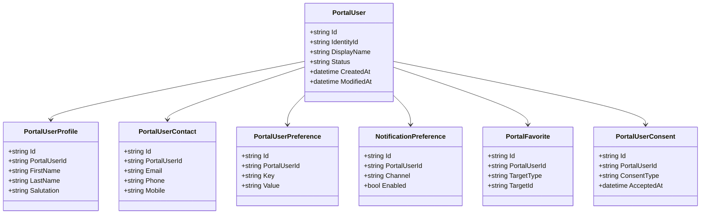
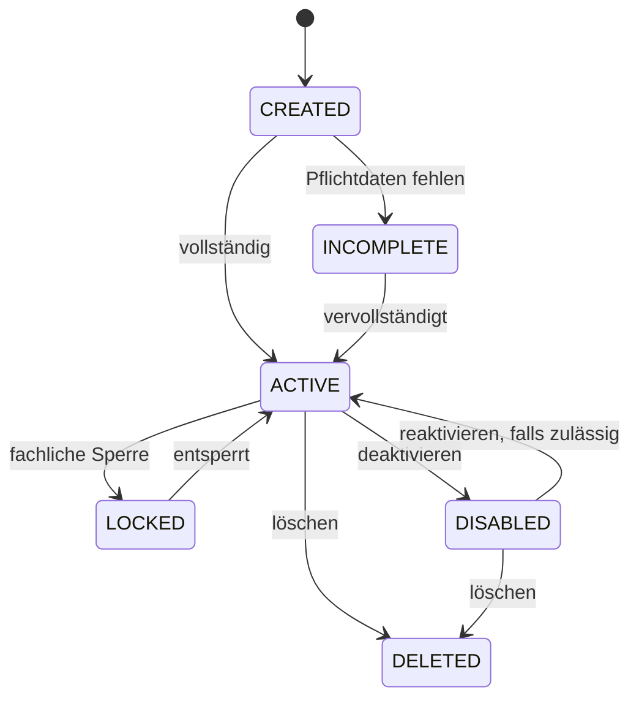
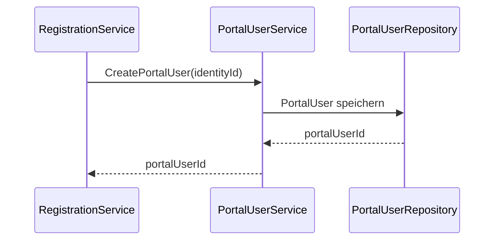
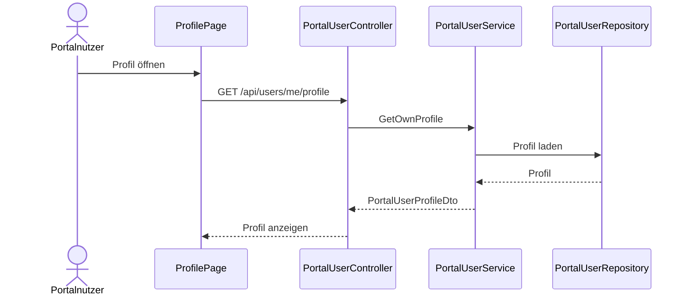
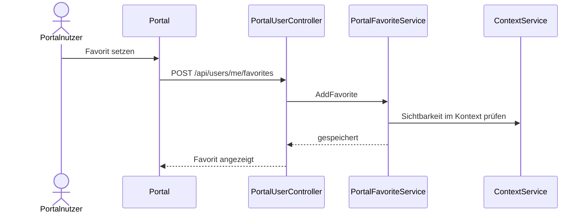

# Domäne PortalUser

| Feld | Wert |
|---|---|
| Kapitel | 03 – Domänen |
| Dokument | PortalUser |
| Status | Konsolidierter Arbeitsstand |
| Typ | Neuentwicklung |
| Priorität | Sehr hoch |
| Leitquellen | `Quellen/2026-07-05_Snapshot1.txt`, `Quellen/2026-05_28_Lastenheft_SportFM.pdf` |

---

## 1 Zweck

Die Domäne **PortalUser** verwaltet das fachliche Benutzerprofil eines Portalnutzers.

Sie ergänzt die technische Authentifizierung um fachliche Benutzerdaten, Kontaktdaten, Profilinformationen, Benachrichtigungseinstellungen, Favoriten und die Sicht auf eigene Vorgänge.

PortalUser ist nicht für Login, Passwort oder Tokens zuständig. Diese Funktionen liegen in **Authentication**.

---

## 2 Projektbewertung

| Bereich | Bestand | Erweiterung | Neuentwicklung | Bewertung |
|---|:---:|:---:|:---:|---|
| Oracle |  |  | x | neue Profilpersistenz erforderlich |
| PL/SQL |  |  | x | Package / API für Portalprofile zu prüfen |
| REST |  |  | x | neue PortalUser-API |
| DTO |  |  | x | neue Vertragsobjekte |
| Portal |  |  | x | Profil, Einstellungen, Favoriten, eigene Übersicht |
| Authentication |  | x |  | technische Identität verknüpfen |
| Organisation |  | x |  | Mitgliedschaften anzeigen / verwalten |
| Context |  | x |  | verfügbare Kontexte ableiten |
| Tests |  |  | x | neue Profil- und Berechtigungstests erforderlich |

---

## 3 Abgrenzung

### 3.1 Verantwortlich

PortalUser ist verantwortlich für:

- fachliches Benutzerprofil,
- Anzeigename,
- Kontaktdaten,
- Kommunikationsdaten,
- Profilstatus,
- persönliche Einstellungen,
- Benachrichtigungseinstellungen,
- Favoriten,
- persönliche Dashboard-Grunddaten,
- Verknüpfung zur technischen Identität,
- Anzeige eigener Mitgliedschaften,
- Anzeige eigener Kontexte,
- Anzeige eigener Anträge, Dokumente, Buchungen und Rechnungen über die jeweiligen Domänen.

### 3.2 Nicht verantwortlich

PortalUser ist nicht verantwortlich für:

- Passwort,
- Login,
- Tokens,
- E-Mail-Bestätigung,
- Rollenvergabe,
- Mitgliedschaftsfreigabe,
- Kontextentscheidung,
- Antragserstellung,
- Dokumentenspeicherung,
- Buchungslogik,
- Rechnungslogik.

Diese Funktionen liegen in Authentication, Organisation, Context, Application, Document, Booking und Invoice.

---

## 4 Architekturgrundsatz

PortalUser trennt fachliches Profil und technische Identität.

```text
PortalIdentity
  ↓
PortalUser
  ↓
Memberships
  ↓
Contexts
  ↓
Fachdomänen
```

Authentication kennt die technische Identität.

PortalUser kennt das fachliche Profil.

Organisation kennt Mitgliedschaften.

Context kennt den aktiven Arbeitsraum.

---

## 5 Fachlicher Grundsatz

Ein Portalnutzer kann als Einzelperson handeln oder im Namen einer Organisation bzw. Abteilung tätig werden.

Die Entscheidung, in welchem fachlichen Raum er handelt, erfolgt nicht in PortalUser, sondern über Context.

PortalUser stellt dafür die persönlichen Benutzerdaten und die Einstiegspunkte bereit.

---

## 6 Einordnung in die Plattform

```text
Authentication
  ↓
PortalUser
  ↓
Organisation / Membership
  ↓
Context
  ↓
Application / Booking / Document / Invoice / Notification
```

---

## 7 Business Objects

| Objekt | Zweck | Persistenz |
|---|---|---|
| `PortalUser` | fachlicher Portalnutzer | neue Persistenz |
| `PortalUserProfile` | Profildaten | neue Persistenz |
| `PortalUserContact` | Kontaktinformationen | neue Persistenz |
| `PortalUserPreference` | persönliche Einstellungen | neue Persistenz |
| `NotificationPreference` | Benachrichtigungseinstellungen | neue Persistenz / Notification |
| `PortalFavorite` | Favoriten | neue Persistenz |
| `PortalUserActivity` | letzte Aktivitäten / Verlauf | neue Persistenz / abgeleitet |
| `PortalUserConsent` | Zustimmungen / Datenschutz | neue Persistenz |

### 7.1 Klassendiagramm



---

## 8 Statusmodell

| Status | Bedeutung |
|---|---|
| `CREATED` | Profil wurde angelegt |
| `ACTIVE` | Profil ist aktiv nutzbar |
| `INCOMPLETE` | Pflichtdaten fehlen |
| `LOCKED` | Nutzung fachlich eingeschränkt, technische Sperre liegt in Authentication |
| `DISABLED` | Profil deaktiviert |
| `DELETED` | Profil gelöscht / nicht mehr nutzbar, Löschkonzept gesondert klären |

### 8.1 Zustandsdiagramm



---

## 9 Fachliche Regeln

| ID | Regel |
|---|---|
| PU-BR-001 | Jeder PortalUser ist mit genau einer technischen PortalIdentity verknüpft. |
| PU-BR-002 | Login-Daten werden nicht in PortalUser gespeichert. |
| PU-BR-003 | Fachliche Kontaktdaten können von der Login-E-Mail abweichen, wenn fachlich zulässig. |
| PU-BR-004 | Änderungen an relevanten Profildaten werden historisiert oder auditiert, soweit datenschutzrechtlich erforderlich. |
| PU-BR-005 | Mitgliedschaften werden nicht in PortalUser gepflegt, sondern über Organisation. |
| PU-BR-006 | Verfügbare Kontexte werden nicht in PortalUser berechnet, sondern über Context. |
| PU-BR-007 | Eigene Anträge, Dokumente, Buchungen und Rechnungen werden über die zuständigen Domänen geladen. |
| PU-BR-008 | Favoriten dürfen nur auf Objekte zeigen, die für den Nutzer im Kontext sichtbar sind. |
| PU-BR-009 | Benachrichtigungseinstellungen dürfen keine systemrelevanten Pflichtbenachrichtigungen deaktivieren, falls solche fachlich definiert sind. |
| PU-BR-010 | Datenschutz- und Nutzungszustimmungen werden nachvollziehbar gespeichert. |

---

## 10 Standardabläufe

### 10.1 Profil nach Registrierung erzeugen

```text
Authentication registriert Identity
  ↓
PortalUser-Profil wird erzeugt
  ↓
Profilstatus CREATED oder INCOMPLETE
  ↓
Benutzer ergänzt Pflichtdaten
  ↓
Profilstatus ACTIVE
```

### 10.2 Profil bearbeiten

```text
Portalnutzer öffnet Profil
  ↓
Profil wird geladen
  ↓
Benutzer ändert Profildaten
  ↓
Validierung
  ↓
Speichern
  ↓
Änderung protokollieren, falls erforderlich
```

### 10.3 Eigene Übersicht laden

```text
Benutzer meldet sich an
  ↓
PortalUser lädt Profildaten
  ↓
Organisation lädt Mitgliedschaften
  ↓
Context lädt verfügbare Kontexte
  ↓
Dashboard lädt eigene Vorgänge über Fachdomänen
```

---

## 11 Sequenzdiagramme

### 11.1 Profil anlegen nach Registrierung



### 11.2 Profil lesen



### 11.3 Favorit speichern



---

## 12 REST-API

| ID | Methode | Pfad | Zweck |
|---|---|---|---|
| PU-API-001 | `GET` | `/api/users/me` | eigenen PortalUser lesen |
| PU-API-002 | `GET` | `/api/users/me/profile` | eigenes Profil lesen |
| PU-API-003 | `PUT` | `/api/users/me/profile` | eigenes Profil ändern |
| PU-API-004 | `GET` | `/api/users/me/preferences` | eigene Einstellungen lesen |
| PU-API-005 | `PUT` | `/api/users/me/preferences` | eigene Einstellungen speichern |
| PU-API-006 | `GET` | `/api/users/me/notification-preferences` | Benachrichtigungseinstellungen lesen |
| PU-API-007 | `PUT` | `/api/users/me/notification-preferences` | Benachrichtigungseinstellungen speichern |
| PU-API-008 | `GET` | `/api/users/me/favorites` | Favoriten lesen |
| PU-API-009 | `POST` | `/api/users/me/favorites` | Favorit hinzufügen |
| PU-API-010 | `DELETE` | `/api/users/me/favorites/{id}` | Favorit entfernen |
| PU-API-011 | `GET` | `/api/users/me/memberships` | eigene Mitgliedschaften lesen, delegiert an Organisation |
| PU-API-012 | `GET` | `/api/users/me/contexts` | eigene Kontexte lesen, delegiert an Context |
| PU-API-013 | `GET` | `/api/users/me/activities` | letzte Aktivitäten lesen |
| PU-API-014 | `POST` | `/api/users/me/consents` | Zustimmung speichern |

---

## 13 DTOs

### 13.1 `PortalUserDto`

| Feld | Typ | Pflicht |
|---|---|:---:|
| `id` | string | ja |
| `identityId` | string | ja |
| `displayName` | string | nein |
| `status` | string | ja |
| `createdAt` | datetime | ja |

### 13.2 `PortalUserProfileDto`

| Feld | Typ | Pflicht |
|---|---|:---:|
| `firstName` | string | nein |
| `lastName` | string | nein |
| `displayName` | string | ja |
| `salutation` | string | nein |
| `email` | string | ja |
| `phone` | string | nein |
| `mobile` | string | nein |

### 13.3 `PortalUserPreferenceDto`

| Feld | Typ | Pflicht |
|---|---|:---:|
| `key` | string | ja |
| `value` | string | ja |

### 13.4 `NotificationPreferenceDto`

| Feld | Typ | Pflicht |
|---|---|:---:|
| `channel` | string | ja |
| `enabled` | boolean | ja |
| `category` | string | nein |

### 13.5 `PortalFavoriteDto`

| Feld | Typ | Pflicht |
|---|---|:---:|
| `id` | string | ja |
| `targetType` | string | ja |
| `targetId` | string | ja |
| `label` | string | nein |

### 13.6 `PortalUserActivityDto`

| Feld | Typ | Pflicht |
|---|---|:---:|
| `id` | string | ja |
| `activityType` | string | ja |
| `targetType` | string | nein |
| `targetId` | string | nein |
| `createdAt` | datetime | ja |
| `description` | string | nein |

---

## 14 Services

| Service | Verantwortung |
|---|---|
| `PortalUserService` | PortalUser lesen und verwalten |
| `PortalUserProfileService` | Profil lesen / speichern |
| `PortalUserPreferenceService` | persönliche Einstellungen |
| `PortalFavoriteService` | Favoriten verwalten |
| `PortalUserConsentService` | Zustimmungen speichern |
| `PortalUserActivityService` | Aktivitäten lesen / schreiben |
| `PortalUserIntegrationService` | Delegation zu Organisation und Context koordinieren |

---

## 15 Repository

| Repository | Zweck |
|---|---|
| `PortalUserRepository` | PortalUser lesen / speichern |
| `PortalUserProfileRepository` | Profile lesen / speichern |
| `PortalUserPreferenceRepository` | Einstellungen lesen / speichern |
| `PortalFavoriteRepository` | Favoriten lesen / speichern |
| `PortalUserConsentRepository` | Zustimmungen lesen / speichern |
| `PortalUserActivityRepository` | Aktivitäten lesen / speichern |

Repositories enthalten keine Geschäftslogik.

---

## 16 Oracle und PL/SQL

### 16.1 Neue / zu prüfende Persistenz

Die Quellen legen Portalnutzer, Benutzerkonto und persönliche Portalfunktionen nahe, enthalten aber keine abschließend bestätigte PortalUser-Tabellenstruktur. Daher sind folgende Objekte zu prüfen:

| Objekt | Zweck | Status |
|---|---|---|
| `LHD_SPA_PORTAL_USERS` | fachliche Portalnutzer | zu prüfen / voraussichtlich neu |
| `LHD_SPA_PORTAL_USER_PROFILES` | Profildaten | zu prüfen / voraussichtlich neu |
| `LHD_SPA_PORTAL_USER_CONTACTS` | Kontaktdaten | zu prüfen / voraussichtlich neu |
| `LHD_SPA_PORTAL_USER_PREFS` | persönliche Einstellungen | zu prüfen / voraussichtlich neu |
| `LHD_SPA_NOTIFICATION_PREFS` | Benachrichtigungseinstellungen | zu prüfen / mit Notification abstimmen |
| `LHD_SPA_PORTAL_FAVORITES` | Favoriten | zu prüfen / voraussichtlich neu |
| `LHD_SPA_PORTAL_USER_CONSENTS` | Zustimmungen | zu prüfen / voraussichtlich neu |
| `LHD_SPA_PORTAL_USER_ACTIVITY` | Aktivitäten | zu prüfen |

### 16.2 Package-Zuordnung

| Package | Zweck | Status |
|---|---|---|
| `PA_LHD_SPA_PORTAL_USER` | PortalUser und Profil | vorgeschlagene Zielstruktur, noch zu bestätigen |
| `PA_LHD_SPA_PORTAL_PREFS` | Einstellungen / Favoriten | vorgeschlagene Zielstruktur, noch zu bestätigen |
| `PA_LHD_SPA_PORTAL_CONSENT` | Zustimmungen | vorgeschlagene Zielstruktur, noch zu bestätigen |

---

## 17 Blazor-Frontend

### 17.1 Seiten

| ID | Seite | Route | Zweck |
|---|---|---|---|
| PU-PAGE-001 | Mein Profil | `/account/profile` | Profildaten anzeigen / ändern |
| PU-PAGE-002 | Einstellungen | `/account/preferences` | persönliche Einstellungen |
| PU-PAGE-003 | Benachrichtigungen | `/account/notifications` | Benachrichtigungseinstellungen |
| PU-PAGE-004 | Meine Mitgliedschaften | `/account/memberships` | Mitgliedschaften anzeigen |
| PU-PAGE-005 | Meine Kontexte | `/account/contexts` | verfügbare Kontexte anzeigen |
| PU-PAGE-006 | Favoriten | `/account/favorites` | Favoriten verwalten |
| PU-PAGE-007 | Aktivitäten | `/account/activities` | letzte Aktivitäten |
| PU-PAGE-008 | Datenschutz / Zustimmungen | `/account/consents` | Zustimmungen anzeigen |

### 17.2 Komponenten

| Komponente | Zweck |
|---|---|
| `ProfileForm` | Profildaten bearbeiten |
| `ContactDataForm` | Kontaktdaten bearbeiten |
| `PreferenceEditor` | Einstellungen bearbeiten |
| `NotificationPreferenceList` | Benachrichtigungseinstellungen |
| `MembershipSummary` | eigene Mitgliedschaften anzeigen |
| `ContextSummary` | eigene Kontexte anzeigen |
| `FavoriteList` | Favoriten anzeigen |
| `RecentActivityList` | Aktivitäten anzeigen |
| `ConsentList` | Zustimmungen anzeigen |

---

## 18 Berechtigungen

| Berechtigung | Zweck |
|---|---|
| `PortalUser.ReadSelf` | eigenes Profil lesen |
| `PortalUser.UpdateSelf` | eigenes Profil ändern |
| `PortalUser.Preferences.ReadSelf` | eigene Einstellungen lesen |
| `PortalUser.Preferences.UpdateSelf` | eigene Einstellungen ändern |
| `PortalUser.Favorites.ManageSelf` | eigene Favoriten verwalten |
| `PortalUser.Consents.ReadSelf` | eigene Zustimmungen lesen |
| `PortalUser.Admin.Read` | PortalUser administrativ lesen |
| `PortalUser.Admin.Update` | PortalUser administrativ ändern, falls V1 |

Eigene Mitgliedschaften und eigene Kontexte werden über Organisation und Context abgesichert.

---

## 19 Validierungen

| ID | Validierung | Ebene |
|---|---|---|
| PU-VAL-001 | PortalUser existiert | PortalUser |
| PU-VAL-002 | Benutzer darf nur eigenes Profil bearbeiten | PortalUser / Authentication |
| PU-VAL-003 | Pflichtdaten vollständig | PortalUserProfile |
| PU-VAL-004 | E-Mail-Format gültig, falls Kontaktemail editierbar | PortalUserContact |
| PU-VAL-005 | Telefonnummernformat gültig, falls gepflegt | PortalUserContact |
| PU-VAL-006 | Favoritenziel im aktiven Kontext sichtbar | PortalFavorite / Context |
| PU-VAL-007 | Zustimmungstyp gültig | PortalUserConsent |
| PU-VAL-008 | Pflichtbenachrichtigung darf nicht deaktiviert werden, falls fachlich definiert | NotificationPreference |

---

## 20 Testfälle

| Testfall | Beschreibung |
|---|---|
| TF-PU-001 | PortalUser nach Registrierung erzeugen |
| TF-PU-002 | eigenes Profil lesen |
| TF-PU-003 | eigenes Profil ändern |
| TF-PU-004 | fremdes Profil nicht lesen |
| TF-PU-005 | fremdes Profil nicht ändern |
| TF-PU-006 | Benachrichtigungseinstellungen speichern |
| TF-PU-007 | Favorit hinzufügen |
| TF-PU-008 | Favorit ohne Kontextsichtbarkeit verhindern |
| TF-PU-009 | eigene Mitgliedschaften anzeigen |
| TF-PU-010 | eigene Kontexte anzeigen |
| TF-PU-011 | Zustimmung speichern |
| TF-PU-012 | Aktivitäten anzeigen |

---

## 21 Arbeitspakete

| AP | Titel | Inhalt |
|---|---|---|
| AP-PU-001 | PortalUser-Modell | PortalUser, Profil, Kontakt, Einstellungen |
| AP-PU-002 | Oracle-Konzept | Tabellenprüfung, neue Tabellen, Package-Zuordnung |
| AP-PU-003 | REST | Controller, DTOs, Fehlerformat |
| AP-PU-004 | PortalUserService | PortalUser lesen / verwalten |
| AP-PU-005 | ProfileService | Profil und Kontaktdaten |
| AP-PU-006 | PreferenceService | Einstellungen und Benachrichtigungseinstellungen |
| AP-PU-007 | FavoriteService | Favoriten |
| AP-PU-008 | ConsentService | Zustimmungen |
| AP-PU-009 | Integration | Authentication, Organisation, Context |
| AP-PU-010 | Portal | Profil-, Einstellungen-, Favoriten- und Aktivitätsseiten |
| AP-PU-011 | Tests | Unit-, Integrations- und UI-Tests |
| AP-PU-012 | Dokumentation | API, Domäne, Datenschutzbezug |

---

## 22 Aufwandstreiber

| Treiber | Einfluss |
|---|---|
| Umfang Profilpflichtdaten | mittel |
| Datenschutz- und Zustimmungskonzept | hoch |
| Benachrichtigungseinstellungen | mittel |
| Favoriten mit Kontextprüfung | mittel bis hoch |
| Integration mit Organisation / Context | hoch |
| Aktivitäten / Verlauf | mittel |
| Administrativer Zugriff auf PortalUser | mittel bis hoch |
| Lösch- und Aufbewahrungskonzept | hoch |
| UI-Aufwand Kontobereich | mittel |

Konkrete Personentage werden erst nach finalem Datenschutz-, Profil- und Löschkonzept festgelegt.

---

## 23 Risiken

| Risiko | Bewertung | Maßnahme |
|---|---|---|
| PortalUser und Authentication werden vermischt | hoch | klare Trennung einhalten |
| PortalUser und Organisation werden vermischt | hoch | Mitgliedschaften ausschließlich in Organisation |
| Kontextprüfung bei Favoriten fehlt | mittel | Context-Service verpflichtend nutzen |
| Datenschutzanforderungen unklar | hoch | Datenschutz- und Löschkonzept klären |
| Profildaten doppelt zu Organisationsdaten | mittel | Abgrenzung in UI und Datenmodell dokumentieren |
| Pflichtbenachrichtigungen deaktivierbar | mittel | Notification-Regeln festlegen |

---

## 24 Offene Punkte

| ID | Offener Punkt | Relevanz |
|---|---|---|
| OP-PU-001 | finale Pflichtfelder im Benutzerprofil | hoch |
| OP-PU-002 | Kontaktemail gleich Login-E-Mail oder getrennt? | hoch |
| OP-PU-003 | Umfang Favoriten V1 | mittel |
| OP-PU-004 | Umfang Aktivitäten / Verlauf V1 | mittel |
| OP-PU-005 | Benachrichtigungseinstellungen je Kanal / Kategorie | hoch |
| OP-PU-006 | Lösch- und Aufbewahrungsregeln | sehr hoch |
| OP-PU-007 | administrativer Zugriff auf PortalUser in V1 | mittel |
| OP-PU-008 | finale Oracle-/Package-Zuordnung | hoch |

---

## 25 Traceability-Matrix

| Quelle | Funktion | REST | Service | UI | Test | AP |
|---|---|---|---|---|---|---|
| Lastenheft Benutzerkonto | Profil lesen | PU-API-002 | PortalUserProfileService | ProfileForm | TF-PU-002 | AP-PU-005/010 |
| Lastenheft Benutzerkonto | Profil ändern | PU-API-003 | PortalUserProfileService | ProfileForm | TF-PU-003 | AP-PU-005/010 |
| Lastenheft Favoriten | Favoriten | PU-API-008/009 | PortalFavoriteService | FavoriteList | TF-PU-007/008 | AP-PU-007 |
| Authentication.md | Profil nach Registrierung | intern | PortalUserService | n/a | TF-PU-001 | AP-PU-004/009 |
| Organisation.md | eigene Mitgliedschaften | PU-API-011 | PortalUserIntegrationService | MembershipSummary | TF-PU-009 | AP-PU-009 |
| Context.md | eigene Kontexte | PU-API-012 | PortalUserIntegrationService | ContextSummary | TF-PU-010 | AP-PU-009 |

---

## 26 Änderungsauswirkungen

Änderungen an `PortalUser.md` wirken sich aus auf:

- `03_Domaenen/Authentication.md`,
- `03_Domaenen/Organisation.md`,
- `03_Domaenen/Context.md`,
- `03_Domaenen/Dashboard.md`,
- `03_Domaenen/Notification.md`,
- `04_REST_API/Endpunkte.md`,
- `04_REST_API/DTOs.md`,
- `05_Datenmodell/Tabellen.md`,
- `05_Datenmodell/Packages.md`,
- `06_Arbeitspakete/Arbeitspaketliste.md`,
- `07_Kalkulation/Aufwandsschaetzung.md`,
- `09_Testkonzept/Testfaelle.md`,
- `10_Sicherheit/Datenschutz.md`,
- `12_Offene_Punkte/Offene_Punkte.md`.

---

## 27 Ergebnis

Die Domäne PortalUser ist als fachliche Benutzerdomäne des Portals spezifiziert.

Sie verwaltet Profil, Kontaktdaten, Einstellungen, Favoriten, Zustimmungen und persönliche Sichten, bleibt aber strikt getrennt von Login, Organisation, Mitgliedschaften und Kontext.

Die konkrete Kalkulation bleibt abhängig von:

- finalen Profilpflichtdaten,
- Datenschutz- und Löschkonzept,
- Umfang Benachrichtigungseinstellungen,
- Umfang Favoriten,
- Umfang Aktivitäten,
- administrativem Zugriff in V1,
- bestätigter Oracle-Zuordnung.
