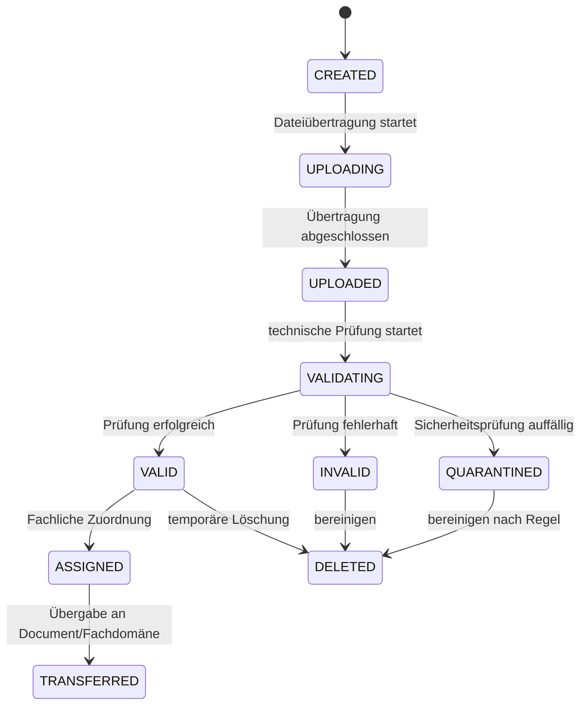
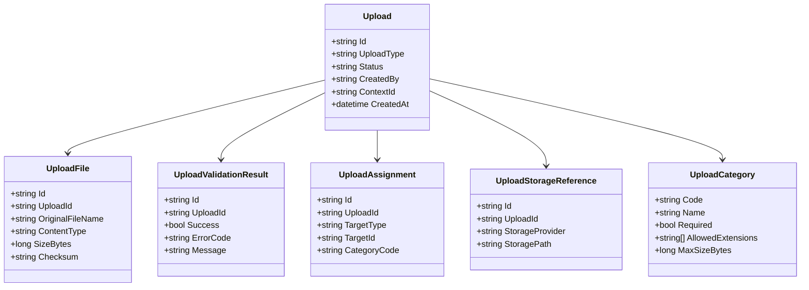
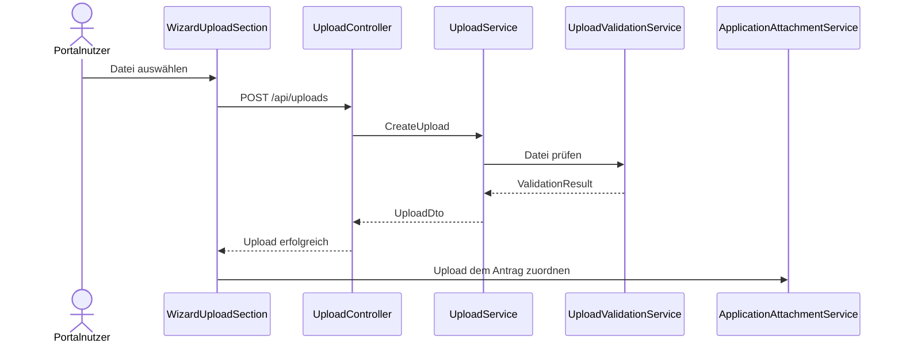
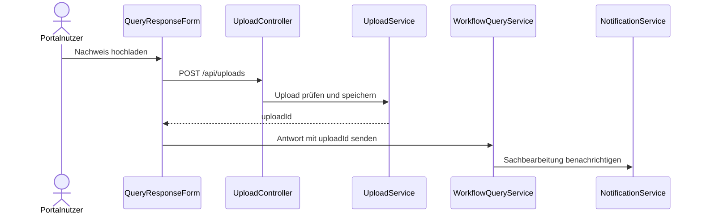
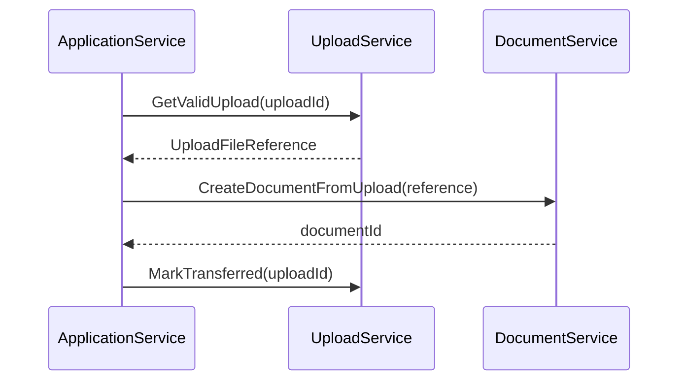

# Domäne Upload

| Feld | Wert |
|---|---|
| Kapitel | 03 – Domänen |
| Dokument | Upload |
| Status | Konsolidierter Arbeitsstand |
| Typ | Neuentwicklung / technische Plattformdomäne |
| Priorität | Hoch |
| Leitquellen | `Quellen/2026-07-05_Snapshot1.txt`, `Quellen/2026-05_28_Lastenheft_SportFM.pdf` |

---

## 1 Zweck

Die Domäne **Upload** stellt das kontrollierte Hochladen, Prüfen, Zwischenspeichern und fachliche Zuordnen von Dateien im SportFM-Portal bereit.

Upload unterstützt insbesondere Anlagen zu Onlineanträgen, Nachreichungen zu Rückfragen, strukturierte Importdateien und sonstige portalbezogene Dateiübermittlungen.

Upload ist keine Dokumentenverwaltung. Die dauerhafte fachliche Dokumentenverwaltung, Versionierung, Vorlagen, Bescheide und erzeugte Dokumente liegen in der Domäne **Document**.

---

## 2 Projektbewertung

| Bereich | Bestand | Erweiterung | Neuentwicklung | Bewertung |
|---|:---:|:---:|:---:|---|
| Oracle |  | x | x | Metadaten, Zuordnungen und Prüfstatus erforderlich |
| PL/SQL |  | x | x | Package / API für Upload-Metadaten zu prüfen |
| REST |  |  | x | neue Upload-API |
| DTO |  |  | x | neue Vertragsobjekte |
| Portal |  |  | x | Upload-Komponenten, Fortschritt, Fehleranzeige |
| Application |  | x |  | Anlagen zu Anträgen |
| Wizard |  | x |  | Upload-Schritte und Pflichtanlagen |
| Workflow |  | x |  | Nachreichungen bei Rückfragen |
| Document |  | x |  | Übergabe erfolgreicher Uploads an Dokumentendomäne |
| Tests |  |  | x | Sicherheits-, Datei-, Integrations- und UI-Tests |

---

## 3 Abgrenzung

### 3.1 Verantwortlich

Upload ist verantwortlich für:

- Annahme von Dateien,
- Größenprüfung,
- Dateitypprüfung,
- Prüfsummen,
- technisches Upload-Metadatum,
- temporäre Ablage,
- Uploadstatus,
- Zuordnung zu Antrag, Rückfrage oder sonstigem Zielobjekt,
- Validierung gegen erlaubte Upload-Kategorien,
- Übergabe an Document oder zuständige Fachdomäne,
- Fehler- und Sicherheitsstatus,
- Löschung temporärer Uploads nach definierten Regeln.

### 3.2 Nicht verantwortlich

Upload ist nicht verantwortlich für:

- fachliche Dokumentenerzeugung,
- Dokumentversionierung,
- Bescheide,
- Rechnungen,
- Workflowstatus,
- Antragseinreichung,
- fachliche Bewertung des Dateiinhalts,
- OCR,
- Virenschutz-Engine selbst,
- Langzeitarchivierung.

Diese Aufgaben liegen in Document, Workflow, Application, Invoice, Betrieb oder externen Sicherheitskomponenten.

---

## 4 Architekturgrundsatz

Upload ist eine technische Plattformdomäne mit fachlicher Zuordnung.

```text
Portal / Wizard / Application / Workflow
  ↓
Upload API
  ↓
UploadService
  ↓
UploadRepository
  ↓
File Storage + Oracle-Metadaten
  ↓
Document / Fachdomäne
```

Fachdomänen laden keine Dateien direkt in Dateispeicher oder Datenbank. Sie nutzen Upload als zentrale Schnittstelle.

---

## 5 Fachlicher Grundsatz

Dateien werden zunächst als Uploadobjekte behandelt.

Erst nach erfolgreicher technischer Prüfung und fachlicher Zuordnung werden sie zu Dokumenten oder Anlagen eines Fachvorgangs.

```text
Datei
  ↓
Upload
  ↓
Prüfung
  ↓
Zuordnung
  ↓
ApplicationAttachment / WorkflowQueryAttachment / Document
```

---

## 6 Einordnung in die Plattform

```text
Wizard
  ↓
Upload
  ↓
Application
  ↓
Workflow
  ↓
Document
```

Wizard zeigt Uploadfelder und Pflichtanlagen an.

Upload verarbeitet die Datei.

Application ordnet den Upload dem Antrag zu.

Workflow kann Nachreichungen aus Rückfragen entgegennehmen.

Document übernimmt die dauerhafte fachliche Dokumentenverwaltung, soweit erforderlich.

---

## 7 Upload-Arten

| Upload-Art | Beschreibung | Zugeordnete Domäne |
|---|---|---|
| `APPLICATION_ATTACHMENT` | Anlage zu einem Antrag | Application |
| `QUERY_RESPONSE_ATTACHMENT` | Nachreichung zu einer Rückfrage | Workflow / Application |
| `ORGANISATION_PROOF` | Nachweis zu Organisation oder Mitgliedschaft | Organisation |
| `IMPORT_FILE` | strukturierte Importdatei | Administration / Integration |
| `DOCUMENT_SOURCE` | hochgeladene Datei als Dokumentquelle | Document |
| `OTHER` | sonstiger Upload | gesondert zu prüfen |

---

## 8 Upload-Status

| Status | Bedeutung |
|---|---|
| `CREATED` | Uploadobjekt wurde angelegt |
| `UPLOADING` | Datei wird übertragen |
| `UPLOADED` | Übertragung abgeschlossen |
| `VALIDATING` | technische Prüfung läuft |
| `VALID` | Upload ist technisch gültig |
| `INVALID` | Upload ist ungültig |
| `QUARANTINED` | Upload wurde sicherheitstechnisch separiert |
| `ASSIGNED` | Upload ist fachlich zugeordnet |
| `TRANSFERRED` | Upload wurde an Document / Fachdomäne übergeben |
| `DELETED` | Upload wurde gelöscht |

### 8.1 Zustandsdiagramm



---

## 9 Business Objects

| Objekt | Zweck | Persistenz |
|---|---|---|
| `Upload` | technisches Uploadobjekt | neue Persistenz |
| `UploadFile` | Dateimetadaten | neue Persistenz |
| `UploadCategory` | fachliche Uploadkategorie | neue / Wizard-Konfiguration |
| `UploadValidationResult` | Prüfergebnis | neue Persistenz / transient |
| `UploadAssignment` | Zuordnung zu Antrag, Rückfrage oder Dokument | neue Persistenz |
| `UploadStorageReference` | Verweis auf Dateispeicher | neue Persistenz |
| `UploadAuditEntry` | Upload-Protokoll | neue Persistenz / Audit |

### 9.1 Klassendiagramm



---

## 10 Fachliche Regeln

| ID | Regel |
|---|---|
| UPL-BR-001 | Upload nimmt Dateien nur über definierte REST-Endpunkte entgegen. |
| UPL-BR-002 | Jeder Upload besitzt einen Status. |
| UPL-BR-003 | Jeder Upload wird einem Benutzer und, falls fachlich erforderlich, einem Kontext zugeordnet. |
| UPL-BR-004 | Dateigröße und Dateityp werden vor fachlicher Zuordnung geprüft. |
| UPL-BR-005 | Ungültige Uploads dürfen nicht an Application, Workflow oder Document übergeben werden. |
| UPL-BR-006 | Upload erzeugt keine Antragsanlage ohne Zuordnung durch Application oder Workflow. |
| UPL-BR-007 | Upload ersetzt keine Dokumentenverwaltung. |
| UPL-BR-008 | Pflichtanlagen werden fachlich durch Wizard / Application definiert, technisch durch Upload geprüft. |
| UPL-BR-009 | Nachreichungen zu Rückfragen bleiben dem ursprünglichen Antrag / Workflow zugeordnet. |
| UPL-BR-010 | Sicherheitsauffällige Uploads werden nicht normal weiterverarbeitet. |
| UPL-BR-011 | Temporäre Uploads werden nach definierten Aufbewahrungsregeln bereinigt. |
| UPL-BR-012 | Download oder Anzeige hochgeladener Dateien erfolgt nur mit Berechtigung und Kontextprüfung. |

---

## 11 Standardabläufe

### 11.1 Anlage im Wizard hochladen

```text
Benutzer befindet sich im Wizard
  ↓
Upload-Kategorie wird angezeigt
  ↓
Datei auswählen
  ↓
UploadService nimmt Datei entgegen
  ↓
technische Prüfung
  ↓
Uploadstatus VALID
  ↓
Application ordnet Upload dem Antrag zu
```

### 11.2 Nachreichung bei Rückfrage

```text
Workflow stellt Rückfrage mit Anlagenanforderung
  ↓
Antragsteller lädt Datei hoch
  ↓
Upload prüft Datei
  ↓
Workflow / Application ordnet Nachreichung zu
  ↓
Sachbearbeitung wird benachrichtigt
```

### 11.3 Übergabe an Document

```text
Upload ist gültig und fachlich zugeordnet
  ↓
zuständige Domäne entscheidet Übergabe
  ↓
Document übernimmt Datei als Dokument / Anlage
  ↓
Uploadstatus TRANSFERRED
```

---

## 12 Sequenzdiagramme

### 12.1 Upload im Antrag



### 12.2 Nachreichung zu Rückfrage



### 12.3 Übergabe an Document



---

## 13 REST-API

| ID | Methode | Pfad | Zweck |
|---|---|---|---|
| UPL-API-001 | `POST` | `/api/uploads` | Datei hochladen |
| UPL-API-002 | `GET` | `/api/uploads/{id}` | Upload-Metadaten lesen |
| UPL-API-003 | `GET` | `/api/uploads/{id}/content` | Dateiinhalt laden, falls berechtigt |
| UPL-API-004 | `DELETE` | `/api/uploads/{id}` | Upload löschen, falls zulässig |
| UPL-API-005 | `POST` | `/api/uploads/{id}/assign` | Upload fachlich zuordnen |
| UPL-API-006 | `POST` | `/api/uploads/{id}/validate` | Upload erneut prüfen |
| UPL-API-007 | `GET` | `/api/upload-categories` | Uploadkategorien lesen |
| UPL-API-008 | `GET` | `/api/uploads/by-target` | Uploads zu Zielobjekt lesen |

---

## 14 DTOs

### 14.1 `UploadDto`

| Feld | Typ | Pflicht |
|---|---|:---:|
| `id` | string | ja |
| `uploadType` | string | ja |
| `status` | string | ja |
| `fileName` | string | ja |
| `contentType` | string | ja |
| `sizeBytes` | long | ja |
| `checksum` | string | nein |
| `contextId` | string | nein |
| `createdAt` | datetime | ja |

### 14.2 `UploadRequestDto`

| Feld | Typ | Pflicht |
|---|---|:---:|
| `uploadType` | string | ja |
| `categoryCode` | string | nein |
| `contextId` | string | nein / aus aktivem Kontext |
| `targetType` | string | nein |
| `targetId` | string | nein |

Die Datei selbst wird multipart/form-data übertragen.

### 14.3 `UploadAssignmentDto`

| Feld | Typ | Pflicht |
|---|---|:---:|
| `targetType` | string | ja |
| `targetId` | string | ja |
| `categoryCode` | string | nein |

### 14.4 `UploadValidationResultDto`

| Feld | Typ | Pflicht |
|---|---|:---:|
| `success` | boolean | ja |
| `errors` | array | ja |
| `warnings` | array | nein |

### 14.5 `UploadCategoryDto`

| Feld | Typ | Pflicht |
|---|---|:---:|
| `code` | string | ja |
| `name` | string | ja |
| `required` | boolean | ja |
| `allowedExtensions` | array | ja |
| `maxSizeBytes` | long | ja |

---

## 15 Services

| Service | Verantwortung |
|---|---|
| `UploadService` | zentrale Upload-Orchestrierung |
| `UploadValidationService` | Größe, Typ, Prüfsumme, Sicherheitsstatus prüfen |
| `UploadStorageService` | Datei speichern / lesen / löschen |
| `UploadAssignmentService` | fachliche Zuordnung speichern |
| `UploadCategoryService` | Kategorien und Regeln bereitstellen |
| `UploadSecurityService` | Sicherheitsprüfungen koordinieren |
| `UploadCleanupService` | temporäre Uploads bereinigen |
| `UploadIntegrationService` | Übergabe an Application, Workflow, Document koordinieren |

---

## 16 Repository

| Repository | Zweck |
|---|---|
| `UploadRepository` | Upload-Metadaten lesen / speichern |
| `UploadFileRepository` | Dateimetadaten lesen / speichern |
| `UploadAssignmentRepository` | Zuordnungen lesen / speichern |
| `UploadCategoryRepository` | Kategorien lesen |
| `UploadAuditRepository` | Protokoll schreiben / lesen |

Repositories speichern Metadaten. Der Dateispeicher wird über `UploadStorageService` gekapselt.

---

## 17 Oracle und PL/SQL

### 17.1 Neue / zu prüfende Persistenz

| Objekt | Zweck | Status |
|---|---|---|
| `LHD_SPA_UPLOADS` | Uploadkopf / Status | zu prüfen / voraussichtlich neu |
| `LHD_SPA_UPLOAD_FILES` | Dateimetadaten | zu prüfen / voraussichtlich neu |
| `LHD_SPA_UPLOAD_CATEGORIES` | Uploadkategorien | zu prüfen / voraussichtlich neu oder Wizard-Konfiguration |
| `LHD_SPA_UPLOAD_ASSIGNMENTS` | fachliche Zuordnung | zu prüfen / voraussichtlich neu |
| `LHD_SPA_UPLOAD_VALIDATIONS` | Prüfergebnisse | zu prüfen / optional |
| `LHD_SPA_UPLOAD_AUDIT` | Upload-Protokoll | zu prüfen / Logging nutzen |

### 17.2 Dateispeicher

Die Quellen legen keine abschließende Entscheidung fest, ob Dateien in der Datenbank, im Dateisystem oder in einem Objektspeicher gehalten werden.

Daher ist die Speicherstrategie als offener Punkt zu führen.

### 17.3 Package-Zuordnung

| Package | Zweck | Status |
|---|---|---|
| `PA_LHD_SPA_UPLOAD` | Upload-Metadaten, Status, Zuordnung | vorgeschlagene Zielstruktur, noch zu bestätigen |
| `PA_LHD_SPA_UPLOAD_CLEANUP` | Bereinigung temporärer Uploads | vorgeschlagene Zielstruktur, noch zu bestätigen |

---

## 18 Blazor-Frontend

### 18.1 Seiten / Einbettung

| ID | Seite / Einbettung | Route | Zweck |
|---|---|---|---|
| UPL-UI-001 | Wizard Upload-Schritt | Bestandteil `/applications/{id}/wizard` | Anlagen hochladen |
| UPL-UI-002 | Rückfrage-Nachreichung | Bestandteil Workflow-Antwort | Nachweise hochladen |
| UPL-UI-003 | Upload-Detail | optional | Metadaten / Status anzeigen |
| UPL-UI-004 | Upload-Admin | `/admin/uploads` | nur falls V1 administrativ erforderlich |

### 18.2 Komponenten

| Komponente | Zweck |
|---|---|
| `FileUploadDropZone` | Datei auswählen / Drag & Drop |
| `UploadProgressBar` | Fortschritt anzeigen |
| `UploadStatusBadge` | Status anzeigen |
| `UploadValidationSummary` | Fehler anzeigen |
| `AttachmentUploadList` | hochgeladene Anlagen anzeigen |
| `UploadCategoryHint` | Anforderungen je Kategorie anzeigen |
| `RemoveUploadButton` | Upload entfernen, falls zulässig |
| `UploadRetryButton` | erneut hochladen / prüfen |

---

## 19 Berechtigungen

| Berechtigung | Zweck |
|---|---|
| `Upload.Create` | Datei hochladen |
| `Upload.Read` | Upload-Metadaten lesen |
| `Upload.ReadContent` | Dateiinhalt lesen |
| `Upload.Delete` | Upload löschen |
| `Upload.Assign` | Upload fachlich zuordnen |
| `Upload.Validate` | Upload erneut prüfen |
| `Upload.Admin.Read` | Upload administrativ lesen |
| `Upload.Admin.Manage` | Upload administrativ verwalten, falls V1 |

Berechtigungen sind immer mit Context und Zielobjekt abzugleichen.

---

## 20 Validierungen

| ID | Validierung | Ebene |
|---|---|---|
| UPL-VAL-001 | Datei vorhanden | Upload |
| UPL-VAL-002 | Dateigröße zulässig | UploadValidation |
| UPL-VAL-003 | Dateityp / Erweiterung zulässig | UploadValidation |
| UPL-VAL-004 | Content-Type plausibel | UploadValidation |
| UPL-VAL-005 | Kontext zulässig | Context |
| UPL-VAL-006 | Zielobjekt existiert | Ziel-Domäne |
| UPL-VAL-007 | Benutzer darf Datei zum Zielobjekt hochladen | Ziel-Domäne / Context |
| UPL-VAL-008 | Uploadstatus erlaubt Zuordnung | Upload |
| UPL-VAL-009 | Pflichtkategorie erfüllt | Wizard / Application |
| UPL-VAL-010 | sicherheitstechnische Prüfung erfolgreich | UploadSecurity |

---

## 21 Testfälle

| Testfall | Beschreibung |
|---|---|
| TF-UPL-001 | Datei erfolgreich hochladen |
| TF-UPL-002 | zu große Datei ablehnen |
| TF-UPL-003 | nicht erlaubten Dateityp ablehnen |
| TF-UPL-004 | Upload-Metadaten lesen |
| TF-UPL-005 | Upload dem Antrag zuordnen |
| TF-UPL-006 | Upload ohne Berechtigung verhindern |
| TF-UPL-007 | Upload ohne Kontext verhindern, falls erforderlich |
| TF-UPL-008 | ungültiger Upload wird nicht zugeordnet |
| TF-UPL-009 | Rückfrage-Nachreichung hochladen |
| TF-UPL-010 | Upload an Document übergeben |
| TF-UPL-011 | temporären Upload bereinigen |
| TF-UPL-012 | Uploadstatus wird korrekt gesetzt |
| TF-UPL-013 | Pflichtanlage fehlt und Application-Validierung schlägt fehl |

---

## 22 Arbeitspakete

| AP | Titel | Inhalt |
|---|---|---|
| AP-UPL-001 | Uploadmodell | Upload, Datei, Kategorie, Status, Zuordnung |
| AP-UPL-002 | Speicherentscheidung | DB / Dateisystem / Objektspeicher klären |
| AP-UPL-003 | Oracle-Konzept | Tabellenprüfung, neue Tabellen, Package-Zuordnung |
| AP-UPL-004 | REST | Controller, Multipart, DTOs, Fehlerformat |
| AP-UPL-005 | UploadService | zentrale Orchestrierung |
| AP-UPL-006 | ValidationService | Größe, Typ, Content-Type, Sicherheitsstatus |
| AP-UPL-007 | StorageService | Dateiablage und Abruf |
| AP-UPL-008 | AssignmentService | fachliche Zuordnung |
| AP-UPL-009 | Application/Wizard-Anbindung | Anlagen im Antrag |
| AP-UPL-010 | Workflow-Anbindung | Nachreichungen |
| AP-UPL-011 | Document-Anbindung | Übergabe gültiger Uploads |
| AP-UPL-012 | Portal | Upload-Komponenten |
| AP-UPL-013 | Cleanup | temporäre Uploads bereinigen |
| AP-UPL-014 | Tests | Unit-, Integrations-, Sicherheits- und UI-Tests |
| AP-UPL-015 | Dokumentation | API, Betrieb, Speicherstrategie |

---

## 23 Aufwandstreiber

| Treiber | Einfluss |
|---|---|
| Speicherstrategie | sehr hoch |
| Sicherheitsprüfung / Virenscan-Anbindung | sehr hoch |
| erlaubte Dateitypen und Größen | mittel |
| Pflichtanlagen je Antragstyp | hoch |
| Integration mit Wizard | hoch |
| Integration mit Application | hoch |
| Nachreichungen im Workflow | hoch |
| Übergabe an Document | hoch |
| Cleanup und Aufbewahrung | mittel bis hoch |
| UI-Komfort wie Drag & Drop / Fortschritt | mittel |
| Sicherheitstests | hoch |

Konkrete Personentage werden erst nach finaler Speicher-, Sicherheits- und Anlagenmatrix festgelegt.

---

## 24 Risiken

| Risiko | Bewertung | Maßnahme |
|---|---|---|
| Upload und Document werden vermischt | hoch | klare Übergabegrenze definieren |
| Speicherstrategie unklar | sehr hoch | Architekturentscheidung treffen |
| Virenscan / Sicherheitsprüfung fehlt | sehr hoch | Betrieb und Sicherheitskonzept klären |
| Dateitypprüfung unzureichend | hoch | Erweiterung und Content-Type prüfen |
| Uploads ohne Kontext sichtbar | hoch | Context-Prüfung verpflichtend |
| temporäre Uploads bleiben dauerhaft liegen | mittel | CleanupService und Aufbewahrungsregeln |
| große Dateien belasten Portal | hoch | Größenlimits und Streaming prüfen |
| Pflichtanlagenmatrix unklar | hoch | je Antragstyp festlegen |

---

## 25 Offene Punkte

| ID | Offener Punkt | Relevanz |
|---|---|---|
| OP-UPL-001 | finale Speicherstrategie | sehr hoch |
| OP-UPL-002 | Virenscan / Sicherheitsprüfung vorhanden? | sehr hoch |
| OP-UPL-003 | erlaubte Dateitypen V1 | hoch |
| OP-UPL-004 | maximale Dateigröße V1 | hoch |
| OP-UPL-005 | Pflichtanlagen je Antragstyp | sehr hoch |
| OP-UPL-006 | Übergabeformat an Document | hoch |
| OP-UPL-007 | Aufbewahrung temporärer Uploads | hoch |
| OP-UPL-008 | Upload-Admin in V1 erforderlich? | mittel |
| OP-UPL-009 | finale Oracle-/Package-Zuordnung | hoch |

---

## 26 Traceability-Matrix

| Quelle | Funktion | REST | Service | UI | Test | AP |
|---|---|---|---|---|---|---|
| Lastenheft Uploads | Datei hochladen | UPL-API-001 | UploadService | FileUploadDropZone | TF-UPL-001 | AP-UPL-004/005/012 |
| Wizard.md | Upload-Kategorie | UPL-API-007 | UploadCategoryService | UploadCategoryHint | TF-UPL-013 | AP-UPL-009 |
| Application.md | Antragsanlage | UPL-API-005 | UploadAssignmentService | AttachmentUploadList | TF-UPL-005 | AP-UPL-009 |
| Workflow.md | Nachreichung | UPL-API-001/005 | UploadService | QueryResponseForm | TF-UPL-009 | AP-UPL-010 |
| Document.md | Übergabe | intern | UploadIntegrationService | n/a | TF-UPL-010 | AP-UPL-011 |
| Context.md | Zugriffsschutz | alle | UploadValidationService | alle Upload-Komponenten | TF-UPL-006/007 | AP-UPL-006/014 |

---

## 27 Änderungsauswirkungen

Änderungen an `Upload.md` wirken sich aus auf:

- `03_Domaenen/Application.md`,
- `03_Domaenen/Wizard.md`,
- `03_Domaenen/Workflow.md`,
- `03_Domaenen/Document.md`,
- `03_Domaenen/Organisation.md`,
- `03_Domaenen/Context.md`,
- `04_REST_API/Endpunkte.md`,
- `04_REST_API/DTOs.md`,
- `05_Datenmodell/Tabellen.md`,
- `05_Datenmodell/Packages.md`,
- `06_Arbeitspakete/Arbeitspaketliste.md`,
- `07_Kalkulation/Aufwandsschaetzung.md`,
- `09_Testkonzept/Testfaelle.md`,
- `10_Betrieb/Dateispeicher.md`,
- `10_Sicherheit/Dateiupload.md`,
- `12_Offene_Punkte/Offene_Punkte.md`.

---

## 28 Ergebnis

Die Domäne Upload ist als technische Plattformdomäne für sichere Dateiübermittlung spezifiziert.

Sie nimmt Dateien entgegen, prüft sie, speichert technische Metadaten, ordnet sie fachlich zu und übergibt gültige Uploads an Application, Workflow oder Document.

Die konkrete Kalkulation bleibt abhängig von:

- Speicherstrategie,
- Sicherheitsprüfung / Virenscan,
- erlaubten Dateitypen,
- maximaler Dateigröße,
- Pflichtanlagenmatrix,
- Übergabe an Document,
- Aufbewahrungs- und Löschregeln,
- bestätigter Oracle-Zuordnung.
