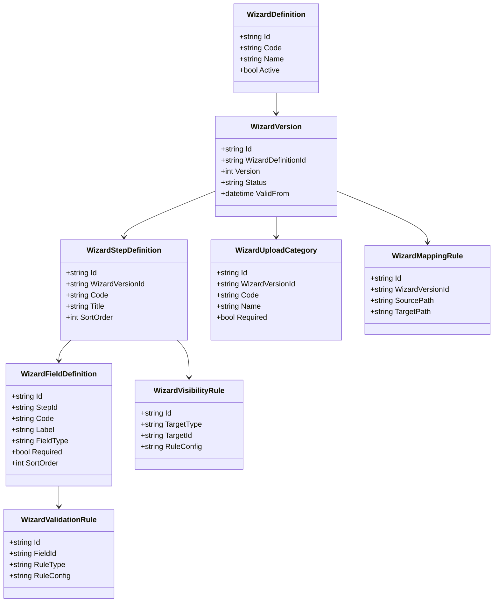
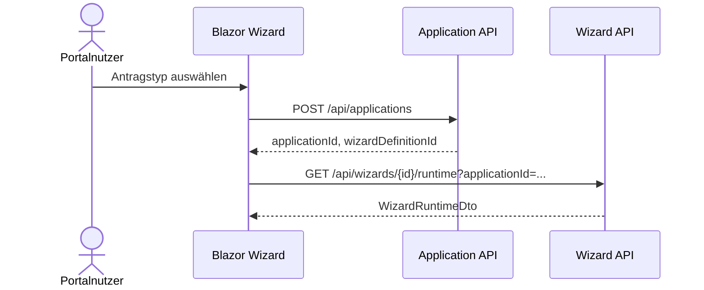
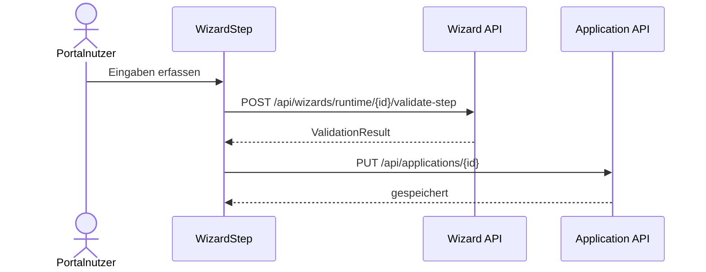
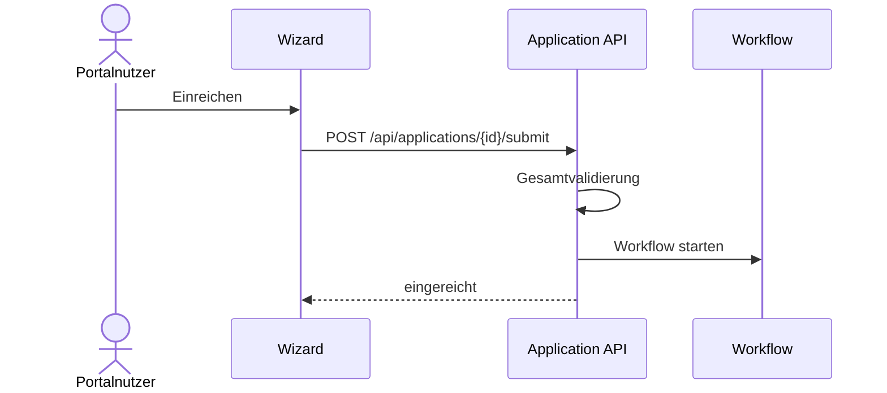

# Domäne Wizard

| Feld | Wert |
|---|---|
| Kapitel | 03 – Domänen |
| Dokument | Wizard |
| Status | Konsolidierter Arbeitsstand |
| Typ | Neuentwicklung / technisches Framework |
| Priorität | Sehr hoch |
| Leitquellen | `Quellen/2026-07-05_Snapshot1.txt`, `Quellen/2026-05_28_Lastenheft_SportFM.pdf` |

---

## 1 Zweck

Die Domäne **Wizard** stellt ein konfigurierbares Framework zur geführten Erfassung von Antragsdaten im SportFM-Portal bereit.

Der Wizard ist kein fachlicher Antrag und keine Workflow-Engine. Er ist die technische Eingabeoberfläche für Antragstypen der Domäne **Application**.

Ziel ist, mehrere Onlineantragsassistenten ohne hart codierte Einzelformulare abbilden zu können.

---

## 2 Projektbewertung

| Bereich | Bestand | Erweiterung | Neuentwicklung | Bewertung |
|---|:---:|:---:|:---:|---|
| Oracle |  |  | x | Konfiguration und Laufzeitdaten erforderlich |
| PL/SQL |  |  | x | Package / API für Definitionen und Validierung zu prüfen |
| REST |  |  | x | neue Wizard-API |
| DTO |  |  | x | neue Vertragsobjekte |
| Portal |  |  | x | Wizard Runtime und Komponenten |
| Application |  | x |  | enge Anbindung erforderlich |
| Upload |  | x |  | Upload-Schritte erforderlich |
| Workflow |  | x |  | Übergabe nach Einreichung über Application |
| Tests |  |  | x | neue Tests erforderlich |

---

## 3 Abgrenzung

### 3.1 Verantwortlich

Wizard ist verantwortlich für:

- Konfiguration von Antragsschritten,
- Konfiguration von Feldern,
- Pflichtfeldern,
- Sichtbarkeitsregeln,
- Eingabevalidierungen,
- Upload-Kategorien,
- Navigation zwischen Schritten,
- Zwischenspeicherung der Eingaben über Application,
- Anzeige von Validierungsfehlern,
- Bereitstellung einer wiederverwendbaren Portal-Laufzeitkomponente.

### 3.2 Nicht verantwortlich

Wizard ist nicht verantwortlich für:

- fachlichen Antragstatus,
- Workflowstatus,
- Arbeitskorb,
- Buchung,
- Gebühren,
- Rechnung,
- Dokumentengenerierung,
- physische Dateispeicherung,
- Authentifizierung,
- Berechtigungslogik außerhalb der Sichtbarkeits- und Eingaberegeln.

---

## 4 Architekturgrundsatz

Der Wizard ist ein technisches Framework.

Er darf keine fachliche Speziallogik einzelner Antragstypen enthalten.

Fachliche Unterschiede werden über Konfiguration abgebildet.

```text
ApplicationType
  ↓
WizardDefinition
  ↓
WizardStep
  ↓
WizardField
  ↓
ValidationRule
  ↓
VisibilityRule
  ↓
ApplicationPayload
```

---

## 5 Einordnung in die Plattform

```text
Portal / Blazor
  ↓
Wizard Runtime
  ↓
Wizard API
  ↓
Application API
  ↓
Application Payload
  ↓
Application Submit
  ↓
Workflow
```

Der Wizard verarbeitet Eingaben. Application speichert und bewertet den Antrag. Workflow übernimmt erst nach Einreichung.

---

## 6 Fachlicher Bezug

Das Lastenheft beschreibt Onlineantragsassistenten für unterschiedliche Nutzungsanträge. Vor dem korrekten Nutzungsantrag erfolgt eine Anliegensklärung. Danach werden themenbezogene Onlineantragsassistenten ausgefüllt.

Daraus folgt:

- Es gibt mehrere Antragstypen.
- Antragstypen unterscheiden sich in Schritten, Feldern, Pflichtangaben und Anlagen.
- Einzelnutzungen und Mehrfachnutzungen müssen unterstützt werden.
- Anlagen müssen hochgeladen werden können.
- Strukturierte Anlagen können für die spätere Übermittlung nach SportFM relevant sein.

---

## 7 Wizard-Struktur

Die im Snapshot festgelegte Zielstruktur wird übernommen:

```text
Antragstyp
 ├─ Schritte
 ├─ Felder
 ├─ Pflichtfelder
 ├─ Sichtbarkeitsregeln
 ├─ Validierungen
 ├─ Upload-Kategorien
 ├─ Datenmapping
 ├─ PDF-Ausgabe
 ├─ Workflow-Status
 └─ Übergabe an SportFM
```

Die Punkte **PDF-Ausgabe**, **Workflow-Status** und **Übergabe an SportFM** werden nicht im Wizard selbst umgesetzt, sondern über definierte Übergabepunkte an Application, Document, Workflow und Integration.

---

## 8 Business Objects

| Objekt | Zweck | Persistenz |
|---|---|---|
| `WizardDefinition` | vollständige Definition eines Wizards | neue Persistenz |
| `WizardVersion` | Version einer Definition | neue Persistenz |
| `WizardStepDefinition` | Schrittdefinition | neue Persistenz |
| `WizardFieldDefinition` | Felddefinition | neue Persistenz |
| `WizardValidationRule` | Validierungsregel | neue Persistenz |
| `WizardVisibilityRule` | Sichtbarkeitsregel | neue Persistenz |
| `WizardUploadCategory` | erwartete Anlagenkategorie | neue Persistenz |
| `WizardMappingRule` | Mapping in ApplicationPayload / SportFM-Zielstruktur | neue Persistenz |
| `WizardRuntimeState` | aktueller Zustand einer Ausführung | Application-bezogen |

### 8.1 Klassendiagramm



---

## 9 Feldtypen

Die folgenden Feldtypen sind für V1 vorzusehen:

| Feldtyp | Zweck |
|---|---|
| `Text` | einzeilige Texteingabe |
| `Textarea` | mehrzeilige Texteingabe |
| `Number` | numerische Eingabe |
| `Date` | Datum |
| `DateRange` | Zeitraum |
| `Time` | Uhrzeit |
| `TimeRange` | Zeitspanne |
| `Select` | Einfachauswahl |
| `MultiSelect` | Mehrfachauswahl |
| `Checkbox` | Zustimmung / Ja-Nein |
| `RadioGroup` | Auswahl aus Alternativen |
| `FacilitySelect` | Sportanlage auswählen |
| `SportTypeSelect` | Sportart auswählen |
| `OrganisationSelect` | Organisation / Verein auswählen |
| `Upload` | Anlagen erfassen |
| `Repeater` | Wiederholbare Datengruppe, z. B. mehrere Termine |

Weitere Feldtypen sind nach V1 gesondert zu bewerten.

---

## 10 Fachliche Regeln

| ID | Regel |
|---|---|
| WIZ-BR-001 | Jeder Antragstyp referenziert genau eine aktive Wizarddefinition. |
| WIZ-BR-002 | Eine Wizarddefinition kann versioniert werden. |
| WIZ-BR-003 | Laufende Anträge verwenden die zum Erstellzeitpunkt gültige Wizardversion. |
| WIZ-BR-004 | Der Wizard speichert keine fachlichen Status. |
| WIZ-BR-005 | Eingaben werden als strukturierter Payload an Application übergeben. |
| WIZ-BR-006 | Pflichtfelder können schritt- oder feldbezogen definiert werden. |
| WIZ-BR-007 | Sichtbarkeitsregeln dürfen Felder und Schritte ausblenden. |
| WIZ-BR-008 | Upload-Kategorien werden fachlich definiert, die Dateiablage erfolgt über Upload. |
| WIZ-BR-009 | Einreichen erfolgt ausschließlich über Application. |
| WIZ-BR-010 | Der Wizard löst keinen Workflow direkt aus. |
| WIZ-BR-011 | Konfigurationsänderungen dürfen bestehende Entwürfe nicht beschädigen. |
| WIZ-BR-012 | Fachliche Spezialfälle werden nicht im Portalcode hart codiert. |

---

## 11 Laufzeitablauf

```text
Benutzer wählt Antragstyp
  ↓
Application erzeugt Antrag im Status DRAFT
  ↓
Wizard lädt Definition und Version
  ↓
Wizard rendert Schritte und Felder
  ↓
Benutzer erfasst Daten
  ↓
Wizard validiert clientnah
  ↓
Application speichert Payload
  ↓
Benutzer lädt Anlagen hoch
  ↓
Application validiert Gesamtantrag
  ↓
Application reicht Antrag ein
```

---

## 12 Sequenzdiagramme

### 12.1 Wizard starten



### 12.2 Schritt speichern



### 12.3 Einreichen



---

## 13 REST-API

| ID | Methode | Pfad | Zweck |
|---|---|---|---|
| WIZ-API-001 | `GET` | `/api/wizards` | verfügbare Wizarddefinitionen lesen |
| WIZ-API-002 | `GET` | `/api/wizards/{id}` | Wizarddefinition lesen |
| WIZ-API-003 | `GET` | `/api/wizards/{id}/versions/{version}` | konkrete Version lesen |
| WIZ-API-004 | `GET` | `/api/wizards/{id}/runtime` | Runtime-Modell für Antrag laden |
| WIZ-API-005 | `POST` | `/api/wizards/runtime/{runtimeId}/validate-step` | Schritt validieren |
| WIZ-API-006 | `POST` | `/api/wizards/runtime/{runtimeId}/validate` | vollständigen Wizard validieren |
| WIZ-API-007 | `GET` | `/api/wizards/{id}/upload-categories` | Upload-Kategorien lesen |
| WIZ-API-008 | `GET` | `/api/wizards/{id}/mapping` | Mappingregeln lesen |

Konfigurationspflege ist für V1 nur aufzunehmen, wenn sie fachlich beauftragt wird. Andernfalls werden Wizarddefinitionen administrativ / technisch gepflegt.

---

## 14 DTOs

### 14.1 `WizardDefinitionDto`

| Feld | Typ | Pflicht |
|---|---|:---:|
| `id` | string | ja |
| `code` | string | ja |
| `name` | string | ja |
| `activeVersion` | int | ja |
| `steps` | array | ja |

### 14.2 `WizardStepDto`

| Feld | Typ | Pflicht |
|---|---|:---:|
| `id` | string | ja |
| `code` | string | ja |
| `title` | string | ja |
| `sortOrder` | int | ja |
| `fields` | array | ja |
| `visibilityRule` | object | nein |

### 14.3 `WizardFieldDto`

| Feld | Typ | Pflicht |
|---|---|:---:|
| `id` | string | ja |
| `code` | string | ja |
| `label` | string | ja |
| `fieldType` | string | ja |
| `required` | boolean | ja |
| `options` | array | nein |
| `validationRules` | array | nein |
| `visibilityRule` | object | nein |
| `mappingPath` | string | nein |

### 14.4 `WizardRuntimeDto`

| Feld | Typ | Pflicht |
|---|---|:---:|
| `runtimeId` | string | ja |
| `applicationId` | string | ja |
| `wizardDefinition` | `WizardDefinitionDto` | ja |
| `currentStep` | string | nein |
| `payload` | object | ja |
| `validation` | `ValidationResultDto` | nein |

### 14.5 `WizardValidationResultDto`

| Feld | Typ | Pflicht |
|---|---|:---:|
| `success` | boolean | ja |
| `errors` | array | ja |
| `warnings` | array | nein |
| `stepErrors` | array | nein |

---

## 15 Services

| Service | Verantwortung |
|---|---|
| `WizardDefinitionService` | Definitionen und Versionen lesen |
| `WizardRuntimeService` | Runtime-Modell aufbauen |
| `WizardValidationService` | Wizard- und Schrittvalidierung |
| `WizardVisibilityService` | Sichtbarkeitsregeln auswerten |
| `WizardMappingService` | Payload-Mapping vorbereiten |
| `WizardUploadService` | Upload-Kategorien bereitstellen, Upload selbst delegieren |

Services enthalten keine Application- oder Workflowentscheidung.

---

## 16 Repository

| Repository | Zweck |
|---|---|
| `WizardDefinitionRepository` | Definitionen lesen / speichern |
| `WizardVersionRepository` | Versionen lesen |
| `WizardStepRepository` | Schritte lesen |
| `WizardFieldRepository` | Felder lesen |
| `WizardRuleRepository` | Validierungs- und Sichtbarkeitsregeln lesen |
| `WizardMappingRepository` | Mappingregeln lesen |

Repositories enthalten keine Geschäftslogik.

---

## 17 Oracle und PL/SQL

### 17.1 Neue / zu prüfende Persistenz

| Objekt | Zweck | Status |
|---|---|---|
| `LHD_SPA_WIZARDS` | Wizarddefinitionen | zu prüfen / voraussichtlich neu |
| `LHD_SPA_WIZARD_VERSIONS` | Versionen | zu prüfen / voraussichtlich neu |
| `LHD_SPA_WIZARD_STEPS` | Schritte | zu prüfen / voraussichtlich neu |
| `LHD_SPA_WIZARD_FIELDS` | Felder | zu prüfen / voraussichtlich neu |
| `LHD_SPA_WIZARD_RULES` | Validierungs-/Sichtbarkeitsregeln | zu prüfen / voraussichtlich neu |
| `LHD_SPA_WIZARD_UPLOAD_CATEGORIES` | Upload-Kategorien | zu prüfen / voraussichtlich neu |
| `LHD_SPA_WIZARD_MAPPINGS` | Mappingregeln | zu prüfen / voraussichtlich neu |

### 17.2 Package-Zuordnung

| Package | Zweck | Status |
|---|---|---|
| `PA_LHD_SPA_WIZARD` | Wizarddefinitionen und Runtime lesen | vorgeschlagene Zielstruktur, noch zu bestätigen |
| `PA_LHD_SPA_WIZARD_VALIDATION` | Validierungsregeln auswerten | vorgeschlagene Zielstruktur, noch zu bestätigen |

---

## 18 Blazor-Frontend

### 18.1 Seiten

| ID | Seite | Route | Zweck |
|---|---|---|---|
| WIZ-PAGE-001 | Wizard Runtime | `/applications/{id}/wizard` | geführte Antragserfassung |
| WIZ-PAGE-002 | Wizard Vorschau | `/admin/wizards/{id}/preview` | nur falls Admin-Funktion V1 |
| WIZ-PAGE-003 | Wizard Konfiguration | `/admin/wizards` | nur falls Konfigurationspflege V1 |

### 18.2 Komponenten

| Komponente | Zweck |
|---|---|
| `WizardHost` | Hauptcontainer |
| `WizardNavigation` | Schrittnavigation |
| `WizardStepRenderer` | rendert Schritt |
| `WizardFieldRenderer` | rendert Feld anhand Feldtyp |
| `WizardValidationSummary` | Validierungsfehler anzeigen |
| `WizardProgressIndicator` | Fortschritt anzeigen |
| `WizardUploadSection` | Upload-Kategorien anzeigen |
| `WizardSaveDraftButton` | Entwurf speichern |
| `WizardSubmitButton` | Einreichen über Application |
| `WizardCancelButton` | Bearbeitung abbrechen |

---

## 19 Validierungen

| ID | Validierung | Ebene |
|---|---|---|
| WIZ-VAL-001 | Pflichtfeld gefüllt | Wizard |
| WIZ-VAL-002 | Datentyp korrekt | Wizard |
| WIZ-VAL-003 | Wertebereich korrekt | Wizard |
| WIZ-VAL-004 | Sichtbarkeitsregel korrekt ausgewertet | Wizard |
| WIZ-VAL-005 | Pflichtanlage vorhanden | Wizard / Application / Upload |
| WIZ-VAL-006 | wiederholbare Gruppe vollständig | Wizard |
| WIZ-VAL-007 | Mappingziel vorhanden | Wizard / Application |
| WIZ-VAL-008 | Antrag weiterhin im bearbeitbaren Status | Application |

---

## 20 Berechtigungen

| Berechtigung | Zweck |
|---|---|
| `Wizard.Read` | Wizarddefinition lesen |
| `Wizard.Runtime.Read` | Runtime-Modell lesen |
| `Wizard.Runtime.Validate` | Schritt / Wizard validieren |
| `Wizard.Admin.Read` | Konfiguration lesen |
| `Wizard.Admin.Write` | Konfiguration ändern, nur falls V1 |

Die Nutzung eines Wizards ist zusätzlich an `Application.Create` bzw. `Application.UpdateDraft` gebunden.

---

## 21 Testfälle

| Testfall | Beschreibung |
|---|---|
| TF-WIZ-001 | Wizarddefinition laden |
| TF-WIZ-002 | aktive Version verwenden |
| TF-WIZ-003 | Schritte in korrekter Reihenfolge anzeigen |
| TF-WIZ-004 | Pflichtfeldvalidierung schlägt fehl |
| TF-WIZ-005 | Sichtbarkeitsregel blendet Feld aus |
| TF-WIZ-006 | Entwurf speichern über Application |
| TF-WIZ-007 | Upload-Kategorie anzeigen |
| TF-WIZ-008 | vollständigen Wizard validieren |
| TF-WIZ-009 | Einreichen delegiert an Application |
| TF-WIZ-010 | Änderung an Wizarddefinition beschädigt bestehenden Entwurf nicht |
| TF-WIZ-011 | Repeater-Gruppe speichert mehrere Datensätze |
| TF-WIZ-012 | nicht berechtigter Zugriff wird verhindert |

---

## 22 Arbeitspakete

| AP | Titel | Inhalt |
|---|---|---|
| AP-WIZ-001 | Wizardmodell | Definition, Version, Schritt, Feld, Regel |
| AP-WIZ-002 | Oracle-Konzept | Tabellenprüfung, neue Tabellen, Package-Zuordnung |
| AP-WIZ-003 | REST | Controller, DTOs, Fehlerformat |
| AP-WIZ-004 | DefinitionService | Definitionen und Versionen lesen |
| AP-WIZ-005 | RuntimeService | Runtime-Modell erzeugen |
| AP-WIZ-006 | ValidationService | Regeln auswerten |
| AP-WIZ-007 | VisibilityService | Sichtbarkeit auswerten |
| AP-WIZ-008 | MappingService | Payload-Mapping |
| AP-WIZ-009 | Blazor Runtime | Host, Navigation, Renderer |
| AP-WIZ-010 | Feldkomponenten | Standardfeldtypen |
| AP-WIZ-011 | Upload-Anbindung | Upload-Kategorien und Pflichtanlagen |
| AP-WIZ-012 | Tests | Unit-, Integrations- und UI-Tests |
| AP-WIZ-013 | Dokumentation | API, Konfiguration, Betriebshinweise |

---

## 23 Aufwandstreiber

| Treiber | Einfluss |
|---|---|
| Anzahl Antragstypen | sehr hoch |
| Anzahl Feldtypen | hoch |
| Sichtbarkeitsregeln | hoch |
| Validierungsregeln | hoch |
| wiederholbare Gruppen | hoch |
| Upload-Kategorien | mittel bis hoch |
| Versionierung | hoch |
| Admin-Konfigurationsoberfläche | sehr hoch |
| Mapping nach Application / SportFM | hoch |
| UI-Testaufwand | hoch |

Konkrete Personentage werden erst nach finaler Entscheidung getroffen, ob Wizarddefinitionen in V1 nur technisch gepflegt oder über eine Administrationsoberfläche bearbeitet werden.

---

## 24 Risiken

| Risiko | Bewertung | Maßnahme |
|---|---|---|
| Wizard wird zu komplex | hoch | V1 bewusst schlank halten |
| Admin-Designer sprengt V1 | hoch | Admin-Konfiguration als offener Punkt |
| Fachlogik wandert in Wizard | hoch | klare Abgrenzung zu Application / Workflow |
| Versionierung unterschätzt | hoch | Versionierung von Beginn an berücksichtigen |
| Sichtbarkeitsregeln werden unwartbar | mittel | Regelmodell begrenzen |
| Mapping nach SportFM unklar | hoch | Mappingmatrix je Antragstyp erstellen |
| Pflichtanlagen nicht final | hoch | Anlagenmatrix erstellen |

---

## 25 Offene Punkte

| ID | Offener Punkt | Relevanz |
|---|---|---|
| OP-WIZ-001 | finale Antragstypen V1 | hoch |
| OP-WIZ-002 | finale Schrittstruktur je Antragstyp | hoch |
| OP-WIZ-003 | finale Feldliste je Antragstyp | hoch |
| OP-WIZ-004 | Pflichtanlagen je Antragstyp | hoch |
| OP-WIZ-005 | Pflege der Wizarddefinitionen technisch oder über Admin-UI | sehr hoch |
| OP-WIZ-006 | Umfang Sichtbarkeitsregeln V1 | hoch |
| OP-WIZ-007 | Umfang Repeater / Mehrfachnutzungen V1 | hoch |
| OP-WIZ-008 | finales Mapping nach ApplicationPayload / SportFM | hoch |

---

## 26 Traceability-Matrix

| Quelle | Funktion | REST | Service | UI | Test | AP |
|---|---|---|---|---|---|---|
| Snapshot Wizard-Framework | Wizarddefinition laden | WIZ-API-002 | WizardDefinitionService | WizardHost | TF-WIZ-001 | AP-WIZ-003/004 |
| Lastenheft Onlineantrag | Antragsschritte ausfüllen | WIZ-API-004 | WizardRuntimeService | WizardStepRenderer | TF-WIZ-003 | AP-WIZ-005/009 |
| Lastenheft Pflichtangaben | Pflichtfeld prüfen | WIZ-API-005 | WizardValidationService | ValidationSummary | TF-WIZ-004 | AP-WIZ-006 |
| Lastenheft Upload | Anlagen hochladen | WIZ-API-007 | WizardUploadService | WizardUploadSection | TF-WIZ-007 | AP-WIZ-011 |
| Application.md | Einreichen | Application API | ApplicationSubmissionService | WizardSubmitButton | TF-WIZ-009 | AP-WIZ-009 |

---

## 27 Änderungsauswirkungen

Änderungen an `Wizard.md` wirken sich aus auf:

- `03_Domaenen/Application.md`,
- `03_Domaenen/Upload.md`,
- `03_Domaenen/Workflow.md`,
- `04_REST_API/Endpunkte.md`,
- `04_REST_API/DTOs.md`,
- `05_Datenmodell/Tabellen.md`,
- `05_Datenmodell/Packages.md`,
- `06_Arbeitspakete/Arbeitspaketliste.md`,
- `07_Kalkulation/Variantenvergleich_Wizard.md`,
- `07_Kalkulation/Aufwandsschaetzung.md`,
- `09_Testkonzept/Testfaelle.md`,
- `11_Entscheidungen/ADR_002_Wizard_Framework.md`,
- `12_Offene_Punkte/Offene_Punkte.md`.

---

## 28 Ergebnis

Die Domäne Wizard ist als wiederverwendbares technisches Framework spezifiziert.

Sie stellt die konfigurierbare Erfassung von Antragsdaten bereit und bleibt fachlich strikt von Application und Workflow getrennt.

Die konkrete Kalkulation bleibt abhängig von:

- finaler Antragstypenliste,
- finaler Schritt- und Feldmatrix,
- Pflichtanlagenmatrix,
- Entscheidung Admin-UI vs. technische Konfiguration,
- bestätigt zu unterstützenden Feldtypen,
- finalem Mapping nach Application und SportFM.
