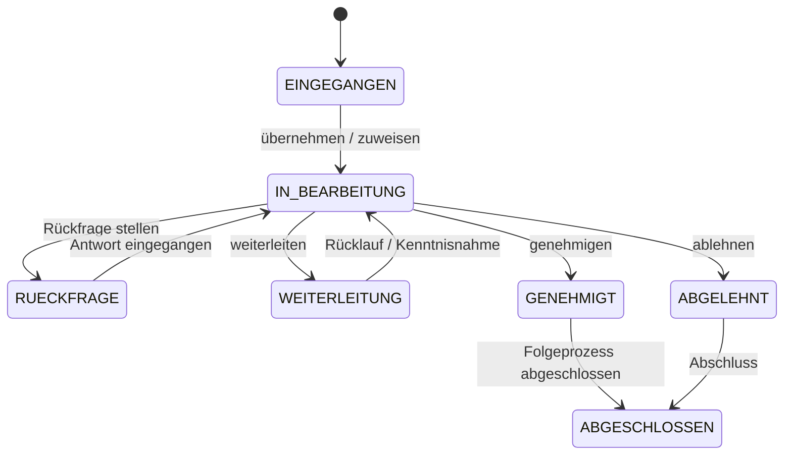
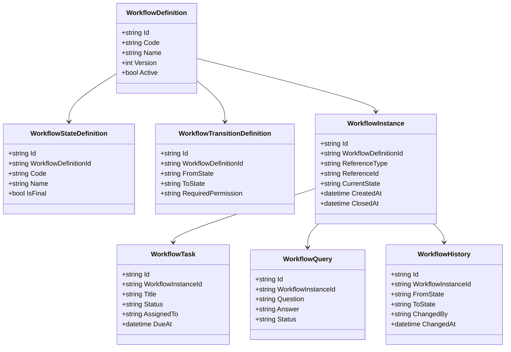
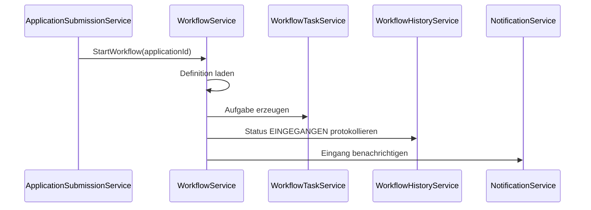
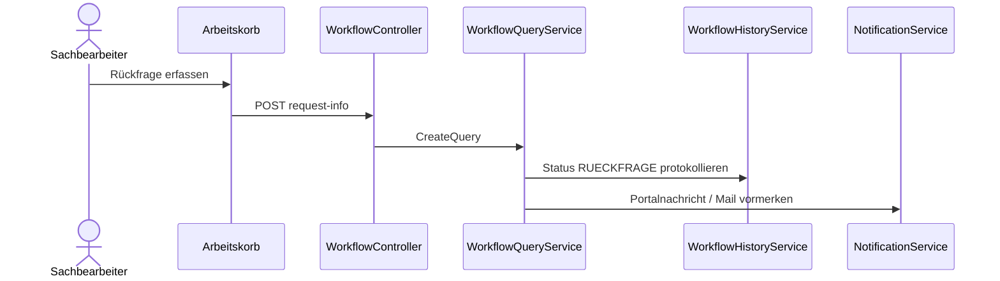
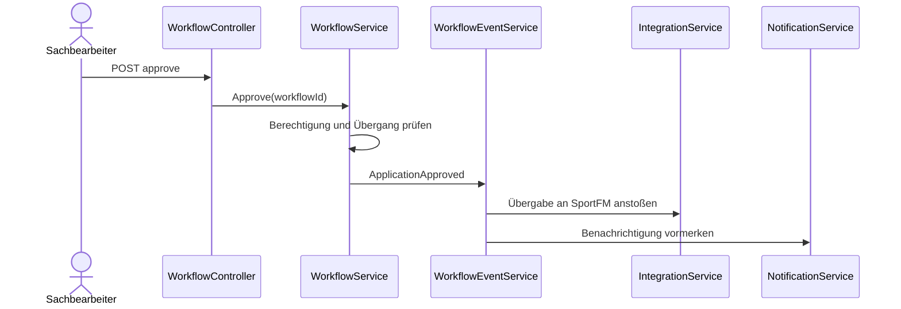

# Domäne Workflow

| Feld | Wert |
|---|---|
| Kapitel | 03 – Domänen |
| Dokument | Workflow |
| Status | Konsolidierter Arbeitsstand |
| Typ | Neuentwicklung |
| Priorität | Sehr hoch |
| Leitquellen | `Quellen/2026-07-05_Snapshot1.txt`, `Quellen/2026-05_28_Lastenheft_SportFM.pdf` |

---

## 1 Zweck

Die Domäne **Workflow** steuert die fachliche Bearbeitung eingereichter Anträge.

Sie bildet Status, Zuständigkeiten, Bearbeiter, Aufgaben, Rückfragen, Weiterleitungen, Historie und Fristen ab.

Workflow ist eine generische Plattformdomäne und darf keine fachliche Speziallogik aus Buchung, Gebühren, Rechnung oder Dokumentenerzeugung enthalten.

---

## 2 Projektbewertung

| Bereich | Bestand | Erweiterung | Neuentwicklung | Bewertung |
|---|:---:|:---:|:---:|---|
| Oracle |  |  | x | neue Workflow-Persistenz erforderlich |
| PL/SQL |  |  | x | Package / API für Status, Aufgaben, Historie erforderlich |
| REST |  |  | x | neue fachliche Workflow-API |
| DTO |  |  | x | neue Vertragsobjekte |
| Portal |  |  | x | Arbeitskorb, Aufgaben, Rückfragen |
| SportFM |  | x |  | Übergabe an bestehende Fachlogik |
| Tests |  |  | x | neue Tests erforderlich |

---

## 3 Abgrenzung

### 3.1 Verantwortlich

Workflow ist verantwortlich für:

- Workflowinstanzen,
- Workflowdefinitionen,
- Status,
- Statuswechsel,
- Aufgaben,
- Zuständigkeiten,
- Bearbeiter,
- Arbeitskörbe,
- Rückfragen,
- Antworten auf Rückfragen,
- Weiterleitungen,
- Fristen,
- Historie,
- Audit,
- Auslösen definierter Folgeereignisse.

### 3.2 Nicht verantwortlich

Workflow ist nicht verantwortlich für:

- Buchungserstellung,
- Reservierungslogik,
- Gebührenberechnung,
- Rechnungserstellung,
- Dokumentenerzeugung,
- Dateispeicherung,
- E-Mail-Versand,
- Antragserfassung,
- Wizard-Logik.

Diese Abgrenzung ist verbindlich: Workflow entscheidet nicht fachlich über Buchungen oder Rechnungen, sondern löst bei definierten Ereignissen die zuständigen Domänen oder Integrationsservices aus.

---

## 4 Architekturgrundsatz

Der Workflow kennt keine fachliche Detaildomäne.

Er kennt ausschließlich:

- Vorgang,
- Status,
- Aufgabe,
- Bearbeiter,
- Zuständigkeit,
- Historie,
- Ereignis.

Er weiß nicht:

- was eine konkrete Buchung ist,
- wie Gebühren berechnet werden,
- wie Rechnungen erzeugt werden,
- wie Dokumente generiert werden,
- wie Sportstätten fachlich geprüft werden.

Dadurch bleibt Workflow als Framework wiederverwendbar.

---

## 5 Einordnung in die Plattform

```text
Application
  ↓
Workflow
  ↓
Integration
  ↓
Booking / Document / Charge / Invoice
  ↓
Notification
```

Workflow ist die Steuerungsdomäne nach Einreichung eines Antrags.

Application startet den Workflow.

Integration übernimmt fachliche Übergänge in bestehende SportFM-Domänen.

Notification übernimmt Benachrichtigungen und Mailversand asynchron.

---

## 6 Fachlicher Standardablauf

```text
Antrag eingereicht
  ↓
Workflowinstanz erzeugen
  ↓
Aufgabe im Arbeitskorb erzeugen
  ↓
Sachbearbeiter zuweisen
  ↓
fachliche Prüfung
  ↓
Entscheidung
  ├─ Rückfrage
  ├─ Weiterleitung
  ├─ Genehmigung
  └─ Ablehnung
```

### 6.1 Standardworkflow

```text
EINGEGANGEN
  ↓
IN_BEARBEITUNG
  ↓
RUECKFRAGE
  ↓
IN_BEARBEITUNG
  ↓
GENEHMIGT
  ↓
UEBERGABE_SPORTFM
  ↓
ABGESCHLOSSEN
```

Alternative:

```text
IN_BEARBEITUNG
  ↓
ABGELEHNT
  ↓
ABGESCHLOSSEN
```

---

## 7 Statusmodell

| Status | Bedeutung | Quelle / Ableitung |
|---|---|---|
| `EINGEGANGEN` | Antrag liegt im Arbeitskorb vor | Lastenheft Modul Antrag |
| `IN_BEARBEITUNG` | Antrag wird fachlich geprüft | Lastenheft Modul Antrag |
| `RUECKFRAGE` | Rückfrage an Antragsteller oder Zuarbeit erforderlich | Lastenheft Modul Antrag |
| `WEITERLEITUNG` | Weiterleitung zur Kenntnis oder Zuarbeit | Lastenheft Modul Antrag |
| `GENEHMIGT` | Antrag fachlich genehmigt | Lastenheft Modul Antrag |
| `ABGELEHNT` | Antrag fachlich abgelehnt | Lastenheft Modul Antrag |
| `ABGESCHLOSSEN` | Workflow beendet | Workflow-Ableitung |

### 7.1 Zustandsdiagramm



---

## 8 Business Objects

| Objekt | Zweck | Persistenz |
|---|---|---|
| `WorkflowDefinition` | konfigurierbarer Workflowtyp | neue Persistenz |
| `WorkflowStateDefinition` | erlaubte Status | neue Persistenz |
| `WorkflowTransitionDefinition` | erlaubte Statusübergänge | neue Persistenz |
| `WorkflowInstance` | laufender Bearbeitungsprozess | neue Persistenz |
| `WorkflowTask` | konkrete Aufgabe | neue Persistenz |
| `WorkflowAssignment` | Zuständigkeit / Bearbeiter | neue Persistenz |
| `WorkflowQuery` | Rückfrage | neue Persistenz |
| `WorkflowComment` | Bemerkung / Notiz | neue Persistenz |
| `WorkflowHistory` | unveränderbare Historie | neue Persistenz / Audit |
| `WorkflowEvent` | fachliches Ereignis | neue Persistenz / transient |

### 8.1 Klassendiagramm



---

## 9 Fachliche Regeln

| ID | Regel |
|---|---|
| WFL-BR-001 | Jeder eingereichte Antrag besitzt genau eine Workflowinstanz. |
| WFL-BR-002 | Jede Workflowinstanz besitzt genau einen aktuellen Status. |
| WFL-BR-003 | Statuswechsel sind nur erlaubt, wenn sie in der Workflowdefinition konfiguriert sind. |
| WFL-BR-004 | Jeder Statuswechsel wird unveränderbar historisiert. |
| WFL-BR-005 | Jeder Statuswechsel enthält Zeitpunkt, Bearbeiter und optional Bemerkung. |
| WFL-BR-006 | Rückfragen werden als Workflowobjekt abgebildet. |
| WFL-BR-007 | Rückfragen bleiben dem ursprünglichen Antrag zugeordnet. |
| WFL-BR-008 | Nachgereichte Anlagen bleiben dem bestehenden Antrag zugeordnet. |
| WFL-BR-009 | Genehmigung löst ein Ereignis aus, erzeugt aber keine Buchung selbst. |
| WFL-BR-010 | Ablehnung benötigt eine Begründung. |
| WFL-BR-011 | Workflow versendet keine E-Mails direkt. |
| WFL-BR-012 | Workflow kennt keine Oracle-Fachlogik aus Booking, Charge, Invoice oder Document. |

---

## 10 Arbeitskorb

### 10.1 Zweck

Der Arbeitskorb zeigt fachlich zu bearbeitende Anträge und Aufgaben für Sachbearbeiter.

Im Lastenheft ist beschrieben, dass Anträge aus dem Onlineportal in der Rubrik **Anträge** in einem Arbeitskorb eingehen und nach Zuständigkeit, Sportanlagen oder Status filterbar sein müssen.

### 10.2 Arbeitskorb-Felder

| Feld | Beschreibung |
|---|---|
| `TaskId` | technische Aufgaben-ID |
| `ApplicationId` | zugehöriger Antrag |
| `Anliegen` | Anliegensklärung / Anliegen |
| `Status` | aktueller Workflowstatus |
| `Sachbearbeiter` | zuständige Person |
| `BearbeitetVon` | aktuell oder zuletzt bearbeitende Person |
| `Sportanlage` | betroffene Sportanlage, soweit vorhanden |
| `FaelligAm` | Frist, falls konfiguriert |
| `ErstelltAm` | Eingang im Arbeitskorb |

### 10.3 Filter

Der Arbeitskorb muss mindestens unterstützen:

- Zuständigkeit,
- Sportanlage,
- Status,
- Bearbeiter,
- Anliegen,
- Frist.

---

## 11 Menüstruktur der Bearbeitung

Für die Bearbeitung eines Antrags ergibt sich aus dem Lastenheft folgende Menüstruktur:

| Menü | Inhalt | Zugeordnete Domäne |
|---|---|---|
| Übersicht | Antragsdaten, Antragsteller, Verein, Sportanlage, Sportart, Nutzungszeitraum | Application |
| Dokumente | Nutzungsantrag und Anlagen | Document / Upload |
| Notizen | Bearbeitungsnotizen | Workflow |
| Nachrichten | Verlauf zum Austausch | Notification / Workflow |
| Protokoll | Änderungsstatus / Historie | Workflow |

Workflow verantwortet dabei insbesondere Notizen, Nachrichtenbezug und Protokoll / Historie.

---

## 12 Rückfragen

### 12.1 Ablauf

```text
Sachbearbeiter stellt Rückfrage
  ↓
Workflowstatus = RUECKFRAGE
  ↓
Notification erzeugt Portalnachricht / Mailqueue
  ↓
Antragsteller beantwortet Rückfrage im Portal
  ↓
Workflowstatus = IN_BEARBEITUNG
  ↓
Sachbearbeiter erhält neue Aufgabe
```

### 12.2 Regeln

| ID | Regel |
|---|---|
| WFL-QRY-001 | Rückfragen benötigen einen Nachrichtentext. |
| WFL-QRY-002 | Rückfragen können Anlagenanforderungen enthalten. |
| WFL-QRY-003 | Antworten werden historisiert. |
| WFL-QRY-004 | Nachgereichte Anlagen werden Application / Upload zugeordnet. |
| WFL-QRY-005 | Rückfragekommunikation wird nicht als freie E-Mail ohne Systembezug geführt. |

---

## 13 Genehmigung und Ablehnung

### 13.1 Genehmigung

```text
IN_BEARBEITUNG
  ↓
fachliche Prüfung abgeschlossen
  ↓
GENEHMIGT
  ↓
WorkflowEvent ApplicationApproved
  ↓
Integration übernimmt Übergabe an SportFM
  ↓
Notification informiert Antragsteller
  ↓
Historie wird geschrieben
```

Regeln:

- Genehmigung nur durch berechtigte Sachbearbeiter.
- Genehmigung erzeugt keine Buchung im Workflow.
- Die Übergabe an SportFM erfolgt über Integration / zuständige Fachdomäne.
- Genehmigung wird auditiert.

### 13.2 Ablehnung

```text
IN_BEARBEITUNG
  ↓
ABLEHNEN mit Begründung
  ↓
ABGELEHNT
  ↓
Notification informiert Antragsteller
  ↓
Historie wird geschrieben
  ↓
ABGESCHLOSSEN
```

Regeln:

- Ablehnung benötigt eine Begründung.
- Nach Ablehnung ist der Vorgang für den Antragsteller nur lesend sichtbar.
- Ablehnung wird auditiert.

---

## 14 Ereignisse

| Ereignis | Auslöser | Empfänger |
|---|---|---|
| `WorkflowStarted` | Application reicht Antrag ein | Workflow / Audit |
| `TaskCreated` | Workflow erzeugt Aufgabe | Dashboard / Arbeitskorb |
| `TaskAssigned` | Aufgabe wird zugewiesen | Dashboard / Notification |
| `QuestionRequested` | Rückfrage gestellt | Notification / Application |
| `QuestionAnswered` | Antragsteller antwortet | Workflow / Arbeitskorb |
| `ApplicationApproved` | Antrag genehmigt | Integration |
| `ApplicationRejected` | Antrag abgelehnt | Notification |
| `WorkflowClosed` | Prozess beendet | Application / Audit |

---

## 15 REST-API

### 15.1 Endpunkte

| ID | Methode | Pfad | Zweck |
|---|---|---|---|
| WFL-API-001 | `POST` | `/api/workflows` | Workflow starten |
| WFL-API-002 | `GET` | `/api/workflows/{id}` | Workflow lesen |
| WFL-API-003 | `GET` | `/api/workflows/{id}/history` | Historie lesen |
| WFL-API-004 | `GET` | `/api/workbasket` | Arbeitskorb lesen |
| WFL-API-005 | `POST` | `/api/workflow-tasks/{id}/assign` | Aufgabe zuweisen |
| WFL-API-006 | `POST` | `/api/workflow-tasks/{id}/complete` | Aufgabe abschließen |
| WFL-API-007 | `POST` | `/api/workflows/{id}/transition` | Statuswechsel durchführen |
| WFL-API-008 | `POST` | `/api/workflows/{id}/request-info` | Rückfrage stellen |
| WFL-API-009 | `POST` | `/api/workflows/{id}/answer-info` | Rückfrage beantworten |
| WFL-API-010 | `POST` | `/api/workflows/{id}/approve` | Antrag genehmigen |
| WFL-API-011 | `POST` | `/api/workflows/{id}/reject` | Antrag ablehnen |

### 15.2 Keine öffentlichen Integrationsendpunkte

Fachliche Übergänge zu Booking, Document, Charge oder Invoice werden nicht über öffentliche Workflow-Endpunkte ausgeführt.

---

## 16 DTOs

### 16.1 `WorkflowStartDto`

| Feld | Typ | Pflicht |
|---|---|:---:|
| `referenceType` | string | ja |
| `referenceId` | string | ja |
| `workflowDefinitionCode` | string | ja |
| `contextId` | string | ja |

### 16.2 `WorkflowDto`

| Feld | Typ | Pflicht |
|---|---|:---:|
| `id` | string | ja |
| `referenceType` | string | ja |
| `referenceId` | string | ja |
| `currentState` | string | ja |
| `assignedTo` | string | nein |
| `createdAt` | datetime | ja |
| `closedAt` | datetime | nein |

### 16.3 `WorkbasketItemDto`

| Feld | Typ | Pflicht |
|---|---|:---:|
| `taskId` | string | ja |
| `workflowId` | string | ja |
| `applicationId` | string | ja |
| `concern` | string | ja |
| `status` | string | ja |
| `assignedTo` | string | nein |
| `handledBy` | string | nein |
| `facilityName` | string | nein |
| `dueAt` | datetime | nein |

### 16.4 `TransitionDto`

| Feld | Typ | Pflicht |
|---|---|:---:|
| `toState` | string | ja |
| `comment` | string | nein |
| `reason` | string | nein |

### 16.5 `RequestInfoDto`

| Feld | Typ | Pflicht |
|---|---|:---:|
| `message` | string | ja |
| `requiredAttachments` | array | nein |
| `dueAt` | datetime | nein |

### 16.6 `RejectDto`

| Feld | Typ | Pflicht |
|---|---|:---:|
| `reason` | string | ja |
| `comment` | string | nein |

---

## 17 Services

### 17.1 `WorkflowService`

Verantwortung:

- Workflow starten,
- Workflow lesen,
- Statuswechsel ausführen,
- Regeln prüfen,
- Ereignisse erzeugen.

### 17.2 `WorkflowTaskService`

Verantwortung:

- Aufgaben erzeugen,
- Aufgaben zuweisen,
- Aufgaben abschließen,
- Arbeitskorb bereitstellen.

### 17.3 `WorkflowQueryService`

Verantwortung:

- Rückfragen erstellen,
- Antworten entgegennehmen,
- Statuswechsel zwischen Rückfrage und Bearbeitung koordinieren.

### 17.4 `WorkflowHistoryService`

Verantwortung:

- Historie schreiben,
- Historie lesen,
- Unveränderbarkeit fachlich sicherstellen.

### 17.5 `WorkflowEventService`

Verantwortung:

- Workflowereignisse veröffentlichen,
- Integration / Notification entkoppelt anstoßen.

---

## 18 Repository

| Repository | Zweck |
|---|---|
| `WorkflowRepository` | Workflowinstanzen lesen / speichern |
| `WorkflowDefinitionRepository` | Definitionen lesen |
| `WorkflowTaskRepository` | Aufgaben lesen / speichern |
| `WorkflowQueryRepository` | Rückfragen lesen / speichern |
| `WorkflowHistoryRepository` | Historie schreiben / lesen |

Repositories enthalten keine Geschäftslogik.

---

## 19 Oracle und PL/SQL

### 19.1 Neue / zu prüfende Persistenz

Die Quellen belegen kein vorhandenes generisches Workflowdatenmodell. Daher sind neue Persistenzobjekte zu prüfen:

| Objekt | Zweck | Status |
|---|---|---|
| `LHD_SPA_WORKFLOWS` | Workflowinstanzen | zu prüfen / voraussichtlich neu |
| `LHD_SPA_WORKFLOW_DEFINITIONS` | Workflowdefinitionen | zu prüfen / voraussichtlich neu |
| `LHD_SPA_WORKFLOW_STATES` | Statusdefinitionen | zu prüfen / voraussichtlich neu |
| `LHD_SPA_WORKFLOW_TRANSITIONS` | erlaubte Übergänge | zu prüfen / voraussichtlich neu |
| `LHD_SPA_WORKFLOW_TASKS` | Aufgaben | zu prüfen / voraussichtlich neu |
| `LHD_SPA_WORKFLOW_QUERIES` | Rückfragen | zu prüfen / voraussichtlich neu |
| `LHD_SPA_WORKFLOW_HISTORY` | Historie | zu prüfen / voraussichtlich neu |

### 19.2 Package-Zuordnung

| Package | Zweck | Status |
|---|---|---|
| `PA_LHD_SPA_WORKFLOW` | Workflow-Funktionen | vorgeschlagene Zielstruktur, noch zu bestätigen |
| `PA_LHD_SPA_WORKBASKET` | Arbeitskorb-Funktionen | vorgeschlagene Zielstruktur, noch zu bestätigen |

---

## 20 Blazor-Frontend

### 20.1 Seiten

| ID | Seite | Route | Zweck |
|---|---|---|---|
| WFL-PAGE-001 | Arbeitskorb | `/workbasket` | Aufgabenliste für Sachbearbeiter |
| WFL-PAGE-002 | Workflowdetails | `/workflows/{id}` | Bearbeitungsübersicht |
| WFL-PAGE-003 | Rückfrage | `/workflows/{id}/request-info` | Rückfrage erfassen |
| WFL-PAGE-004 | Historie | `/workflows/{id}/history` | Protokoll / Statushistorie |
| WFL-PAGE-005 | Aufgabe bearbeiten | `/workflow-tasks/{id}` | Einzelaufgabe bearbeiten |

### 20.2 Komponenten

| Komponente | Zweck |
|---|---|
| `WorkbasketGrid` | Arbeitskorbliste |
| `WorkflowStatusBadge` | Statusanzeige |
| `WorkflowTimeline` | Historie / Protokoll |
| `TaskAssignmentSelector` | Bearbeiterzuweisung |
| `RequestInfoDialog` | Rückfrage erfassen |
| `ApproveButton` | Genehmigung |
| `RejectButton` | Ablehnung |
| `ForwardTaskDialog` | Weiterleitung |
| `WorkflowCommentBox` | Notizen / Bemerkungen |

---

## 21 Sequenzdiagramme

### 21.1 Workflow starten



### 21.2 Rückfrage stellen



### 21.3 Genehmigung



---

## 22 Berechtigungen

| Berechtigung | Zweck |
|---|---|
| `Workflow.Read` | Workflow lesen |
| `Workflow.Start` | Workflow starten |
| `Workflow.Transition` | Statuswechsel durchführen |
| `Workflow.Assign` | Aufgabe zuweisen |
| `Workflow.Task.Complete` | Aufgabe abschließen |
| `Workflow.RequestInfo` | Rückfrage stellen |
| `Workflow.AnswerInfo` | Rückfrage beantworten |
| `Workflow.Approve` | genehmigen |
| `Workflow.Reject` | ablehnen |
| `Workflow.History.Read` | Historie lesen |
| `Workbasket.Read` | Arbeitskorb anzeigen |

Berechtigungen sind kontext- und zuständigkeitsbezogen zu prüfen.

---

## 23 Validierungen

| ID | Validierung | Ebene |
|---|---|---|
| WFL-VAL-001 | Workflowinstanz existiert | Workflow |
| WFL-VAL-002 | Statusübergang erlaubt | WorkflowDefinition |
| WFL-VAL-003 | Benutzer berechtigt | Authorization / Context |
| WFL-VAL-004 | Aufgabe offen | WorkflowTask |
| WFL-VAL-005 | Ablehnung enthält Begründung | Workflow |
| WFL-VAL-006 | Rückfrage enthält Nachricht | WorkflowQuery |
| WFL-VAL-007 | Antwort auf Rückfrage gehört zum Vorgang | WorkflowQuery |
| WFL-VAL-008 | finaler Status nicht erneut änderbar | Workflow |

---

## 24 Testfälle

| Testfall | Beschreibung |
|---|---|
| TF-WFL-001 | Workflow starten |
| TF-WFL-002 | Aufgabe im Arbeitskorb erzeugen |
| TF-WFL-003 | Aufgabe zuweisen |
| TF-WFL-004 | Status wechseln |
| TF-WFL-005 | unzulässigen Statuswechsel verhindern |
| TF-WFL-006 | Rückfrage erzeugen |
| TF-WFL-007 | Rückfrage beantworten |
| TF-WFL-008 | Aufgabe abschließen |
| TF-WFL-009 | Antrag genehmigen |
| TF-WFL-010 | Antrag ablehnen mit Begründung |
| TF-WFL-011 | Ablehnung ohne Begründung verhindern |
| TF-WFL-012 | Historie schreiben |
| TF-WFL-013 | fremde Zuständigkeit nicht sichtbar |
| TF-WFL-014 | Workflow erzeugt keine Buchung selbst |
| TF-WFL-015 | Notification wird asynchron angestoßen |

---

## 25 Arbeitspakete

| AP | Titel | Inhalt |
|---|---|---|
| AP-WFL-001 | Workflowmodell | Definitionen, Status, Übergänge |
| AP-WFL-002 | Oracle-Konzept | Tabellenprüfung, neue Tabellen, Package-Zuordnung |
| AP-WFL-003 | REST | Controller, DTOs, Fehlerformat |
| AP-WFL-004 | WorkflowService | Start, Statuswechsel, Regeln |
| AP-WFL-005 | TaskService | Aufgaben, Arbeitskorb, Zuweisung |
| AP-WFL-006 | QueryService | Rückfragen und Antworten |
| AP-WFL-007 | HistoryService | Historie / Audit |
| AP-WFL-008 | EventService | Ereignisse / Integration |
| AP-WFL-009 | Portal | Arbeitskorb, Detailseiten, Dialoge |
| AP-WFL-010 | Tests | Unit-, Integrations- und UI-Tests |
| AP-WFL-011 | Dokumentation | API, Domäne, Betriebshinweise |

---

## 26 Aufwandstreiber

| Treiber | Einfluss |
|---|---|
| Anzahl Workflowdefinitionen | hoch |
| Anzahl Status / Übergänge | hoch |
| Rückfrageprozess | hoch |
| Zuständigkeitsregeln | sehr hoch |
| Arbeitskorbfilter | mittel bis hoch |
| Audit / Historie | hoch |
| Integration nach Genehmigung | hoch |
| Berechtigungsmodell | hoch |
| UI-Komplexität Arbeitskorb | mittel |
| Testaufwand | hoch |

Konkrete Personentage werden erst nach finaler Status-, Rollen-, Zuständigkeits- und Integrationsmatrix festgelegt.

---

## 27 Risiken

| Risiko | Bewertung | Maßnahme |
|---|---|---|
| Workflow wird mit Fachlogik überladen | hoch | strikte Abgrenzung zu Booking, Charge, Invoice |
| Zuständigkeitsregeln unklar | hoch | Zuständigkeitsmatrix erstellen |
| Statusliste nicht final | hoch | Statusmodell fachlich freigeben |
| Rückfrageprozess unterschätzt | mittel | Rückfrage separat testen |
| Integration nach Genehmigung unklar | hoch | Integration-Domäne ausarbeiten |
| Audit-Anforderungen unterschätzt | hoch | Historie verbindlich modellieren |
| E-Mail-Versand blockiert Prozess | mittel | Notification/MailQueue asynchron nutzen |

---

## 28 Offene Punkte

| ID | Offener Punkt | Relevanz |
|---|---|---|
| OP-WFL-001 | finale Workflowstatus V1 | hoch |
| OP-WFL-002 | finale Zuständigkeitsregeln für Arbeitskörbe | hoch |
| OP-WFL-003 | genaue Bearbeiterrollen | hoch |
| OP-WFL-004 | Fristen je Status / Aufgabe | mittel |
| OP-WFL-005 | Eskalationsregeln | mittel |
| OP-WFL-006 | finale Übergabe an SportFM nach Genehmigung | hoch |
| OP-WFL-007 | technische Persistenzstruktur | hoch |
| OP-WFL-008 | finales Package-Konzept | hoch |

---

## 29 Traceability-Matrix

| Quelle | Funktion | REST | Service | UI | Test | AP |
|---|---|---|---|---|---|---|
| Lastenheft Arbeitskorb | Arbeitskorb lesen | WFL-API-004 | WorkflowTaskService | WorkbasketGrid | TF-WFL-002 | AP-WFL-005/009 |
| Lastenheft Status | Statuswechsel | WFL-API-007 | WorkflowService | WorkflowStatusBadge | TF-WFL-004/005 | AP-WFL-004 |
| Lastenheft Rückfrage | Rückfrage stellen | WFL-API-008 | WorkflowQueryService | RequestInfoDialog | TF-WFL-006 | AP-WFL-006 |
| Lastenheft Protokoll | Historie lesen | WFL-API-003 | WorkflowHistoryService | WorkflowTimeline | TF-WFL-012 | AP-WFL-007 |
| Snapshot Architekturentscheidung | keine Buchung im Workflow | intern | WorkflowEventService | n/a | TF-WFL-014 | AP-WFL-008 |

---

## 30 Änderungsauswirkungen

Änderungen an `Workflow.md` wirken sich aus auf:

- `03_Domaenen/Application.md`,
- `03_Domaenen/Integration.md`,
- `03_Domaenen/Notification.md`,
- `03_Domaenen/Booking.md`,
- `04_REST_API/Endpunkte.md`,
- `04_REST_API/DTOs.md`,
- `05_Datenmodell/Tabellen.md`,
- `05_Datenmodell/Packages.md`,
- `06_Arbeitspakete/Arbeitspaketliste.md`,
- `07_Kalkulation/Aufwandsschaetzung.md`,
- `09_Testkonzept/Testfaelle.md`,
- `11_Entscheidungen/ADR_003_Workflow_Framework.md`,
- `12_Offene_Punkte/Offene_Punkte.md`.

---

## 31 Ergebnis

Die Domäne Workflow ist als generische Plattformdomäne spezifiziert.

Sie steuert Bearbeitung, Zuständigkeiten, Aufgaben, Rückfragen, Genehmigung, Ablehnung und Historie.

Die konkrete Kalkulation bleibt abhängig von:

- finaler Statusliste,
- finaler Zuständigkeitsmatrix,
- finaler Rollenmatrix,
- bestätigtem Integrationsmodell,
- bestätigter Oracle-Zuordnung.
