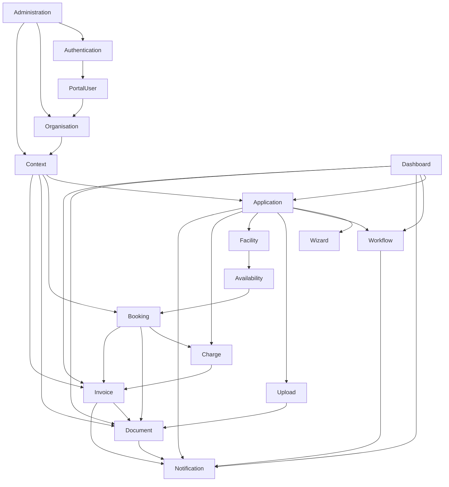

# Datenmodell Übersicht

| Feld | Wert |
|---|---|
| Kapitel | 05 – Datenmodell |
| Dokument | Datenmodell Übersicht |
| Status | Konsolidierter Arbeitsstand, Teil 1 |
| Typ | Fachliches Übersichts- und Referenzdokument |
| Priorität | Sehr hoch |
| Leitquellen | `Quellen/2026-07-05_Snapshot1.txt`, Lastenheft, Oracle-DDLs, Kapitel `03_Domaenen`, Architekturkapitel, fachliche Korrekturen Facility ↔ Booking und Charge ↔ Invoice |

---

## 1 Zweck

Dieses Dokument beschreibt die **fachliche Gesamtstruktur des SportFM-Datenmodells**.

Es ist der Einstieg in Kapitel `05_Datenmodell` und verbindet die bereits ausgearbeiteten Domänen mit dem vorhandenen Oracle-Bestand, den zentralen PL/SQL-Packages und der späteren REST- und Umsetzungssicht.

Die Übersicht beantwortet insbesondere folgende Fragen:

- Welche fachlichen Datenobjekte existieren im SportFM-Zielbild?
- Welche Domäne ist für welches Datenobjekt verantwortlich?
- Welche Oracle-Tabellen gehören fachlich zu welcher Domäne?
- Welche PL/SQL-Packages bleiben führend?
- Welche Datenbereiche werden über REST freigelegt?
- Welche Datenbereiche sind Bestandsdomänen und dürfen nicht neu modelliert werden?

Dieses Dokument beschreibt bewusst **nur das fachliche Datenmodell**.

Technische Details wie Trigger, Indizes, Sequenzen, Dirty-Tabellen, technische Hilfsstrukturen, Optimizer-Details oder vollständige Spaltenkataloge werden nicht hier, sondern in den nachfolgenden Dokumenten `Oracle_Datenmodell.md`, `Tabellen.md` und `Packages.md` behandelt.

---

## 2 Einordnung im Projekthandbuch

Kapitel `05_Datenmodell` liegt fachlich zwischen Domänenmodell und REST-API.

```text
03_Domaenen
  ↓
05_Datenmodell
  ↓
04_REST_API
  ↓
06_Arbeitspakete
  ↓
07_Kalkulation
```

Die Domänendokumente beschreiben die fachliche Verantwortung.

Das Datenmodell beschreibt, welche fachlichen Objekte und Bestandsdaten diese Verantwortung tragen.

Die REST-API beschreibt anschließend, wie diese Objekte kontrolliert verfügbar gemacht werden.

---

## 3 Geltungsbereich

Diese Übersicht umfasst:

- fachliche Business Objects,
- fachliche Datenbereiche,
- Domänenverantwortung,
- zentrale Oracle-Tabellen je Domäne,
- zentrale PL/SQL-Packages je Domäne,
- zentrale fachliche Abhängigkeiten,
- Abgrenzung zwischen Bestandsdaten und neuen Portaldaten,
- Auswirkungen auf REST, Migration und Umsetzung.

Diese Übersicht umfasst nicht:

- vollständige DDL-Dokumentation,
- vollständige Spaltenlisten aller Tabellen,
- technische Schlüsseldefinitionen im Detail,
- Trigger,
- Indizes,
- Sequenzen,
- Partitionierung,
- technische Batch- und Dirty-Queue-Details,
- physische Performanceoptimierung.

---

## 4 Modellierungsgrundsätze

### 4.1 Oracle bleibt führend

SportFM besitzt einen fachlich relevanten Oracle-Bestand.

Dieser Bestand bleibt führend für die zentralen Bestandsdomänen:

- Booking,
- Facility,
- Availability,
- Charge,
- Invoice,
- Document.

Für diese Domänen wird keine zweite fachliche Datenhaltung aufgebaut.

---

### 4.2 PL/SQL-Bestand bleibt führend

Bestehende PL/SQL-Logik wird nicht durch neue .NET-Logik ersetzt.

Verbindlich führend sind insbesondere:

| Package / Funktion | Fachliche Verantwortung |
|---|---|
| `PA_LHD_SPA` | zentrale bestehende SportFM-Logik, u. a. Buchung, Gebühren, Stornierung und weitere Bestandslogik |
| `PA_LHD_SPA_OCC` | Occurrence- und Winner-Logik, performante Termin- und Belegungszugriffe |
| `PA_LHD_SPA.p_get_charges` | Gebührenberechnung |

Die neue REST- und Serviceschicht kapselt diese Logik, ersetzt sie aber nicht.

---

### 4.3 Fachliches Datenmodell statt technisches Schema

Dieses Dokument modelliert fachliche Zusammenhänge.

Beispiel:

```text
BookingEvent
  ↓
EventUnitAssignment
  ↓
Occurrence
  ↓
OccurrenceWinner
```

Das ist keine vollständige physische Oracle-Struktur, sondern eine fachliche Sicht auf den Bestand.

---

### 4.4 Genau eine fachliche Verantwortung

Jedes zentrale Business Object besitzt genau eine fachlich verantwortliche Domäne.

| Business Object | Verantwortliche Domäne |
|---|---|
| `Application` | Application |
| `WorkflowTask` | Workflow |
| `Facility` | Facility |
| `FacilityUnit` | Facility |
| `BookingEvent` | Booking |
| `SportType` | Booking |
| `Charge` | Charge |
| `Invoice` | Invoice |
| `Document` | Document |
| `Upload` | Upload |
| `PortalUser` | PortalUser |
| `Context` | Context |

---

### 4.5 Keine direkte Tabellen-API

REST-Endpunkte bilden keine Oracle-Tabellen direkt ab.

REST arbeitet fachlich über DTOs, Services und domänenbezogene Berechtigungen.

Beispiel:

Nicht gewünscht:

```text
GET /api/lhd_spa_events/{id}
```

Gewünscht:

```text
GET /api/v1/bookings/{id}
```

---

### 4.6 Keine Doppelmodellierung

Fachliche Daten werden nicht in mehreren Domänen doppelt modelliert.

Verbindliche Abgrenzungen:

| Thema | Verantwortliche Domäne | Nicht verantwortlich |
|---|---|---|
| Sportanlage | Facility | Booking |
| Teileinheit | Facility | Booking |
| Sportart | Booking | Facility |
| Sportgruppe | Booking | Facility |
| Sportuntergruppe | Booking | Facility |
| Sportkategorie | Booking | Facility |
| Gebühren | Charge | Invoice |
| Rechnung | Invoice | Charge |
| Dateiannahme | Upload | Document |
| dauerhaftes Dokument | Document | Upload |
| Login / Token | Authentication | PortalUser |
| fachliches Profil | PortalUser | Authentication |
| Sichtbarkeitsraum | Context | Organisation |

---

## 5 Fachliche Gesamtübersicht

Das fachliche Datenmodell gliedert sich in mehrere Datenbereiche.

```text
Benutzer / Organisation / Kontext
  ↓
Antrag / Wizard / Workflow / Upload
  ↓
Facility / Availability / Booking
  ↓
Charge / Invoice / Document
  ↓
Notification / Dashboard / Administration
```

### 5.1 Benutzer, Organisation und Kontext

Dieser Bereich bildet Identität, fachliches Profil, Organisationen, Mitgliedschaften und den aktiven fachlichen Arbeitsraum ab.

| Domäne | Fachliche Datenobjekte |
|---|---|
| Authentication | technische Identität, Login, Token, Sperrstatus |
| PortalUser | Portalprofil, Kontaktdaten, Einstellungen, Favoriten, Zustimmungen |
| Organisation | Organisation, Abteilung, Mitgliedschaft, Organisationsrolle |
| Context | fachlicher Arbeitskontext, sichtbare Organisation / Abteilung / Rolle |

### 5.2 Antrag und Bearbeitung

Dieser Bereich bildet neue Portalprozesse für Antragstellung und Bearbeitung ab.

| Domäne | Fachliche Datenobjekte |
|---|---|
| Application | Antrag, Antragsteller, Antragspayload, Antragsstatus |
| Wizard | Wizarddefinition, Schritt, Feld, Validierung, Pflichtanlage |
| Workflow | Vorgang, Aufgabe, Rückfrage, Entscheidung, Statusübergang |
| Upload | Upload, Datei, Uploadstatus, Uploadzuordnung |

### 5.3 Sportstätten, Belegung und Buchung

Dieser Bereich bildet den fachlich wichtigsten Bestandskern von SportFM ab.

| Domäne | Fachliche Datenobjekte |
|---|---|
| Facility | Sportkomplex, Sportanlage, Teileinheit, FacilityGroup |
| Availability | Verfügbarkeitsabfrage, freies Zeitfenster, Konflikt, Kalenderansicht |
| Booking | Event, Buchung, Eventtyp, Eventklasse, Sportart, Sportgruppe, Wiederholungsmuster, Occurrence, Winner |

### 5.4 Gebühren, Rechnungen und Dokumente

Dieser Bereich bildet Gebühreninformationen, Rechnungen und Dokumente ab.

| Domäne | Fachliche Datenobjekte |
|---|---|
| Charge | Charge, ChargeType, ChargeGroup, EventCharge, InvoiceChargeInfo |
| Invoice | Rechnung, Rechnungsstatus, Zahlstatus, SAP-Status, Rechnungsdokumentbezug |
| Document | Dokument, Dokumenttyp, Dokumentstatus, Dokumentnummer, PDF-Inhalt, Vorlage, Textbaustein |

### 5.5 Querschnittsdaten

Dieser Bereich aggregiert oder unterstützt Fachprozesse.

| Domäne | Fachliche Datenobjekte |
|---|---|
| Notification | Portalnachricht, Empfänger, MailQueue, Versandstatus, Vorlage |
| Dashboard | Dashboardbereich, Aufgabenübersicht, Antragsübersicht, Dokument-/Rechnungsübersicht |
| Administration | Systemparameter, AdminAudit, Konfiguration, administrative Sichten |

---

## 6 Fachliche Datenlandkarte



---

## 7 Domänen → Business Objects

| Domäne | Primäre Business Objects | Charakter |
|---|---|---|
| Authentication | Identity, Login, Token, AccountLock | neue Portaldomäne |
| PortalUser | PortalUser, Profile, Contact, Preference, Favorite, Consent | neue Portaldomäne |
| Organisation | Organisation, Department, Membership, OrganisationRole | neue / erweiterte Portaldomäne |
| Context | Context, ContextScope, ContextRole | neue Portaldomäne |
| Application | Application, ApplicationDraft, ApplicationPayload, ApplicationStatus | neue Portaldomäne |
| Wizard | WizardDefinition, WizardStep, WizardField, WizardValidation | neue Portaldomäne |
| Workflow | WorkflowInstance, WorkflowTask, Query, Decision, Transition | neue / erweiterte Portaldomäne |
| Upload | Upload, UploadFile, UploadCategory, UploadAssignment | neue Plattformdomäne |
| Facility | SportsComplex, Facility, FacilityUnit, FacilityGroup | Bestandsdomäne |
| Availability | AvailabilityQuery, AvailabilityResult, TimeSlot, Conflict | Bestands-/Lesedomäne |
| Booking | BookingEvent, EventType, EventClass, RecurringPattern, Occurrence, OccurrenceWinner, SportType, SportGroup, SportSubGroup, SportCategory | Bestandsdomäne |
| Charge | Charge, ChargeType, ChargeGroup, ChargeFacilityGroupAssignment, EventCharge, InvoiceChargeInfo | Bestandsdomäne |
| Invoice | Invoice, InvoiceStatus, PaymentStatus, SapStatus, InvoiceDocument | Bestandsdomäne |
| Document | Document, DocumentType, DocumentState, DocumentTemplate, DocumentTextModule, DocumentContent | Bestandsdomäne |
| Notification | Notification, PortalMessage, Recipient, MailQueueItem, DeliveryStatus | neue Querschnittsdomäne |
| Dashboard | DashboardDto, DashboardSection, DashboardTaskItem | Aggregationsdomäne |
| Administration | SystemParameter, ConfigurationItem, AdminAuditEntry, AdminDashboardItem | Verwaltungsdomäne |

---

## 8 Wichtige fachliche Abgrenzungen

### 8.1 Facility ↔ Booking

Facility beschreibt Sportstätten.

Booking beschreibt die Nutzung dieser Sportstätten.

| Objekt | Domäne |
|---|---|
| Sportkomplex | Facility |
| Sportanlage | Facility |
| Teileinheit | Facility |
| FacilityGroup | Facility |
| Event / Buchung | Booking |
| Eventtyp | Booking |
| Sportart | Booking |
| Sportgruppe | Booking |
| Sportuntergruppe | Booking |
| Sportkategorie | Booking |

Diese Abgrenzung ist verbindlich, weil `LHD_SPA_EVENTS` die Sportreferenzen `ID_SPORTTYPE`, `ID_SPORTGROUP` und `ID_SPORTSUBGROUP` am Event führt.

---

### 8.2 Charge ↔ Invoice

Charge beschreibt Gebühren und Gebühreninformationen.

Invoice beschreibt Rechnungen und Zahlstatus.

| Objekt | Domäne |
|---|---|
| Charge | Charge |
| ChargeType | Charge |
| ChargeGroup | Charge |
| EventCharge | Charge |
| InvoiceChargeInfo | Charge / Rechnungsbezug, fachlich Gebühreninformation |
| Invoice | Invoice |
| PaymentStatus | Invoice |
| SapStatus | Invoice |
| Rechnungs-PDF | Document mit Bezug zu Invoice |

Die Gebührenberechnung erfolgt über `PA_LHD_SPA.p_get_charges` und wird nicht in Invoice oder Portal neu umgesetzt.

---

### 8.3 Upload ↔ Document

Upload nimmt Dateien entgegen, prüft sie und ordnet sie fachlich zu.

Document verwaltet Dokumente dauerhaft.

| Objekt | Domäne |
|---|---|
| Upload | Upload |
| UploadFile | Upload |
| UploadValidationResult | Upload |
| UploadAssignment | Upload |
| Document | Document |
| DocumentContent | Document |
| DocumentType | Document |
| DocumentTemplate | Document |

---

## 9 Ergebnis dieses Übersichtsabschnitts

Die fachliche Datenmodellierung ist domänenorientiert aufgebaut.

Die zentralen Bestandsbereiche bleiben in Oracle und PL/SQL führend.

Neue Portaldomänen ergänzen den Bestand, ersetzen ihn aber nicht.

Die folgenden Abschnitte dieser Datei ergänzen darauf aufbauend:

- Mapping Domäne → Oracle-Tabellen,
- Mapping Domäne → PL/SQL-Packages,
- Mapping Domäne → REST-Verantwortung,
- fachliche Identitäten und Schlüsselfelder,
- Datenflüsse,
- Risiken,
- offene Punkte,
- Traceability.
