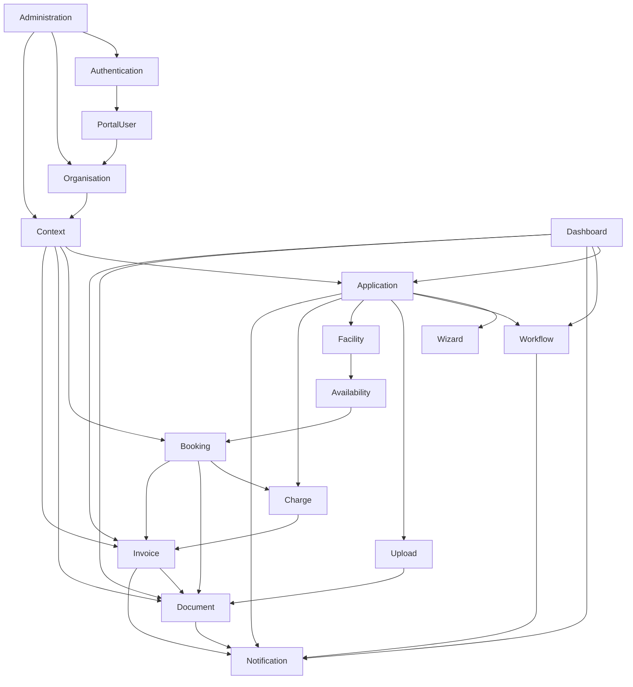

# Datenmodell Übersicht

| Feld | Wert |
|---|---|
| Kapitel | 05 – Datenmodell |
| Dokument | Datenmodell Übersicht |
| Status | Fertiggestellt |
| Typ | Fachliches Übersichts- und Referenzdokument |
| Priorität | Sehr hoch |
| Leitquellen | `Quellen/2026-07-05_Snapshot1.txt`, Lastenheft, Oracle-DDLs, Kapitel `03_Domaenen`, Architekturkapitel, fachliche Korrekturen Facility ↔ Booking und Charge ↔ Invoice |

---

## 1 Zweck

Dieses Dokument beschreibt die **fachliche Gesamtstruktur des SportFM-Datenmodells**.

Es ist der Einstieg in Kapitel `05_Datenmodell` und verbindet die bereits ausgearbeiteten Domänen mit dem vorhandenen Oracle-Bestand, den zentralen PL/SQL-Packages und der späteren REST- und Umsetzungssicht.

Die Übersicht beantwortet insbesondere folgende Fragen:

- Welche fachlichen Datenobjekte existieren im SportFM-Zielbild?
- Welche Domäne ist für welches Datenobjekt verantwortlich?
- Welche Oracle-Tabellen gehören fachlich zu welcher Domäne?
- Welche PL/SQL-Packages bleiben führend?
- Welche Datenbereiche werden über REST freigelegt?
- Welche Datenbereiche sind Bestandsdomänen und dürfen nicht neu modelliert werden?

Dieses Dokument beschreibt bewusst **nur das fachliche Datenmodell**.

Technische Details wie Trigger, Indizes, Sequenzen, Dirty-Tabellen, technische Hilfsstrukturen, Optimizer-Details oder vollständige Spaltenkataloge werden nicht hier, sondern in den nachfolgenden Dokumenten `Oracle_Datenmodell.md`, `Tabellen.md` und `Packages.md` behandelt.

---

## 2 Einordnung im Projekthandbuch

Kapitel `05_Datenmodell` liegt fachlich zwischen Domänenmodell und REST-API.

```text
03_Domaenen
  ↓
05_Datenmodell
  ↓
04_REST_API
  ↓
06_Arbeitspakete
  ↓
07_Kalkulation
```

Die Domänendokumente beschreiben die fachliche Verantwortung.

Das Datenmodell beschreibt, welche fachlichen Objekte und Bestandsdaten diese Verantwortung tragen.

Die REST-API beschreibt anschließend, wie diese Objekte kontrolliert verfügbar gemacht werden.

---

## 3 Geltungsbereich

Diese Übersicht umfasst:

- fachliche Datenobjekte,
- fachliche Datenbereiche,
- Domänenverantwortung,
- zentrale Oracle-Tabellen je Domäne,
- zentrale PL/SQL-Packages je Domäne,
- zentrale fachliche Abhängigkeiten,
- Abgrenzung zwischen Bestandsdaten und neuen Portaldaten,
- Datenflüsse,
- Lebenszyklen,
- Auswirkungen auf REST, Migration, Tests und Umsetzung.

Diese Übersicht umfasst nicht:

- vollständige DDL-Dokumentation,
- vollständige Spaltenlisten aller Tabellen,
- technische Schlüsseldefinitionen im Detail,
- Trigger,
- Indizes,
- Sequenzen,
- Partitionierung,
- technische Batch- und Dirty-Queue-Details,
- physische Performanceoptimierung.

---

## 4 Modellierungsgrundsätze

### 4.1 Oracle bleibt führend

SportFM besitzt einen fachlich relevanten Oracle-Bestand.

Dieser Bestand bleibt führend für die zentralen Bestandsdomänen:

- Booking,
- Facility,
- Availability,
- Charge,
- Invoice,
- Document.

Für diese Domänen wird keine zweite fachliche Datenhaltung aufgebaut.

### 4.2 PL/SQL-Bestand bleibt führend

Bestehende PL/SQL-Logik wird nicht durch neue .NET-Logik ersetzt.

Verbindlich führend sind insbesondere:

| Package / Funktion | Fachliche Verantwortung |
|---|---|
| `PA_LHD_SPA` | zentrale bestehende SportFM-Logik, u. a. Buchung, Wiederholungen, Gebühren, Stornierung und weitere Bestandslogik |
| `PA_LHD_SPA_OCC` | Occurrence- und Winner-Logik, performante Termin- und Belegungszugriffe |
| `PA_LHD_SPA.p_get_charges` | Gebührenberechnung |

Die neue REST- und Serviceschicht kapselt diese Logik, ersetzt sie aber nicht.

### 4.3 Fachliches Datenmodell statt technisches Schema

Dieses Dokument modelliert fachliche Zusammenhänge.

Beispiel:

```text
BookingEvent
  ↓
EventUnitAssignment
  ↓
Occurrence
  ↓
OccurrenceWinner
```

Das ist keine vollständige physische Oracle-Struktur, sondern eine fachliche Sicht auf den Bestand.

### 4.4 Genau eine fachliche Verantwortung

Jedes zentrale Datenobjekt besitzt genau eine fachlich verantwortliche Domäne.

| Datenobjekt | Verantwortliche Domäne |
|---|---|
| `Application` | Application |
| `WorkflowTask` | Workflow |
| `Facility` | Facility |
| `FacilityUnit` | Facility |
| `BookingEvent` | Booking |
| `SportType` | Booking |
| `Charge` | Charge |
| `Invoice` | Invoice |
| `Document` | Document |
| `Upload` | Upload |
| `PortalUser` | PortalUser |
| `Context` | Context |

### 4.5 Keine direkte Tabellen-API

REST-Endpunkte bilden keine Oracle-Tabellen direkt ab.

Nicht gewünscht:

```text
GET /api/lhd_spa_events/{id}
```

Gewünscht:

```text
GET /api/v1/bookings/{id}
```

### 4.6 Keine Doppelmodellierung

Fachliche Daten werden nicht in mehreren Domänen doppelt modelliert.

| Thema | Verantwortliche Domäne | Nicht verantwortlich |
|---|---|---|
| Sportanlage | Facility | Booking |
| Teileinheit | Facility | Booking |
| Sportart | Booking | Facility |
| Sportgruppe | Booking | Facility |
| Sportuntergruppe | Booking | Facility |
| Sportkategorie | Booking | Facility |
| Gebühren | Charge | Invoice |
| Rechnung | Invoice | Charge |
| Dateiannahme | Upload | Document |
| dauerhaftes Dokument | Document | Upload |
| Login / Token | Authentication | PortalUser |
| fachliches Profil | PortalUser | Authentication |
| Sichtbarkeitsraum | Context | Organisation |

---

## 5 Fachliche Gesamtübersicht

Das fachliche Datenmodell gliedert sich in mehrere Datenbereiche.

```text
Benutzer / Organisation / Kontext
  ↓
Antrag / Wizard / Workflow / Upload
  ↓
Facility / Availability / Booking
  ↓
Charge / Invoice / Document
  ↓
Notification / Dashboard / Administration
```

### 5.1 Benutzer, Organisation und Kontext

| Domäne | Fachliche Datenobjekte |
|---|---|
| Authentication | technische Identität, Login, Token, Sperrstatus |
| PortalUser | Portalprofil, Kontaktdaten, Einstellungen, Favoriten, Zustimmungen |
| Organisation | Organisation, Abteilung, Mitgliedschaft, Organisationsrolle |
| Context | fachlicher Arbeitskontext, sichtbare Organisation / Abteilung / Rolle |

### 5.2 Antrag und Bearbeitung

| Domäne | Fachliche Datenobjekte |
|---|---|
| Application | Antrag, Antragsteller, Antragspayload, Antragsstatus |
| Wizard | Wizarddefinition, Schritt, Feld, Validierung, Pflichtanlage |
| Workflow | Vorgang, Aufgabe, Rückfrage, Entscheidung, Statusübergang |
| Upload | Upload, Datei, Uploadstatus, Uploadzuordnung |

### 5.3 Sportstätten, Belegung und Buchung

| Domäne | Fachliche Datenobjekte |
|---|---|
| Facility | Sportkomplex, Sportanlage, Teileinheit, FacilityGroup |
| Availability | Verfügbarkeitsabfrage, freies Zeitfenster, Konflikt, Kalenderansicht |
| Booking | Event, Buchung, Eventtyp, Eventklasse, Sportart, Sportgruppe, Wiederholungsmuster, Occurrence, Winner |

### 5.4 Gebühren, Rechnungen und Dokumente

| Domäne | Fachliche Datenobjekte |
|---|---|
| Charge | Charge, ChargeType, ChargeGroup, EventCharge, InvoiceChargeInfo |
| Invoice | Rechnung, Rechnungsstatus, Zahlstatus, SAP-Status, Rechnungsdokumentbezug |
| Document | Dokument, Dokumenttyp, Dokumentstatus, Dokumentnummer, PDF-Inhalt, Vorlage, Textbaustein |

### 5.5 Querschnittsdaten

| Domäne | Fachliche Datenobjekte |
|---|---|
| Notification | Portalnachricht, Empfänger, MailQueue, Versandstatus, Vorlage |
| Dashboard | Dashboardbereich, Aufgabenübersicht, Antragsübersicht, Dokument-/Rechnungsübersicht |
| Administration | Systemparameter, AdminAudit, Konfiguration, administrative Sichten |

---

## 6 Fachliche Datenlandkarte



---

## 7 Domänen → Datenobjekte

| Domäne | Primäre Datenobjekte | Charakter |
|---|---|---|
| Authentication | Identity, Login, Token, AccountLock | neue Portaldomäne |
| PortalUser | PortalUser, Profile, Contact, Preference, Favorite, Consent | neue Portaldomäne |
| Organisation | Organisation, Department, Membership, OrganisationRole | neue / erweiterte Portaldomäne |
| Context | Context, ContextScope, ContextRole | neue Portaldomäne |
| Application | Application, ApplicationDraft, ApplicationPayload, ApplicationStatus | neue Portaldomäne |
| Wizard | WizardDefinition, WizardStep, WizardField, WizardValidation | neue Portaldomäne |
| Workflow | WorkflowInstance, WorkflowTask, Query, Decision, Transition | neue / erweiterte Portaldomäne |
| Upload | Upload, UploadFile, UploadCategory, UploadAssignment | neue Plattformdomäne |
| Facility | SportsComplex, Facility, FacilityUnit, FacilityGroup | Bestandsdomäne |
| Availability | AvailabilityQuery, AvailabilityResult, TimeSlot, Conflict | Bestands-/Lesedomäne |
| Booking | BookingEvent, EventType, EventClass, RecurringPattern, Occurrence, OccurrenceWinner, SportType, SportGroup, SportSubGroup, SportCategory | Bestandsdomäne |
| Charge | Charge, ChargeType, ChargeGroup, ChargeFacilityGroupAssignment, EventCharge, InvoiceChargeInfo | Bestandsdomäne |
| Invoice | Invoice, InvoiceStatus, PaymentStatus, SapStatus, InvoiceDocument | Bestandsdomäne |
| Document | Document, DocumentType, DocumentState, DocumentTemplate, DocumentTextModule, DocumentContent | Bestandsdomäne |
| Notification | Notification, PortalMessage, Recipient, MailQueueItem, DeliveryStatus | neue Querschnittsdomäne |
| Dashboard | DashboardDto, DashboardSection, DashboardTaskItem | Aggregationsdomäne |
| Administration | SystemParameter, ConfigurationItem, AdminAuditEntry, AdminDashboardItem | Verwaltungsdomäne |

---

## 8 Wichtige fachliche Abgrenzungen

### 8.1 Facility ↔ Booking

Facility beschreibt Sportstätten.

Booking beschreibt die Nutzung dieser Sportstätten.

| Objekt | Domäne |
|---|---|
| Sportkomplex | Facility |
| Sportanlage | Facility |
| Teileinheit | Facility |
| FacilityGroup | Facility |
| Event / Buchung | Booking |
| Eventtyp | Booking |
| Sportart | Booking |
| Sportgruppe | Booking |
| Sportuntergruppe | Booking |
| Sportkategorie | Booking |

Diese Abgrenzung ist verbindlich, weil `LHD_SPA_EVENTS` die Sportreferenzen `ID_SPORTTYPE`, `ID_SPORTGROUP` und `ID_SPORTSUBGROUP` am Event führt.

### 8.2 Charge ↔ Invoice

Charge beschreibt Gebühren und Gebühreninformationen.

Invoice beschreibt Rechnungen und Zahlstatus.

| Objekt | Domäne |
|---|---|
| Charge | Charge |
| ChargeType | Charge |
| ChargeGroup | Charge |
| EventCharge | Charge |
| InvoiceChargeInfo | Charge / Rechnungsbezug, fachlich Gebühreninformation |
| Invoice | Invoice |
| PaymentStatus | Invoice |
| SapStatus | Invoice |
| Rechnungs-PDF | Document mit Bezug zu Invoice |

Die Gebührenberechnung erfolgt über `PA_LHD_SPA.p_get_charges` und wird nicht in Invoice oder Portal neu umgesetzt.

### 8.3 Upload ↔ Document

Upload nimmt Dateien entgegen, prüft sie und ordnet sie fachlich zu.

Document verwaltet Dokumente dauerhaft.

| Objekt | Domäne |
|---|---|
| Upload | Upload |
| UploadFile | Upload |
| UploadValidationResult | Upload |
| UploadAssignment | Upload |
| Document | Document |
| DocumentContent | Document |
| DocumentType | Document |
| DocumentTemplate | Document |

---

## 9 Ergebnis der fachlichen Grundmodellierung

Die fachliche Datenmodellierung ist domänenorientiert aufgebaut.

Die zentralen Bestandsbereiche bleiben in Oracle und PL/SQL führend.

Neue Portaldomänen ergänzen den Bestand, ersetzen ihn aber nicht.

---

## 10 Domänen → Oracle-Tabellen

Die folgende Matrix beschreibt die fachliche Zuordnung der zentralen Oracle-Tabellen zu den Domänen.

Sie ist keine vollständige Tabelleninventur. Vollständige Details folgen in `Tabellen.md`.

| Domäne | Zentrale Oracle-Tabellen | Fachliche Bedeutung |
|---|---|---|
| Booking | `LHD_SPA_EVENTS`, `LHD_SPA_EVENTS_HIST`, `LHD_SPA_EVENTTYPES`, `LHD_SPA_EVENTCLASSES`, `LHD_SPA_EVENT2UNIT`, `LHD_SPA_BOOKING_NUMBERS`, `LHD_SPA_RECURRING_PATTERN` | Event, Buchung, Eventtyp, Eventklasse, Teileinheitszuordnung, Buchungsnummer, Wiederholung |
| Booking | `LHD_SPA_OCC`, `LHD_SPA_OCC_WINNER`, `LHD_SPA_OCC_DAY_COVERAGE`, `LHD_SPA_OCC_EVENT_DRT`, `LHD_SPA_OCC_WINNER_DRT` | konkrete Vorkommen, gültige Belegung, Aktualisierungs- und technische Dirty-Strukturen |
| Booking | `LHD_SPA_SPORTCATEGORIES`, `LHD_SPA_SPORTGROUPS`, `LHD_SPA_SPORTSUBGROUPS`, `LHD_SPA_SPORTTYPES` | Sportreferenzdaten am Event / an der Buchung |
| Facility | `LHD_SPA_SPORTSCOMPLEXES`, `LHD_SPA_FACILITY2COMPLEX`, `LHD_SPA_FACILITYGROUPS` | Sportkomplexe, Zuordnung Sportanlage zu Komplex, Sportanlagengruppen |
| Facility | `LHD_SPA_EVENTS`, `LHD_SPA_EVENT2UNIT`, `LHD_SPA_OCC`, `LHD_SPA_OCC_WINNER` | Facility-Bezug über `ID_SPA`, `SPA_NR`, `UNIT_ID`; fachliche Hauptverantwortung für Events bleibt Booking |
| Availability | `LHD_SPA_OCC`, `LHD_SPA_OCC_WINNER`, `LHD_SPA_OCC_DAY_COVERAGE` | Grundlage für freie Zeiten, Kalender und Konfliktprüfung |
| Charge | `LHD_SPA_CHARGES`, `LHD_SPA_CHARGETYPES`, `LHD_SPA_CHARGEGROUPS`, `LHD_SPA_CHARGE2FACILITYGROUP` | Gebührenstammdaten, Typen, Gruppen und FacilityGroup-Zuordnung |
| Charge | `LHD_SPA_EVENTCHARGES`, `LHD_SPA_EVENTCHARGES_HIST`, `LHD_SPA_INVOICE_CHARGEINFOS`, `LHD_SPA_INVOICE_CHARGEINFOS_2025` | Buchungsgebühren, Historie und rechnungsrelevante Gebühreninformationen |
| Invoice | `LHD_SPA_INVOICES`, `LHD_SPA_INVOICES_HIST`, `LHD_SPA_INVOICE_CHARGEINFOS` | Rechnungen, Historie, Anzeige von Rechnungspositionen über ChargeInfos |
| Document | `LHD_SPA_DOCUMENTS`, `LHD_SPA_DOCUMENTS_EVENTS`, `LHD_SPA_DOCUMENT_NUMBERS`, `LHD_SPA_DOCUMENT_TEMPLATES`, `LHD_SPA_DOCUMENT_TEXTMODULES`, `LHD_SPA_DOCUMENT_TYPES` | Dokumente, Event-Zuordnung, Nummernkreise, Vorlagen, Textbausteine, Dokumenttypen |
| Upload | neue / zu prüfende Upload-Tabellen laut Domäne Upload | technische Dateiannahme, Validierung, Zuordnung; finale Persistenz abhängig von Speicherstrategie |
| Application | neue / zu definierende Antragstabellen laut Domäne Application | Onlineanträge, Entwürfe, Payload, Status, Zuordnungen |
| Wizard | neue / zu definierende Wizard-Konfigurationstabellen laut Domäne Wizard | Schritt-, Feld-, Validierungs- und Pflichtanlagenkonfiguration |
| Workflow | neue / zu definierende Workflow-Tabellen laut Domäne Workflow | Vorgänge, Aufgaben, Rückfragen, Statusübergänge |
| Authentication | neue / zu definierende Identity-/Auth-Tabellen laut Domäne Authentication | technische Portalidentität, Login, Token, Sperre |
| PortalUser | neue / zu definierende PortalUser-Tabellen laut Domäne PortalUser | fachliches Benutzerprofil, Präferenzen, Zustimmungen |
| Organisation | neue / zu definierende Organisations- und Mitgliedschaftstabellen laut Domäne Organisation | Organisationen, Abteilungen, Mitgliedschaften, Rollenbezug |
| Context | neue / abgeleitete Kontextstrukturen laut Domäne Context | aktiver Sichtbarkeits- und Arbeitskontext |
| Notification | neue / zu definierende Notification-Tabellen laut Domäne Notification | Portalnachrichten, Empfänger, MailQueue, Versandstatus |
| Dashboard | keine eigene fachliche Persistenz V1 | reine Aggregation aus anderen Domänen |
| Administration | neue / zu prüfende Konfigurations- und Auditstrukturen | administrative Einstellungen, Protokollierung, Verwaltungssichten |

---

## 11 Domänen → PL/SQL-Packages

| Domäne | Package / Funktion | Bedeutung |
|---|---|---|
| Booking | `PA_LHD_SPA` | bestehende Buchungs-, Wiederholungs-, Stornierungs- und weitere SportFM-Bestandslogik |
| Booking | `PA_LHD_SPA_OCC` | Occurrence- und Winner-Ermittlung, performante Termin- und Belegungszugriffe |
| Availability | `PA_LHD_SPA_OCC` | führende Grundlage für Belegung und freie Zeiten |
| Charge | `PA_LHD_SPA.p_get_charges` | führende Gebührenberechnung |
| Charge | `PA_LHD_SPA` | bestehende Gebühren- und Buchungslogik im Bestand |
| Invoice | bestehende Rechnungs-/SAP-Packages, noch final zu identifizieren | Anzeige und Status bleiben Bestand; keine SAP-Neuimplementierung |
| Document | bestehende Dokumentenpackages, noch final zu identifizieren | Dokumentliste, Details, Download und Nummernkreis über Bestand oder Kapselung |
| Facility | bestehende Facility-/Stammdatenpackages, noch final zu identifizieren | Sportstätten, Teileinheiten, Sportkomplexe, FacilityGroups |
| Application | neue REST-/Service-Schicht, kein bestätigtes Bestandspackage | Antrag ist neue Portaldomäne |
| Wizard | neue REST-/Service-Schicht, kein bestätigtes Bestandspackage | Wizard-Konfiguration ist neue Portaldomäne |
| Workflow | neue REST-/Service-Schicht, kein bestätigtes Bestandspackage | Workflow ist neue / erweiterte Portaldomäne |
| Upload | neue REST-/Service-Schicht, kein bestätigtes Bestandspackage | Upload ist neue Plattformdomäne |
| Authentication | neue Auth-Schicht | technische Identität und Zugriff |
| PortalUser | neue REST-/Service-Schicht | fachliches Benutzerprofil |
| Organisation | neue REST-/Service-Schicht | Organisationen und Mitgliedschaften |
| Context | neue REST-/Service-Schicht | Sichtbarkeits- und Arbeitskontext |
| Notification | neue REST-/Service-Schicht | Portalnachrichten und MailQueue |
| Dashboard | kein eigenes Package V1 | Aggregation vorhandener Services |
| Administration | neue / zu prüfende Admin-Kapselungen | Verwaltung und Konfiguration |

### 11.1 Zielprinzip für Package-Nutzung

Die .NET-Schicht ruft Packages über Repository- oder Gateway-Klassen auf.

```text
REST Controller
  ↓
Application / Domain Service
  ↓
Repository / Oracle Gateway
  ↓
PL/SQL Package / Oracle Tabelle
```

Die Domänenlogik entscheidet fachlich, **welche** Operation benötigt wird.

Das Repository / Gateway kapselt, **wie** Oracle oder PL/SQL aufgerufen wird.

---

## 12 Domänen → REST-Verantwortung

Die REST-Schicht bildet fachliche Operationen ab und trennt konsequent zwischen Bestandsfreilegung und neuen Portalfunktionen.

| Domäne | REST-Verantwortung | Charakter |
|---|---|---|
| Authentication | Login, Registrierung, Token, Passwortprozesse | neu |
| PortalUser | Profil, Einstellungen, Favoriten, Zustimmungen | neu |
| Organisation | Organisationen, Mitgliedschaften, Rollenbezug | neu / erweitert |
| Context | verfügbare Kontexte, aktiver Kontext | neu |
| Application | Anträge, Entwürfe, Einreichung, Status | neu |
| Wizard | Wizarddefinitionen, Schritte, Felder, Validierungen | neu |
| Workflow | Aufgaben, Rückfragen, Entscheidungen, Status | neu / erweitert |
| Upload | Datei hochladen, prüfen, zuordnen | neu |
| Facility | Sportanlagen, Teileinheiten, Sportkomplexe, FacilityGroups | lesende Bestandsfreilegung |
| Availability | freie Zeiten, Kalender, Konflikte | lesende / prüfende Bestandsfreilegung |
| Booking | Buchungen, Occurrences, Kalender, Sportreferenzen | lesende Bestandsfreilegung V1 |
| Charge | Gebührenstammdaten, EventCharges, InvoiceChargeInfos, Gebührenhinweis | lesende Bestandsfreilegung / Vorschau |
| Invoice | Rechnungsliste, Details, Zahlstatus, PDF-Bezug | lesende Bestandsfreilegung |
| Document | Dokumentliste, Detail, Download, Dokumenttypen | lesende Bestandsfreilegung / Upload-Übernahme |
| Notification | Nachrichten, ungelesene Anzahl, MailQueue, Präferenzen | neu |
| Dashboard | aggregierte Startseite | neu, keine eigene Persistenz |
| Administration | administrative Sichten, Konfiguration, Audit | neu / erweitert |

---

## 13 Fachliche Identitäten und Schlüsselfelder

Diese Übersicht nennt nur fachlich relevante Identitäten. Die vollständige technische Schlüsselbeschreibung folgt in `Tabellen.md`.

| Bereich | Fachliche Identität | Quelle / Bezug |
|---|---|---|
| Booking | `ID_EVENT` | zentrale Event-/Buchungsidentität in `LHD_SPA_EVENTS` |
| Booking | `BOOKING_NUMBER` | fachliche Buchungsnummer |
| Booking | `ID_BOOKING`, `BOOKING_COUNTER`, `YEAR` | Buchungsnummern- und Jahresbezug |
| Booking | `EVENT_ID` | Occurrence-Bezug in `LHD_SPA_OCC` |
| Booking | `WINNER_ID` / `OCC_ID` | Winner-/Occurrence-Bezug |
| Facility | `ID_SPA`, `SPA_NR` | Sportanlagenbezug aus Event / Occurrence |
| Facility | `ID_UNIT`, `UNIT_ID` | Teileinheitsbezug aus Event2Unit / Occurrence |
| Facility | `ID_FACILITYGROUP` | Sportanlagengruppe / Gebührenbezug |
| Charge | `ID_CHARGE` | Gebührenstammsatz |
| Charge | `ID_CHARGETYPE` | Gebührentyp |
| Charge | `ID_CHARGEGROUP` | Gebührengruppe |
| Charge | `ID_EVENT` + `ID_CHARGE` | EventCharge-Bezug |
| Invoice | `ID_INVOICE` | Rechnung und Rechnungsbezug |
| Document | `ID_DOCUMENT_TYPE`, `DOCUMENT_NUMBER` | Dokumenttyp und Dokumentnummer |
| Document | `ID_INVOICE` | Dokumentbezug zur Rechnung |
| Application | `applicationId` | neue Portalidentität, final im Datenmodell zu definieren |
| Workflow | `workflowInstanceId`, `taskId` | neue Portalidentitäten, final im Datenmodell zu definieren |
| Upload | `uploadId` | neue Portalidentität, final im Datenmodell zu definieren |
| PortalUser | `portalUserId`, `identityId` | neue Portalidentität und technische Identitätsverknüpfung |
| Context | `contextId` | neue / abgeleitete Kontextidentität |

---

## 14 Fachliche Referenzdaten

Referenzdaten werden fachlich einer verantwortlichen Domäne zugeordnet.

| Referenzdaten | Verantwortliche Domäne | Oracle-Bezug |
|---|---|---|
| Eventtypen | Booking | `LHD_SPA_EVENTTYPES` |
| Eventklassen | Booking | `LHD_SPA_EVENTCLASSES` |
| Sportarten | Booking | `LHD_SPA_SPORTTYPES` |
| Sportgruppen | Booking | `LHD_SPA_SPORTGROUPS` |
| Sportuntergruppen | Booking | `LHD_SPA_SPORTSUBGROUPS` |
| Sportkategorien | Booking | `LHD_SPA_SPORTCATEGORIES` |
| FacilityGroups | Facility / Charge-Bezug | `LHD_SPA_FACILITYGROUPS` |
| ChargeTypes | Charge | `LHD_SPA_CHARGETYPES` |
| ChargeGroups | Charge | `LHD_SPA_CHARGEGROUPS` |
| DocumentTypes | Document | `LHD_SPA_DOCUMENT_TYPES` |
| WizardSteps / Fields | Wizard | neue / zu definierende Portalreferenzdaten |
| NotificationCategories | Notification | neue / zu definierende Portalreferenzdaten |
| Rollen / Rechte | Authentication / Organisation / Context / Administration | neue / zu definierende Portalreferenzdaten |

---

## 15 Auswirkungen auf nachfolgende Kapitel

### 15.1 Auswirkungen auf `Oracle_Datenmodell.md`

`Oracle_Datenmodell.md` muss die hier genannten fachlichen Datenbereiche technisch vertiefen.

Dort sind insbesondere zu dokumentieren:

- Tabellenbereiche,
- technische Hilfstabellen,
- Historien,
- Dirty-Tabellen,
- Trigger, falls fachlich relevant,
- Sequenzen und Nummernkreise,
- Views, falls vorhanden,
- technische Abhängigkeiten.

### 15.2 Auswirkungen auf `Tabellen.md`

`Tabellen.md` muss jede relevante Tabelle mit mindestens folgenden Angaben dokumentieren:

- verantwortliche Domäne,
- fachlicher Zweck,
- wichtigste Schlüssel,
- wichtigste Attribute,
- Beziehung zu anderen Tabellen,
- verwendende REST-Funktionen,
- verwendende Packages,
- Migrationsrelevanz.

### 15.3 Auswirkungen auf `Packages.md`

`Packages.md` muss mindestens folgende Bestandslogik vertiefen:

- `PA_LHD_SPA`,
- `PA_LHD_SPA_OCC`,
- `PA_LHD_SPA.p_get_charges`,
- identifizierte Dokumentenpackages,
- identifizierte Rechnungs-/SAP-Packages,
- identifizierte Facility-/Stammdatenpackages.

### 15.4 Auswirkungen auf `04_REST_API`

Die REST-API muss die fachlichen Domänen abbilden und darf keine Tabellen-API werden.

Die REST-Struktur muss deshalb den Domänen folgen:

```text
/api/v1/bookings
/api/v1/facilities
/api/v1/charges
/api/v1/invoices
/api/v1/documents
/api/v1/applications
/api/v1/workflow
```

### 15.5 Auswirkungen auf `06_Arbeitspakete` und `07_Kalkulation`

Die Arbeitspakete und die Kalkulation müssen zwischen folgenden Aufwandsarten unterscheiden:

| Art | Bedeutung |
|---|---|
| Bestandsfreilegung | Oracle-/PLSQL-Bestand fachlich über REST verfügbar machen |
| Neuentwicklung | neue Portal- und Plattformfunktionen entwickeln |
| Integration | Domänen verbinden, z. B. Booking ↔ Charge ↔ Invoice |
| Migration | WPF und Bestand schrittweise an REST und Portal anbinden |
| Tests | Regression gegen Bestand und neue Portalfunktionen |

---

## 16 Datenflüsse

Die Datenflüsse zeigen, wie neue Portaldaten und bestehende SportFM-Bestandsdaten zusammenwirken.

### 16.1 Antrag → Buchung

```text
PortalUser
  ↓
Context
  ↓
ApplicationDraft
  ↓
Application
  ↓
WorkflowInstance
  ↓
Prüfung / Entscheidung
  ↓
BookingEvent
  ↓
RecurringPattern
  ↓
Occurrence
  ↓
OccurrenceWinner
```

Wichtig:

- Der Antrag ist ein neues Portalobjekt.
- Die Buchung bleibt ein SportFM-Bestandsobjekt.
- Die Überführung vom Antrag zur Buchung erfolgt nicht automatisch durch das Portal, sondern über Workflow, REST-Service und bestehende SportFM-Logik.

### 16.2 Buchung → Gebühren → Rechnung → Dokument

```text
BookingEvent
  ↓
EventCharge
  ↓
InvoiceChargeInfo
  ↓
Invoice
  ↓
Document
  ↓
Portal-Download
```

Die Gebührenberechnung verbleibt in `PA_LHD_SPA.p_get_charges`.

Das Portal zeigt Ergebnisse an, berechnet aber keine Gebühren und erzeugt keine Rechnung eigenständig.

### 16.3 Dateiannahme → Dokument

```text
Upload
  ↓
UploadValidationResult
  ↓
UploadAssignment
  ↓
Document oder fachliche Zuordnung
```

Upload ist die technische Annahme und Prüfung.

Document ist die dauerhafte fachliche Dokumentverwaltung.

### 16.4 Dashboard-Aggregation

```text
Application
Workflow
Notification
Document
Invoice
  ↓
Dashboard
```

Dashboard besitzt in V1 keine eigene fachliche Persistenz.

---

## 17 Lebenszyklen zentraler Datenobjekte

### 17.1 Application

```text
Entwurf
  ↓
Eingereicht
  ↓
In Prüfung
  ↓
Rückfrage / Nachforderung
  ↓
Genehmigt oder Abgelehnt
  ↓
Buchung erzeugt / abgeschlossen
```

Application ist führend für den Portalvorgang, aber nicht für die spätere Belegung.

### 17.2 BookingEvent

```text
Angelegt
  ↓
Aktiv
  ↓
ggf. beendet durch Datum
  ↓
ggf. über Stornierungs-Event überlagert
```

Der aktuelle Statusbestand ist:

| Wert | Bedeutung |
|---:|---|
| `1` | aktiv |
| `-1` | gelöscht |

Buchungen werden fachlich nicht durch komplexe Statusketten historisiert, sondern enden durch Datum oder werden durch Stornierungs-Events abgebildet.

### 17.3 Occurrence und OccurrenceWinner

```text
Event / Pattern
  ↓
Occurrence-Ermittlung
  ↓
Winner-Ermittlung
  ↓
Kalender / freie Zeiten / Konfliktprüfung
```

Die Ermittlung erfolgt über `PA_LHD_SPA_OCC`.

Es existiert ein stündlicher Lauf sowie ein Fast Path.

### 17.4 Document

| Wert | Bedeutung |
|---:|---|
| `-1` | gelöscht |
| `1` | aktuell |
| `2` | bearbeitet |
| `3` | gedruckt |

Dokumente sind grundsätzlich portalrelevant, sofern die Berechtigung des Portalnutzers zum zugehörigen SportFM-Nutzer gegeben ist.

### 17.5 Invoice

| Wert | Bedeutung |
|---:|---|
| `-1` | gelöscht |
| `1` | aktuell |

Rechnungen werden aus SportFM/SAP-Kontext angezeigt.

Das Portal ist nicht führend für Rechnungserzeugung oder SAP-Buchung.

---

## 18 Datenhoheit und Systemgrenzen

| Datenbereich | Führendes System / führende Schicht | Bemerkung |
|---|---|---|
| SportFM-Buchungen | Oracle / PL/SQL / SportFM | keine zweite Buchungsdatenhaltung im Portal |
| Occurrences / Winner | `PA_LHD_SPA_OCC` / Oracle | zentrale Grundlage für Performance |
| Gebühren | `PA_LHD_SPA.p_get_charges` / Oracle | keine Gebührenberechnung im Portal |
| Rechnungen | SportFM / SAP-Integration | Portal zeigt an |
| Dokumente | SportFM-Dokumentenbestand | Portal lädt berechtigt herunter |
| Portalidentität | neue Auth-Schicht | getrennt vom fachlichen SportFM-Nutzer |
| Portalprofil | PortalUser / Organisation / Context | neue Portaldomäne |
| Antrag | Application / Workflow / Wizard | neue Portaldomäne |
| Upload | Upload-Domäne | Dateiannahme vor dauerhafter Dokumentpersistenz |

Systemgrenze:

```text
Portal
  ↓
REST-API
  ↓
SportFM-Plattform
  ↓
Oracle / PL/SQL / SAP
```

Das Portal darf keine Bestandslogik duplizieren.

---

## 19 Traceability-Matrix

Die folgende Matrix zeigt, wie Datenmodell, REST, Arbeitspakete und Tests später miteinander verbunden werden.

| Datenobjekt | Domäne | REST-Verantwortung | Folgekapitel | Testschwerpunkt |
|---|---|---|---|---|
| Application | Application | Antrag erfassen, speichern, einreichen | REST-API, Arbeitspakete | Entwurf, Einreichung, Status |
| WizardDefinition | Wizard | Wizard laden und ausführen | REST-API, Arbeitspakete | Feldlogik, Pflichtfelder, Versionierung |
| WorkflowInstance | Workflow | Aufgaben, Entscheidungen, Rückfragen | REST-API, Arbeitspakete | Statusübergänge, Berechtigungen |
| Upload | Upload | Dateiannahme und Zuordnung | REST-API, Arbeitspakete | Dateityp, Größe, Viren-/Plausibilitätsprüfung |
| Facility | Facility | Sportstätten lesen | REST-API | Filter, Sichtbarkeit, Performance |
| BookingEvent | Booking | Buchungen lesen / später erweitern | REST-API, Migration | Bestandstreue, Rechte, Regression |
| OccurrenceWinner | Availability | Kalender und freie Zeiten | REST-API | Performance, korrekte Belegung |
| Charge | Charge | Gebühreninformation / Vorschau | REST-API | Gebührenlogik bleibt Bestand |
| Invoice | Invoice | Rechnungsliste und Details | REST-API | Benutzer sieht nur eigene Rechnungen |
| Document | Document | Dokumentliste und Download | REST-API | Benutzer sieht nur eigene Dokumente |
| Notification | Notification | Nachrichten und Versandstatus | REST-API | Zustellung, Lesestatus |

---

## 20 Risiken aus Datenmodellsicht

| Risiko | Bewertung | Gegenmaßnahme |
|---|---|---|
| Doppelte Fachlogik im Portal | hoch | REST nur fachlich, keine Berechnung im Portal |
| direkte Tabellen-API | hoch | DTOs und domänenbezogene Services |
| Vermischung Upload und Document | mittel | klare Trennung Dateiannahme / dauerhaftes Dokument |
| Vermischung Charge und Invoice | mittel | Charge berechnet Gebühren, Invoice zeigt Rechnung/Zahlstatus |
| unklare Zuordnung PortalUser ↔ SportFM-Nutzer | hoch | Context- und Organisationsmodell verbindlich definieren |
| Performanceprobleme bei Kalender / freie Zeiten | hoch | Nutzung von `LHD_SPA_OCC`, `LHD_SPA_OCC_WINNER`, Fast Path |
| neue Portalstatus kollidieren mit Bestandsstatus | mittel | Statusmodelle getrennt halten und fachlich mappen |
| fehlende Revisions- und Downloadprotokollierung | mittel | Audit- und Protokollstrukturen ergänzen |

---

## 21 Offene Klärungspunkte

| Kürzel | Klärungspunkt | Relevanz |
|---|---|---|
| KP-DAT-001 | Finale technische Tabellen für Application, Wizard, Workflow, Upload, PortalUser, Organisation und Context festlegen | sehr hoch |
| KP-DAT-002 | Dokumentenpackages und Nummernkreislogik final identifizieren | hoch |
| KP-DAT-003 | Rechnungs-/SAP-Packages final identifizieren | hoch |
| KP-DAT-004 | Portal-Sichtbarkeit von Dokumenten technisch markieren oder rein über Berechtigung ableiten | hoch |
| KP-DAT-005 | Uploads dauerhaft in `LHD_SPA_DOCUMENTS` übernehmen oder gesondert halten | hoch |
| KP-DAT-006 | Rollen- und Kontextmodell für Vereine mit mehreren Abteilungen definieren | sehr hoch |
| KP-DAT-007 | Statusmodell für Antrag und Workflow final festlegen | sehr hoch |
| KP-DAT-008 | ePayBL-Statusdaten und SAP-Zahlstatus fachlich abgrenzen | mittel |
| KP-DAT-009 | Notwendige Audit- und Protokolltabellen definieren | mittel |

---

## 22 Änderungsauswirkungen

Änderungen am Datenmodell wirken unterschiedlich stark.

| Änderungsart | Auswirkung | Bewertung |
|---|---|---|
| neue Wizard-Felder | Konfiguration / Wizarddaten | gering bis mittel |
| neuer Antragstyp | Wizard, Application, Workflow | mittel |
| neuer Workflowstatus | Workflow, Dashboard, Notification | mittel |
| neue Buchungsart ohne neue Logik | Booking-Referenzdaten | mittel |
| neue Buchungsart mit neuer Prioritätslogik | Booking, Occurrence, Winner, PL/SQL | hoch |
| neue Gebührenregel | Charge / PL/SQL | hoch |
| neue Dokumentvorlage | Document / Template | gering bis mittel |
| neue Rechnungsschnittstelle | Invoice / Payment / SAP | hoch |
| neue Portalrolle | Authentication / Organisation / Context | mittel |

Grundsatz:

Änderungen an neuen Portaldomänen sollen möglichst konfigurierbar bleiben.

Änderungen am SportFM-Bestand müssen besonders restriktiv geprüft werden.

---

## 23 Abschlussbewertung

Das Datenmodell bestätigt die strategische Zielarchitektur:

- SportFM besitzt bereits einen tragfähigen fachlichen Daten- und Logikbestand.
- Oracle und PL/SQL bleiben führend für Buchung, Belegung, Gebühren, Dokumente und Rechnungen.
- Das Portal ergänzt neue Datenbereiche, ersetzt aber keine Bestandsdomäne.
- REST wird fachliche Zugriffsschicht, nicht Tabellenfreigabe.
- Die zentrale Herausforderung liegt in sauberer Abgrenzung zwischen Bestandsdaten, neuen Portaldaten und fachlichen Kontexten.

Die wichtigsten Architekturentscheidungen aus Sicht des Datenmodells sind:

| Nr. | Entscheidung |
|---:|---|
| 1 | keine zweite Buchungsdatenhaltung im Portal |
| 2 | keine Gebührenberechnung im Portal |
| 3 | keine direkte Tabellen-API |
| 4 | klare Trennung von PortalUser und SportFM-Nutzer |
| 5 | Application / Wizard / Workflow als neue Portaldomänen |
| 6 | Upload und Document getrennt modellieren |
| 7 | Occurrence und Winner bleiben Grundlage für Kalender und freie Zeiten |

---

## 24 Verweise auf Folgedokumente

Dieses Dokument ist abgeschlossen und bildet die Grundlage für die weiteren Dokumente in Kapitel `05_Datenmodell`.

| Folgedokument | Aufgabe |
|---|---|
| `Fachliches_Datenmodell.md` | fachliche Vertiefung der Datenobjekte, Beziehungen und Lebenszyklen |
| `Oracle_Datenmodell.md` | technische Einordnung des Oracle-Bestands, Tabellenbereiche, technische Strukturen |
| `Tabellen.md` | strukturierte Tabelleninventur mit Zweck, Schlüsseln, Beziehungen und Relevanz |
| `Packages.md` | Beschreibung der führenden PL/SQL-Packages und ihrer fachlichen Verantwortung |
| `Datenmigration.md` | Migrationsstrategie, neue Portaltabellen, Bestandsfreilegung, WPF-Migration |

Nächster Bearbeitungsschritt ist `Fachliches_Datenmodell.md`.
